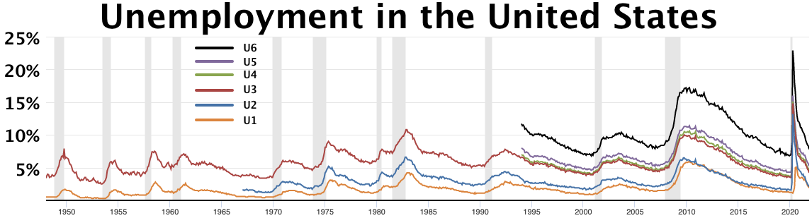
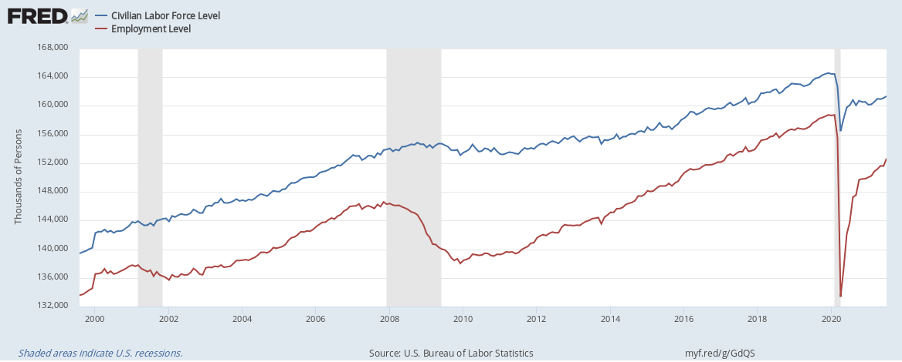

# Anthropic Proposed Taxing 3% of Its AI Revenue for a Jobs Fund

_A frontier lab_

## Executive Summary

> [!callout]
> In June 2026, Anthropic proposed taxing the revenue its AI generates and using the proceeds to cover the cost of job displacement. By press accounts, the rate is 3%. It is the first time a frontier AI lab has called for taxing its own revenue, and the first time such a response has been tied step by step to the unemployment rate. What drew the least attention, though, sits one layer down: the step that comes before compensation or taxation is measurement.

> Dario Amodei wrote that it is easy to dismiss plain data collection as trivial against the scale of the problem, but that without measuring precisely what is happening on the ground, good policy is unlikely. The trouble is that capturing "fired because of AI" in statistics is close to impossible. In 2024 one tracker attributed roughly 12,700 job losses directly to AI, while forecasts from the same period warned that up to half of entry-level white-collar jobs could disappear.

> That gap between forecast and measurement is exactly how hard the measuring is. And displacement that goes unmeasured drops out of any compensation scheme. If you cannot count who was pushed out and by what path, you cannot even define where the money raised by a 3% token tax should go. This is the point where the premise of labor policy comes back not to ethics or budgets but to the quality and provenance of data.

<!-- stat-card -->
**3%** — Tax on AI output revenue — Anthropic proposal (per press)

<!-- stat-card -->
**4.3%** — US unemployment at launch — Tier 1 trigger (5%) not yet hit

<!-- stat-card -->
**~12,700** — 2024 layoffs attributed to AI — Gap from "up to 50%" forecast

<!-- stat-card -->
**$350M** — Jobs research & fellowship fund — Separate from the token tax

## A Frontier Lab Tied Policy to the Unemployment Rate for the First Time

On June 10–11, Anthropic released two official frameworks alongside Dario Amodei's essay "Policy on the AI Exponential." The most-quoted passage was the "3% token tax on AI output revenue" — the idea of taxing the revenue a language model produces each time it generates output. Amodei acknowledged it runs against his own financial interest yet called it a reasonable solution. Note that this is a policy recommendation, not a bill before Congress.

Structurally, the more interesting move than the token tax is that the response is **tied step by step to the unemployment rate**. If a policy switches on at a specific number, then who measures that number, and how, has to be settled first. At the time of the announcement, US unemployment stood at 4.3% — not yet at the 5% trigger for the first tier.

The framework splits the response into three bands — roughly 5% unemployment, roughly 10%, and an unprecedented zone — and the deeper the band, the heavier the prescription. The order runs from data collection, through direct support, to a redesign of the distribution structure itself.

Unemployment ~5%

### Tier 1 · Data collection

Expanded measurement, retention tax credits, wage insurance, retraining support, licensing reform.

Unemployment ~10%

### Tier 2 · Direct support

Expanded unemployment insurance, sector-specific aid — a buffer once the shock is visible.

Unprecedented zone

### Tier 3 · Structural redesign

Universal basic income, sovereign funds, equity sharing — redesigning the distribution structure itself.

The ordering of the three tiers is itself the message. The heaviest prescription, structural redesign, sits at the back; compensation and direct support come before it; and ahead of all of them sits measurement.

## Tier 1 Is Measurement, Not Compensation

What fills Tier 1 reveals the proposer's priorities. Compensation mechanisms such as wage insurance and retention tax credits are in Tier 1 too, but the top of the list goes to "measuring AI-driven changes in employment." Amodei argued that the government should expand its economic statistics so it can track AI job displacement more closely.

> [!callout]
> "It is easy to dismiss plain data collection and analysis as inadequate against the scale of the problem. But if we cannot measure precisely what is happening on the ground, we are unlikely to get good policy." Amodei pointed to his company's own Economic Index, which it has run for 18 months, while adding that the government can access kinds of data a company cannot. He named public statistics as the body that should do the measuring.

*▲ Dario Amodei, CEO of Anthropic — author of "Policy on the AI Exponential," which positioned measurement as Tier 1 of AI labor policy | Source: [Wikimedia Commons (CC BY-SA 4.0)](https://commons.wikimedia.org/wiki/File:Dario_Amodei_in_2023.jpg)*

Compensation and taxation are the business of Tiers 2 and 3. Putting measurement ahead of them is not a mere procedural note. It rests on a premise: to decide what to compensate and where to tax, you first have to agree, in numbers, on what actually happened.

## Capturing "Fired Because of AI" in Data

Putting measurement in Tier 1 is the right call. But that measurement is among the hardest tasks in labor statistics. The core difficulty is the **attribution problem**. Layoffs happen with many causes tangled together — recession, restructuring, offshoring, interest rates. Isolating AI's share from that mix is methodologically very hard. A rise in layoff counts alone cannot prove AI is the cause, and attribution requires firm-level evidence.

### 3.1. Only One Side of the Ledger Gets Counted

Displacement trackers only count the jobs that vanish. The new roles AI creates, or its net employment effect, are rarely captured. The US Bureau of Labor Statistics has acknowledged the limit itself: its employment projection method was not designed to capture extremely rapid technological change, and it assumes the overall pace of such change is gradual. Statistics built on historical data are structurally late to see abrupt shifts.

### 3.2. The Gap Between Forecast and Measurement

By one tracker's tally, job losses directly attributed to AI in 2024 came to about 12,700. In the same period, Amodei warned that within five years up to half of entry-level white-collar jobs could disappear and unemployment could be pushed up to 10–20%. The forecast speaks of half; the measurement captures only a few. Compounding this, the impact has not yet fully surfaced, so after-the-fact measurement is impossible. The alternative researchers use is a forward-looking indicator such as observed exposure — but that estimates "risk," not realized displacement directly.

*▲ US unemployment measures U1–U6: the same labor market reads very differently depending on the definition used. Choosing which number a policy triggers on is itself a measurement decision. | Source: [Wikimedia Commons (U.S. BLS, public domain)](https://commons.wikimedia.org/wiki/File:U1-U6_unemployment_rate.webp)*

> [!callout]
> That distance between forecast and measurement is exactly how hard the measuring is. If a policy is triggered by unemployment numbers like 5% or 10%, then whether those very numbers reliably reflect AI's impact has to be solved first. If the trigger is a badly measured number, even an elegant tiered design fires at the wrong moment.

## Displacement You Can't Measure Never Becomes Policy

The difficulty of measurement does not stay an abstract statistical problem. Whether you compensate or tax, anyone the statistics miss falls outside the scope. If you cannot count who was pushed out by AI, you cannot even begin to define where the money raised by a token tax should go. However elegant the mechanism that raises the funds, distribution fails without the data to identify the people that money is supposed to reach.

*▲ Civilian Labor Force vs. Employment Level, 2000–2021 — the gap between the two BLS series is the space policy is designed to address. Accurate data is what makes it addressable. | Source: [Wikimedia Commons (FRED/BLS, public domain)](https://commons.wikimedia.org/wiki/File:US_Labor_Force_and_Employment_Numbers_-_v1.png)*

So the question comes back, in the end, to the quality and provenance of data. A record has to remain of which roles disappeared, by what path, and at what time. Labels that distinguish whether a layoff was caused by AI or by the business cycle; a two-sided ledger that views vanished and newly created roles together; an update cadence that reflects fast change without lag. On statistics that lack these, any labor policy stands on sand.

A case that shares the same diagnosis but offers a different prescription has already appeared. Around the same time, Bernie Sanders proposed a one-time tax on the equity of AI companies above a certain size to build a sovereign wealth fund. A revenue-based token tax and a compulsory equity transfer are entirely different mechanisms. Yet both start from the same diagnosis of large-scale displacement, and both stand on the same premise: neither can skip the step of measuring who was affected and by how much.

## When "Can We Measure It in Data?" Becomes Policy's First Question

The significance of this episode lies not in the 3% rate or the $350M fund. It lies in the fact that the starting point of labor policy in the AI era has shifted from ethical imperative or fiscal design to measurability. Before you build a policy, you have to ask whether the phenomenon it targets can be captured in reliable data — and that ordering has now been declared in public.

For anyone who works with data, "can this phenomenon be captured in trustworthy data?" is a familiar question. Checking for missingness, bias, unknown provenance, and label errors is the daily work of analysis. What Anthropic's proposal shows is that this very question has now become item number one in labor policy. What cannot be measured cannot be compensated, and what cannot be compensated cannot become policy.

> [!callout]
> Whether the token tax becomes a bill, and whether the unemployment triggers actually fire, remains unknown. What is clear is that the whole design stands on a single premise: it has to be possible to capture in data who AI displaced, and how. The bigger the ambition of the policy, the more the quality of the measurement holding it up matters.

## FAQ

## References

### Official documents

- 1.Amodei, D. (2026). "[Policy on the AI Exponential](https://darioamodei.com/post/policy-on-the-ai-exponential)." darioamodei.com.
- 2.Anthropic. (2026). "[Labor market impacts of AI: A new measure and early evidence](https://www.anthropic.com/research/labor-market-impacts)." Anthropic Research.
- 3.U.S. Bureau of Labor Statistics. (2025). "[Incorporating AI impacts in BLS employment projections](https://www.bls.gov/opub/mlr/2025/article/incorporating-ai-impacts-in-bls-employment-projections.htm)." Monthly Labor Review.

### Industry & press

- 4.Fortune. (2026, June 11). "[Anthropic just proposed taxing itself to pay for the jobs its AI destroys](https://fortune.com/2026/06/11/anthropic-dario-amodei-ai-jobs-tax-displacement-fund/)." Fortune.
- 5.Digital Applied. (2026). "[Anthropic's AI Policy Blueprint: A Business Readout](https://www.digitalapplied.com/blog/anthropic-advanced-ai-framework-2026-business-readout)." digitalapplied.com.
- 6.Fortune. (2026, June 3). "[Bernie Sanders wants an American AI sovereign wealth fund](https://fortune.com/2026/06/03/bernie-sanders-ai-ownership-sovereign-wealth-fund-electrification/)." Fortune.

Most of the conversation around Anthropic's proposal stayed on the number 3% and its political implications. But the gear that makes a policy actually run sits one notch earlier, in measurement. Seen from where data is handled, the conclusion is a familiar one: what cannot be measured cannot be governed.

Thank you for reading. If you have thoughts or questions about AI, labor, and the data that connects them, we would be glad to hear from you.

**Pebblous Data Communication Team**  
June 27, 2026
