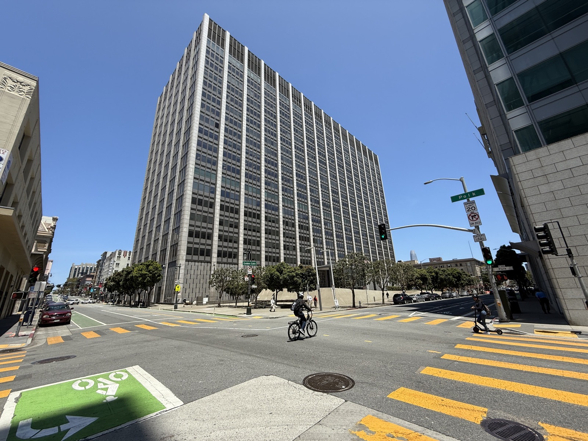

# Anthropic

_Training on lawfully bought books was fair use while keeping pirated copies was infringement, and that ruling turned data provenance into the first variable in AI copyright litigation_

## Executive Summary

> [!callout]
> In July 2026, the U.S. District Court for the Northern District of California gave final approval to the settlement in Bartz v. Anthropic. Anthropic agreed to pay $1.5 billion covering roughly 480,000 works, the largest copyright settlement on record.

> The point is not the size of the payout but the place where the court drew the line. The same book was fair use when lawfully purchased and used for training, and infringement when downloaded from a pirated source and stored. The $1.5 billion is not compensation for training; it is the price set on acquiring and keeping seven million books without authorization. The path of acquisition decided guilt.

> Not what the data taught the model, but how the data was obtained, became the first variable that decides who wins after the fact. That boundary now imposes a new burden of proof on corporate data procurement and vendor due diligence.

Four numbers capture the scale of this settlement and what would have been at stake had it gone to trial.

<!-- stat-card -->
**$1.5B** — Total settlement — Largest copyright settlement on record

<!-- stat-card -->
**~480,000** — Works compensated — About $3,000 allocated per work

<!-- stat-card -->
**$150,000** — Max statutory damages per work — Applied to 7M books, an existential threat

<!-- stat-card -->
**7M books** — E-books downloaded without license — Via LibGen and PiLiMi shadow libraries

## What Actually Happened

The formal name of the case is Bartz v. Anthropic PBC. Authors Andrea Bartz, Charles Graeber, and Kirk Wallace Johnson filed a class action in August 2024, claiming that Anthropic had used their books to train AI without permission. The judge who issued summary judgment the following summer was William Alsup, long known for handling Silicon Valley technology cases. After he retired, Judge Araceli Martínez-Olguín gave the settlement final approval on July 20, 2026.

The scale was unprecedented: $1.5 billion in total, across roughly 482,000 works. Divide the total by the count and about $3,000 goes to each work. More than 90 percent of eligible rightsholders joined the claim, and for books held through a trust or publisher, author and publisher split the amount evenly. The fund is disbursed in stages through 2027.

*▲ The Phillip Burton Federal Building in San Francisco, home to the Northern District of California, where the Bartz v. Anthropic settlement was finally approved | Source: [Wikimedia Commons (Marincyclist, CC BY-SA 4.0)](https://commons.wikimedia.org/wiki/File:Phillip_Burton_Federal_Building_%26_United_States_Courthouse.jpg)*

Two distinct acts were at issue. One was downloading roughly seven million e-books without authorization from shadow libraries such as LibGen and PiLiMi (Pirate Library Mirror) and stacking them in an in-house library. The other was scanning lawfully bought physical books into digital files and then destroying the originals, a practice the industry calls buy-scan-destroy. The court reached entirely different conclusions on these two paths.

## The Line the Court Drew

Judge Alsup's June 2025 summary judgment split a single case into three strands and attached a different conclusion to each. That three-way split is the backbone of the entire case.

- •**Training on lawfully purchased books was fair use.** The court called it exceedingly transformative, likening it to the way a person reads and learns from a book.
- •**Scanning and destroying lawfully bought copies was also fair use.** The logic was that it merely replaced an already-owned physical copy with a digital file, not a new unauthorized reproduction.
- •**Downloading and keeping pirated copies was infringement.** Regardless of whether they were actually used for training, the unauthorized downloading and storage was itself an inherent and irreparable infringement.

What deserves attention is what the court actually placed on the scale. The standard that separated the three findings was not what Anthropic learned from the data. It was the purpose at the moment the data was acquired. Buying a book to obtain it is normal R&D procurement; downloading from a shadow library is an act aimed at avoiding payment.

*▲ The same act of training split into fair use or infringement depending on how the data was acquired | Source: [Wikimedia Commons (Joe Gratz, CC0)](https://commons.wikimedia.org/wiki/File:Courtroom_One_Gavel_-_Flickr_-_Joe_Gratz.jpg)*

> [!callout]
> The first of the four fair-use factors, the purpose and character of the use, was filled not by the outcome of training but by the intent at the point of acquisition. Infringement did not turn on how transformative the use was. It turned on the path by which the data was obtained. This is the precise legal mechanism of the boundary this settlement established.

## Why the Distinction Became Money

The distinction over acquisition path did not stop at legal elegance. It immediately became a question of money. U.S. copyright law allows statutory damages of up to $150,000 per infringed work. With seven million books held without authorization, multiplying by the maximum puts the theoretical exposure in the hundreds of billions of dollars. Had it gone to trial, the sum could have shaken the company's very survival.

*▲ Holding seven million books without authorization is a volume that would fill several floors of a university library's stacks | Source: [Wikimedia Commons (Ibagli, Public Domain)](https://commons.wikimedia.org/wiki/File:OSU_William_Oxley_Thompson_Memorial_Library_Stacks.JPG)*

On the other side, training itself was already in the safe zone. Training on the lawfully purchased portion had been settled as fair use in summary judgment, and that portion was not subject to damages. That clarifies the character of the $1.5 billion figure. This money is not compensation for the fact that Anthropic trained; it is compensation for the fact that it acquired and stored data through an unlawful path.

Seen from this angle, the roughly $3,000 allocated per work is not a fee for training but a price tag attached to the acquisition path. The same book was worth either $0 or $3,000 depending on where it was obtained. It is the first time the provenance of data was written into a judgment as a concrete number.

## The Industry Already Responded

The signal from the ruling spread quickly into practice. Court filings and industry reporting show buy-scan-destroy (purchasing books, scanning them, and destroying the originals) settling in as a data-sourcing standard across several AI companies. The judgment that training is safe as long as the acquisition path is clean has reshaped how companies procure.

*▲ A book-scanning facility at the Internet Archive in San Francisco. Buy-scan-destroy is settling in as an industry standard | Source: [Wikimedia Commons (Jason Scott, CC BY 2.0)](https://commons.wikimedia.org/wiki/File:San_Francisco_Internet_Archive_Scanning_Center.jpg)*

Plaintiffs' lawyers changed strategy too. Rather than wading into the thorny debate over whether AI training is fair use, they now aim only to prove that the data in question came from a shadow library such as LibGen. It is easier to prove and the damages are larger. A lawsuit contesting the legitimacy of training has shifted in character into a lawsuit digging up acquisition records.

This ruling does not copy cleanly onto every case, however. Suits against Meta or Midjourney will be judged separately on their own acquisition records. Same principle, different facts. And because Anthropic chose to settle rather than appeal, the portion recognizing fair use remains the judgment of a single district court, not a precedent confirmed on appeal. The principle that acquisition path is the first variable is spreading, but there is still room for outcomes to diverge case by case.

A shadow falls over competition as well. Large labs that have already finished training can resolve their risk into a fixed cost through settlements like this one. A startup just getting off the ground, by contrast, must license at market rates from the very start, an effect that leaves latecomers at a cost-structure disadvantage.

## What Companies Must Now Prove

For companies that use AI, the question this ruling leaves converges on one point: the focus of vendor due diligence has to change. Until now the standard question was whether your model trained on copyrighted data. But nearly every large model did, so that question filters out nothing. What must be asked now is how that data was acquired.

The problem is that most procurement checklists have no data-provenance item at all. That is precisely the practical gap this case exposed. And because there is no appellate ruling and the law remains in flux, it is safer to build an intellectual-property indemnification clause into contracts now. A vendor's fair-use claim is still a matter of dispute, not settled law, and the contract should decide in advance who pays if a court rules otherwise.

The same principle applies when a company obtains and stores data itself. Purchase records, acquisition logs, and access-path documentation have to be kept from now on, so that in a later lawsuit or audit the company can prove how it got hold of the data. What must be managed has moved from which data was used to whether you can prove how you got hold of it.

The Pebblous blog has addressed this shift before. From the angle of an EU AI Act audit, we noted that the crux of litigation moves from what was trained on to whether you can prove how it was obtained ([our piece on separating training-data provenance](/blog/training-data-source-separation/en/)). That was a general argument from the standpoint of regulation and audit. This settlement is the first case in which that very principle was fixed in an actual lawsuit as a dollar figure.

Editor's Note

Pebblous has argued across many pieces that the value of data comes from its lineage and provenance. This ruling is the moment a court wrote that proposition down as a number. Explaining where and how data was acquired, and keeping it in a state you can prove, that is, managing data provenance, is the work Pebblous has done under the banner of AI-Ready Data.

## References

### Legal Analysis

- 1.Kluwer Copyright Blog. (2026). "[The Bartz v. Anthropic Settlement: Understanding America's Largest Copyright Settlement](https://legalblogs.wolterskluwer.com/copyright-blog/the-bartz-v-anthropic-settlement-understanding-americas-largest-copyright-settlement/)."
- 2.Mondaq. (2026). "[Intelligence Piracy: Anthropic Agrees To US$1.5 Billion Copyright Settlement](https://www.mondaq.com/unitedstates/copyright/1821102/)."
- 3.IQ Source. (2026). "[Anthropic's $3,000-Per-Book Settlement Exposes a Gap in AI Vendor Vetting](https://www.iqsource.ai/en/blog/anthropic-copyright-settlement-vendor-due-diligence/)."

### News Coverage

- 4.Euronews Next. (2026). "[Anthropic to pay $1.3bn in biggest copyright settlement on record](https://www.euronews.com/next/2026/07/21/anthropic-to-pay-13bn-in-biggest-copyright-settlement-on-record)."
- 5.International Business Times UK. (2026). "[Anthropic's Historic Settlement: Training AI on Legally Bought Books Stays Fair Use](https://www.ibtimes.co.uk/anthropic-historic-settlement-pirated-books-1810392)."
- 6.FourWeekMBA. (2026). "[Anthropic's $1.5 Billion Copyright Settlement and the Rising Cost of AI Training Data](https://fourweekmba.com/ai-anthropic-copyright-settlement-training-data-cost/)."

### Official Documents

- 7.Authors Guild. (2026). "[What Authors Need to Know About the Anthropic Settlement](https://authorsguild.org/advocacy/artificial-intelligence/what-authors-need-to-know-about-the-anthropic-settlement/)."
- 8.Authors Guild. (2025). "[Mixed Decision in Anthropic AI Case](https://authorsguild.org/news/mixed-decision-in-anthropic-ai-case/)."
