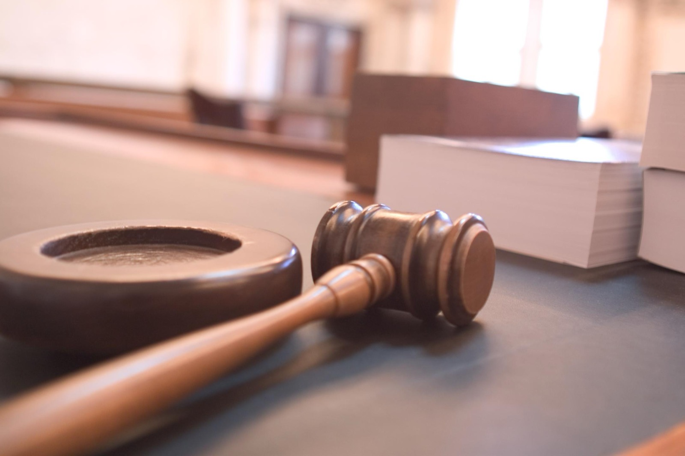
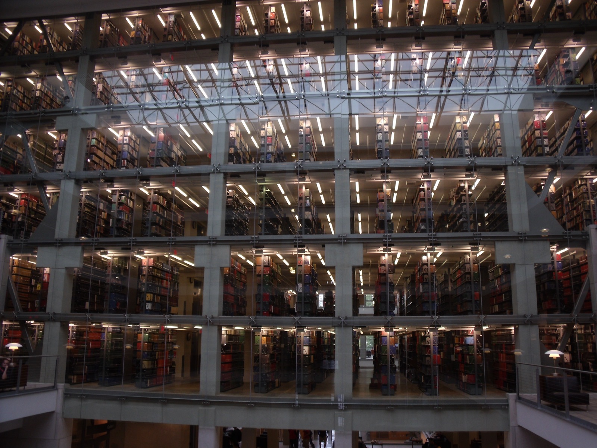
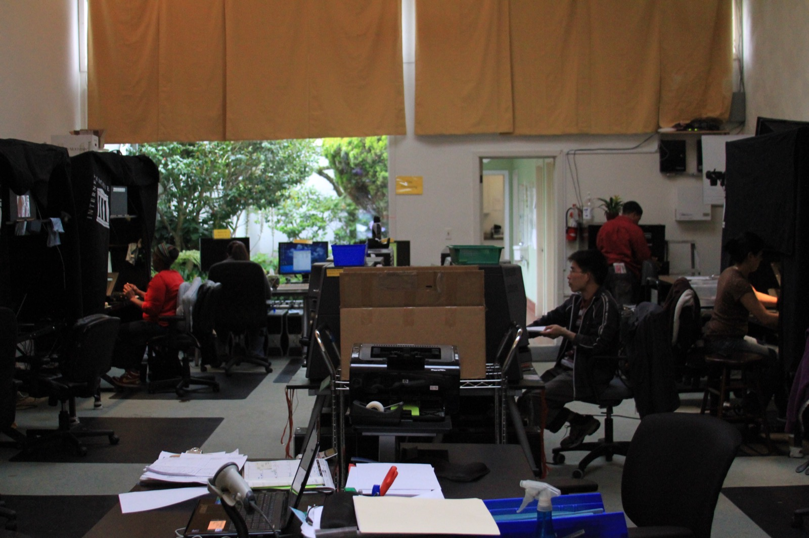

# 앤트로픽 저작권 합의가 세운 데이터 취득 경로의 법적 경계

_합법 구매본 학습은 공정 이용, 불법 복제본 보관은 침해로 갈린 판결이 데이터 프로버넌스를 소송의 1차 변수로 세웠다_

## Executive Summary

> [!callout]
> 2026년 7월, 미국 캘리포니아 북부지방법원은 Bartz v. Anthropic 사건의 합의를 최종 승인했다. 앤트로픽은 저작물 약 48만 건에 15억 달러를 지급하기로 했고, 이는 기록상 가장 큰 저작권 합의로 남았다.

> 핵심은 합의금의 크기가 아니라 법원이 선을 그은 자리다. 같은 책이라도 합법적으로 사서 학습에 쓰면 공정 이용이었고, 불법 복제본을 내려받아 보관하면 침해였다. 15억 달러는 학습에 대한 배상이 아니라 700만 권을 무단으로 취득하고 보관한 데 매겨진 값이다. 취득 경로가 유무죄를 갈랐다.

> 데이터를 무엇으로 배웠느냐가 아니라 어떻게 손에 넣었느냐가 사후 소송의 승패를 가르는 1차 변수가 됐다. 그 경계는 기업의 데이터 조달과 벤더 실사에도 새로운 증빙 의무를 남긴다.

이 합의가 어떤 규모였고, 재판까지 갔다면 무엇이 걸려 있었는지를 네 개 숫자로 추렸다.

<!-- stat-card -->
**$1.5B** — 합의 총액 — 기록상 최대 규모의 저작권 합의

<!-- stat-card -->
**약 48만 건** — 배상 대상 저작물 — 저작물 1건당 약 $3,000 배분

<!-- stat-card -->
**$150,000** — 저작물당 법정손해배상 최대치 — 700만 권에 적용됐다면 회사 존속 위협

<!-- stat-card -->
**700만 권** — 무단 다운로드 전자책 — LibGen·PiLiMi 섀도 라이브러리 경유

## 무슨 일이 있었나

사건의 정식 이름은 Bartz v. Anthropic PBC다. 작가 앤드리아 바츠, 찰스 그레이버, 커크 월리스 존슨이 2024년 8월 집단소송을 제기했다. 앤트로픽이 자신들의 책을 허락 없이 AI 학습에 썼다는 주장이었다. 이듬해 여름 요약판결을 낸 판사는 실리콘밸리 기술 소송에 밝기로 이름난 윌리엄 앨섭이었고, 그가 은퇴한 뒤 아라셀리 마르티네스올긴 판사가 2026년 7월 20일 합의를 최종 승인했다.

규모는 전례가 없었다. 총액 15억 달러, 우리 돈으로 약 1조 9,700억 원. 배상 대상 저작물은 약 48만 2,000건으로, 총액을 건수로 나누면 저작물 한 건당 약 3,000달러가 돌아간다. 자격을 갖춘 권리자의 청구 참여율은 90%를 넘었고, 신탁이나 출판사가 낀 도서는 저자와 출판사가 절반씩 나눈다. 자금은 2027년까지 몇 차례에 걸쳐 집행된다.

*▲ 캘리포니아 북부지방법원이 입주한 샌프란시스코 필립 버튼 연방빌딩. 이곳에서 Bartz v. Anthropic 합의가 최종 승인됐다 | Source: [Wikimedia Commons (Marincyclist, CC BY-SA 4.0)](https://commons.wikimedia.org/wiki/File:Phillip_Burton_Federal_Building_%26_United_States_Courthouse.jpg)*

문제가 된 행위는 두 갈래였다. 하나는 LibGen과 PiLiMi(Pirate Library Mirror) 같은 섀도 라이브러리에서 약 700만 권의 전자책을 무단으로 내려받아 사내 라이브러리에 쌓아 둔 것이다. 다른 하나는 합법적으로 산 실물 책을 스캔해 디지털 파일로 바꾼 뒤 원본을 파쇄하는 방식으로, 업계에서 buy-scan-destroy라 부르는 관행이다. 이 두 경로에 법원이 전혀 다른 판단을 내렸다.

## 법원이 그은 선

앨섭 판사의 2025년 6월 요약판결은 하나의 사건을 세 갈래로 쪼갠 뒤 각각에 다른 결론을 붙였다. 이 3분할이 이번 사건 전체의 뼈대다.

- •**합법 구매한 책으로 학습한 것은 공정 이용.** 법원은 이를 대단히 변형적(exceedingly transformative)이라고 봤다. 사람이 책을 읽고 배우는 과정에 빗댄 것이다.
- •**합법 구매본을 스캔해 파쇄한 것도 공정 이용.** 이미 소유한 실물을 디지털 파일로 대체한 것일 뿐 새로운 무단 복제가 아니라는 논리였다.
- •**불법 복제본을 내려받아 보관한 것은 침해.** 학습에 실제로 썼는지와 무관하게, 무단 다운로드와 보관 그 자체가 본질적이고 회복 불가능한 침해라고 판단했다.

여기서 눈여겨볼 것은 법원이 실제로 저울에 올린 대상이다. 세 판단을 가른 기준은 앤트로픽이 그 데이터로 무엇을 배웠는지가 아니었다. 데이터를 손에 넣는 시점의 목적이었다. 책을 사서 확보하는 행위는 연구개발의 정상적 조달이고, 섀도 라이브러리에서 내려받는 행위는 값을 치르지 않으려는 목적이라는 것이다.

*▲ 같은 학습 행위라도 취득 경로에 따라 공정 이용과 침해로 갈린 판결 | Source: [Wikimedia Commons (Joe Gratz, CC0)](https://commons.wikimedia.org/wiki/File:Courtroom_One_Gavel_-_Flickr_-_Joe_Gratz.jpg)*

> [!callout]
> 공정 이용을 판단하는 네 요소 중 첫째인 사용의 목적과 성격이, 학습 결과가 아니라 취득 시점의 의도로 채워졌다. 변형성이 얼마나 높은가로는 침해 여부가 갈리지 않았다. 데이터를 어떤 경로로 확보했는가가 갈랐다. 이것이 이번 합의가 세운 경계의 정확한 법적 메커니즘이다.

## 왜 이 구분이 돈이 됐나

취득 경로의 구분은 법리적 정교함으로 끝나지 않았다. 곧바로 돈의 문제가 됐다. 미국 저작권법은 침해 저작물 한 건당 최대 15만 달러까지 법정손해배상을 물릴 수 있게 해 둔다. 앤트로픽이 무단으로 보관한 책이 700만 권이었으니, 최대치를 곱하면 이론상 노출액은 수천억 달러에 이른다. 재판까지 갔다면 회사의 존속 자체가 흔들릴 수 있는 규모였다.

*▲ 책 700만 권을 무단 보관한 규모는 대학 도서관 서가 여러 개 층을 가득 채우는 물량이다 | Source: [Wikimedia Commons (Ibagli, Public Domain)](https://commons.wikimedia.org/wiki/File:OSU_William_Oxley_Thompson_Memorial_Library_Stacks.JPG)*

반대편에서 학습 자체는 이미 안전지대에 있었다. 합법 구매분으로 학습한 부분은 요약판결에서 공정 이용으로 정리됐고, 그 부분은 배상 대상이 아니었다. 그래서 15억 달러라는 숫자의 성격이 분명해진다. 이 돈은 앤트로픽이 학습을 했다는 데 대한 배상이 아니라, 데이터를 불법 경로로 취득하고 보관했다는 데 대한 배상이다.

저작물 한 건에 약 3,000달러라는 배분액을 이런 각도에서 다시 보면, 그것은 학습의 대가가 아니라 취득 경로에 붙은 가격표다. 같은 책이라도 어디서 구했느냐에 따라 값이 0달러이거나 3,000달러였다. 데이터의 출처가 처음으로 판결문에 구체적인 숫자로 적힌 순간이다.

## 산업은 이미 반응했다

판결의 신호는 빠르게 관행으로 번졌다. 법원 서류와 업계 보도를 보면, 도서를 사서 스캔하고 원본을 파쇄하는 buy-scan-destroy 방식이 여러 AI 기업의 데이터 소싱 표준으로 자리 잡고 있다. 취득 경로만 깨끗하면 학습은 안전하다는 판단이, 조달 방식을 바꿔 놓은 것이다.

*▲ 샌프란시스코 인터넷 아카이브의 도서 스캐닝 시설. buy-scan-destroy 방식이 업계 표준으로 자리 잡고 있다 | Source: [Wikimedia Commons (Jason Scott, CC BY 2.0)](https://commons.wikimedia.org/wiki/File:San_Francisco_Internet_Archive_Scanning_Center.jpg)*

원고 측 변호사들의 전략도 달라졌다. 이제는 AI 학습이 공정 이용인가라는 까다로운 논쟁에 들어가는 대신, 문제의 데이터가 LibGen 같은 섀도 라이브러리에서 나왔는지만 입증하려 한다. 입증이 쉽고 배상액이 크기 때문이다. 학습의 정당성을 다투는 소송이, 취득 기록을 캐는 소송으로 성격이 바뀌었다.

다만 이 판결이 모든 사건에 그대로 복사되지는 않는다. 메타나 미드저니를 상대로 한 소송은 각자의 취득 기록에 따라 별도로 판단받는다. 같은 원칙, 다른 사실관계다. 게다가 앤트로픽이 항소 대신 합의를 택했기 때문에, 공정 이용을 인정한 부분은 상급심에서 확정된 판례가 아니라 단일 지방법원의 판단으로 남는다. 취득 경로가 1차 변수라는 원칙은 확산 중이지만, 사건마다 결과가 갈릴 여지는 여전히 있다.

경쟁 구도에도 그늘이 생긴다. 이미 학습을 끝낸 대형 랩은 이번 같은 합의로 리스크를 확정 비용으로 정리할 수 있다. 반면 이제 막 시작하는 신생 기업은 처음부터 시장가로 라이선싱해야 하니, 원가 구조에서 후발주자가 불리해지는 효과가 함께 따라온다.

## 기업이 지금 증빙해야 할 것

이 판결이 AI를 쓰는 기업에 남기는 질문은 하나로 모인다. 벤더 실사의 초점이 바뀌어야 한다는 것이다. 지금까지의 단골 질문은 당신의 모델이 저작권 데이터로 학습했느냐였다. 그러나 대형 모델은 거의 다 그렇게 학습했으니 이 질문으로는 아무것도 걸러지지 않는다. 이제 물어야 할 것은 그 데이터를 어떻게 취득했느냐다.

문제는 대다수 조달 체크리스트에 데이터 프로버넌스 항목이 아예 없다는 점이다. 이번 사건이 드러낸 실무 공백이 바로 여기다. 게다가 항소심이 없어 법리가 아직 유동적이므로, 계약에는 지식재산권 면책 조항을 지금 넣어 두는 편이 안전하다. 벤더의 공정 이용 주장은 아직 논쟁이지 확정된 법이 아니고, 법원이 다르게 판단할 경우 누가 배상하는지를 계약서가 미리 정해 둬야 한다.

기업이 스스로 데이터를 확보하고 보관할 때도 같은 원칙이 적용된다. 구매 증빙, 취득 로그, 접근 경로 기록을 지금부터 남겨 둬야, 나중에 소송이나 감사에서 이 데이터를 어떻게 손에 넣었는지 증명 가능한 상태가 된다. 관리해야 할 대상이 어떤 데이터를 썼는가에서 그 데이터를 어떻게 손에 넣었는지 증명할 수 있는가로 옮겨 간 것이다.

페블러스 블로그는 이 흐름을 앞서 다룬 적이 있다. 소송의 쟁점이 학습한 것에서 어떻게 구했는지 증명 가능한가로 옮겨 간다는 진단을 EU AI Act 감사의 각도에서 짚었다([학습 데이터 출처 분리 보관 글](/blog/training-data-source-separation/ko/)). 그때는 규제와 감사의 관점에서 나온 일반론이었다. 이번 합의는 바로 그 원칙이 실제 소송에서 달러 숫자로 확정된 첫 사례다.

Editor's Note

페블러스는 데이터의 값이 그 계보와 출처에서 나온다는 명제를 여러 글에서 확인해 왔다. 이번 판결은 그 명제를 법정이 숫자로 받아 적은 순간이다. 데이터를 어디서 어떻게 취득했는지를 스스로 설명하고 증빙 가능한 상태로 지키는 일, 곧 데이터 프로버넌스를 관리하는 일이 페블러스가 AI-Ready Data로 해 온 작업이다.

## 참고문헌

### 법률 분석

- 1.Kluwer Copyright Blog. (2026). "[The Bartz v. Anthropic Settlement: Understanding America's Largest Copyright Settlement](https://legalblogs.wolterskluwer.com/copyright-blog/the-bartz-v-anthropic-settlement-understanding-americas-largest-copyright-settlement/)."
- 2.Mondaq. (2026). "[Intelligence Piracy: Anthropic Agrees To US$1.5 Billion Copyright Settlement](https://www.mondaq.com/unitedstates/copyright/1821102/)."
- 3.IQ Source. (2026). "[Anthropic's $3,000-Per-Book Settlement Exposes a Gap in AI Vendor Vetting](https://www.iqsource.ai/en/blog/anthropic-copyright-settlement-vendor-due-diligence/)."

### 언론 보도

- 4.Euronews Next. (2026). "[Anthropic to pay $1.3bn in biggest copyright settlement on record](https://www.euronews.com/next/2026/07/21/anthropic-to-pay-13bn-in-biggest-copyright-settlement-on-record)."
- 5.International Business Times UK. (2026). "[Anthropic's Historic Settlement: Training AI on Legally Bought Books Stays Fair Use](https://www.ibtimes.co.uk/anthropic-historic-settlement-pirated-books-1810392)."
- 6.FourWeekMBA. (2026). "[Anthropic's $1.5 Billion Copyright Settlement and the Rising Cost of AI Training Data](https://fourweekmba.com/ai-anthropic-copyright-settlement-training-data-cost/)."

### 공식 문서

- 7.Authors Guild. (2026). "[What Authors Need to Know About the Anthropic Settlement](https://authorsguild.org/advocacy/artificial-intelligence/what-authors-need-to-know-about-the-anthropic-settlement/)."
- 8.Authors Guild. (2025). "[Mixed Decision in Anthropic AI Case](https://authorsguild.org/news/mixed-decision-in-anthropic-ai-case/)."
