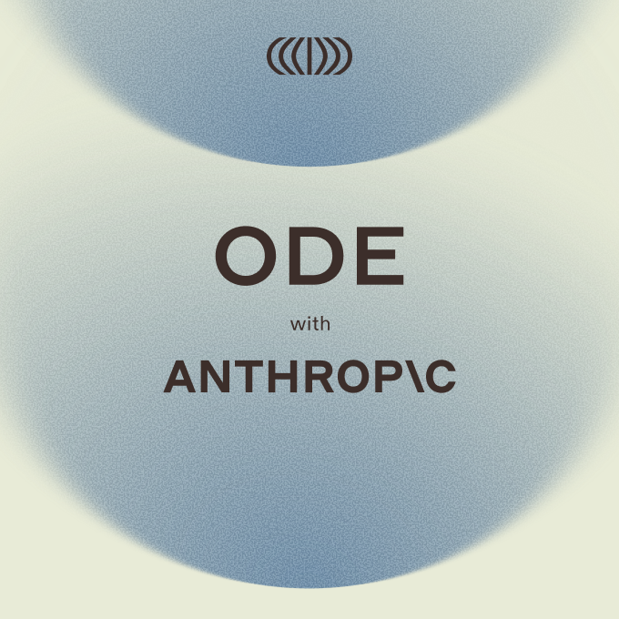
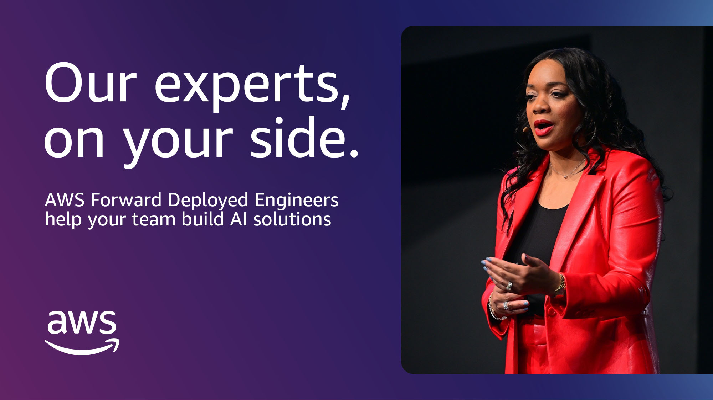

# 앤트로픽이 15억 달러로 세운 AI 구현 회사, 오드

_오픈AI·마이크로소프트·AWS까지 배포 전담 조직에 조 단위를 쏟기 시작했다_

## Executive Summary

> [!callout]
> 2026년 7월 15일, 앤트로픽이 블랙스톤·헬만앤프리드먼·골드만삭스와 함께 15억 달러를 모아 'AI 구현 회사' 오드(Ode with Anthropic)를 세웠다. 모델을 만드는 회사가 이번에 사들인 것은 더 큰 모델이 아니라, 기업 현장에 들어가 AI를 실제로 붙이는 사람들의 회사였다. 이 글은 그 자본 배분이 무엇을 말하는지 데이터 리더의 눈으로 읽는다.

> 눈에 띄는 대목은 오드의 기술 총책임자가 직접 한 말이다. 그는 모델 선택을 두고 "소프트웨어를 만들 때 프로그래밍 언어를 고르는 것과 비슷하다"고 했다. 모델 회사의 임원이 자기 제품을 시스템의 한 재료로 내려 부른 셈이다. 오픈AI·마이크로소프트·AWS까지 넉 달 새 나란히 배포 전담 조직에 조 단위를 걸었다는 사실이 이 발언을 우연이 아니게 만든다.

> 이 글은 "병목은 데이터다"를 다시 증명하려는 글이 아니다. 랩들이 스스로 어디에 돈을 걸었는지를 보고, 그들이 "인재 부족"이라 부르는 병목이 기업 현장에서 실제로 무엇인지를 데이터 준비도의 언어로 옮겨 본다.

아래 네 숫자 가운데 앞의 셋은 앤트로픽·마이크로소프트·AWS가 배포 조직에 실은 자본이고, 마지막 하나는 가장 앞선 마이크로소프트조차 자사 도구를 실제로 쓰게 만들지 못한 현실이다. 조 단위가 배포 쪽으로 흘러가는 동안, 정작 실사용은 1% 언저리에 머물러 있다.

<!-- stat-card -->
**$1.5B** — 오드 출범 자본 — 앤트로픽·블랙스톤 등 컨소시엄

<!-- stat-card -->
**$2.5B** — 마이크로소프트 Frontier — 배포 전문가 6,000명 규모

<!-- stat-card -->
**$1B** — AWS 배포 엔지니어링 — 고객이 지식 그래프·매뉴얼로 자립

<!-- stat-card -->
**1%** — Copilot 주간 활성 사용률 — 유료 시트 도입률은 5% 미만

## 모델 회사가 사람 회사를 샀다

오드의 출발점은 앤트로픽이 아니라 블랙스톤이었다. 블랙스톤은 자사 포트폴리오 기업에 AI를 심으려고 대형 컨설팅사와 소형 AI 부티크를 여럿 붙여 봤는데, 그중 '프랙셔널 AI(Fractional AI)'라는 작은 회사가 유독 성과를 냈다. 조인트벤처는 이 회사를 통째로 인수했고, 프랙셔널 AI는 인수 직후 11개월간 이어오던 오픈AI와의 파트너십을 정리했다. 오드의 CEO 크리스 테일러와 CTO 에디 시겔은 둘 다 프랙셔널 AI 공동창업자 출신으로, 같은 직함을 오드에서 그대로 유지한다.

자금 구조를 보면 판돈의 무게가 드러난다. 총 15억 달러 가운데 앤트로픽·블랙스톤·헬만앤프리드먼이 각각 약 3억 달러, 골드만삭스가 약 1억 5천만 달러를 댔고, 제너럴 애틀랜틱·아폴로·GIC·세쿼이아 등이 나머지를 채웠다. 테일러는 "잘 실행하면 언젠가 조 단위 기업이 될 수 있다"고 말했다. 모델 한 세대를 더 키우는 데 쓸 수도 있었을 돈이, 모델을 기업 안에 붙이는 일에 흘러 들어간 것이다.

오드의 운영 원칙은 "클로드 퍼스트(Claude-first)"다. 가능하면 앤트로픽 기술을 먼저 쓰되, 필요하면 경쟁 모델도 함께 쓴다. 지금 엔지니어는 100명 규모다. 모델을 파는 회사가 아니라, 그 모델을 남의 조직 안에서 작동시키는 손을 파는 회사인 셈이다.

*▲ 오드(Ode with Anthropic) 출범 보도자료 대표 이미지 | Source: [Ode Official Press](https://www.ode.com/press/anthropic-blackstone-and-hellman-friedman-introduce-ode-with-anthropic-an-enterprise-ai-services-firm)*

## 모델은 프로그래밍 언어 선택이다

이번 발표에서 가장 오래 곱씹게 되는 문장은 CTO 에디 시겔의 육성이다. 모델 회사의 기술 총책임자가 모델의 자리를 이렇게 정리했다.

"모델 선택은 중요하다고 생각합니다. 하지만 대부분의 노력이 거기 들어가는 건 아닙니다. 그건 시스템을 구성하는 하나의 재료일 뿐이에요. 소프트웨어를 만들 때 프로그래밍 언어를 고르는 것과 비슷합니다. 기업 전환을 파이썬이냐 자바냐로 정의하지는 않을 겁니다."

모델을 만드는 진영의 임원이 모델을 "재료 하나"로 부른 것은, 성능 경쟁이 사실상 평평해졌다는 조용한 인정이다. 실제로 시겔의 말은 혼자 나온 것이 아니다. 오픈AI는 앞서 'The Deployment Company(배포 회사)'를 내놓았고, 델로이트와 액센츄어도 자체 전방배치 엔지니어(FDE) 팀을 꾸렸다. 마이크로소프트는 6,000명 규모의 Frontier Company를, AWS는 10억 달러짜리 배포 엔지니어링 조직을 세웠다.

넉 달 새 다섯 곳이 같은 방향에 돈을 걸었다면, 그건 유행이 아니라 산업의 무게중심이 옮겨갔다는 신호다. 모델이 서로 비슷해진 자리에서 승부처는 "누가 남의 조직 안에서 배포를 끝까지 해내는가"로 넘어갔다.

## 겨냥한 곳은 은행과 병원이었다

오드가 정조준한 시장은 이전 배포 경쟁이 다루던 곳과 다르다. 마이크로소프트 Frontier의 초기 고객은 런던증권거래소그룹, 유니레버, 노보 노디스크 같은 글로벌 블루칩이었다. 오드가 노린 곳은 그 반대편이다. AI를 원하지만 만들 인력이 없는 지역 은행, 지방 의료 시스템, 중견 제조업체다.

테일러의 진단은 단순하다. AI를 핵심 업무에 붙이려면 최상위 AI 인재가 필요한데, 대부분의 기업은 그런 사람을 데리고 있지 않다는 것이다. 대기업은 자체 팀을 꾸려 어떻게든 버티지만, 엔지니어 한 명 뽑기도 벅찬 중견 조직은 남이 들어와 붙여 주지 않으면 시작조차 못 한다. AI 배포 경쟁이 대기업 울타리를 넘어 중견 시장까지 내려온 것이다.

중요한 것은 랩들이 이 병목을 "데이터"라고 부르지 않는다는 점이다. 그들이 쓰는 단어는 "최상위 AI 인재 부족", "엔드투엔드로 문제를 푸는 일반화 엔지니어 부족"이다. 그렇다면 왜 하필 희소하고 비싼 사람이 필요한가. 이 질문에 답하려면 그 엔지니어들이 현장에서 실제로 무슨 일을 하는지 봐야 한다.

## '구현'이라는 말의 실체

'구현(implementation)'은 매끈한 단어지만, 안을 열어 보면 대부분 데이터 작업이다. AWS는 자사 배포 조직을 설명하면서, 프로젝트가 끝나면 고객이 "지식 그래프, 실행 매뉴얼(runbook), 훈련된 직원"을 손에 쥐고 자립한다고 했다. 이 세 가지를 데이터의 언어로 옮기면 이렇게 된다. 흩어진 사내 데이터를 관계로 엮은 지도, 그 데이터가 어디서 와서 어떻게 변형됐는지 적은 계보, 그리고 그것을 읽고 다룰 줄 아는 사람.

*▲ AWS의 10억 달러 Forward Deployed Engineering 투자 발표 공식 이미지 | Source: [About Amazon](https://www.aboutamazon.com/news/aws/aws-1-billion-forward-deployed-ai-engineers)*

여기서부터는 랩들이 말하지 않은 영역이다. 그들이 "데이터"라고 부른 적은 없지만, 반년씩 고비용 엔지니어를 현장에 상주시켜야 하는 이유는 기업마다 데이터가 표준화돼 있지 않고 계보와 품질이 제각각이라 자동화가 걸리지 않기 때문이다. 구현 엔지니어가 몇 달에 걸쳐 하는 일의 상당 부분은 결국 데이터 정제·계보 문서화·품질 규칙 수립이다. FDE의 몸값은 그래서 곧 기업이 쌓아 둔 데이터 준비 부채의 시장 가격표이기도 하다.

수치도 이 방향을 가리킨다. Databricks의 2026년 조사에 따르면, 거버넌스와 데이터 인프라를 갖춘 기업은 그렇지 못한 기업보다 12배 많은 프로젝트를 실제 운영 단계까지 올렸다. 준비된 데이터 위에서는 배포가 빨리 끝나고, 그렇지 못한 곳에서는 비싼 사람이 오래 붙어 있어야 한다는 뜻이다. Info-Tech가 IT 리더에게 준 실무 조언 중 하나가 "배포 계약 시 데이터 이식성(portability)을 명시적으로 요구하라"였던 것도 같은 맥락이다.

## 그런데도 실사용률은 1%다

조 단위를 배포에 쏟는다고 문제가 다 풀리는 것은 아니다. 가장 앞서 있는 마이크로소프트조차, 자사 Copilot의 유료 시트 도입률은 5% 미만이고 주간 활성 사용자는 약 1%에 그친다. 가격은 오히려 올랐다. 좌석은 팔렸지만 실제로 쓰이지 않는다는 뜻이다.

이 간극은 사람을 더 투입한다고 저절로 메워지지 않는다. AI가 업무에 붙어 값을 하려면 결국 그 조직의 데이터가 읽을 수 있는 상태여야 한다. 배포 인력은 그 상태를 사람 손으로 만들어 주는 임시방편이고, 그 일이 끝나도 데이터는 계속 바뀌기 때문에 준비도는 한 번 사면 끝나는 물건이 아니라 유지해야 하는 능력에 가깝다.

> [!callout]
> 랩들의 조 단위 베팅이 데이터 리더에게 주는 신호는 분명하다. 다음 예산 라인이 모델 라이선스로 향하기 전에, 자기 조직의 데이터가 배포 엔지니어의 반년을 잡아먹을 상태인지 먼저 물어야 한다. 랩들이 사람에 돈을 거는 이유가 바로 거기에 있기 때문이다.

Editor's Note

오드나 마이크로소프트의 배포 엔지니어가 반년에 걸쳐 사람 손으로 하는 일 — 데이터 정제, 계보 문서화, 품질 규칙 수립 — 을 반복 가능하고 측정 가능한 작업으로 구조화하는 것이 페블러스가 해 온 AI-Ready Data 작업이다. 관련해 이미 다룬 글로는 [AI 파일럿이 프로덕션에서 죽는 이유](/blog/why-ai-pilots-fail-production/ko/)와 [청소만으로는 AI-Ready가 되지 않는다](/blog/clario-rot-data-ai-ready/ko/)가 있다.

## 참고문헌

### 업계·보도

- 1.Wiggers, K. (2026). "[Anthropic, Blackstone bet the next trillion-dollar AI business is implementation, not models](https://techcrunch.com/2026/07/15/anthropic-blackstone-bet-the-next-trillion-dollar-ai-business-is-implementation-not-models/)." TechCrunch.
- 2.Info-Tech Research Group. (2026). "[Big 5 AI Vendor Roundup — Week of July 6, 2026](https://www.infotech.com/software-reviews/vendor-technology-notes/big-5-ai-vendor-roundup-week-of-july-6-2026)." Info-Tech Research Group.
- 3.Technology.org. (2026). "[Ode with Anthropic and Blackstone launch enterprise AI implementation firm](https://www.technology.org/2026/07/16/ode-with-anthropic-blackstone-ai-implementation/)." Technology.org.

### 공식 발표

- 4.Anthropic, Blackstone & Hellman & Friedman. (2026). "[Anthropic, Blackstone, and Hellman & Friedman Introduce Ode with Anthropic, an Enterprise AI Services Firm](https://www.businesswire.com/news/home/20260715205134/en/Anthropic-Blackstone-and-Hellman-Friedman-Introduce-Ode-with-Anthropic-an-Enterprise-AI-Services-Firm)." BusinessWire.
