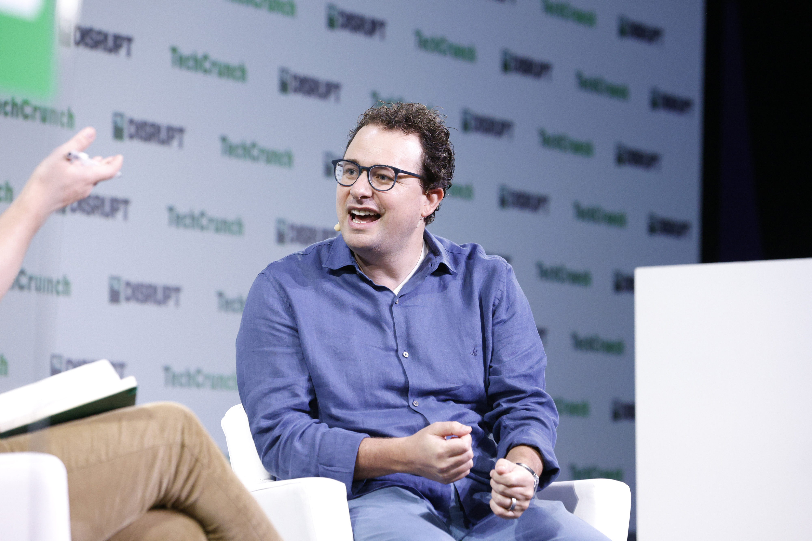
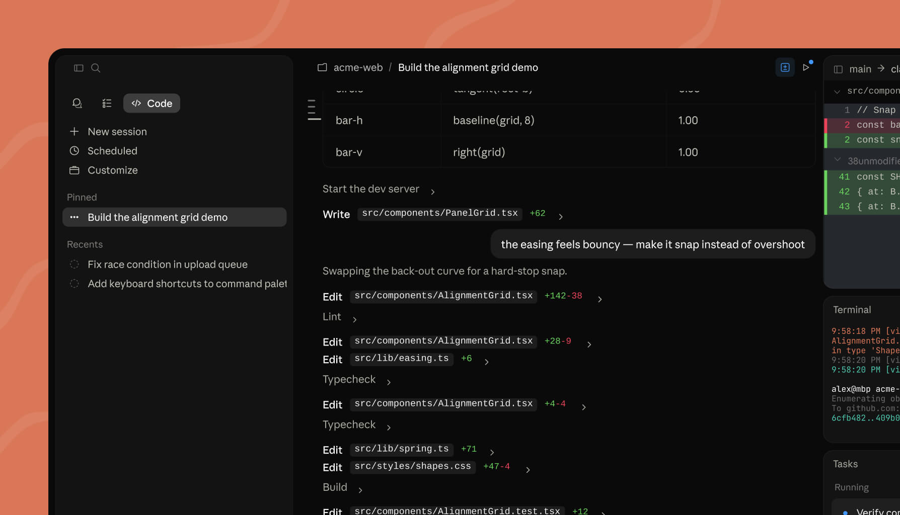
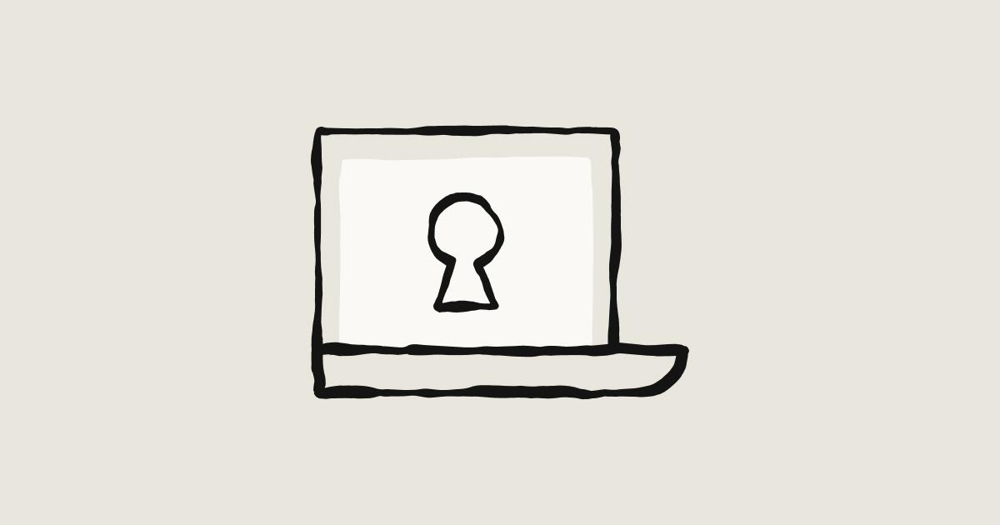
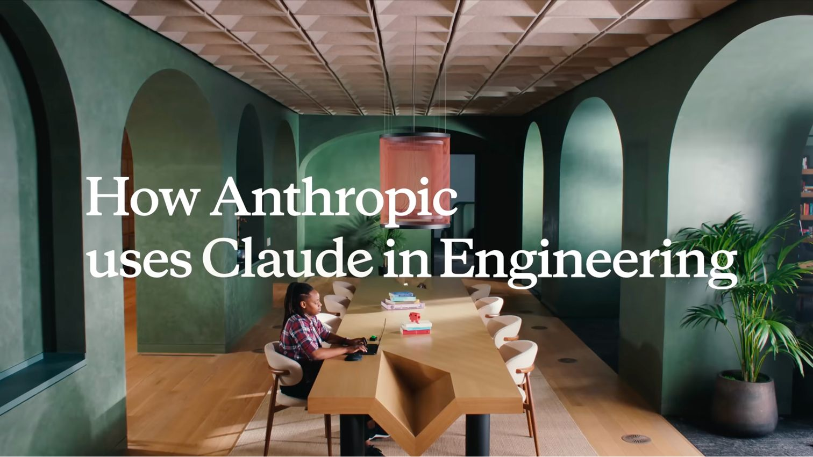

# 앤트로픽이 오픈AI를 넘어선 힘, 데이터 신뢰

_매출의 80%를 떠받친 기업 고객, 그 끈끈함의 바탕엔 데이터 신뢰가 있었다_

## Executive Summary

> [!callout]
> 2026년 5월, 앤트로픽의 기업가치가 9,650억 달러로 평가되며 오픈AI를 처음으로 앞질렀습니다. AI 업계의 순위가 뒤집힌 사건인데, 정작 그 순간을 만든 동력은 벤치마크 점수가 아니었습니다. 앤트로픽의 소비자 사용자 기반은 ChatGPT의 5% 수준에 불과합니다. 그런데도 매출에서 앞섰습니다. 더 똑똑한 모델이 아니라 다른 무언가가 가격을 움직였다는 뜻입니다.

> 그 무언가는 매출의 구성에 있었습니다. 앤트로픽 매출의 약 80%가 기업 고객에서 나옵니다. 기업 매출은 소비자 매출보다 끈끈하고 예측 가능해서, 투자자는 같은 1달러라도 더 높은 값을 매깁니다. 그리고 그 끈끈함을 지탱하는 것은 가격도 성능도 아닌 데이터 신뢰입니다. 학습에 고객 데이터를 쓰지 않고, 감사할 수 있게 만들고, 규제 산업의 컴플라이언스를 통과시키는 능력. 규제받는 기업이 자기 데이터를 믿고 맡길 수 있느냐가 채택의 진짜 병목이었습니다.

> 데이터를 다루는 쪽에 이 사건이 보내는 신호는 분명합니다. 모델 성능이 평준화될수록, AI 사업의 가치를 가르는 변수는 "누가 데이터를 믿고 맡기느냐"로 이동한다는 것입니다. 이 글은 9,650억 달러라는 가격표를 매출의 질과 그 질을 떠받친 데이터 신뢰로 되짚어, 왜 거버넌스가 곧 해자가 되는지 읽습니다.

### 주요 수치

출처: [Fortune](https://fortune.com/2026/06/01/anthropic-confidentially-files-ipo-965-billion-valuation/), [TradingKey](https://www.tradingkey.com/analysis/stocks/us-stocks/261935293-anthropic-ipo-openai-claude-code-tradingkey), [CNBC](https://www.cnbc.com/2026/05/28/anthropic-open-ai-startup-value.html)

네 숫자가 이 역전의 무게를 보여 줍니다. 두 회사의 기업가치, 앤트로픽 매출에서 기업 고객이 차지하는 비중, 같은 시기 연환산 매출 규모, 그리고 소비자 사용자라는 흔한 잣대로는 설명되지 않는 격차까지. 순위를 바꾼 것이 사용자 수가 아니라 매출의 질이었다는 사실이 이 안에 들어 있습니다.

<!-- stat-card -->
**$9,650억** — 앤트로픽 기업가치 — 오픈AI($8,520억)를 처음 넘어선 세계 최고가 AI 스타트업

<!-- stat-card -->
**80%** — 기업 고객 매출 비중 — 앤트로픽 매출의 약 80%가 기업에서. 오픈AI는 40%대

<!-- stat-card -->
**$47B** — 연환산 매출 run rate — 오픈AI 약 $25B를 앞섬. 곧 $50B 돌파 전망

<!-- stat-card -->
**5%** — 소비자 사용자 비중 — ChatGPT 대비 앤트로픽 소비자 기반. 그래도 매출에서 앞섬

## 순위가 바뀌었다, 그런데 모델 때문이 아니었다

2026년 5월 말, 앤트로픽이 650억 달러 규모의 신규 펀딩 라운드를 마무리하면서 기업가치가 9,650억 달러로 책정됐습니다. 알티미터, 그린오크스, 드래고니어, 세쿼이아가 이끈 라운드였고, 이 평가로 앤트로픽은 세계에서 가장 비싼 AI 스타트업이 됐습니다. 비교 대상은 오픈AI입니다. 오픈AI의 마지막 펀딩 기준 가치는 8,520억 달러. 앤트로픽이 이 숫자를 처음으로 넘어선 것입니다.

*▲ 앤트로픽 공동창업자이자 CEO 다리오 아모데이 (TechCrunch Disrupt 2023) | Source: [Kimberly White / Getty Images for TechCrunch, CC BY 2.0, via Wikimedia Commons](https://commons.wikimedia.org/wiki/File:Dario_Amodei_at_TechCrunch_Disrupt_2023_04.jpg)*

흔한 해석은 "더 좋은 모델을 만들었으니 더 비싸졌다"입니다. 그런데 이 사건에서는 그 설명이 잘 들어맞지 않습니다. 모델 성능 벤치마크에서 두 회사는 엎치락뒤치락하는 사이이고, 일반 대중에게 더 익숙한 쪽은 여전히 ChatGPT입니다. 앤트로픽의 소비자 사용자 기반은 ChatGPT의 5% 안팎으로 추정됩니다. 사용자 수만 놓고 보면 비교가 되지 않습니다.

그런데도 매출에서는 앤트로픽이 앞섰습니다. 연환산 매출 run rate가 470억 달러 수준으로, 같은 시기 오픈AI의 약 250억 달러를 웃돕니다. 다음 달 말이면 500억 달러를 넘길 것이라는 전망도 나옵니다. 2025년 7월 40억 달러였던 run rate가 1년 만에 폭증한 것입니다. 분기 단위로도 흑자 전환이 예상되고, 비밀리에 S-1 초안을 제출하며 2026년 가을 상장 가능성이 거론됩니다.

> [!callout]
> **핵심 질문**: 사용자 수는 20분의 1인데 매출은 더 많고, 기업가치는 더 높습니다. 더 똑똑한 모델이 순위를 바꾼 게 아니라면, 무엇이 가격을 움직였을까요. 답은 매출이 어디서 나오는지에 있습니다.

## 80%라는 숫자, 끈끈한 매출의 경제학

앤트로픽 매출의 약 80%가 기업 고객에서 나옵니다. 오픈AI는 반대 방향입니다. 엔터프라이즈 비중이 40%대로 올라오긴 했지만 여전히 소비자 매출에 더 기대고, ChatGPT의 주간 활성 사용자는 9억 명을 넘습니다. 한 업계 관계자의 정리가 두 회사의 차이를 압축합니다. "오픈AI는 엔터프라이즈 제품을 만드는 소비자 회사, 앤트로픽은 소비자 제품을 가진 엔터프라이즈 회사."

이 차이가 왜 기업가치로 이어지는지는 매출의 성질을 보면 드러납니다. 소비자 매출은 빠르게 커지지만 변동도 큽니다. 사용자는 쉽게 들어오고 쉽게 떠납니다. 반면 기업 계약은 한번 맺으면 잘 끊기지 않습니다. 업무 흐름에 들어간 도구는 교체 비용이 크고, 부서 단위로 쓰임이 늘면서 계약은 해마다 확장됩니다. 높은 retention, 낮은 churn, 복리로 쌓이는 expansion. 투자자가 보는 것은 바로 이 예측 가능성입니다.

그래서 같은 1달러의 매출이라도 값이 다르게 매겨집니다. 내년에도 거기 있을 것이 확실한 매출에는 더 높은 멀티플이 붙습니다. 앤트로픽의 성장 엔진인 Claude Code가 이 구조를 그대로 보여 줍니다. 2025년 5월 출시된 이 도구는 2026년 2월 연환산 매출 25억 달러에 이르렀고, 매출의 절반 이상이 엔터프라이즈에서 나옵니다. 포춘 10대 기업 중 8곳이 앤트로픽의 엔터프라이즈 고객이고, 엔터프라이즈 지출에서 앤트로픽이 차지하는 점유율은 2025년 초 10%에서 2026년 2월 65% 이상으로 뛰었습니다.

*▲ 앤트로픽 Claude Code 인터페이스 — 파일 편집, 테스트 실행, 터미널까지 자동으로 처리하는 에이전틱 코딩 도구 | Source: [Anthropic](https://www.anthropic.com/product/claude-code)*

고객 기반의 변화는 이 확장이 한두 대기업의 큰 계약이 아니라 넓고 두꺼운 토대 위에 있음을 보여 줍니다. 앤트로픽의 도구를 쓰는 기업은 2년 전만 해도 1,000곳이 채 되지 않았는데, 지금은 30만 곳을 넘습니다. 한번 들어온 기업이 부서를 늘려 가며 쓰임을 키우고, 그 위로 새 기업이 계속 쌓이는 구조입니다. 끈끈함은 떠나지 않는 한 명의 고객에서 나오는 게 아니라, 떠나지 않는 고객이 빠르게 늘어나는 데서 복리로 만들어집니다.

> [!callout]
> **왜 중요한가**: 소비자 바이럴은 사용자 수를 빨리 키우고, 엔터프라이즈 계약은 끊기지 않는 매출을 복리로 쌓습니다. 80%라는 숫자는 앤트로픽 매출의 대부분이 후자라는 뜻이고, 시장은 그 끈끈함에 프리미엄을 지불했습니다.

## 그 끈끈함의 바탕엔 데이터 신뢰가 있다

그렇다면 한 단계 더 들어가 봐야 합니다. 기업 매출이 끈끈한 건 맞는데, 애초에 규제받는 대기업이 왜 앤트로픽을 골랐을까요. 포춘 10대 기업 중 8곳이 같은 선택을 한 데에는 성능 점수로 환원되지 않는 이유가 있습니다. 금융, 헬스케어, 정부 같은 규제 산업에서 AI 도입의 진짜 장벽은 모델이 얼마나 똑똑한가가 아니라 "우리 데이터를 안전하게 맡길 수 있는가"였습니다.

앤트로픽은 이 질문에 제품으로 답했습니다. 고객 데이터를 모델 학습에 쓰지 않고, 데이터 보존 기간을 고객이 설정할 수 있게 하고, Trust Center로 데이터가 어떻게 처리되는지를 공개합니다. 여기에 클라우드플레어, 크라우드스트라이크, 옥타, 팰로앨토, 마이크로소프트 퍼뷰, 위즈, 지스케일러 등 28개 보안·컴플라이언스 플랫폼과 연동되고, Compliance API로 대화와 활동 로그를 기존 SIEM에서 감사할 수 있게 합니다. SOC 2 Type II 인증, 저장 데이터 AES-256 암호화, 전송 구간 TLS 1.2 이상, HIPAA와 BAA 지원도 갖췄습니다.

*▲ 앤트로픽 Claude 보안 제품의 핵심 개념 — 기업 데이터를 안전하게 잠그는 것이 AI 채택의 전제조건 | Source: [Anthropic](https://www.anthropic.com/product/security)*

이런 기능이 추상적 안심이 아니라 채택의 결정 요인이라는 건 고객의 입에서 확인됩니다. 개발자 2,500명에게 Claude를 배포한 팰로앨토 네트웍스는 "앤트로픽은 모든 미팅에서 보안을 논한다. 최대 보안기업인 우리에게 그건 큰 의미"라고 평했습니다. GitLab은 Claude가 "불안정하거나 기만적인 행동을 억제하는 능력"에서 두드러진다고 봤습니다. 규제 산업의 구매자가 보는 것은 벤치마크 순위가 아니라 감사 가능성입니다. 앤트로픽은 그 감사 가능성을 부가 옵션이 아니라 기본 기능으로 만들어, 채택의 병목을 풀었습니다.

> [!callout]
> **달라진 기준**: 성능이 비슷해진 시대에 규제받는 기업의 선택을 가른 건 "감사할 수 있는가"였습니다. 학습에 데이터를 쓰지 않고, 로그를 추적할 수 있고, 컴플라이언스를 통과시키는 능력. 데이터 신뢰는 80% 매출의 바닥에 깔린 진짜 기반입니다.

## 시장이 가격으로 인증한 명제

여기까지 오면 세 가지가 하나로 이어집니다. 앤트로픽의 기업가치가 오픈AI를 넘어섰고, 그 동력은 매출의 80%를 떠받친 기업 고객이었으며, 그 기업 고객을 붙든 것은 데이터 신뢰였습니다. 이 인과를 끝까지 따라가면 하나의 명제에 닿습니다. AI 사업의 해자는 모델이 아니라 데이터 신뢰라는 것. 이번 역전은 그 명제를 추상이 아니라 9,650억 달러라는 가격표로 증명한 사건입니다.

비용 구조를 보면 이 해석이 더 분명해집니다. 오픈AI는 2030년까지 연 1,250억 달러의 훈련 비용을 전망하는 반면 앤트로픽은 약 300억 달러로, 네 배 가까운 차이가 납니다. 앤트로픽은 네 배 적게 쓰고도 매출에서 앞섰습니다. 모델에 더 많은 연산을 부어 성능을 끌어올리는 경쟁만으로는 설명되지 않는 결과입니다. 변별점이 모델의 절대 성능에서 "그 모델에 데이터를 믿고 맡길 수 있느냐"로 옮겨갔다는 신호입니다.

*▲ 앤트로픽이 내부 엔지니어링에 Claude를 사용하는 방식 — 연산 비용이 아닌 데이터 신뢰 기반 기업 도입 모델 | Source: [Anthropic](https://www.anthropic.com/product/enterprise)*

물론 이 우위가 영원하지는 않습니다. 앤트로픽은 미 정부와 법적 분쟁을 겪고 있고, 펜타곤은 앤트로픽을 공급망 리스크로 지정하며 수십억 달러 규모의 매출 위협을 경고했습니다. 신뢰로 쌓은 해자는 신뢰의 문제로 흔들릴 수도 있습니다. 그러나 그 위험의 성격조차 같은 이야기를 합니다. 이 회사의 가치를 떠받치는 것도, 위협하는 것도 결국 데이터와 신뢰의 문제라는 것입니다.

> [!callout]
> **한 줄 요약**: "데이터 신뢰가 해자다"는 그동안 주장이었습니다. 이번 역전으로 시장이 그 주장에 가격을 매겼습니다. 모델 성능이 평준화될수록 가치를 가르는 변수는 누가 데이터를 믿고 맡기느냐로 이동합니다.

## 데이터를 맡길 수 있게 만드는 일이 사업이다

이 사건을 데이터 의사결정자의 언어로 옮기면 이렇게 됩니다. AI 도입의 ROI는 모델의 벤치마크 점수가 아니라, 그 모델에 우리 데이터를 안전하게 맡길 수 있느냐에서 나옵니다. 앤트로픽이 증명한 것은 거버넌스가 비용이 아니라 매출의 원천이라는 사실입니다. 학습에 데이터를 쓰지 않는다는 약속, 감사할 수 있는 로그, 규제를 통과하는 컴플라이언스가 그대로 끈끈한 기업 매출로, 다시 기업가치로 환산됐습니다.

뒤집어 보면 모델을 사는 쪽에도 같은 잣대가 생긴다는 뜻입니다. 앞으로 기업이 AI 공급자를 고를 때 먼저 묻는 것은 성능 순위가 아니라 데이터를 어떻게 다루느냐일 것입니다. 그렇다면 데이터를 가진 쪽이 할 일도 분명해집니다. 자기 데이터를 'AI에 맡길 수 있는 상태', 다시 말해 출처가 분명하고 권리가 정리되고 품질이 검증된 상태로 만들어 두는 일. 그것이 곧 협상 테이블에서 신뢰를 입증하는 서류가 됩니다.

페블러스가 데이터를 AI-Ready 상태로 만드는 일을 해온 이유도 여기에 있습니다. 모델 경쟁이 평준화될수록 차이를 만드는 것은 데이터를 믿고 맡길 수 있게 만드는 능력이라는 판단입니다. 이번 역전은 그 판단을 시장이 가격으로 확인해 준 사례입니다. AI 사업에서 다음에 가장 먼저 확인하게 될 자산은, 더 큰 모델이 아니라 신뢰할 수 있는 데이터일 가능성이 큽니다.

> [!callout]
> **마무리**: 순위를 바꾼 건 더 똑똑한 모델이 아니라 데이터를 믿고 맡긴 기업 고객이었습니다. 데이터를 맡길 수 있게 만드는 일은 규제 대응 업무가 아니라, 매출을 끈끈하게 만들고 기업가치를 떠받치는 사업 그 자체가 되어 가고 있습니다.

## 참고문헌

### 업계·보도

- 1.Fortune. (2026). "[Anthropic confidentially files for IPO at $965 billion valuation](https://fortune.com/2026/06/01/anthropic-confidentially-files-ipo-965-billion-valuation/)." _Fortune_. — 9,650억 달러 평가, 650억 달러 펀딩, 비공개 S-1 제출, 펜타곤 공급망 리스크 경고.
- 2.CNBC. (2026). "[Anthropic overtakes OpenAI as most valuable AI startup](https://www.cnbc.com/2026/05/28/anthropic-open-ai-startup-value.html)." _CNBC_. — 앤트로픽이 오픈AI를 넘어선 기업가치 역전 보도.
- 3.TradingKey. (2026). "[Anthropic IPO, OpenAI, and the Claude Code engine](https://www.tradingkey.com/analysis/stocks/us-stocks/261935293-anthropic-ipo-openai-claude-code-tradingkey)." _TradingKey_. — 연환산 매출 $47B vs $25B, Claude Code 매출, 엔터프라이즈 지출 점유율 10%→65%.
- 4.Al Jazeera. (2026). "[Anthropic soars to $965bn valuation, leapfrogging OpenAI](https://www.aljazeera.com/economy/2026/5/29/anthropic-soars-to-965bn-valuation-leapfrogging-openai)." _Al Jazeera_. — 펀딩 주도사, 다리오 아모데이, IPO 임박 맥락.
- 5.VentureBeat. (2026). "[Anthropic finally beat OpenAI in business AI adoption — but 3 big threats remain](https://venturebeat.com/ai/anthropic-finally-beat-openai-in-business-ai-adoption)." _VentureBeat_. — 엔터프라이즈 채택, 팰로앨토·GitLab 현장 증언.
- 6.Security Boulevard. (2026). "[Anthropic's enterprise security and compliance integrations](https://securityboulevard.com/)." _Security Boulevard_. — 28개 보안·컴플라이언스 플랫폼 연동, Compliance API, SIEM 감사.
