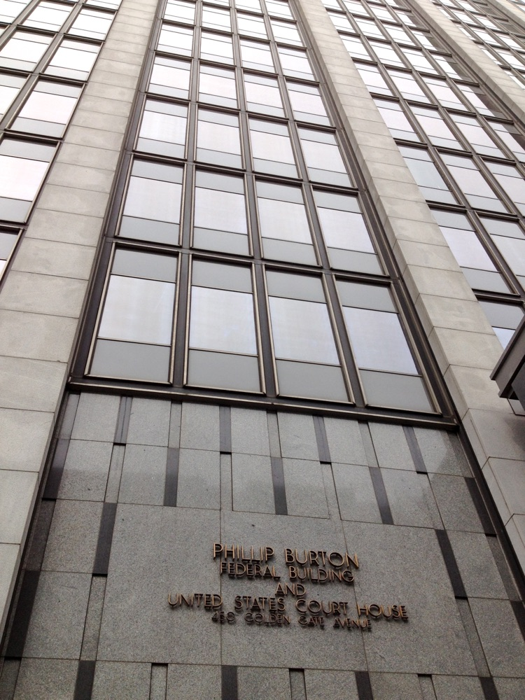

# A Federal Court Struck Down Anthropic

_Anthropic held its line on autonomous weapons and mass surveillance, and the risk grade that followed was ruled unlawful retaliation_

## Executive Summary

> [!callout]
> On Thursday evening, August 27, 2026, U.S. District Judge Rita Lin of the Northern District of California ruled that the Pentagon's designation of Anthropic as a supply-chain risk was illegal. She gave three grounds. The designation was retaliation of a kind the First Amendment forbids, it skipped the due process the Fifth Amendment requires, and it was arbitrary and capricious under the standard that governs agency action.

> What brought the label on was not a defect in the model. Anthropic had drawn two lines, refusing to let Claude be used for fully autonomous weapons or for mass surveillance of American citizens, and the Pentagon asked the company to erase them. When the talks broke down, the department applied to an American firm a category normally reserved for suppliers tied to hostile states, and the defense supply chain began pulling Claude out. Pentagon officials have disputed that the fight is over lethal weapons and mass surveillance, arguing that a private company cannot dictate how the government uses technology in scenarios like warfare and tactical operations.

> Six months passed between the day the label went on and the day it was voided, and the replacement work the defense supply chain carried out in that window does not come back with the ruling. That is why a single risk entry on a vendor scorecard is worth asking about. A separate suit in Washington, D.C. is still open.

*▲ Dario Amodei, Anthropic CEO — refused the Pentagon's demand to remove the guardrails | Source: [Wikimedia Commons (CC BY 2.0)](https://commons.wikimedia.org/wiki/File:Dario_Amodei_at_TechCrunch_Disrupt_2023_01.jpg)*

### Key figures

Source: [TechCrunch](https://techcrunch.com/2026/08/28/anthropic-gets-its-first-court-win-over-the-pentagons-supply-chain-risk-label/) (2026-08-28) and [CNBC](https://www.cnbc.com/2026/03/04/pentagon-blacklist-anthropic-defense-tech-claude.html) (2026-03-04)

<!-- stat-card -->
**Zero** — Technical findings behind the label — The judge wrote that Anthropic undisputedly lacks any backdoor access to its technology once it hands that technology over to the Defense Department

<!-- stat-card -->
**$200M** — The defense contract at the center — The contract that made Claude the first major model deployed on the government's classified networks. Anthropic entered the department's ecosystem in late 2024 through a partnership with Palantir

<!-- stat-card -->
**10** — Defense portfolio companies that dropped Claude — That count comes from a single venture firm's portfolio. Five days after the designation, all ten were already in active processes to replace Claude for defense use cases

<!-- stat-card -->
**6 months** — Phase-out window for federal agencies — Outside the Pentagon, the Treasury Department, the State Department and Health and Human Services directed employees to move off Claude

## The court called this label retaliation

Judge Rita Lin found that Defense Secretary Pete Hegseth's labeling of Anthropic as a risk to national security signified unlawful retaliation in violation of the First Amendment. In the same ruling she called the decision arbitrary and capricious, and said Anthropic had been denied the due process the Fifth Amendment requires. That is three distinct legal defects in one action.

*▲ Phillip Burton Federal Building and United States Courthouse, San Francisco — home to the U.S. District Court for the Northern District of California | Source: [Wikimedia Commons (CC BY-SA 3.0)](https://commons.wikimedia.org/wiki/File:Phillip_Burton_Federal_Building.jpg)*

The motive the judge found was not security. Her ruling says the government's "words and deeds confirm that the challenged actions were based on a desire to make a public example out of Anthropic for its 'arrogance' in criticizing the government." She did not leave the word security alone either. "The empty invocation of national security is not a blank check to punish and retaliate against government critics," she wrote.

The ruling did not touch the government's power to choose its vendors. Lin drew that line herself. "Though the Department of War is undisputedly free to select the AI vendor of its choice, the evidence demonstrates that the broad measures imposed on Anthropic were illegal and baseless," she wrote. What was illegal was not the decision to stop buying from a vendor. It was attaching a risk grade and then enforcing that grade across every federal agency and every contractor.

An Anthropic spokesperson welcomed the ruling in a statement shared with TechCrunch. "We welcome the court's ruling that this supply chain risk designation was unlawful." The statement went on: "We remain focused on working productively with the government to harness AI for our national security so all Americans benefit from this technology." TechCrunch said it had reached out to the Defense Department for comment.

## How a guardrail that held became a risk item

Anthropic entered the Defense Department's ecosystem in late 2024 through a partnership with Palantir. Months after that agreement, a $200 million contract made Claude the first major model deployed on the government's classified networks. The seed of the dispute was the pair of lines attached to that work. Claude would not be used for fully autonomous weapons, and it would not be used for mass surveillance of Americans. After a February 2026 meeting between Secretary Hegseth and chief executive Dario Amodei, the department asked the company to erase those lines, and Anthropic refused.

The logic Anthropic set out in its complaint was less about product specifications than about why the company exists. "Allowing Claude to be used to enable the Department to surveil U.S. persons at scale and to field weapons systems that may kill without human oversight would therefore be inconsistent with Anthropic's founding purpose and public commitments," the suit states. It also characterized the action itself. "The federal government retaliated against a leading frontier AI developer for adhering to its protected viewpoint on a subject of great public significance," the complaint says, naming that subject as AI safety and the limitations of the company's own model, "in violation of the Constitution and laws of the United States."

The Pentagon's account points the other way. Officials there have disputed that the fight with Anthropic is over lethal weapons and mass surveillance. Their claim is that private companies cannot dictate how the government uses technology in scenarios like warfare and tactical operations, and that all of its uses would be lawful. As TechCrunch summarized the department's position, it alleged that Anthropic could try to control the military's use of the models it bought and paid for.

On Friday, February 27, the Pentagon designated Anthropic a supply-chain risk. National security experts told NPR that such a label typically applies to foreign adversary contractors that could potentially sabotage U.S. interests, and that using it against an American company is highly unusual. Secretary Hegseth declared on X that any contractor or supplier doing business with the U.S. military is barred from commercial activity with Anthropic, and President Trump posted that federal agencies would have six months to phase out their use of the technology. On March 9 Anthropic filed two suits, one in the U.S. District Court for the Northern District of California and one in the federal appeals court in Washington, D.C.
