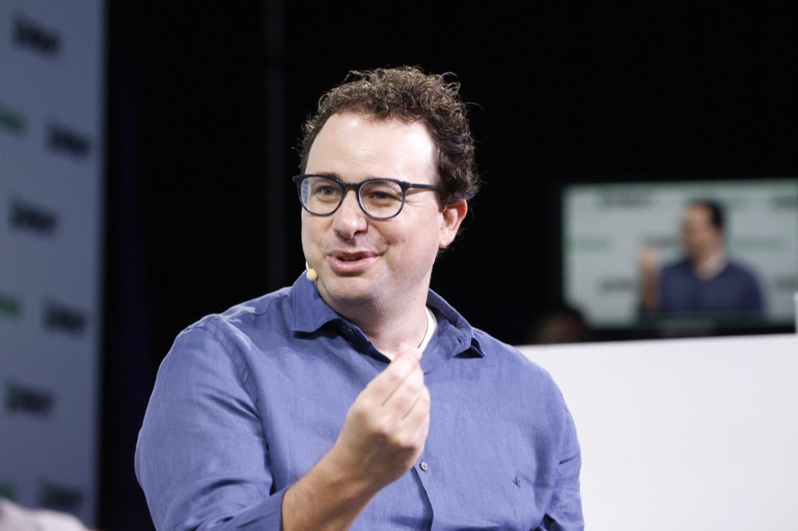

# 국방부의 앤트로픽 공급망 위험 지정을 뒤집은 연방법원 판결

_자율무기와 대량감시에 안전선을 그은 대가로 붙은 위험 등급이 위법 판정을 받기까지_

## Executive Summary

> [!callout]
> 2026년 8월 27일 목요일 저녁, 캘리포니아 북부지구 연방지방법원의 Rita Lin 판사가 국방부의 앤트로픽 공급망 위험 지정을 위법이라고 판단했습니다. 근거는 세 갈래였습니다. 수정헌법 1조가 금지하는 보복, 수정헌법 5조가 요구하는 적법절차의 생략, 그리고 행정절차법이 말하는 자의적이고 재량을 남용한 처분입니다.

> 딱지가 붙은 계기는 모델의 결함이 아니었습니다. 앤트로픽은 완전 자율무기와 미국 시민 대상 대량감시 두 가지에 선을 그었고, 국방부는 그 선을 지우라고 요구했습니다. 협상이 깨지자 국방부는 주로 적대국과 연계된 공급업체에 쓰이던 범주를 미국 기업에 적용했고, 그 뒤 방산 공급망 전체가 클로드를 걷어내기 시작했습니다. 국방부는 이 다툼이 살상무기나 대량감시에 관한 것이 아니며 민간 기업이 정부의 기술 사용 방식을 지정할 수는 없다고 반박해 왔습니다.

> 딱지가 붙고 번지고 걷히기까지 여섯 달이 걸렸고, 그사이 방산 공급망이 실행한 교체 작업은 판결로 되돌아오지 않습니다. 벤더 심사표에 적힌 위험 항목 한 줄이 무엇을 근거로 삼는지 되물어야 하는 이유입니다. 워싱턴 D.C.에서 진행 중인 별개 소송은 아직 끝나지 않았습니다.

*▲ 다리오 아모데이, 앤트로픽 CEO — 국방부의 완화 요구를 거부한 당사자 | Source: [Wikimedia Commons (CC BY 2.0)](https://commons.wikimedia.org/wiki/File:Dario_Amodei_at_TechCrunch_Disrupt_2023_01.jpg)*

### 주요 수치

출처: [TechCrunch](https://techcrunch.com/2026/08/28/anthropic-gets-its-first-court-win-over-the-pentagons-supply-chain-risk-label/) (2026-08-28) 및 [CNBC](https://www.cnbc.com/2026/03/04/pentagon-blacklist-anthropic-defense-tech-claude.html) (2026-03-04)

<!-- stat-card -->
**0건** — 인정된 기술적 위협 근거 — 판사는 앤트로픽이 국방부에 넘긴 기술에 백도어 접근 수단을 갖고 있지 않다는 점에 다툼이 없다고 적었습니다

<!-- stat-card -->
**2억 달러** — 문제가 된 국방부 계약 — 클로드가 정부 기밀망에 처음 배치된 주요 모델이 된 계약입니다. 앤트로픽은 2024년 말 팔란티어와의 협력으로 국방부 생태계에 들어갔습니다

<!-- stat-card -->
**10곳** — 클로드를 걷어낸 방산 포트폴리오사 — J2 벤처스 한 곳의 포트폴리오만 헤아린 숫자입니다. 지정 닷새 만에 국방 용도의 클로드를 다른 모델로 대체하는 절차에 들어가 있었습니다

<!-- stat-card -->
**6개월** — 연방기관에 주어진 전환 기한 — 국방부 밖의 재무부와 국무부, 보건복지부도 직원들에게 클로드에서 옮겨 가라고 지시했습니다

## 법원은 이 딱지를 보복이라고 적었다

Rita Lin 연방지방법원 판사는 국방장관 Pete Hegseth가 앤트로픽을 국가안보 위협으로 규정한 행위를 수정헌법 1조를 위반한 위법한 보복으로 봤습니다. 같은 판결문에서 그 결정이 자의적이고 재량을 남용한 것이라고 판단했고, 수정헌법 5조가 요구하는 적법절차도 앤트로픽에게 주어지지 않았다고 적었습니다. 하나의 조치에 서로 다른 법적 결함 세 개가 겹쳤습니다.

*▲ 필립 버튼 연방청사 및 연방지방법원, 샌프란시스코 — 캘리포니아 북부지구 연방지방법원이 입주한 건물 | Source: [Wikimedia Commons (CC BY-SA 3.0)](https://commons.wikimedia.org/wiki/File:Phillip_Burton_Federal_Building.jpg)*

판사가 본 진짜 동기는 안보가 아니었습니다. 판결문은 "정부의 말과 행동은 문제 된 조치들이 정부를 비판한 앤트로픽의 오만함을 공개적으로 본보기 삼으려는 욕구에 근거했음을 확인해 줍니다"라고 적었습니다. 안보라는 단어의 쓰임도 그냥 두지 않았습니다. "국가안보를 공허하게 불러내는 것이 정부 비판자를 처벌하고 보복할 백지수표가 되지는 않습니다."

다만 판결은 정부가 벤더를 고를 권한 자체를 부정하지 않았습니다. Lin 판사는 이렇게 선을 그었습니다. "국방부가 원하는 AI 벤더를 고를 자유가 있다는 데는 다툼이 없지만, 앤트로픽에 부과된 광범위한 조치들이 불법이고 근거가 없었다는 것을 증거가 보여 줍니다." 위법한 것은 벤더를 안 쓰겠다는 선택이 아니라, 위험 등급을 붙이고 그 등급을 연방기관 전체와 모든 협력사에까지 강제한 방식이었습니다.

앤트로픽 대변인은 TechCrunch에 보낸 성명에서 판결을 환영한다고 밝혔습니다. "이 공급망 위험 지정이 위법하다는 법원의 판단을 환영합니다. 우리는 국가안보를 위해 AI를 활용하고 모든 미국인이 이 기술의 혜택을 누리도록 정부와 생산적으로 협력하는 데 계속 집중하겠습니다." TechCrunch는 국방부에 논평을 요청해 두었다고 밝혔습니다.

## 지켜진 가드레일이 위험 항목이 되기까지

앤트로픽은 2024년 말 팔란티어와의 협력으로 국방부 생태계에 들어갔습니다. 그 몇 달 뒤 2억 달러 규모 계약을 통해 클로드는 정부 기밀망에 배치된 첫 주요 모델이 됐습니다. 다툼의 씨앗은 그 계약에 붙은 두 개의 선이었습니다. 완전 자율무기에 쓰지 않을 것, 그리고 미국인을 대상으로 한 대량감시에 쓰지 않을 것. 2026년 2월 Hegseth 장관과 Dario Amodei 대표의 면담을 거쳐 국방부는 그 선을 지우라고 요구했고, 앤트로픽은 거부했습니다.

앤트로픽이 소장에 적은 논리는 제품 사양의 문제라기보다 설립 목적의 문제였습니다. "국방부가 미국인을 대규모로 감시하고 인간의 감독 없이 살상할 수 있는 무기 체계를 운용하는 데 클로드를 쓰도록 허용하는 것은 앤트로픽의 설립 목적과 공개 약속에 부합하지 않습니다." 소장은 이 조치의 성격도 규정했습니다. "연방정부는 AI 안전과 자사 모델의 한계라는, 공적으로 매우 중요한 사안에 관한 보호받는 견해를 고수했다는 이유로 선도적인 프런티어 AI 개발사에 보복했습니다."

국방부의 반박은 정반대 방향입니다. 국방부 관계자들은 이 갈등이 살상무기나 대량감시에 관한 것이 아니라고 부인해 왔습니다. 민간 기업이 전쟁이나 전술 작전 같은 상황에서 정부가 기술을 어떻게 쓸지를 지정할 수는 없으며, 모든 사용은 합법적일 것이라는 주장입니다. TechCrunch의 정리에 따르면 국방부는 자신들이 값을 치르고 사들인 모델을 어떻게 쓸지까지 앤트로픽이 통제하려 든다고 봤습니다.

2월 27일 금요일, 국방부는 앤트로픽을 공급망 위험으로 지정했습니다. 국가안보 전문가들이 NPR에 설명한 바에 따르면 이 딱지는 통상 미국의 이익을 훼손할 수 있는 적대국 계약업체에 붙는 것이고, 미국 기업을 상대로 쓰는 일은 대단히 이례적입니다. Hegseth 장관은 미군과 거래하는 모든 계약사와 공급사가 앤트로픽과 상업적 거래를 할 수 없다고 X에 밝혔고, 트럼프 대통령은 연방기관들이 6개월 안에 이 기술 사용을 단계적으로 중단할 것이라고 게시했습니다. 앤트로픽은 3월 9일 캘리포니아 북부지구 연방지방법원과 워싱턴 D.C. 연방항소법원에 각각 소송을 냈습니다.
