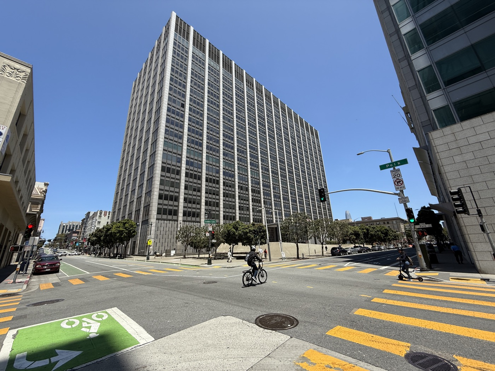

# 앤트로픽 합의금 배분에서 어긋난 출판사의 판권 기록

_약 50만 종에 저작 1건당 3,000달러, 2022년 8월 10일 시점의 권리 소재가 저자와 출판사의 몫을 갈랐다_

## Executive Summary

> [!callout]
> 앤트로픽이 저작권 집단소송을 15억 달러에 합의하면서 약 50만 종의 저작물에 1건당 3,000달러가 매겨졌다. 지난 7월 법원의 최종 승인이 떨어져 돈이 실제로 움직이기 시작했고, 이번 주 청구인들에게 배분 내역 확인 통지가 나갔다. 그 통지를 열어 본 저자들이 낯선 이름을 발견했다. 오래전에 자기 손으로 돌아온 책의 권리를 옛 출판사가 청구하고 있었다.

> 배분 규칙 자체는 복잡하지 않다. 절판되어 권리가 저자에게 돌아갔거나 자비출판한 책이면 저자가 3,000달러 전액을 받고, 현행 출판 계약이 살아 있으면 저자와 출판사가 절반씩 나눈다. 갈림길은 2022년 8월 10일이다. 합의서가 앤트로픽의 다운로드 날짜로 정한 이 날짜 이전에 권리가 반환됐어야 저자가 전액을 청구할 수 있다. 문제는 그 반환이 언제 일어났는지를 업계 어디에도 정확히 적어 둔 곳이 없다는 데 있다.

> 3절까지는 보도와 1차 자료가 확인한 사실을 따라간다. 4절에서 데이터 거버넌스 쪽으로 옮겨 적는 부분은 자료에 없는 이 글의 해석이다.

### 주요 수치

출처: [TechCrunch](https://techcrunch.com/2026/09/06/authors-push-back-as-publishers-and-agents-seek-share-of-anthropic-settlement/)(2026-09-06), [Writer Beware](https://writerbeware.blog/2026/09/04/anthropic-copyright-settlement-publishers-are-making-incorrect-claims-on-authors-payouts/)(2026-09-04), [Authors Guild](https://authorsguild.org/news/important-information-regarding-anthropic-copyright-settlement-claim-notices/)(2026-09-04)

<!-- stat-card -->
**3,000달러** — 저작 1건당 배분액 — 약 50만 종이 대상, 합의 총액은 15억 달러

<!-- stat-card -->
**50 대 50** — 현행 계약 도서의 기본 배분 — 절판·권리 반환·자비출판이면 저자가 전액

<!-- stat-card -->
**2022.08.10** — 합의서가 정한 다운로드 날짜 — 이날 이전 반환이라야 저자 전액 청구가 선다

<!-- stat-card -->
**16권** — 한 저자가 한꺼번에 잘못 청구당한 반환 도서 — 다른 저자는 11권, 둘 다 권리가 이미 돌아온 책들

## 3,000달러는 누구 몫인가

이 사건은 저자 세 사람이 앤트로픽을 상대로 낸 집단소송에서 시작했다. 앨섭 판사는 저작권이 있는 글로 인공지능 모델을 학습시키는 것 자체는 공정이용에 해당한다고 봤지만, 그 책들을 해적 사이트에서 내려받아 보관한 행위는 별개라고 판단했다. 앤트로픽은 배심 재판으로 가는 대신 15억 달러 합의를 택했다. 앨섭 판사가 그사이 퇴임해 최종 승인은 마르티네스올긴 판사가 지난 7월 20일에 서명했다.

*▲ 이 소송이 열린 미국 연방 북부캘리포니아지방법원(샌프란시스코 필립버튼 연방청사) | Source: [Wikimedia Commons (Marincyclist, CC BY-SA 4.0)](https://commons.wikimedia.org/wiki/File:Phillip_Burton_Federal_Building_%26_United_States_Courthouse.jpg)*

승인이 나자 돈을 나누는 실무가 시작됐다. 합의 관리자는 이번 주 청구인 전원에게 통지를 보냈다. 통지에는 자기가 청구한 저작 목록과 함께, 같은 저작을 청구한 다른 사람이 누구이고 몇 퍼센트를 청구했는지가 적혀 있다. 대부분은 내용을 확인만 하면 되고, 공동 청구인끼리 비율이 어긋난 경우에는 수정하거나 그대로 확인하라는 안내가 붙는다.

비율을 정하는 규칙은 네 갈래다. 자비출판이거나 계약이 종료됐거나 권리가 반환된 책은 저자가 전액을 받는다. 절판되지 않고 계약이 살아 있는 책은 저자와 출판사가 절반씩 나눈다. 이 절반씩이라는 기본값은 저작권 침해 소송에서 받아 낸 회수금을 저자와 출판사가 똑같이 나눈다고 적어 둔 일반적인 출판 계약 문구에서 왔다. 마지막 갈래인 교육 출판물은 아예 기본값에서 빠져 있는데, 이 예외가 3절에서 다시 나온다.
