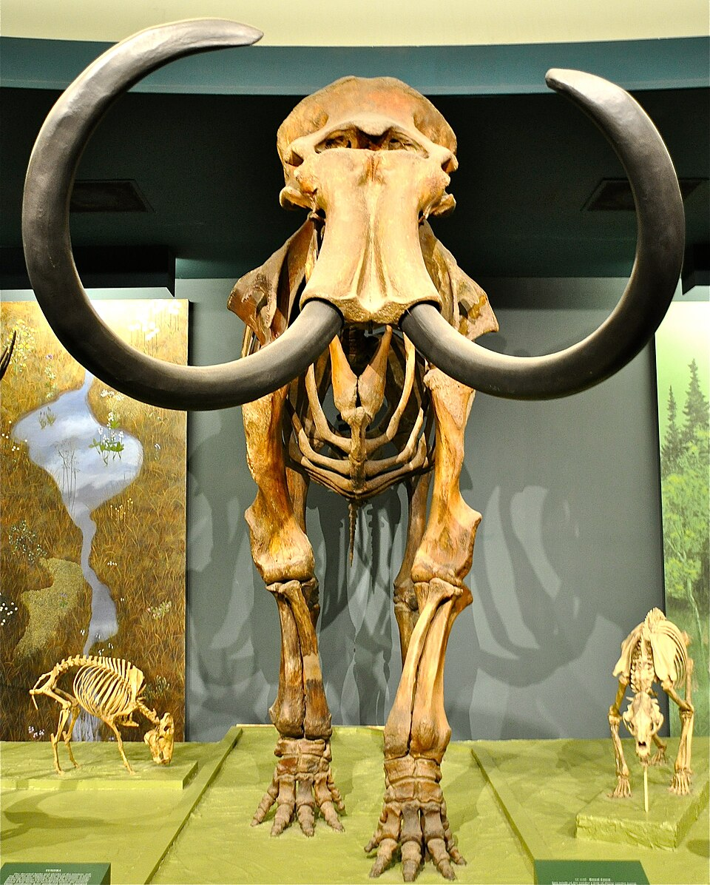

# 쥐 실험에서 최후 항생제급 효능을 낸 AI 설계 항균 펩타이드

_펜실베이니아대 ApexGO가 편집한 펩타이드 85%가 세균 성장을 멈추고 쥐 감염 모델에서 폴리믹신B에 필적했다_

## Executive Summary

> [!callout]
> 생성형 AI가 설계한 신약 후보는 대개 컴퓨터 안에서만 좋아 보이다가 실험실에서 무너집니다. 이번에는 그렇지 않았습니다. 펜실베이니아대 César de la Fuente와 Jacob Gardner 팀이 만든 ApexGO는 멸종 동물에서 발굴한 항균 펩타이드를 출발점 삼아 새 후보를 편집해 냈고, 그 후보들이 시험관을 넘어 살아 있는 쥐에서 약처럼 작동했습니다. 이 글은 그 결과 자체보다, 모델의 낙관이 이번엔 왜 실험실에서 배신당하지 않았는지를 데이터 설계의 눈으로 봅니다.

> 숫자 하나가 이례성을 압축합니다. AI가 편집한 펩타이드의 85%가 시험관에서 세균 성장을 멈췄습니다. 생성 모델을 또 다른 모델의 점수에 맞춰 최적화하면 흔히 시뮬레이션 안에서만 그럴듯한 후보가 쏟아지는데, 이번엔 그 대부분이 실제 습식 실험에서 재현됐습니다. 나아가 다제내성균에 감염된 쥐 모델에서 최적화 펩타이드 2종이 최후의 항생제로 불리는 폴리믹신B에 필적하거나 이를 능가했습니다.

> 차이를 만든 것은 더 큰 모델이 아니라 데이터 설계였습니다. 검증 가능한 활성 데이터, 템플릿을 반복 편집하는 제약 조건, 불확실성 추정으로 실험 대상을 좁히는 선별. 이 세 가지가 생성-예측 루프를 컴퓨터 밖으로 끌어냈습니다. 지난달 다룬 정반대 사례, 성공만 학습해 활성을 과대평가한 신약 AI와 나란히 놓으면 그 대비가 선명해집니다.

### 주요 수치

이 연구의 핵심을 네 숫자로 압축하면 다음과 같습니다. 시험관에서 세균 성장을 멈춘 비율, 원본 템플릿을 능가한 비율, 쥐 감염 모델에서 도달한 효능의 기준선, 그리고 편집의 출발점이 된 템플릿 펩타이드의 수입니다.

출처: [Nature Machine Intelligence (2026)](https://www.nature.com/articles/s42256-026-01237-5), [NIH Research Matters](https://www.nih.gov/news-events/nih-research-matters/ai-tool-could-speed-antibiotic-development)

<!-- stat-card -->
**85%** — 세균 성장 정지 — AI가 편집한 펩타이드 중 시험관에서 억제력을 보인 비율

<!-- stat-card -->
**72%** — 원본 능가 — 출발점이 된 원본 템플릿보다 강한 항균력을 보인 비율

<!-- stat-card -->
**폴리믹신B급** — 쥐 감염 모델 효능 — 최후 항생제에 필적·능가한 세균 수 감소 (펩타이드 2종)

<!-- stat-card -->
**10종** — 템플릿 펩타이드 — 매머드·땅늘보 등 멸종 동물 유래 편집 출발점

## 쥐에서 통한 AI 항생제

항균제 내성은 조용히 커지는 위협입니다. 폴리믹신B나 콜리스틴 같은 펩타이드 항생제는 다제내성 그람음성균에 대한 사실상 마지막 카드로 남아 있습니다. 새 후보를 빨리 찾아야 하지만, 실험실에서 하나하나 합성하고 검증하는 과정은 느리고 비쌉니다. 펜실베이니아대 César de la Fuente와 Jacob Gardner 팀이 만든 ApexGO는 이 병목을 AI로 돌파하려는 시도입니다.

출발점부터 남다릅니다. 이 팀은 앞선 연구에서 매머드와 땅늘보 같은 멸종 생물의 고대 프로테옴을 항생제 후보의 광산으로 채굴했습니다. ApexGO는 그렇게 발굴한 항균 펩타이드 10종을 템플릿으로 삼아, AI가 아미노산 서열을 조금씩 고쳐 가며 더 나은 후보를 만들어 냈습니다. 결과는 두 층위에서 확인됐습니다. 시험관에서는 AI가 설계한 펩타이드의 85%가 세균 성장을 멈췄고, 72%가 원본 템플릿보다 강한 항균력을 보였습니다.

*▲ 스미소니언 자연사박물관의 매머드 골격 — ApexGO 템플릿 펩타이드가 채굴된 멸종 동물 계열 중 하나 | Source: [Wikimedia Commons (Kevin Burkett, CC BY-SA 2.0)](https://commons.wikimedia.org/wiki/File:Smithsonian_woolly_mammoth.jpg)*
