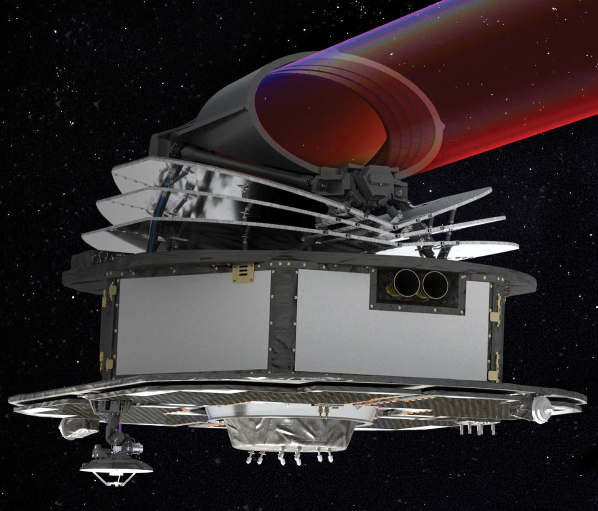

# An Ariel Spectral Model Traced Predictions Back to Training Data Without Labels

_An ESA co-authored study reworks influence functions to run on predictions without ground truth_

## Executive Summary

> [!callout]
> Data quality work usually finishes before training starts. You apply filters, review labels a second time, drop the outliers. But when the model is already deployed and the ground truth will never arrive, where can that review happen again? A paper posted to arXiv on August 24 opened one such place. Co-authored by an ESA researcher, it takes a single prediction from the spectroscopy pipeline of the Ariel mission, which will observe exoplanet atmospheres, and traces it back to the training samples that produced it.

> The key was changing what influence is measured against. The classical influence function measures how much a training sample moves the test loss, and computing a loss requires the true label. The authors moved the quantity of interest from the loss to the model's prediction itself. It became a quantity computable without ground truth, and the full influence matrix across five cross-validation folds came out in 1 minute and 15 seconds. Doing the same work by actual retraining would take about 24 hours.

> One condition sits over all of this. Ariel has not launched yet, and the validation ran on a public simulated dataset. The harmful samples the paper points to are not settled verdicts either, but flags marking high-risk contributions. The authors state plainly that with true labels unobserved, no actual degradation is guaranteed.

### Key Numbers

Source: Grens et al., [arXiv:2608.23458](https://arxiv.org/abs/2608.23458) (2026-08-24)

<!-- stat-card -->
**1 min 15 s** — Time to compute the entire influence matrix — Across all 5 folds, each holding 6,810 training points. Checking the same set by actual retraining would take about 24 hours

<!-- stat-card -->
**0.81** — Rank correlation between risk score and realised error — On shape-based spectral error, with 0.69 on the magnitude-based measure. Ground truth was used for this comparison alone

<!-- stat-card -->
**6-fold** — Magnitude gap of the top influential samples — Their shape matches the nearest neighbours almost as well, while magnitude dissimilarity widens sixfold. Influential samples are not lookalikes

<!-- stat-card -->
**6 of 10** — Overlap between the most influential and the most harmful — In both the 0.55 µm visible and the 4.3 µm infrared channel, six of the top ten were the same samples

## Ariel observes without ever seeing the answer

Ariel is the European Space Agency's M4 medium-class space telescope, due to launch in 2031. It will leave from French Guiana aboard an Ariane 6, settle into a halo orbit around the Sun-Earth L2 point, and take spectra of the atmospheres of roughly 1,000 exoplanets. ESA calls this a chemical census. Its launch mass is 1,400 kg, its collecting area 0.64 m², and it carries two instruments.

*▲ Artist's impression of Ariel | Source: [ESA, CC BY-SA 3.0 IGO](https://commons.wikimedia.org/wiki/File:Ariel_ESA_(cropped).jpg)*

The observing principle is transit. While a planet passes in front of its host star, part of the starlight filters through the planetary atmosphere and leaves wavelength-specific molecular signatures behind. What Ariel receives is a time series of brightness variation per wavelength, and machine learning enters at the stage where the atmospheric transmission spectrum is recovered from that. The paper places this role as a complement to the classical retrieval pipeline rather than a replacement for it. Machine learning is also used on the side that infers atmospheric properties from spectra, but the task this work addresses is predicting transmission spectra directly from light curve data. In Ariel's data processing terms, that is the step from L2 to L3.

The trouble is that this pipeline cannot be graded. In a laboratory you would measure the answer separately and check the prediction against it, but an observation taken in orbit has no reference value to compare with. Whether a prediction makes physical sense has to be established some other way, and that is what turns interpretability from a convenience into a means of validation.

### 1.1. Plenty of tools interrogate the inputs, few interrogate the data

Say explainable AI and most people picture feature attribution, methods like SHAP or LIME that ask which input variable pushed this prediction. The paper heads somewhere else, toward training data attribution: which training samples shaped the model's behaviour in generating a particular prediction. When a spectrum comes out looking strange, what you want to know is often less about which of the 55 channels contributed and more about which observations this model learned that from.

The most honest answer is to remove them one at a time. Take out a single training sample, retrain, and watch how far the prediction moves. The result is exact. The cost is one retraining run per sample, and the paper states flatly that this is computationally expensive even for models that train rapidly. Influence functions substitute an approximation for that retraining. Originating in robust statistics and adapted to machine learning in 2017, the tool estimates, through the inverse Hessian, which way a test prediction moves when a training sample is upweighted by an infinitesimal amount. Being a first-order approximation, it carries a caveat of its own: for standard non-linear models it can deviate from the true effect as influence magnitudes increase.

The classical formulation, though, contains one part Ariel cannot use. Influence is defined as the change in test loss, and computing a loss requires the true label for that test sample. How the sign is read is bound up with the same thing. Positive means the loss goes up, therefore harmful, negative means helpful, and that reading holds only where a loss can be measured. Ariel in operation has no such label.

> [!callout]
> One condition is worth setting down before going further. Ariel is scheduled for launch in 2031 and is not in the sky yet. The data this study used is the public simulated dataset of the Ariel Data Challenge 2021, and the paper validates the framework on the ground in advance, under an assumed post-launch operating condition. Because it is simulated, the ground truth does exist, but the authors kept it out of the method and used it only to score the results.

## Shifting from loss to prediction removed the need for labels

What the authors changed is one thing: the quantity of interest. Instead of how much a training sample moves the test loss, they ask how much it moves the model's predicted value itself. The loss takes the true label as an input; the prediction does not. The paper describes this as a conceptual transition that does not introduce new modelling assumptions. In other words, nothing theoretical is surrendered in exchange for dropping the label.

How the sign reads does change. Under the loss-based definition positive meant harmful, but under the prediction-based one the sign only points a direction. Positive means the predicted value rises the moment that training sample is removed, negative means it falls. What matters instead is the magnitude. Values near zero mark samples with a negligible impact on the output for that test case, and large absolute values mark the samples that shift the prediction most. Those are the ones that matter most for validation, because they include both proponents that support the model's physical consistency and opponents that may carry over artefacts of the synthetic training data.

One notational adjustment went into making the sign read that way. The classical expression carries a negative sign in front, and the authors dropped it. Only then does the direction of the value line up with the way the prediction actually moves when that training sample is removed. The paper notes that this changes nothing about the computation and is purely interpretational.
