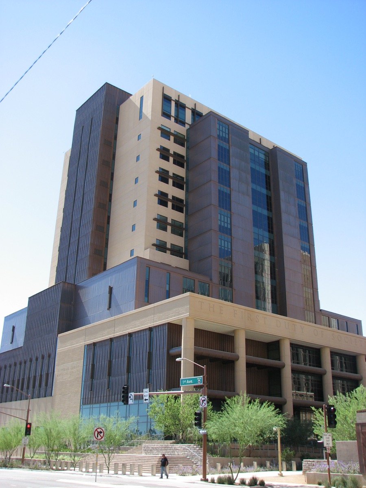

# 애리조나 AI 피해자 영상, 판사가 믿은 용서에 형량 취소

_크리스토퍼 펠키를 AI로 되살린 영상에 판사가 기대어 정한 10년 6개월 형을 애리조나 항소법원이 취소했다_

## Executive Summary

> [!callout]
> 이 글은 2026년 9월 30일 애리조나 항소법원 제1부가 내놓은 판결 하나를 읽는다. 2021년 11월 챈들러의 한 교차로에서 보복운전 끝에 총에 맞아 숨진 크리스토퍼 펠키의 유족은, 2025년 5월 양형 심리에서 그를 AI로 되살린 영상을 틀었다. 생전에 찍힌 영상과 사진에 여동생이 쓴 대본과 AI가 만든 목소리를 얹은 것이었고, 화면 속 펠키는 자기를 쏜 사람을 용서한다고 말했다. 1심 판사는 그 영상을 보고 10년 6개월을 선고했다. 항소법원은 과실치사 유죄를 그대로 두고 이 형량만 파기한 뒤 다시 선고하라고 돌려보냈다.

> 선고된 형은 검찰이 구한 9년 6개월보다 1년 길었다. 판사는 그 자리에서 그 AI를 사랑했다고 말했고, 화면 속 용서가 펠키의 사람됨을 보여 준다고 밝혔다. 항소법원이 문제 삼은 지점은 영상이 법정에 들어왔다는 사실이 아니다. 유족이 생각한 말과 피해자가 실제로 한 말 사이의 거리가 그 화면에서 지워졌다는 것이고, 그래서 양형 절차가 근본적으로 불공정해졌다는 것이다. 영상에 섞여 있던 생전 실제 녹화분까지 막지는 않았다는 점도 함께 보아야 한다.

> 1절부터 4절까지는 판결과 애리조나 지역 매체 보도가 전한 내용이다. 5절은 그 내용을 데이터를 다루는 사람의 눈으로 다시 읽은 이 글의 해석이다.

### 주요 수치

출처: [FOX 10 Phoenix](https://www.fox10phoenix.com/news/arizona-manslaughter-sentencing-vacated-due-use-ai-victim-impact-statement), [ABC15 Arizona](https://www.abc15.com/news/arizona-appeals-court-throws-out-sentence-after-judge-relied-on-ai-generated-victim-video) 보도.

<!-- stat-card -->
**10년 6개월** — 파기된 1심 형량 — 2025년 5월 선고. 과실치사 유죄는 그대로 두고 이 형량만 다시 정한다

<!-- stat-card -->
**1년** — 구형과 선고의 차이 — 검찰은 9년 6개월을 구했고 판사는 10년 6개월을 골랐다

<!-- stat-card -->
**49건** — 유족이 모은 서면 피해자 진술 — 영상 대본은 그 위에 여동생이 따로 쓴 글이다

## 유죄는 그대로, 형량만 파기

사건은 2021년 11월 애리조나주 챈들러에서 일어났다. 길버트로와 거먼로가 만나는 교차로 근처에서 두 운전자가 부딪쳤고, 당시 서른일곱이던 크리스토퍼 펠키가 자기 트럭에서 내려 가브리엘 폴 호르카시타스의 차로 걸어갔다. 펠키는 가슴에 총을 맞고 숨졌다.

재판은 두 번 열렸다. 첫 유죄 판결은 검찰이 펠키 휴대전화에서 나온 문자 메시지를 변호인에게 넘기지 않은 사실이 드러나 취소됐고, 다시 열린 재판에서 호르카시타스는 과실치사와 위험행위에 유죄를 받았다. 2025년 5월 마리코파 카운티 상급법원의 토드 랭 판사가 10년 6개월을 선고했다.

*▲ 토드 랭 판사가 10년 6개월을 선고한 마리코파 카운티 상급법원(피닉스) 청사. | Source: [Wikimedia Commons (CC0)](https://commons.wikimedia.org/wiki/File:Maricopa_County_Superior_Court_South_Court_Tower_October_6_2013_Phoenix_Arizona_2112x2816_Street_Level.JPG)*

그로부터 1년 4개월 뒤인 2026년 9월 30일, 애리조나 항소법원 제1부가 이 양형을 파기했다(사건번호 1 CA-CR 25-0191). 과실치사 유죄 자체는 손대지 않았고, 형량만 떼어 내 마리코파 카운티 상급법원으로 돌려보냈다. 호르카시타스를 다시 양형 심리에 세운 것은 법정에서 재생된 영상 한 편이다.

## 영상은 무엇으로 만들어졌나

영상을 만든 사람은 펠키의 여동생 스테이시 웨일즈다. 양형 심리를 앞두고 가족과 지인에게서 서면 피해자 진술 49건을 받아 모으던 중에 생각이 떠올랐고, AI 기술을 다뤄 온 남편과 친구의 손을 빌려 영상을 완성했다. 재료는 두 종류였다. 한쪽에는 펠키가 살아 있을 때 찍힌 영상과 사진, 그리고 그 목소리가 있었다. 다른 한쪽에는 웨일즈가 쓴 대본과 그 대본을 읽어 내는 AI 생성 구간이 있었다.

완성된 화면에서 펠키는 자기 신념과 가족, 그리고 자기를 쏜 사람에 대한 용서를 이야기한다. 그중 용서를 말하는 몇 문장이 영상에서 가장 길게 이어지고, 1심 판사가 형을 정하면서 붙든 것도 그 대목이었다.

"In another life, we probably could've been friends. I believe in forgiveness and in God who forgives."

다른 삶이었다면 우리는 아마 친구가 될 수 있었을 겁니다. 저는 용서를 믿고, 용서하시는 하느님을 믿습니다.

펠키는 이 말을 한 적이 없다. 2021년에 숨졌고, 호르카시타스를 용서한다는 뜻을 어디에도 남기지 않았다. 문장을 쓴 사람은 여동생이고, 그 문장을 오빠의 목소리와 얼굴로 바꿔 놓은 것이 AI다. 그러니까 이 영상에는 성격이 다른 두 겹이 들어 있다. 아래쪽은 실제로 일어난 일의 기록이고, 위쪽은 가까운 사람이 짐작한 마음이다. 둘을 가르는 선은 제작 과정에는 분명히 있었지만, 재생되는 화면에는 남지 않았다.

## 판사가 믿은 것은 영상 속 용서다

영상이 끝난 뒤 토드 랭 판사는 그 AI를 사랑했다고 말했다. 방금 본 화면에 대한 소감이었고, 판사는 그 소감을 형량을 정하는 근거 쪽으로 옮겨 놓았다.

"I felt like that was genuine; that his obvious forgiveness of Mr. Horcasitas reflects the character I heard about today."

저는 그것이 진심이라고 느꼈습니다. 호르카시타스 씨를 향한 그 분명한 용서가, 오늘 제가 들은 그 사람됨을 보여 준다고 느꼈습니다.

판사는 화면 속 용서를 펠키의 사람됨에 대한 증거로 읽었고, 검찰이 구한 9년 6개월 대신 10년 6개월을 선고했다. 한쪽으로 기울여 읽지는 말자. ABC15는 10년 6개월이 이 죄목의 기준 형량에 해당한다고 전했다. 판사가 법이 정한 범위 밖으로 나간 것은 아니라는 뜻이고, 항소법원이 문제 삼은 것도 형의 길이가 아니었다.

그렇다면 판사가 AI인 줄 몰랐던 것일까. 유족은 이것이 AI로 만든 영상이라고 법정에서 설명했고, 판사도 그것을 AI라고 부르며 말했다. 무엇으로 만들었는지 모두가 알고 있었는데도, 판사는 그 안에서 나온 용서를 죽은 사람 본인의 마음으로 받아들였다.

## 진본 영상은 되고 지어낸 말은 안 된다

항소심에서 호르카시타스 쪽은 영상의 신뢰성을 걸고 넘어졌고, 판사가 그 영상에 기댄 것이 적법절차를 어겼다고 주장했다. 검찰은 웨일즈가 오빠와 가까웠으니 그가 무슨 말을 했을지 알 만한 위치에 있었다고 맞섰다. 항소법원 제1부는 검찰 쪽 논리를 받아들이지 않았다. 피해자가 양형 심리에서 말할 권리는 있지만, 그 권리가 피고인의 적법절차 권리를 누르지는 못한다는 것이 출발점이었다.

판결문에서 항소법원은 이 영상이 무엇을 더했는지가 아니라 무엇을 지웠는지를 적었다. 파기 판단 전체가 그 한 문장에 들어 있다.

The video "erases the interpretive distance between the family's belief of what the victim would have said and the victim's own voice and opinions" — presenting "a depiction of the victim and his thoughts created from the imaginings of the victim's sister."

이 영상은 피해자가 무슨 말을 했을지에 대한 가족의 믿음과, 피해자 자신의 목소리 및 견해 사이에 있던 해석의 거리를 지운다. 그렇게 해서 피해자의 여동생이 상상한 데서 만들어진, 피해자와 그 생각에 대한 묘사를 내놓는다.

해석의 거리라는 말이 이 판결의 중심이다. 유족이 법정에서 "오빠라면 이렇게 말했을 것"이라고 진술하면, 그것이 짐작이라는 사실은 누구에게나 분명하다. 해석과 사실 사이에 한 칸이 비어 있고, 판사는 그 칸을 보면서 무게를 조절한다. 영상은 그 칸을 메웠다. 말하는 사람이 피해자의 얼굴과 목소리를 하고 있으니, 법정에 남는 것은 해석이 아니라 증언이다. 항소법원은 이 때문에 양형 절차가 근본적으로 불공정해졌다고 판단했다.

이 판결에서 가장 실무적인 대목은 항소법원이 영상 전체를 내치지 않았다는 점이다. 영상 안에 섞여 있던 펠키 생전의 실제 녹화분은 양형 심리에 들어와도 된다고 보았고, 문제로 본 것은 AI가 만들어 낸 구간이었다. 법원이 그은 선은 매체가 아니라 출처에 있다. 실제로 기록된 것은 되고, 기록된 적 없는 말을 기록처럼 보이게 만든 것은 안 된다.

법률 전문 매체 Brownstone Law는 이 판결을 정리하면서 한 가지를 덧붙였다. 영상이 인공적으로 만들어졌다고 밝힌 것만으로는 그 문제가 풀리지 않았다는 것이다. 공개와 구분은 다른 일이다. 만들었다고 말하는 것은 파일 전체에 붙는 한 줄이고, 기록된 대목과 지어낸 대목을 가르는 일은 그 안에서 벌어진다.

## 페블러스가 이 판결을 주목하는 이유

이 사건을 법정 밖으로 가져오면 꽤 익숙한 모양이 된다. 진본 자료가 있고, 그 위에 사람이 쓴 해석이 얹히고, 둘을 합쳐 하나의 산출물이 나온다. 보고서에 들어가는 요약문, 고객 데이터 위에 올린 추정값, 실측값 사이를 메운 합성 데이터가 모두 같은 구조다. 만드는 사람은 어디까지가 어느 쪽인지 알고 있다. 그런데 그 앎은 산출물에 실려 나가지 않는다.

펠키 영상이 보여 준 것이 정확히 그 지점이다. 제작 단계에서는 생전 녹화분과 여동생이 쓴 대본이 분명히 다른 파일이었다. 렌더링이 끝난 뒤에는 한 사람이 이어서 말하는 한 편의 영상이었다. 경계는 결과물 안에서 사라졌고, 받는 쪽은 그 경계를 복원할 방법이 없었다. 법정은 증거를 가장 깐깐하게 따지는 자리이고, 그 자리에 앉은 사람은 판사였다. 그런데도 복원되지 않았다.

이 과정을 왼쪽에서 오른쪽으로 늘어놓으면 항소법원이 어느 칸에 선을 그었는지가 드러난다. 선은 맨 왼쪽 두 칸 사이에 있고, 오른쪽으로 갈수록 그 선은 결과물에서 지워진다.

▲ 항소법원이 가른 선과, 그 선이 결과물에서 사라지는 지점.

이 영상에는 AI로 만들었다는 설명이 붙어 있었고, 그 설명만으로는 아무것도 막지 못했다. 파일 단위 라벨은 "이 안에 생성된 것이 있다"까지만 말한다. 판단하려면 그다음을 알아야 한다. 어느 문장이, 어느 수치가, 어느 프레임이 기록이고 어느 것이 생성인가. 그 해상도가 없으면 라벨은 경고문으로만 남고, 자료를 받은 사람은 결국 전체를 믿거나 전체를 버리거나 둘 중 하나를 고르게 된다.

데이터를 다루는 조직에 이 판결이 남기는 물음은 두 개다. 첫째, 우리 자료는 원본 구간과 생성 구간을 따로 표시해 두고 있는가. 분석 리포트에서 실측과 모델 추정이 갈라져 있는지, 학습 데이터셋에서 수집된 행과 합성된 행이 갈라져 있는지를 묻는 질문이다. 둘째, 그 표시가 하류까지 따라가는가. 원본에 붙여 둔 구분이 가공과 요약과 재배포를 거치면서 떨어져 나가면, 마지막에 그것을 읽는 사람은 토드 랭 판사와 같은 자리에 선다.

AI-Ready Data를 이야기할 때 흔히 형식과 품질을 먼저 떠올린다. 이 판결은 거기에 한 줄을 더 적는다. 데이터가 기계에게 읽히려면 값만으로는 모자라고, 그 값이 어디서 왔는지가 값과 같은 자격으로 함께 실려야 한다. 그 기록이 없는 자료는 쓸 수 있는 자료가 아니라 믿을지 말지만 고르게 하는 자료다.

여기까지 읽어 주셔서 감사하다. 이 사건을 다룬 보도는 [AZFamily](https://www.azfamily.com/2026/10/01/court-appeals-vacates-chandler-murder-sentence-due-ai-victim-video-shown-court/), [ABC15](https://www.abc15.com/news/arizona-appeals-court-throws-out-sentence-after-judge-relied-on-ai-generated-victim-video), [FOX 10 Phoenix](https://www.fox10phoenix.com/news/arizona-manslaughter-sentencing-vacated-due-use-ai-victim-impact-statement)에서 볼 수 있다. 여러분의 조직에서 내보내는 자료에는 원본과 생성의 경계가 어디까지 남아 있는지, 그 경계가 마지막 독자에게까지 닿는지 한번 확인해 보시고 무엇이 비어 있었는지 들려주시면 좋겠다.

## 참고문헌

- 1.AZFamily Digital News Staff. (2026). "[Court of Appeals vacates Chandler road rage sentence due to AI victim video](https://www.azfamily.com/2026/10/01/court-appeals-vacates-chandler-murder-sentence-due-ai-victim-video-shown-court/)." AZFamily.
- 2.ABC15 Arizona. (2026). "[Arizona appeals court throws out sentence after judge relied on AI-generated victim video](https://www.abc15.com/news/arizona-appeals-court-throws-out-sentence-after-judge-relied-on-ai-generated-victim-video)."
- 3.FOX 10 Phoenix. (2026). "[Arizona manslaughter sentencing vacated due to use of AI 'victim impact statement'](https://www.fox10phoenix.com/news/arizona-manslaughter-sentencing-vacated-due-use-ai-victim-impact-statement)."
- 4.Brownstone Law. (2026). "[Arizona Court Vacates Sentence Over AI Victim Video](https://www.brownstonelaw.com/news/arizona-court-orders-resentencing-over-ai-generated-victim-video/)."
