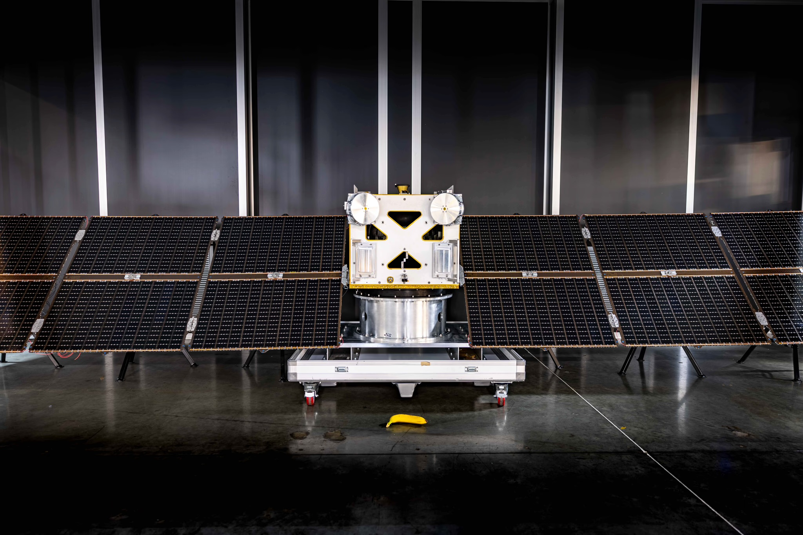
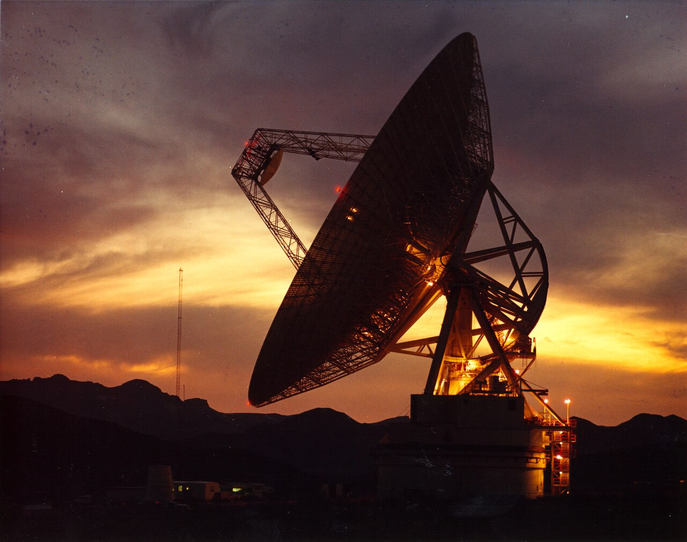
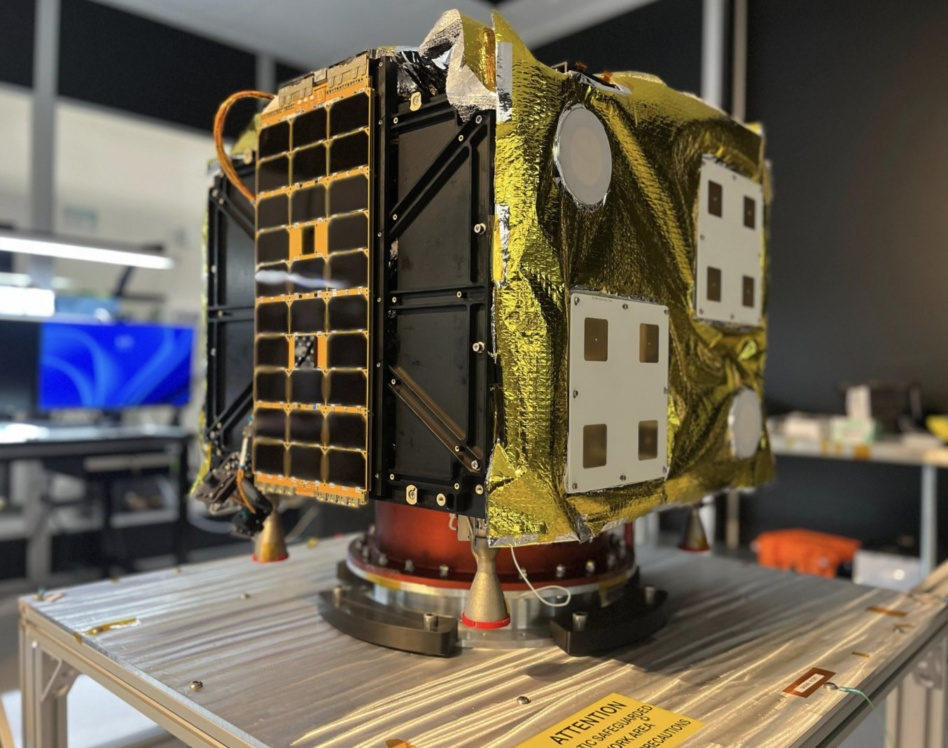

# 지구의 명령을 못 받는 우주선, AI에 다 맡겨도 될까?

_소행성 채굴기업 애스트로포지가 2027년 탐사선에서 지구 명령 수신기를 빼고, 시험 데이터로 배운 AI에 판단을 넘길 계획이다_

## Executive Summary

> [!callout]
> 소행성 채굴 스타트업 애스트로포지가 2027년에 쏠 탐사선 Autonomy-1에 지구에서 오는 명령을 받을 무선 장치를 싣지 않겠다고 밝혔다. 발사체에서 분리된 뒤로는 지상의 어떤 지시도 닿지 않고, 운항 판단은 회사가 만든 트랜스포머 제어 모델 Solo가 전부 맡는다. 이 글은 그 결정이 어디서 나왔고 무엇을 남겨 두지 않았는지를 본다.

> 회사를 움직인 것은 돈 계산이다. 대표 매슈 지얼릭이 든 선택지는 둘이었다. 전 세계에 접시 안테나를 세우는 자체 지상망에 2억 달러를 쓰거나, 모델로 그 지상망을 없애거나. 과거 소행성 탐사는 여덟 시간 교대마다 관제사 100명을 붙여 굴러갔다. 그런 인력을 둘 수 없는 회사에 남은 선택은 처음부터 하나였다. 다만 Solo가 배운 것은 서브시스템별 시험 데이터이고, 이 모델은 아직 우주를 날아 본 적이 없다.

> 1절부터 4절까지는 회사가 밝힌 내용과 지난해 오딘 임무의 기록을 따라간다. 5절의 물음은 이 글이 세운 것이다. 되돌릴 길을 남기지 않은 판단을 모델에 넘길 때, 학습 데이터는 무엇을 증명해야 하는가.

### 주요 수치

출처: Tim Fernholz, [AstroForge is putting AI in command of its next spacecraft](https://techcrunch.com/2026/09/22/astroforge-is-putting-ai-in-command-of-its-next-spacecraft/), TechCrunch (2026-09-22).

<!-- stat-card -->
**0대** — 실릴 지구 명령 수신기 — 현재 계획 기준이다. 대표 본인이 발사 때까지 팀에 설득당할 것 같다는 단서를 달았다

<!-- stat-card -->
**2억 달러** — 자체 지상망 구축 비용 — 전 세계에 접시 안테나 다섯 기를 세우고 운영하는 값이다. 회사가 든 비교 대상이다

<!-- stat-card -->
**약 2,500개** — 지능 레이어가 학습한 센서 — 우주선에 달린 센서 수다. 학습 데이터의 양은 기사에 나오지 않는다

<!-- stat-card -->
**100명** — 과거 임무의 교대 관제 인력 — 오시리스-렉스는 여덟 시간 교대마다 이만큼을 붙였다. 스타트업이 감당할 규모가 아니다

## 무전기를 떼고 떠나는 탐사선

9월 22일 테크크런치가 전한 애스트로포지의 계획은 한 문장으로 요약된다. 다음 탐사선에는 지구에서 오는 명령을 받을 무선 장치를 달지 않는다. 회사 대표 매슈 지얼릭의 말은 이렇다. "Autonomy-1에는 지구에서 수신할 수 있는 무전기를 실을 생각이 없다. 지금은 전부를 걸어야 한다."

이 우주선이 무엇에 실려 나가는지도 같이 볼 만하다. 애스트로포지의 첫 자율 우주선은 2027년 스토크 스페이스가 처음 쏘아 올리는 로켓에 오른다. 이 임무는 나사가 뒤를 받치고 있고, 태양에 관한 과학 데이터를 모으는 것으로 잡혀 있다. 지구의 명령을 받지 않는 우주선이 아직 한 번도 날아 본 적 없는 로켓에 남의 과학 임무를 싣고 올라간다는 뜻이다.

*▲ Solo가 섀도 모드로 먼저 타는 DeepSpace-2 우주선 | Source: [TechCrunch](https://techcrunch.com/2026/09/22/astroforge-is-putting-ai-in-command-of-its-next-spacecraft/) (사진: 애스트로포지)*

그 자리를 채우는 것이 Solo다. 회사가 직접 만든 제어 스택이고, 세 겹으로 되어 있다고 비행 소프트웨어 책임자 아르망 아와드가 설명한다. 아래에는 기존 방식의 제어 알고리즘이 있다. 그 위에 전력 생산이나 항법 같은 서브시스템별로 시험 데이터를 학습한 모델들이 얹히고, 맨 위에 전체를 아우르는 지능 레이어가 있다. 이 마지막 층이 우주선에 달린 센서 약 2,500개를 대상으로 학습했다. 하는 일은 이상 징후를 찾아내고 스스로 해결하는 것이다.

아와드가 든 예는 뜻밖에 작다. 우주선이 제 위치를 놓쳤다고 알아차리고, 전력 쪽 이상이 항성 추적기 문제와 맞물렸다고 짚어 낸 다음, 그 장치를 껐다 켜는 정도다. 회사가 상상하는 자율의 크기는 이만하다. 이 계획을 평가할 때 공정하게 같이 놓아야 할 대목이다.

지얼릭은 이 계획의 크기를 스스로 좁혀 둔다. "나는 범용 우주선 자율성이나 세상을 위한 범용 자율성을 만들겠다고 말하는 게 아니다. 아주 적은 센서 입력 위에서, 트랜스포머 모델의 기본 학습을 따르는 제한된 자율성을 만들고 있다." 자율주행에서 쓰는 말로 옮기면 모든 상황을 다루는 운전자가 아니라 정해진 조건 안에서만 도는 기능에 가깝다.

한 가지는 정확히 짚어 둘 필요가 있다. 이 계획은 확정이 아니다. 앞의 인용문 바로 뒤에 지얼릭은 이렇게 덧붙인다. "발사할 때쯤이면 팀이 아마 나를 설득해 낼 거다. 하지만 지금은 무전기를 싣지 말라고 말하고 있다." 무전기 없는 우주선은 회사가 완료한 일이 아니라 대표가 지금 밀고 있는 방향이다. 기사도 발사 전에 바뀔 수 있다는 점을 함께 전한다.

회사가 전부를 걸겠다고는 했지만 한 번에 걸지는 않는다. 올해 말 인튜이티브 머신스의 세 번째 달 임무와 함께 나갈 DeepSpace-2에 Solo를 먼저 태운다. 다만 이때는 섀도 모드다. 모델이 판단을 내리기는 하되 그 판단이 우주선을 실제로 움직이지는 않고, 사람이 나중에 그 판단이 옳았는지만 본다. 궤도에서 신경망이 위성의 자세 제어를 맡은 [첫 사례](https://arxiv.org/abs/2512.19576)가 나온 것이 작년이다. 이 분야에서 Solo가 하려는 일에는 전례가 거의 없다.

## 관제사 백 명을 살 수 없는 회사

이 결정에서 가장 솔직한 대목은 동기다. 지얼릭이 기사에서 밝힌 판단 기준은 안전도 아니고 성능도 아니다. 값이다. "나에게 이건 맞바꾸기다. 전 세계에 접시 다섯 기를 올리고 운영하는 데 2억 달러쯤 드는 내 지상망을 지을 것인가, 아니면 모델로 그걸 없애려 해 볼 것인가."

비교 대상을 놓고 보면 이 계산이 왜 한쪽으로 기우는지 보인다. 애스트로포지는 2022년에 세워졌고 벤처 자금 5,600만 달러를 모았다. 회사가 지금까지 모은 돈 전부가 지상망 하나 값의 3분의 1이 안 된다. 반대편에는 국가 기관이 굴린 임무의 규모가 있다. 나사의 소행성 표본 채취 임무 오시리스-렉스는 여덟 시간 교대마다 관제 인력 100명을 붙여 돌아갔다. 이 수를 감당할 수 있는 조직과 없는 조직 사이의 거리가 애스트로포지의 설계를 정하고 있다.

지상망 값이 왜 그만큼 나가는지는 기사가 따로 설명해 둔다. 수십만 마일 밖의 우주선까지 신호를 보낼 만큼 큰 안테나는 지구에 몇 대 없고, 쓸 수 있는 시간대도 좁다. 애스트로포지가 오딘과 교신하려면 지름 32미터짜리 접시를 중심선에서 0.15도 안쪽으로 겨눠야 했다. 그런 접시를 여러 임무가 동시에 원하니 차례가 밀리는 것만으로 쓸 수 있는 하늘이 깎였다.

*▲ 나사 딥스페이스 네트워크 골드스톤 단지의 대형 접시 안테나 — 이런 접시 다섯 기를 세우는 값이 2억 달러다 | Source: [NASA/JPL, Wikimedia Commons](https://commons.wikimedia.org/wiki/File:Goldstone_DSN_antenna.jpg)*

> [!callout]
> AI 도입의 동기가 늘 기술적 확신인 것은 아니다. 사람을 붙일 돈이 없을 때, 그 자리를 모델로 메우는 선택이 먼저 온다. 애스트로포지의 대답이 드문 것은 그 순서를 숨기지 않고 값으로 말했기 때문이다.

이 구조는 우주 산업 바깥에서도 익숙하다. 사람이 지켜보는 일은 고정비로 잡히고, 모델은 한 번 만들면 복제가 공짜에 가까운 자산으로 잡힌다. 회계 장부에서 두 항목은 전혀 다르게 생겼다. 판단의 질이 같은지는 장부가 말해 주지 않는데도 그렇다. 애스트로포지가 마주한 문제가 특별히 어려운 것은, 이 맞바꾸기의 결과가 한 번 틀리면 끝난다는 점이다.

## 지상에서 잃어버린 오딘

회사가 이 방향으로 돌아선 이유는 지난해에 있다. 2025년 2월 애스트로포지는 첫 심우주 탐사선 오딘을 쏘아 올렸다. 목표는 백금족 금속이 실린 금속질 소행성을 자기들 모델이 제대로 짚었는지 확인하는 것이었다. 분리와 전원 투입까지는 계획대로였다. 그다음이 문제였다.

*▲ 애스트로포지의 첫 심우주 탐사선 오딘 — 고장은 우주선이 아니라 지상국에 있었다 | Source: [Payload Space](https://payloadspace.com/astroforge-unveils-new-spacecraft-for-deep-space-mission/) (사진: 애스트로포지)*

오딘을 만드는 데 든 것은 열 달이 안 되는 시간과 약 350만 달러였다. 회사는 견줄 대상으로 비슷한 성격의 나사 임무를 적어 두었다. 그 임무는 우주선에만 약 9,500만 달러를 썼다. 그리고 발사 전에 오딘의 성공 확률을 스스로 30%로 매겨 놓고도 쐈다. 지금 판단을 모델에 넘기는 결정도 같은 손이 하고 있다.

망가진 쪽은 우주선이 아니었다. 회사가 나중에 낸 임무 결산 글은 원인을 이렇게 적는다. "한 지상국은 잘못된 편파로 송신하고 있었고, 다른 한 곳은 지향 좌표가 틀려 있었다." 호주에 있던 주 지상국은 기술적 문제로 첫 교신부터 미뤄졌고, 또 다른 핵심 지상국은 발사 전날 전력 증폭기를 잃었다. 명령은 올라가지 못했고 데이터는 내려오지 못했다. 회사는 [그 많은 지상국에서 그만큼 많은 문제가 생기리라고는 예상하지 못했다](https://www.astroforge.com/updates-collection/odint-mission-debrief)고 적었다. 그러면서 책임을 지상국 쪽에 돌리는 대신, 임무 초기에 예비 지상국을 확보해 두지 않은 자기 잘못으로 정리했다.

오딘이 살아 있다는 표시는 분명히 있었다. 발사 일곱 시간 뒤, 독일에서 22미터 접시를 돌리던 아마추어 무선 운용자 한 사람이 오딘의 신호를 잡았다. 열다섯 시간 뒤에 한 번 더 잡혔다. 우주선이 부팅했고 전파를 내보내고 있다는 뜻이었다. 회사는 하루 열여덟 시간씩 명령을 올려 보냈지만 받았다는 표시는 끝내 오지 않았다. 결산 글을 쓸 무렵 오딘은 달을 지나 27만 마일, 약 43만 킬로미터 밖에 있었고 회사는 이제 교신 가능성이 희박하다고 적었다.

이 사건에서 가장 되새길 것은 고장이 있던 자리다. 오딘을 잃게 만든 고장은 전부 지상에 있었다. 우주선은 제 할 일을 하고 있었는데 그 사실을 확인해 줄 접시가 제대로 서 있지 않았다. 같은 사건을 두고 회사가 스스로 적은 교훈은 지상 쪽을 두껍게 하자는 것이었다. 부팅하면 일정한 비콘을 자동으로 쏘게 하고, 지상국 망을 여러 네트워크와 여러 지역으로 다중화하고, 심우주 신호 세기까지 흉내 낸 비행 형상 그대로 종단 시험을 하자는 것이었다.

그런데 지얼릭이 이 사건에서 끌어낸 물음은 다른 방향을 가리킨다. "우주선에 있던 데이터를 다 썼다면 회복할 수 있었을까? 나는 모른다. 다만 기내에서 아무것도 그걸 시도하지 않았다는 건 말할 수 있다. 발사 때 우주선을 되살릴 수 없는 상황이라면, 기내의 무언가가 시도해 주면 좋겠다." 오딘에게 없었던 것은 스스로를 구할 판단이었다는 읽기다. 이 읽기를 끝까지 밀면 다음 우주선에서 지상망은 보강 대상이 아니라 제거 대상이 된다.

## 시험 데이터에 없던 일이 생기면

Solo가 무엇을 보고 배웠는지 기사가 밝힌 범위는 좁다. 서브시스템별 시험 데이터, 그리고 우주선에 달린 센서 약 2,500개다. 분량도 기간도 나오지 않는다. 확실한 것은 둘뿐이다. Solo는 아직 우주를 날아 본 적이 없고, 첫 비행 시험은 올해 말 섀도 모드로 잡혀 있다.

기계학습을 실제로 배포해 본 사람이라면 여기서 익숙한 걱정이 하나 올라온다. 학습할 때 본 상황과 배포된 뒤 마주치는 상황이 갈라지면 모델의 성능은 떨어진다. 떨어지는 것 자체는 예상할 수 있어서 덜 무섭다. 무서운 쪽은 모델이 그 사실을 모른다는 것이다. 분포 밖으로 나간 입력에도 출력은 여전히 또렷하고 확신에 차 있다. 틀렸다는 신호가 출력에 따라붙지 않는다.

우주에서 실제로 벌어진 예가 하나 있다. 기사가 전례로 든 그 첫 사례, 궤도에서 신경망이 위성 자세 제어를 맡은 일은 2025년 1월에 올라간 3U 규격 초소형 위성에서 있었다. 제어기는 전부 시뮬레이션 안에서만 학습했다. 그리고 연구진이 성공 보고와 함께 적어 둔 것 하나가 시뮬레이션과 실제 위성의 거동이 어긋난 지점들이다. 위성 하나의 자세를 맞추는 좁은 일에서도 학습한 세계와 실제 세계는 벌어졌다.

그래서 안전공학 쪽 설계는 대개 두 겹으로 간다. 먼저 학습 분포와 현재 입력 사이의 거리를 재는 장치를 붙여 안전 운용 범위를 숫자로 정해 둔다. 그리고 그 범위를 벗어나면 시스템이 스스로 판단을 멈추고 통제권을 사람에게 넘긴다. 자율주행의 인계 요구도, 산업 설비의 안전 정지도 두 번째 겹에 해당한다. 모델이 못 미더워서 붙이는 장치가 아니라, 모델이 자기가 못 미더운 순간을 알아보지 못하기 때문에 붙이는 장치다. 분포 이동을 거리로 재서 안전 운용 한계를 정하고 그 임계를 넘으면 운용을 멈추거나 사람에게 넘기라는 제안은 [자율 시스템 평가 문헌](https://arxiv.org/abs/2406.20046)에 그대로 적혀 있다. 분포 밖 입력을 알아보는 기법들을 안전 보증 관점에서 정리한 [개괄](https://arxiv.org/abs/2510.21254)도 나와 있다.

Autonomy-1의 설계에서 빠지는 것이 정확히 그 두 번째 겹이다. 지구에서 오는 명령을 받을 장치가 없으면 통제권을 넘길 상대가 물리적으로 존재하지 않는다. 사람이 늦게 알아차린다는 뜻이 아니라, 알아차려도 할 수 있는 일이 없다는 뜻이다.
