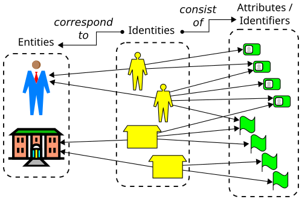
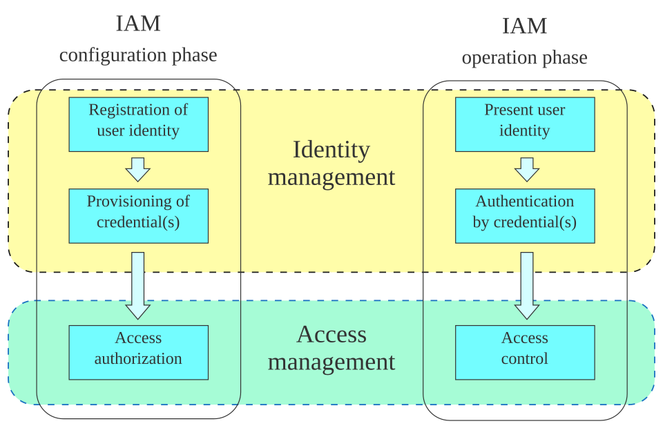
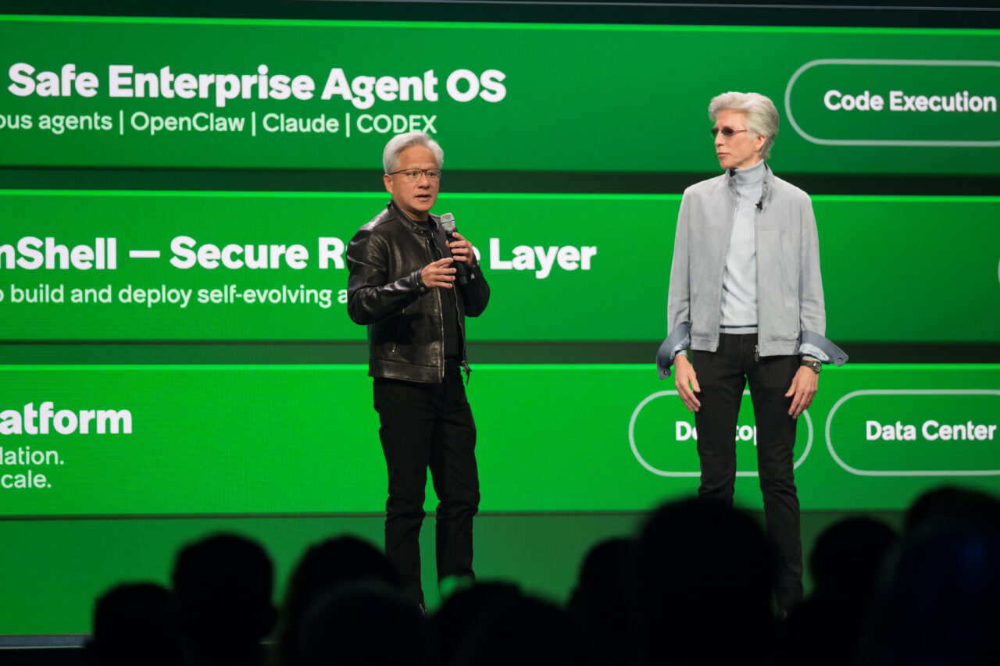
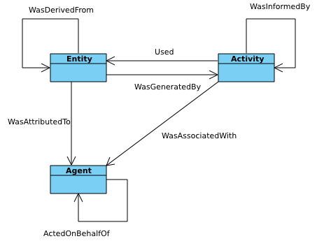

# 200 Agents Run the Company. None of Them Have an Employee ID.

_SAP declared the autonomous enterprise. The real infrastructure is the agents_

## Executive Summary

> [!callout]
> In May 2026, SAP declared the "Autonomous Enterprise," a model in which more than 200 specialized agents carry work through to completion. One of them, an autonomous close agent, compresses a financial close that used to take weeks down to days. Agents are no longer tools that answer questions; they are actors that touch the books and trigger approvals. This piece is about the one thing those actors are missing: identity.

> When a person joins a company, an employee ID, permissions, and logs are attached automatically. Agents get none of that. When the Cloud Security Alliance (CSA) surveyed 383 security professionals, 78% of organizations had no policy even for creating and retiring agent identities. 68% could not tell what an agent had done apart from what a person had done. More than half the actors running the company are working as ghosts with no ID.

> The real infrastructure of the autonomous enterprise isn't a smarter model. It's a system of data identity and lineage that tracks and verifies who accessed which data and what they changed. Autonomy can't outrun the maturity of your data governance.

Four numbers sketch the outline of this gap: the count of specialized agents SAP says it orchestrates, the share of organizations with no identity policy for them, the share that cannot tell agent actions from human ones, and the multiple by which non-human identities have already outnumbered people inside the enterprise.

<!-- stat-card -->
**200+** — SAP specialized agents — Orchestrated across the Autonomous Suite (SAP, 2026-05)

<!-- stat-card -->
**78%** — No identity policy — No policy to create or retire agent identities (CSA·Oasis, n=383)

<!-- stat-card -->
**68%** — Can't tell who acted — Cannot distinguish agent actions from human ones (CSA, 2026-03)

<!-- stat-card -->
**80:1** — Non-human to human — Non-human identities now outnumber people inside the enterprise (KPMG, 2026)

## 200 Agents Already Touch the Books

At SAP Sapphire in May 2026, SAP declared the "Autonomous Enterprise." The thesis compresses into numbers. More than 200 specialized agents are orchestrated across the SAP Autonomous Suite, and over 50 domain-specific Joule assistants are deployed across finance, supply chain, procurement, HR, and customer experience. This isn't marketing rhetoric; it's a product announcement about planting autonomous actors throughout a company's core operations.

The most telling case is the Autonomous Close agent. It handles journal entries, reconciliation, and error resolution on its own, shrinking a financial close that used to run for weeks down to a few days. What matters here isn't the speed but the nature of the act. This agent reaches directly into the accounting ledger. An autonomous asset-management agent analyzes thousands of past incidents to find root causes and drafts work orders before a person does. These are not read-only tools; they are actors that trigger writes.

And it isn't only SAP. NVIDIA and ServiceNow introduced Project Arc, a long-running autonomous desktop agent, and Prosus's 2026 survey reports that agents can now run autonomously for nearly five hours without human intervention. The center of gravity has already shifted from "the smartest model" to "trustworthy production deployment." The capability race is largely settled; the open question lies elsewhere.

> [!callout]
> **The premise has changed**: agents are no longer the helper beside a search box. They trigger approvals, alter the books, and issue work orders. When a person does that work, we naturally ask: who did this? For agents, there is still no mechanism that can answer the question.

*▲ An identity corresponds to an entity (person or organization) and consists of a set of attributes and identifiers | Source: [Wikimedia Commons](https://commons.wikimedia.org/wiki/File:Identity-concept.svg)*

## People Get an ID. Agents Get Nothing.

Think about how a person enters a company. On the first day they receive an employee ID, permissions are set to match their role, and every system they touch keeps a log. A skeleton called identity is laid down first, so that who did what and when can be reconstructed after the fact. Audit and compliance run on top of that skeleton.

For agents, that skeleton is missing wholesale. When CSA and Oasis Security surveyed 383 security professionals in January 2026, 78% of organizations had no documented policy for creating and retiring agent identities. 92% were not confident that their existing IAM stack could effectively manage the risk of non-human identities. Adoption is already finished while identity management hasn't even begun.

The scale makes clear why the gap is dangerous. In Okta's 2026 survey, 91% of organizations were already using AI agents, but only about 10% had governance in place. KPMG counts non-human identities outnumbering humans inside the enterprise by 80 to 1. Eighty automated identities per person move through systems, and many of them aren't tracked to anyone.

*▲ The IAM lifecycle: for people, this registration–authentication–access-control cycle runs automatically. For agents, the skeleton itself is missing | Source: [Wikimedia Commons](https://commons.wikimedia.org/wiki/File:Fig-IAM-phases-vector.svg)*

The most direct symptom is an inability to tell actors apart. In the CSA survey, 68% of organizations could not clearly separate what an agent did from what a person did. Even opening the logs, you cannot pick out which change came from an employee's hand and which came from an agent's autonomous run. The actor is plainly there, but its identity leaves no trace in the record.

> [!callout]
> **Defining the ghost**: an actor with no identity, whose permissions aren't managed through RBAC, and whose actions aren't recorded as belonging to anyone. In most organizations today, agents fit that definition exactly. They do the work of an employee, yet the company's structure still treats them as software.

## "Almost Right" Can't Be Accountable

In his keynote, SAP CEO Christian Klein said, "In mission-critical processes, 'almost right' is not good enough." He's correct. But that sentence is about accountability as much as accuracy. To judge whether a result was almost right or completely wrong, you first have to be able to reconstruct who produced it. That is why Klein, in the same breath, stressed that AI agents must be "anchored in data and governance."

Real-world readiness lags well behind the declaration. When Gravitee surveyed more than 900 practitioners, 88% had confirmed or suspected an agent-related security incident. Yet 45.6% were still authenticating multiple agents with a single shared API key. Agents that move on a shared key make it impossible, when something goes wrong, to tell which agent did what. The moment identity is shared, accountability becomes fundamentally untraceable.

The faster autonomy moves, the sharper this problem gets. While an agent runs autonomously for five hours, dozens of data accesses and changes pile up out of human sight. Digging through logs after the fact can't keep pace. The industry's conclusion is clear: policy has to be enforced at the very moment an action occurs, not reviewed afterward.

Vendors are already moving this way. ServiceNow's AI Control Tower monitors agent behavior in real time and provides auditability, and NVIDIA's OpenShell offers a runtime that fences off an agent's permissions and tool access by policy. That runtime governance and audit trails ship as first-class product features rather than add-ons shows an industry consensus: governance is infrastructure.

*▲ NVIDIA CEO Jensen Huang at ServiceNow Knowledge 2026, announcing OpenShell (secure runtime layer) and the Safe Enterprise Agent OS | Source: [NVIDIA Blog](https://blogs.nvidia.com/blog/servicenow-autonomous-ai-agents-enterprises/)*

## Identity Rests on Data Lineage

Here we have to go one level deeper. Giving an agent an identity isn't the end of it. Even after you issue an employee ID, if you can't answer "what did this agent read, from which source, and what did it change," that identity is just a name tag, not a tracking device. Questions of accountability always point back to the data: which value in which table was changed, through whose hand, and on what basis.

That is why the enterprise governance playbook talks about four pillars: agent identity, runtime enforcement, comprehensive auditing, and data lineage. If the first three pillars handle "who, with what permission, did what," lineage handles "what trace that action left on which data." Drop lineage and the other three spin in place. Even with perfect identity and permissions, if the data itself doesn't know its own origin, you can't trace the consequences of an action to the end.

*▲ The W3C PROV data lineage model: Entity (data), Activity (work), and Agent (actor) connected by relationships that let you trace "who produced what" all the way back | Source: [Wikimedia Commons](https://commons.wikimedia.org/wiki/File:Prov_dm-essentials.png)*

Recall the autonomous close agent from the first section. If this agent adjusted some value in quarterly revenue, the identity record lets you answer "who did it." But unless the data itself remembers which source it based that adjustment on and what the prior value was changed to, tracing stops at the auditor's next question: "why was it changed this way?" Identity fills only half of accountability. The other half is filled only when the data carries its own history.

The AI-Ready Data view embeds this lineage inside the data. Every fact must be traceable back to the source document and the write event it came from, and attributes like sensitivity, region, retention period, and access control (ACL) must travel with the data. When provenance is inscribed into the data this way, the instant an agent touches it, that action automatically becomes a traceable record. If identity is the answer on the actor's side, lineage is the answer on the data's side. Only when the two meet can "who did what" be reconstructed all the way through.

> [!callout]
> **A question of order**: giving an agent an employee ID only means something when the data remembers its own lineage. On top of data that doesn't know its origin, no matter how sophisticated an identity system you build, tracing breaks off midway. So the starting point of agent governance isn't deploying IAM; it's inscribing provenance and permissions into the data.

## Is Your Agent an Employee or a Ghost?

Let's turn the abstract diagnosis into a concrete question. Take the agents working in your company right now and ask four things. Wherever the answer stalls is exactly where the hole in your governance is.

- •**Identity** — Does each agent hold a unique identity the way a person does, or do several agents move on a single shared key?
- •**Lineage** — Does an agent's action log trace back to the origin of the data it touched?
- •**Reconstruction** — When something goes wrong, can you recover which agent changed what, and on what basis, after the fact?
- •**Permissions** — Is the agent's access managed through RBAC, fenced off so it can't reach more data than it needs?

If you can answer "yes" to all four, your company's agents are employees. Wherever one stalls, that much of them is a ghost. And this diagnosis soon translates into the language of regulation. The EU AI Act's high-risk requirements take effect on August 2, 2026, with fines reaching up to €35 million or 7% of global revenue. Explainability and data lineage become, in effect, obligations. "Can you reconstruct who did what" is no longer best practice; it is a legal requirement.

*▲ Advocates at the EU Parliament in Strasbourg pushing for the AI Act. High-risk AI requirements take effect on August 2, 2026 | Source: [Wikimedia Commons](https://commons.wikimedia.org/wiki/File:EKO_-_AI_ACT_-_Strasbourg_Parliament_-_52886020107.jpg) (CC BY 2.0)*

The conclusion is simple. On the road to the autonomous enterprise, the bottleneck isn't the intelligence of the model but the maturity of data governance. Before buying one more, smarter agent, you have to build the data identity to give the agents already at work. Because autonomy can't outrun the maturity of your data governance.

<!-- stat-card -->
**Editor's Note** — Inscribing provenance and permissions into data so agents can touch it with confidence. That is exactly the point Pebblous is pointing to when it talks about AI-Ready Data. Making every fact traceable back to its source and write event, and letting sensitivity and access control move with the data, is the problem we're trying to solve. It's a view that looks for the foundation of the autonomous enterprise in the data, not the model.

## References

### Industry Announcements

- 1.SAP. (2026). "[At SAP Sapphire, SAP Unveils the Autonomous Enterprise](https://news.sap.com/2026/05/sap-sapphire-sap-unveils-autonomous-enterprise/)." _SAP News_. — 200+ specialized agents, Autonomous Close, CEO Klein on "anchored in data and governance."
- 2.NVIDIA. (2026). "[ServiceNow and NVIDIA Build Autonomous AI Agents for Enterprises](https://blogs.nvidia.com/blog/servicenow-autonomous-ai-agents-enterprises/)." _NVIDIA Blog_. — Project Arc, AI Control Tower, OpenShell runtime governance.
- 3.Prosus. (2026). "[State of AI Agents 2026: Autonomy Is Here](https://www.prosus.com/news-insights/2026/state-of-ai-agents-2026-autonomy-is-here)." _Prosus_. — Shift in center of gravity, agents running autonomously for ~5 hours.

### Surveys & Statistics

- 4.Cloud Security Alliance & Oasis Security. (2026). "[The State of Non-Human Identity and AI Security](https://cloudsecurityalliance.org/artifacts/state-of-nhi-and-ai-security-survey-report)." _CSA_. — n=383, 78% with no identity policy, 92% distrusting legacy IAM.
- 5.Cloud Security Alliance. (2026). "[More Than Two-Thirds of Organizations Cannot Clearly Distinguish AI Agent From Human Actions](https://cloudsecurityalliance.org/press-releases/2026/03/24/more-than-two-thirds-of-organizations-cannot-clearly-distinguish-ai-agent-from-human-actions)." _CSA Press Release_. — 68% cannot distinguish actions.
- 6.Okta. (2026). "[AI Agents at Work 2026](https://www.okta.com/newsroom/articles/ai-agents-at-work-2026-agentic-enterprise-security/)." _Okta Newsroom_. — 91% using agents, governance at ~10%.
- 7.Gravitee. (2026). "[State of AI Agent Security 2026](https://www.gravitee.io/blog/state-of-ai-agent-security-2026-report-when-adoption-outpaces-control)." _Gravitee Blog_. — 88% security incidents, 45.6% authenticating via shared API keys.

### Frameworks & Practice

- 8.Promethium. (2026). "[AI Agent Data Governance: The Enterprise Playbook for 2026](https://promethium.ai/guides/ai-agent-data-governance-enterprise-playbook-2026/)." _Promethium Guides_. — Four pillars (identity, runtime enforcement, auditing, lineage), "enforce at the moment of action."
