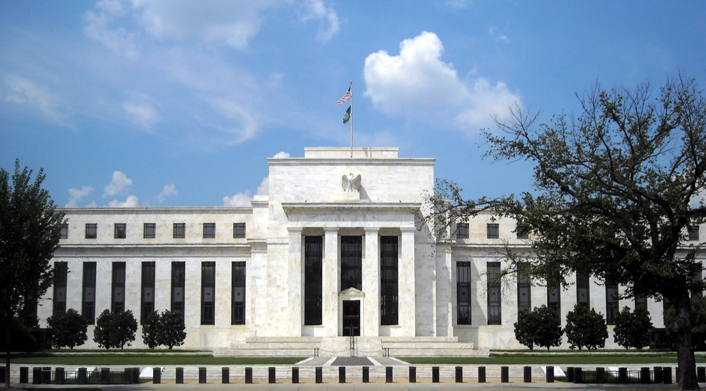

# 대출·사기 판단을 맡은 AI 에이전트의 감사 추적

_골드만삭스 주도 Taktile 시리즈C가 보여주는 신용·사기 자동화의 증거 요건_

## Executive Summary

> [!callout]
> 2026년 6월 24일, 골드만삭스가 주도한 시리즈C 1.1억 달러가 Taktile로 들어갔다. Taktile은 은행과 보험사의 대출 심사, 사기 판단, 청구, KYC·AML 워크플로우를 AI 에이전트와 규칙, 인간 감독을 엮어 자동화하는 뉴욕·베를린·런던 기반 회사다. 표면적으로는 "금융이 드디어 에이전틱 AI를 도입한다"는 익숙한 뉴스지만, 그 자금이 실제로 향한 곳을 보면 이야기가 달라진다. 이 글은 그 투자가 왜 더 정확한 모델이 아니라 판단에 남는 흔적을 산 투자로 읽히는지를 본다.

> 규제받는 고위험 결정에서 은행이 먼저 증명해야 하는 것은 정답률이 아니다. 어떤 데이터로, 어떤 버전의 시스템이, 누구의 승인을 거쳐 그 결론에 도달했는지를 나중에 재구성할 수 있느냐다. 그런데 정작 규제는 이 문제를 정면으로 다루지 않는다. EU AI법은 신용평가를 고위험으로 묶으면서 사기 탐지는 명시적으로 제외했고, 미국은 15년 만에 갈아엎은 모델 리스크 가이던스 SR 26-2에서 생성형·에이전틱 AI를 아예 범위 밖에 두었다. 규칙이 비어 있는 그 자리를 감사 추적이 사실상의 표준으로 메우고 있다.

> 며칠 전 발행한 [EU AI법 10조 리포트](/report/eu-ai-act-article10-labeling-audit-evidence/ko/)가 학습 데이터를 준비하는 단계의 증거 요건을 다뤘다면, 이번 신호는 같은 파이프라인의 반대쪽 끝, 실시간 의사결정 시점의 증거 요건이다. 두 지점을 끊기지 않게 잇는 것이 데이터 계보이며, 규율이 강해질수록 이 끊기지 않는 기록 자체가 상업적 자산이 된다. Taktile이 파는 것도, 골드만이 산 것도 결국 그 흔적이다.

이 전환이 어디에 발을 딛는지는 네 개의 숫자가 먼저 말해 준다. 골드만이 주도한 라운드의 규모, 에이전트가 이미 처리하는 자동화의 깊이, 사기 판단에서 줄어든 오탐, 그리고 금융기관이 스스로 가장 두려워하는 규제 리스크가 무엇인지다.

<!-- stat-card -->
**$110M** — Taktile 시리즈C — 골드만삭스 주도 · 2026-06-24 · 누적 $184M

<!-- stat-card -->
**95%** — B2B 인수 자동화율 — Taktile 고객 사례 · 매일 수백만 건 처리

<!-- stat-card -->
**75%** — AML 거짓양성 감소 — 사기·자금세탁 오탐 축소 · Taktile 지표

<!-- stat-card -->
**28.4%** — 최대 규제 리스크로 지목 — 설명가능성·투명성 · Wolters Kluwer 2026 Q1

## 은행이 에이전트에게 맡긴 판단

어떤 사업자가 계좌를 열려고 신청서를 넣는다. 예전이라면 심사역이 서류를 확인하고, 신용 이력을 조회하고, 제재 명단과 대조한 뒤 승인 여부를 결정했다. Taktile이 하는 일은 이 판단의 흐름을 소프트웨어 안으로 옮기는 것이다. AI 에이전트가 맥락을 읽고, 규칙 엔진이 정책 조건을 걸고, 애매한 경계선만 사람에게 넘긴다. 회사는 이 조합을 "Agentic Decision Platform"이라 부르며, 인수·청구·사기·온보딩·AML 워크플로우의 의사결정을 매일 수백만 건 규모로 자동화한다고 밝힌다.

2020년 Maik Taro Wehmeyer와 Maximilian Eber가 세운 이 회사의 고객 명단에는 Mercury, Monzo, Faire, Pleo 같은 핀테크와 이름을 밝히지 않은 대형 보험사가 올라 있다. 공개된 성과 지표는 구체적이다. B2B 인수 결정의 95%를 자동으로 처리하고, AML 거짓양성을 75% 줄였으며, 한 보험사는 청구 처리에서 9천만 달러 이상의 효율화를 기대한다고 한다. 숫자만 보면 이것은 정확하고 빠른 자동화 도구의 이야기다.

그런데 은행이 이런 판단을 기계에 넘길 때 감독당국이 던지는 첫 질문은 "그 판단이 맞느냐"가 아니다. "왜 이 신청은 거절됐는지, 그때 어떤 데이터를 봤는지, 어느 버전의 규칙이 적용됐는지를 6개월 뒤에도 그대로 보여줄 수 있느냐"다. 대출 거절 하나가 소송이나 차별 심사로 이어지는 순간, 은행이 제출해야 하는 것은 모델의 정확도 리포트가 아니라 그 결정의 재구성 가능한 기록이다. 자동화의 깊이가 깊어질수록 이 기록의 요구도 함께 무거워진다.

## 투자자가 산 것은 정확도가 아니다

골드만삭스의 성장자본 부문(Goldman Sachs Alternatives)이 주도한 이번 라운드에는 Tiger Global, Index Ventures, Balderton Capital, Y Combinator, Dig Ventures가 참여했고, Taktile의 누적 조달액은 1억 8,400만 달러가 됐다. 규모 자체는 2026년의 규제산업 AI 투자 흐름에서 특별히 큰 편은 아니다. 눈여겨볼 것은 투자자의 정체성이다. 골드만은 벤처 실험에 돈을 넣는 곳이 아니라, 규제받는 금융 인프라가 무엇을 요구하는지를 누구보다 잘 아는 당사자다.

*▲ 골드만삭스 뉴욕 본사(200 West Street). 성장자본 부문이 Taktile 시리즈C를 주도했다 | Source: [Wikimedia Commons](https://commons.wikimedia.org/wiki/File:Goldman_Sachs_200_West_Street.JPG)*

Taktile 투자를 다룬 보도들은 대부분 같은 단서를 달았다. LLM은 왜 그런 판단을 내렸는지 설명하기 어렵고, 아직 어느 은행도 규제 프로세스를 끝에서 끝까지 자동화하지는 못했다는 것이다. 흔히 이 단서는 "그래서 아직 이르다"는 신중론으로 읽힌다. 그런데 같은 문장을 뒤집으면 이렇게도 읽힌다. 설명이 어렵고 완전 자동화가 아직 없기 때문에, 지금 자금이 몰리는 대상은 정확한 모델이 아니라 그 판단을 감사에 제출 가능한 형태로 묶어내는 워크플로우라는 것이다.

규제받는 고위험 결정, 곧 신용·사기·청구·온보딩·KYC·AML에서 팔리는 것은 정답률 몇 퍼센트가 아니다. 같은 정확도의 두 시스템이 있을 때, 감독당국 앞에서 살아남는 쪽은 모든 판단의 입력·중간 단계·승인 경로를 되짚어 보여줄 수 있는 쪽이다. 골드만이 1.1억 달러로 산 것은 이 되짚음의 능력이다. 정확도는 경쟁의 입장권일 뿐, 조달의 결정 요인은 추적 가능성 쪽으로 넘어간다.

> [!callout]
> 규제 산업에서 해자는 모델이 아니다. 모델은 복제되고 따라잡히지만, 모든 판단에 끊기지 않고 남는 데이터 흔적은 하루아침에 소급해 만들 수 없다. 감사 추적을 처음부터 파이프라인의 산출물로 남긴 회사와, 마감에 몰려 재구성하는 회사의 차이는 감사관 앞에서 되돌릴 수 없는 격차가 된다. 이것이 골드만의 베팅을 정확도가 아니라 추적 가능성에 대한 베팅으로 읽는 이유다.

## 규제가 그은 이상한 선

추적 가능성이 사실상의 표준이 된 데는 역설적인 이유가 있다. 정작 규제가 에이전틱 AI를 정면으로 다루지 않는다는 점이다. EU AI법 부속서 III은 신용도 평가(creditworthiness)에 쓰이는 AI를 고위험으로 명시한다. 그런데 같은 조항이 금융 사기 탐지 목적의 AI는 고위험 분류에서 명시적으로 제외한다. 대출을 판단하면 고위험, 사기를 판단하면 회색지대인 셈이다.

문제는 현장에서 이 둘이 잘 나뉘지 않는다는 데 있다. 온보딩 단계의 사기 판단 결과가 계좌 개설 거절이나 신용 결정으로 이어지면, 처음엔 고위험 밖에 있던 AML 모니터링이 다시 고위험 안으로 끌려 들어온다. 하나의 에이전트가 신용 결정과 사기 판단을 동시에 다룰 때 어느 규정을 적용해야 하는지가 분명하지 않다. 고위험 의무의 시행 시점을 두고도 출처마다 2026년 8월 2일과 2027년 12월 사이에서 서술이 엇갈린다. 여기서는 8월 2일을 기준 시한으로 두되, Digital Omnibus를 둘러싼 지연 논의가 확정인지 제안인지는 아직 출처마다 다르다는 점을 함께 적어 둔다.

*▲ 브뤼셀 유럽의회 앞 EU 회원국 국기. EU AI법 부속서 III은 신용평가를 고위험으로, 사기탐지는 명시적으로 제외한다 | Source: [Wikimedia Commons](https://commons.wikimedia.org/wiki/File:14_EU_Member_Flags_in_front_of_European_Parliament_in_Brussels.jpg)*

### 3.1. 미국은 아예 다른 길을 갔다

2026년 4월 17일, 연준·OCC·FDIC가 15년간 모델 리스크 관리의 근간이던 SR 11-7을 SR 26-2(OCC Bulletin 2026-13)로 전면 교체했다. 핵심 문구는 이렇다. 생성형 AI와 에이전틱 AI는 새롭고 빠르게 진화하고 있어 이 가이던스의 범위에 포함되지 않는다. 반면 에이전트가 다루는 전통적 통계·정량 모델은 그대로 범위 안에 남는다. 위험이 사라진 것이 아니라, 이름 붙지 않은 곳으로 옮겨 앉은 것이다.

결과적으로 은행의 이사회와 모델 리스크팀은 참조할 프레임워크 없이 에이전틱 AI 거버넌스를 자체적으로 세워야 하는 처지가 됐다. EU는 신용과 사기 사이에 어정쩡한 선을 그었고, 미국은 에이전틱 AI를 아예 스코프 밖으로 밀어 두었다. 두 관할권 모두 "이렇게 하라"는 명확한 규칙을 주지 않는다. 이 공백을 실무가 스스로 메우는 방식이, 모든 판단에 감사 가능한 기록을 남겨 두는 것이다. 규칙이 뭐라고 결론 내릴지 모를 때 가장 안전한 대비는, 나중에 무엇을 요구받든 되짚어 보여줄 수 있게 해 두는 것이기 때문이다.

*▲ 워싱턴 D.C. 연준 에클스 빌딩. 연준·OCC·FDIC가 2026년 4월 SR 11-7을 SR 26-2로 교체했다 | Source: [Wikimedia Commons](https://commons.wikimedia.org/wiki/File:Marriner_S._Eccles_Federal_Reserve_Board_Building.jpg)*

## 설명만으로는 감사를 통과하지 못한다

여기서 자주 뒤섞이는 두 개념을 갈라 둘 필요가 있다. 설명 가능성(explainability)은 "왜 이 결정이 나왔는가"에 답한다. 감사 가능성(auditability)은 "어떤 시스템이, 어떤 버전으로, 어떤 데이터를 근거로, 누구의 승인을 거쳐 그 결정을 냈는가"를 증명한다. ECOA나 GDPR이 요구하는 것은 주로 앞의 것이고, EU AI법과 SR 26-2 계열의 가이던스가 요구하는 것은 뒤의 것이다.

이 구분이 실무에서 갈리는 지점은 분명하다. 대출 승인 이유를 완벽하게 설명하는 에이전트라도, 그 판단에 쓰인 데이터가 잘못 정제됐거나 신원 확인이 누락됐다면 컴플라이언스는 실패한다. 하류의 투명성은 상류의 통제 없이는 거버넌스의 착시일 뿐이다. 실제로 금융기관의 28.4%가 설명가능성·투명성을 가장 심각한 AI 규제 리스크로 꼽았고(Wolters Kluwer, 2026 Q1), 이미 70% 이상이 에이전틱 AI를 일부라도 쓰고 있지만 거버넌스 프레임워크는 그 속도를 따라가지 못한다(EY, 2026).

설명 가능성과 감사 가능성을 이어 주는 것이 데이터 계보(data lineage)다. 학습 데이터가 어디서 왔고 어떻게 준비됐는지부터, 실시간 판단이 어떤 입력과 중간 단계를 거쳐 어떤 출력을 냈는지까지, 끊기지 않고 이어지는 기록이다. 며칠 전 리포트가 다룬 [EU AI법 10조](/report/eu-ai-act-article10-labeling-audit-evidence/ko/)는 이 계보의 상류 끝, 곧 라벨링·정제·편향 검사가 남겨야 할 증거를 요구했다. 이번 신호는 하류 끝, 곧 대출·사기 판단이 남겨야 할 증거를 요구한다. 두 끝을 하나의 계보로 이으면, 규제받는 AI 파이프라인 전체가 감사 추적을 요구한다는 그림이 완성된다. 규율이 강해질수록 이 끊기지 않는 기록은 비용이 아니라 팔리는 제품이 된다.

## 페블러스가 주목하는 이유

규제 금융에서 조달의 기준이 정확도에서 추적 가능성으로 옮겨간다는 것은, 데이터를 다루는 회사에게 지형이 바뀐다는 뜻이다. 그동안 "AI에 준비된 데이터"는 성능을 끌어올리려는 팀의 자발적 관심사였다. 감사 추적이 조달 기준이 되는 순간, 그 데이터가 어디서 왔고 어떻게 검증됐는지를 증명하는 일은 마케팅 문구가 아니라 계약의 조건이 된다.

페블러스가 데이터 품질과 계보를 진단 가능한 형태로 다뤄 온 관점에서 보면, Taktile로 향한 골드만의 자금은 시장의 신호다. 정확한 모델을 만드는 경쟁은 이미 상향 평준화됐고, 규제 산업의 조달 담당자가 실제로 확인하는 것은 판단의 근거를 되짚을 수 있느냐다. 학습 데이터의 준비 이력부터 실시간 결정의 입력·출력까지 끊기지 않게 잇는 계보가, 규율이 강해지는 시장에서 검증 가능한 데이터를 상업적 자산으로 바꾼다.

> [!callout]
> **Editor's Note.** 에이전트가 대출과 사기를 판단하고 그 과정을 로그로 남긴다면, 그 로그는 "무엇을 했나"에 답한다. 남는 질문은 "그 판단의 근거 데이터가 대표성 있고 검증됐는가"이다. 데이터셋의 품질·대표성·계보를 진단해 그 답을 증거로 만드는 일이 페블러스 DataClinic이 겨냥해 온 자리다. 이는 에이전트의 판단을 대체하는 것이 아니라, 그 판단이 딛고 선 데이터를 진단하는 인접한 자리에서 성립한다.

## 참고문헌

이 글은 아래 투자 보도·1차 규제 문서·업계 조사를 교차검증해 작성했다. 투자 규모·성과 지표는 회사 발표와 이를 인용한 보도를, 규제 문언은 1차 원문을 기준으로 삼았다.

### 투자·업계 보도

- 1.Fortune (2026-06-24). "Exclusive: Taktile raises $110M in Goldman Sachs-led round to bring AI to banks and insurers." [링크](https://fortune.com/2026/06/24/exclusive-taktile-goldman-sachs-ai-bank-insurance-funding/)
- 2.Business Wire (2026-06-24). "Taktile Secures $110M in Goldman Sachs-Led Series C to Power AI Transformation in Financial Institutions." [링크](https://www.businesswire.com/news/home/20260624713959/en/Taktile-Secures-110M-in-Goldman-Sachs-Led-Series-C-to-Power-AI-Transformation-in-Financial-Institutions)
- 3.American Banker (2026-06-24). "Goldman leads $110M bet on Taktile's AI software." [링크](https://www.americanbanker.com/news/goldman-leads-110m-bet-on-taktiles-ai-software)

### 규제·1차 문서

- 4.EU AI Act — Annex III, High-Risk AI Systems (신용평가 고위험 지정, 사기탐지 제외). [링크](https://artificialintelligenceact.eu/annex/3/)
- 5.EU AI Act (Reg. (EU) 2024/1689), Article 10 — Data and data governance. [링크](https://artificialintelligenceact.eu/article/10/)
- 6.OCC Bulletin 2026-13 / SR 26-2 (2026-04-17), Model Risk Management — 연준·OCC·FDIC, SR 11-7 대체. [링크](https://www.occ.gov/news-issuances/bulletins/2026/bulletin-2026-13.html)

### 업계 조사

- 7.Wolters Kluwer, "Q1 2026 Banking Compliance AI Trend Report" (설명가능성·투명성 28.4% 응답).
- 8.EY, "2026 Global Financial Services Regulatory Outlook" (에이전틱 AI 도입률·거버넌스 격차).

※ 성과 지표(95% 자동화, AML 오탐 75% 감소, $90M 효율화)는 Taktile과 고객사 발표를 인용한 보도 기준이며, 시행 시점·시장 규모 통계는 정의 범위와 조사 시점이 기관마다 달라 본문에 단서를 함께 표기했다.
