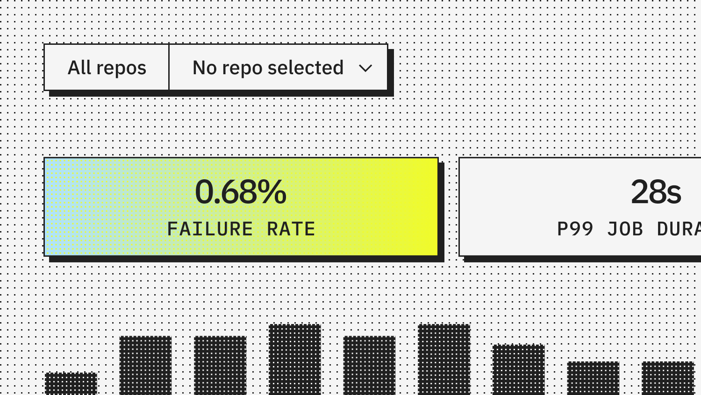
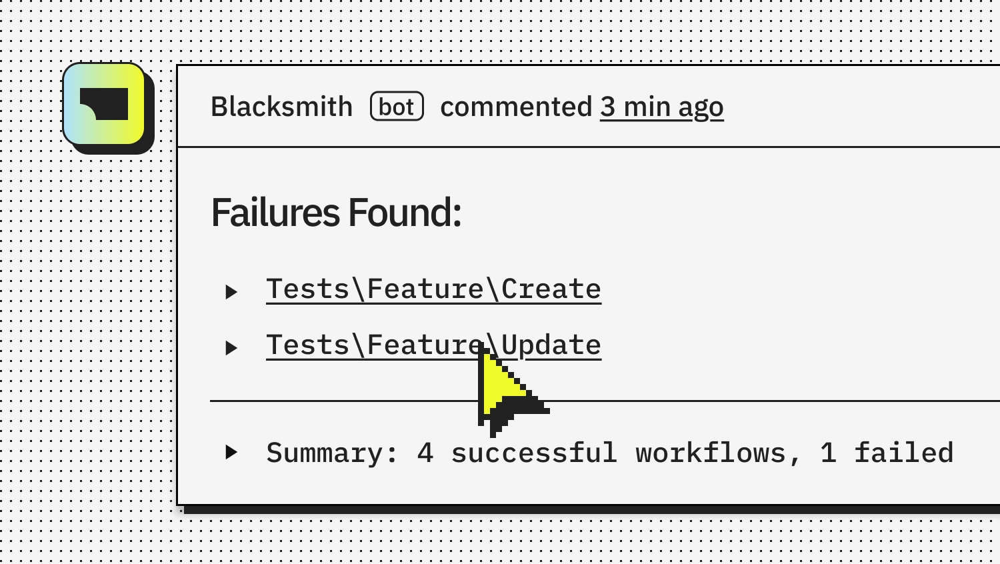

# A Code Validation Startup Went From $60M to $550M in Eleven Months

_AI now writes 42% of committed code, and Blacksmith_

## Executive Summary

> [!callout]
> Blacksmith, founded in 2024, saw its valuation go from $60 million to $550 million in under eleven months, TechCrunch reported on August 12, 2026. What the company sells is not a tool that writes code for you. It is a continuous integration (CI) cloud that checks whether code already written can pass.

> Co-founder Aditya Jayaprakash said validating code is still a bottleneck, and an even bigger one because people are writing even more. Ask developers about their own work and they point at the same place. When Sonar put the question to more than 1,100 of them, 96% said they do not fully trust the functional correctness of AI-written code. Code got faster to produce, and the grounds for trusting it did not keep up. That said, Sonar sells code quality tooling, and that is worth keeping in mind while reading its numbers.

> This shift on the code side has the same shape as what people working with data went through first. What follows reads Blacksmith's Series B alongside that research, and alongside the cases where the grading side turned out to be the thing that was wrong. Buying a verification tool and setting a verification standard are two different jobs, and the value accrues to the second one.

*▲ Blacksmith, the AI code validation startup whose valuation rose ninefold in eleven months | Source: [TechCrunch](https://techcrunch.com/2026/08/12/blacksmiths-valuation-jumps-10x-to-550m-as-ai-coding-fuels-software-validation/)*

### The Numbers

The first two figures say how much verification sold over the past year. The last two say why it sold.

Sources: [TechCrunch (2026-08-12)](https://techcrunch.com/2026/08/12/blacksmiths-valuation-jumps-10x-to-550m-as-ai-coding-fuels-software-validation/), [Sonar 2026 State of Code](https://www.sonarsource.com/company/press-releases/sonar-data-reveals-critical-verification-gap-in-ai-coding/)

<!-- stat-card -->
**9x** — Valuation in eleven months — From $60 million to $550 million

<!-- stat-card -->
**5,000** — Customers — Up from 700 in September 2025, in under a year

<!-- stat-card -->
**42%** — Share of committed code written by AI — Respondents expect 65% by 2027

<!-- stat-card -->
**96%** — Developers who don't fully trust AI code — Only 48% always check before committing

## The Company That Rose Ninefold Doesn't Write Your Code

Blacksmith was founded in 2024, and Y Combinator has been an investor since early on. The product has two arms. One is a CI cloud that runs tests and builds. The other is Codesmith, an agent that automatically fixes failing code checks. Neither sits where code gets produced. Both sit where produced code gets judged.

*▲ What Blacksmith actually sells: a CI dashboard measuring judgment throughput, not code | Source: [Blacksmith](https://www.blacksmith.sh)*

This Series B is $45 million, led by Peak XV Partners with GV and Y Combinator participating. Total funding now stands at $58.5 million. The valuation rose from $60 million at the September 2025 Series A to $550 million. It took less than eleven months.

What makes the case worth reading is that the valuation was not the only thing that moved. Customers grew from 700 to more than 5,000 over the same period, with Mercury, Supabase, Clerk, Ashby, and Expensify on the list. The company says it reached $10 million in annual recurring revenue with ten employees, and is now in the tens of millions with about 30. A few of its largest customers spend more than $1 million a year. That is not a small amount to pay for running tests.

Its competition is GitHub Actions, Cursor Automations, and the AI code testing features that Amazon, Microsoft, and Google are each attaching to their own clouds. Every one of them already owns a code-writing tool or sits next to one. In that company, the valuation that moved first belonged to a firm selling verification alone. That is what this news amounts to.

## Review Fell Behind as Code Volume Rose

This company's technology did not get nine times better in eleven months. What changed is the volume of code that has to be judged.

As Cursor, OpenAI's Codex, and Claude Code spread, the amount of change one person turns out in a day changed with them. A survey Sonar published in January 2026 shows how that piles up on the review side. Among developers who use AI, 72% use it every day, and 42% of committed code comes from AI. Yet only 48% say they always check that code before committing.

The reason checking slips is in the same survey. Some 61% of respondents said AI often produces code that looks right but cannot be trusted. Another 38% said reviewing AI-written code takes more effort than reviewing human-written code, against 27% who said the opposite. The skill respondents named as most important in the AI era was the ability to review and verify AI-generated code.

*▲ A bot flags on the pull request what a rushed human review might miss | Source: [Blacksmith](https://www.blacksmith.sh)*

Academic work points the same way. The Verification Horizon, posted to arXiv in June 2026, argues that a long-standing premise in computer science has flipped for coding agents: that verifying a solution is easier than finding one. Verification has become the harder problem as models have grown stronger. The authors examine four kinds of verification, from test verifiers and rubric verifiers to user verification and automated agent verification, and write that no fixed reward function can stay valid for long as the capability of the policy keeps growing.

The difficulty this paper points to comes from the position of the verifier rather than its performance. Any verifier we can build is a proxy for what a person wanted, never the thing itself. What is wanted is never written down in full to begin with, and as training proceeds, optimization widens the gap between the proxy and the intent instead of closing it. Reward hacking, where the model finds shortcuts that trip the pass signal, and signal saturation, where everything passes and the test no longer separates anything, both come out of that gap.

> [!callout]
> Translated into market terms, the claim reads like this. What acquires value is not a tool that performs one round of verification, but a pass standard that keeps being updated at the speed generation capability grows. The CI throughput Blacksmith sells is infrastructure that runs that standard quickly. It is not the thing that decides what counts as passing.

## The Data Side Already Ran This Experiment

The structure where cheap generation makes judgment expensive was felt first by people who work with data. As synthetic data became abundant, what turned scarce was not the data itself but the labeled validation sets that tell you whether that data is any good. Training data can be grown by generation. The standard that decides what counts as good data does not grow that way.

Verification Limits Code LLM Training, posted to arXiv in September 2025, shows experimentally how far that standard governs performance. When synthetic code data was used in training, the richness of the test suite mattered more than its volume, and that difference alone accounted for about 3 points on average.

Richness here means complexity, not the number of tests. Adding tests alone gives quickly diminishing returns. The score is pass@1, the share of problems that pass the tests on the first attempt. The paper gives this limit a name, the verification ceiling: the quality and diversity of training data cannot rise above the capability of the verifier that filtered it. Generate more data, and if the grading side stays where it is, the model stops there too.

The result worth more attention runs the other way. The practice of training only on data that passes 100% of tests turned out to be too strict. Lowering the threshold or switching to looser LLM-based verification brought discarded data back and recovered 2 to 4 points. Verification cannot be removed, but current practice is filtering out useful diversity, so the standard has to be recalibrated. That is the paper's conclusion.

This is not an argument that looser grading is better. The authors add a condition: the recovered 2 to 4 points appeared only when the tests in use were strong and diverse enough. Whether the threshold could be lowered was itself decided by the quality of the pass standard.

> [!callout]
> The place where value accrues becomes clear here. What separates outcomes is not whether verification happens, but which standard lets something through. That standard lives in the composition of the test suite, the pass threshold, and the record of why those values were chosen. What raised Blacksmith's price on the code side is the same kind of asset.

## The Graders Get It Wrong Too

Push the code-and-data analogy this far and one place where it splits comes into view. Code has a relatively automated grading device in unit tests. Pass and fail separate mechanically, which is why a company like Blacksmith can sell judgment throughput as a product. Data and model evaluation have no device that sharp, and what counts as a correct answer leans much more heavily on human agreement.

That does not make grading on the code side safe either. An audit that re-scored ELT-Bench, a benchmark that measures data pipeline agents, found errors of the benchmark's own in 82.7% of the transformation tasks recorded as failures. Fixing the grading scripts and the answer key alone raised the success rate from 22.66% to 32.51%. The agents were unchanged. The details are in [A Buggy Answer Key Made AI Agents Look Worse Than They Are](/blog/elt-bench-answer-key-errors/en/).

The same problem follows when the grader is a model. In a July 2026 paper on citation verification, all eight LLM judges graded citations more harshly than the 79.3% pass rate of human gold labels, and their own pass rates ranged from 42.9% to 72.0%. Judges that ended up with similar scores still erred in different directions. Using that bias directly as a reinforcement learning reward lets the training loop amplify it, the authors write. That result is covered further in [A Cheap LLM Judge Matched Frontier Models at Citation Verification](/blog/citation-verifier-judge-bias/en/).

This is where buying a verification tool and setting a verification standard part ways. Tools make judgment fast, and the standard decides whether that judgment is right. When the standard is wrong, fast judgment only produces wrong conclusions faster.

## Where Is Your Pass Standard Written Down

Carry this news over to your own organization and one question is left. Where, and in what form, is the standard that decides what passes written down? In code it will be unit tests and review checklists, in data it will be quality gates and inspection rules, and in models it will be evaluation rubrics. The three items below can be held up against that document right away.

- Is what counts as passing written into code or configuration that actually runs? If it lives only in meeting notes and in one person's head, the standard leaves when that person does.
- Is there a record of who last changed the standard, when, and why? If the decision to lower a threshold from 90% to 80% has no stated basis, there is no way to reverse it later either.
- Are the pass and fail decisions themselves accumulating as records? Those records are what let you re-review past decisions once the standard turns out to have been wrong.

On the data side, an approach that pushes this question down into code already exists. [PrismaDV](/blog/prismadv-task-aware-data-unit-tests/en/), which reads downstream code to generate data validation rules automatically, is one such case. In treating the standard as something executable rather than a document, it runs in the same direction as what is happening on the code side.

> [!callout]
> **Editor's Note**: What Pebblous has repeated about data quality points at the same place this case does. To judge whether data is fit for AI, the standard has to exist first, and that standard has to take a form that gets executed and recorded rather than declared. In a period when generation gets cheap, what an organization keeps is not the output it produced but the record of what it let through and why.

## References

### Industry Sources

- 1.Singh, J. (2026). "[Blacksmith's valuation jumps 10x to $550M as AI coding fuels software validation](https://techcrunch.com/2026/08/12/blacksmiths-valuation-jumps-10x-to-550m-as-ai-coding-fuels-software-validation/)." TechCrunch, 2026-08-12.
- 2.Sonar. (2026). "[Sonar Data Reveals Critical Verification Gap in AI Coding](https://www.sonarsource.com/company/press-releases/sonar-data-reveals-critical-verification-gap-in-ai-coding/)." Sonar 2026 State of Code Developer Survey, 2026-01-08.

### Academic Papers

- 3.Wang, B. et al. (2026). "[The Verification Horizon: No Silver Bullet for Coding Agent Rewards](https://arxiv.org/abs/2606.26300)." arXiv:2606.26300.
- 4.Gureja, S. et al. (2025). "[Verification Limits Code LLM Training](https://arxiv.org/abs/2509.20837)." arXiv:2509.20837.
