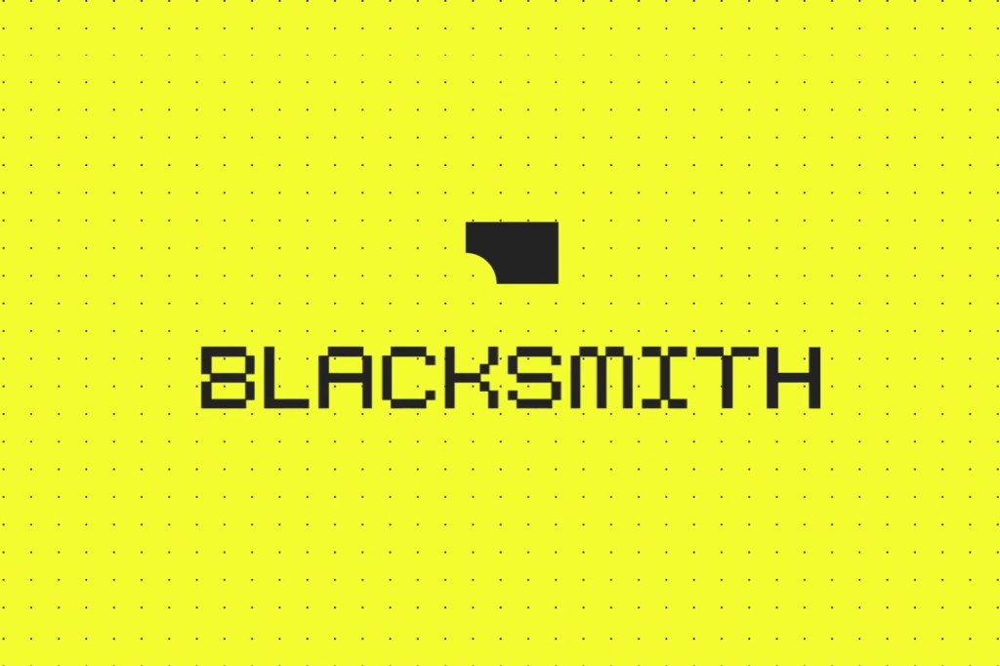

# 11개월 만에 몸값 9배가 된 코드 검증 회사 블랙스미스

_AI가 커밋 코드의 42%를 쓰게 된 개발 현장에서 검증이 새 병목으로 올라섰다_

## Executive Summary

> [!callout]
> 2024년에 창업한 블랙스미스(Blacksmith)의 기업가치가 11개월 만에 6,000만 달러에서 5억 5,000만 달러가 됐다고 테크크런치가 2026년 8월 12일 보도했습니다. 이 회사가 파는 것은 코드를 대신 써 주는 도구가 아닙니다. 이미 쓰인 코드가 통과할 수 있는지 확인하는 지속적 통합(CI) 클라우드입니다.

> 공동창업자 아디티아 자야프라카시(Aditya Jayaprakash)는 코드 검증이 여전히 병목이고, 사람들이 코드를 더 많이 쓰기 때문에 더 큰 병목이 됐다고 말했습니다. 개발 현장을 물어본 조사도 같은 곳을 가리킵니다. 소나(Sonar)가 개발자 1,100여 명에게 물었더니 96%가 AI가 쓴 코드의 기능적 정확성을 온전히 믿지는 않는다고 답했습니다. 코드를 만드는 속도는 올라갔는데 그 코드를 믿을 근거는 그만큼 따라오지 못한 셈입니다. 다만 이 조사를 낸 소나가 코드 품질 도구를 파는 회사라는 점은 감안하고 읽어야 합니다.

> 코드에서 벌어진 이 이동은 데이터를 다루는 쪽이 먼저 겪은 일과 모양이 같습니다. 아래에서는 블랙스미스의 시리즈 B를 데이터 쪽 연구, 그리고 판정하는 쪽이 스스로 틀린 사례와 나란히 놓고 봅니다. 검증 도구를 사는 일과 검증 기준을 세우는 일은 다르고, 값이 붙는 쪽은 뒤쪽이기 때문입니다.

*▲ 11개월 만에 기업가치가 9배 된 AI 코드 검증 스타트업 블랙스미스 | Source: [TechCrunch](https://techcrunch.com/2026/08/12/blacksmiths-valuation-jumps-10x-to-550m-as-ai-coding-fuels-software-validation/)*

### 주요 수치

앞의 두 숫자는 검증이 지난 1년 사이 얼마나 팔렸는지를 말합니다. 뒤의 두 숫자는 왜 팔렸는지를 말합니다.

출처: [TechCrunch (2026-08-12)](https://techcrunch.com/2026/08/12/blacksmiths-valuation-jumps-10x-to-550m-as-ai-coding-fuels-software-validation/), [Sonar 2026 State of Code](https://www.sonarsource.com/company/press-releases/sonar-data-reveals-critical-verification-gap-in-ai-coding/)

<!-- stat-card -->
**9배** — 11개월 만의 기업가치 — 6,000만 달러에서 5억 5,000만 달러로

<!-- stat-card -->
**5,000곳** — 고객사 수 — 2025년 9월 700곳에서 1년이 안 되어

<!-- stat-card -->
**42%** — 커밋 코드 중 AI 작성 비중 — 2027년에는 65%가 될 것으로 응답

<!-- stat-card -->
**96%** — AI 코드를 온전히 믿지 않는 개발자 — 항상 확인한다는 응답은 48%

## 9배가 된 회사는 코드를 써 주지 않는다

블랙스미스는 2024년에 세워졌고 와이컴비네이터가 초기부터 투자자로 들어와 있습니다. 제품은 두 갈래입니다. 하나는 테스트와 빌드를 돌리는 CI 클라우드이고, 다른 하나는 실패한 코드 검사를 자동으로 고치는 에이전트 코드스미스(Codesmith)입니다. 둘 다 코드를 새로 생산하는 자리가 아니라 이미 생산된 코드를 판정하는 자리에 놓여 있습니다.

*▲ 블랙스미스가 실제로 파는 것은 코드가 아니라 판정 처리량을 보여주는 CI 대시보드 화면 | Source: [Blacksmith](https://www.blacksmith.sh)*

이번 시리즈 B는 4,500만 달러 규모로 피크 XV 파트너스(Peak XV Partners)가 이끌었고 GV와 와이컴비네이터가 참여했습니다. 누적 조달액은 5,850만 달러가 됐습니다. 기업가치는 2025년 9월 시리즈 A 당시 6,000만 달러에서 5억 5,000만 달러로 올랐습니다. 11개월이 걸리지 않았습니다.

이 사례가 읽을 만한 것은 기업가치만 오른 게 아니기 때문입니다. 고객사는 같은 기간 700곳에서 5,000곳 넘게 늘었고, 머큐리와 수파베이스, 클럭, 애시비, 익스펜시파이가 명단에 있습니다. 직원 10명으로 연간반복매출 1,000만 달러를 찍은 뒤 지금은 30명 규모에서 수천만 달러대라고 회사는 밝혔습니다. 가장 큰 고객 몇 곳은 연간 100만 달러 이상을 씁니다. 테스트를 돌려 주는 값으로는 적지 않은 금액입니다.

경쟁 상대는 깃허브 액션스와 커서 오토메이션스, 그리고 아마존과 마이크로소프트와 구글이 각자 붙이고 있는 AI 코드 테스팅 기능입니다. 모두 코드를 쓰는 도구를 이미 갖고 있거나 그 도구와 붙어 있는 회사들입니다. 그 틈에서 검증만 파는 회사의 몸값이 먼저 뛰었다는 것이 이번 소식의 내용입니다.

## 코드가 늘어난 만큼 판정이 밀렸다

11개월 사이에 이 회사의 기술이 아홉 배 좋아졌을 리는 없습니다. 달라진 것은 판정해야 할 코드의 양입니다.

커서와 오픈AI 코덱스, 클로드 코드가 퍼지면서 한 사람이 하루에 만들어 내는 변경의 양이 달라졌습니다. 소나가 2026년 1월에 낸 조사는 그 변화가 리뷰 쪽에 어떻게 쌓이는지를 보여 줍니다. AI를 써 본 개발자의 72%가 매일 쓰고, 커밋되는 코드의 42%가 AI에서 나옵니다. 그런데 그 코드를 커밋 전에 항상 확인한다는 응답은 48%에 그칩니다.

확인이 밀리는 이유도 같은 조사에 있습니다. 응답자의 61%가 AI는 맞아 보이지만 믿을 수 없는 코드를 자주 내놓는다고 답했습니다. 38%는 AI가 쓴 코드를 리뷰하는 데 사람이 쓴 코드보다 더 많은 노력이 든다고 했고, 반대로 답한 쪽은 27%였습니다. 응답자들이 AI 시대에 가장 중요한 역량으로 꼽은 것은 AI가 만든 코드를 검토하고 검증하는 능력이었습니다.

*▲ 사람이 다 확인하지 못하고 지나칠 실패를 봇이 PR에 자동으로 남긴다 | Source: [Blacksmith](https://www.blacksmith.sh)*

학계에서도 같은 방향의 진단이 나옵니다. 2026년 6월 arXiv에 올라온 논문 The Verification Horizon은 해를 검증하는 일이 해를 찾는 일보다 쉽다는 전산학의 오랜 전제가 코딩 에이전트에서 뒤집혔다고 주장합니다. 모델이 강해질수록 검증이 더 어려운 문제가 됐다는 것입니다. 저자들은 테스트 검증기와 루브릭 검증기, 사용자 검증, 자동 에이전트 검증 네 가지를 살핀 뒤, 정책의 능력이 자라는 한 어떤 고정된 보상 함수도 계속 유효할 수 없다고 적습니다.

이 논문이 짚는 어려움은 검증기의 성능이 아니라 검증기의 처지에서 옵니다. 우리가 만들 수 있는 어떤 검증기도 사람이 원한 바를 대신 재는 대리물일 뿐 원한 바 자체는 아닙니다. 원하는 바는 애초에 다 적히지 않은 채로 주어지고, 학습이 진행될수록 최적화는 대리물과 원한 바 사이의 틈을 오히려 벌립니다. 통과 신호만 노리고 편법을 찾아내는 보상 해킹, 다 통과해서 더는 아무것도 가려내지 못하는 신호 포화가 그 틈에서 나옵니다.

> [!callout]
> 이 주장을 시장의 말로 바꾸면 이렇습니다. 값이 붙는 것은 검증을 한 번 대신해 주는 도구가 아니라, 생성 능력이 자라는 속도를 따라 계속 갱신되는 판정 기준입니다. 블랙스미스가 파는 CI 처리량은 그 기준을 빠르게 돌려 주는 인프라이지, 무엇을 통과로 볼지 정해 주는 물건이 아닙니다.

## 데이터 쪽에서는 이미 나온 결과다

생성이 싸지면 판정이 비싸진다는 구조는 데이터를 다루는 쪽이 먼저 겪었습니다. 합성 데이터가 흔해지면서 희소해진 것은 데이터 자체가 아니라 그 데이터가 쓸 만한지 가려 줄 정답이 붙은 검증 세트였습니다. 학습 데이터는 생성으로 늘릴 수 있지만, 무엇을 좋은 데이터로 볼지 정한 기준은 생성으로 늘어나지 않습니다.

2025년 9월 arXiv에 올라온 논문 Verification Limits Code LLM Training은 그 기준이 성능을 어디까지 좌우하는지 실험으로 보여 줍니다. 합성 코드 데이터를 학습에 쓸 때 테스트 스위트의 양보다 풍부함이 더 중요했고, 그 차이만으로 평균 3점가량이 갈렸습니다.

여기서 풍부함은 테스트의 개수가 아니라 복잡도를 말합니다. 개수만 늘리면 얻는 것이 금세 줄어듭니다. 점수는 pass@1, 첫 시도에 테스트를 통과하는 비율입니다. 논문은 이 한계에 검증 천장(verification ceiling)이라는 이름을 붙였습니다. 학습 데이터의 품질과 다양성은 그 데이터를 걸러 낸 검증기의 능력 위로 올라가지 못한다는 뜻입니다. 데이터를 더 만들어도 판정하는 쪽이 제자리에 있으면 모델도 거기서 멈춥니다.

더 눈여겨볼 결과는 반대 방향입니다. 테스트를 100% 통과한 데이터만 학습에 쓰는 관행이 지나치게 엄격해서, 임계값을 낮추거나 LLM을 이용한 느슨한 검증으로 바꾸자 버려졌던 데이터가 돌아오면서 2~4점이 회복됐습니다. 검증을 없앨 수는 없지만 지금의 검증 관행이 쓸모 있는 다양성까지 걸러 내고 있으니 기준을 다시 맞춰야 한다는 것이 논문의 결론입니다.

다만 느슨하게 판정할수록 좋다는 이야기는 아닙니다. 회복된 2~4점은 쓰인 테스트가 충분히 강하고 다양할 때만 나왔다고 저자들은 단서를 답니다. 임계값을 낮춰도 되는지를 결국 판정 기준의 질이 정한 셈입니다.

> [!callout]
> 여기서 값이 붙는 자리가 분명해집니다. 검증을 하느냐 마느냐가 아니라 어떤 기준으로 통과시키느냐가 결과를 가릅니다. 그 기준은 테스트 스위트의 구성, 통과 임계값, 그리고 왜 그 값으로 정했는지의 기록으로 남습니다. 코드에서 블랙스미스의 몸값을 올린 것도 같은 종류의 자산입니다.

## 판정하는 쪽도 틀린다

코드와 데이터를 나란히 놓는 이 비유를 여기까지 밀고 오면 갈라지는 지점이 하나 나옵니다. 코드에는 유닛 테스트라는 비교적 자동화된 판정 장치가 있습니다. 통과와 실패가 기계적으로 갈리고, 그래서 블랙스미스 같은 회사가 판정 처리량을 상품으로 팔 수 있습니다. 데이터와 모델 평가에는 그만큼 또렷한 장치가 없고, 무엇을 정답으로 볼지가 사람의 합의에 더 크게 기댑니다.

그렇다고 코드 쪽 판정이 안전한 것도 아닙니다. 데이터 파이프라인 에이전트를 재는 벤치마크 ELT-Bench를 다시 채점한 감사에서, 실패로 기록된 변환 작업의 82.7%에 벤치마크 자신의 오류가 섞여 있었습니다. 채점 스크립트와 정답지를 고치기만 했는데 성공률은 22.66%에서 32.51%로 올랐습니다. 에이전트는 그대로였습니다. 자세한 내용은 [정답지 오류로 AI 에이전트 실력을 낮게 매긴 벤치마크](/blog/elt-bench-answer-key-errors/ko/)에 정리해 두었습니다.

판정자를 모델로 세울 때도 같은 문제가 따라옵니다. 인용 검증을 다룬 2026년 7월 논문에서 여덟 개의 LLM 심판은 모두 인간 골드 라벨의 통과율 79.3%보다 인용을 박하게 판정했고, 심판들 자신의 통과율은 42.9%에서 72.0%까지 벌어졌습니다. 같은 점수를 받아도 어느 방향으로 틀리는지는 심판마다 달랐다는 뜻입니다. 이 편향을 그대로 강화학습 보상으로 쓰면 학습 루프가 그 방향을 증폭한다고 저자들은 적었습니다. 이 결과는 [값싼 LLM 심판도 인용 검증에서 프런티어 모델과 맞먹었다](/blog/citation-verifier-judge-bias/ko/)에서 더 다뤘습니다.

검증 도구를 사는 일과 검증 기준을 세우는 일이 갈라지는 곳이 여기입니다. 도구는 판정을 빠르게 만들고, 기준은 그 판정이 옳은지를 정합니다. 기준이 틀리면 빠른 판정은 틀린 결론을 더 빠르게 만들어 냅니다.

## 통과 기준은 어디에 적혀 있는가

그래서 이 소식을 우리 조직으로 옮겨 오면 질문 하나가 남습니다. 통과를 판정하는 기준은 어디에 어떤 형태로 적혀 있습니까. 코드에서는 유닛 테스트와 리뷰 체크리스트일 것이고, 데이터에서는 품질 게이트와 검수 규칙일 것이며, 모델에서는 평가 루브릭일 것입니다. 아래 세 가지는 그 문서를 열어 놓고 바로 대 볼 수 있는 항목입니다.

- 무엇을 통과로 볼지가 실행되는 코드나 설정에 적혀 있습니까. 회의록과 담당자의 머릿속에만 있다면 그 기준은 사람이 바뀌면 사라집니다.
- 그 기준을 마지막으로 고친 사람과 시점, 고친 이유가 남아 있습니까. 임계값을 90%에서 80%로 내린 결정에 근거가 없으면 나중에 되돌릴 수도 없습니다.
- 통과와 불통 판정 자체가 기록으로 쌓이고 있습니까. 판정 기록이 남아야 기준이 틀렸을 때 과거 판정을 다시 심사할 수 있습니다.

데이터 쪽에서 이 질문을 코드로 내려 보내는 접근은 이미 나와 있습니다. 다운스트림 코드를 읽어 데이터 검증 규칙을 자동으로 만드는 [PrismaDV](/blog/prismadv-task-aware-data-unit-tests/ko/)가 그런 사례입니다. 기준을 문서가 아니라 실행 가능한 형태로 두려는 시도라는 점에서, 코드 쪽에서 벌어지는 일과 방향이 같습니다.

> [!callout]
> **Editor's Note**: 페블러스가 데이터 품질을 두고 반복해 온 말이 이번 사례와 같은 자리를 가리킵니다. 데이터가 AI에 쓸 만한지 판정하려면 판정 기준이 먼저 있어야 하고, 그 기준은 선언이 아니라 실행되고 기록되는 형태여야 합니다. 생성이 싸지는 국면에서 조직에 남는 자산은 만들어 낸 결과물이 아니라, 무엇을 통과시켰고 왜 통과시켰는지의 기록입니다.

## 참고문헌

### 업계 소스

- 1.Singh, J. (2026). "[Blacksmith's valuation jumps 10x to $550M as AI coding fuels software validation](https://techcrunch.com/2026/08/12/blacksmiths-valuation-jumps-10x-to-550m-as-ai-coding-fuels-software-validation/)." TechCrunch, 2026-08-12.
- 2.Sonar. (2026). "[Sonar Data Reveals Critical Verification Gap in AI Coding](https://www.sonarsource.com/company/press-releases/sonar-data-reveals-critical-verification-gap-in-ai-coding/)." Sonar 2026 State of Code Developer Survey, 2026-01-08.

### 학술 논문

- 3.Wang, B. et al. (2026). "[The Verification Horizon: No Silver Bullet for Coding Agent Rewards](https://arxiv.org/abs/2606.26300)." arXiv:2606.26300.
- 4.Gureja, S. et al. (2025). "[Verification Limits Code LLM Training](https://arxiv.org/abs/2509.20837)." arXiv:2509.20837.
