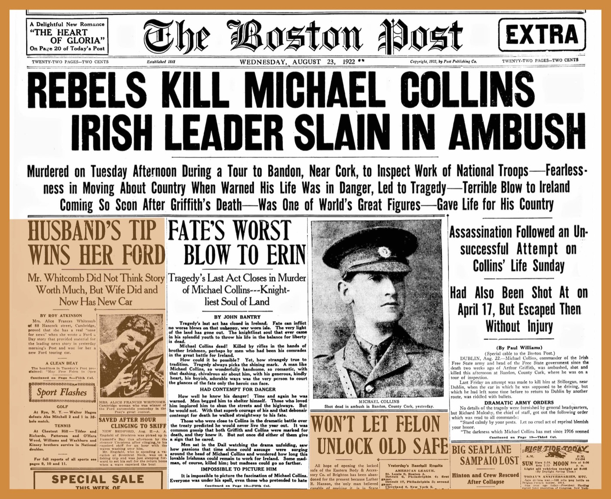

# 신문 147만 장을 자체 서버로 정제한 보스턴 공공도서관

_1795~1930년 지면을 열다섯 단계에 통과시켜 163억 토큰을 뽑은 하버드 로스쿨 도서관 연구팀과의 공동 작업_

## Executive Summary

> [!callout]
> 보스턴 공공도서관과 하버드 로스쿨 도서관 산하 Institutional Data Initiative가 2026년 8월 기술 보고서 한 편을 공개했습니다. 1795년부터 1930년까지 발행된 공개 도메인 신문 스캔 1,473,635장을 열다섯 단계 파이프라인에 통과시켜 구조화 데이터셋으로 만들었고, 파이프라인과 그 안에서 쓴 작은 모델들까지 함께 내놓았습니다.

> 읽을 만한 대목은 규모가 아니라 비용입니다. 논문은 같은 분량의 토큰을 프런티어 모델 API로 만들었다면 25만에서 80만 달러가 들었을 것으로 추산하고, 자기들이 소유한 GPU 노드에서 실제로 돌린 것을 임대 가격으로 환산하면 약 2만 5천 달러라고 적었습니다. 다만 초록의 "워크스테이션급 하드웨어에서 돌아갈 만큼 계산적으로 절약적"이라는 문구는 설계 목표이지 실제 가동 사양이 아닙니다. 그 절약의 대가가 처리량이라는 것도 논문이 같은 자리에 적어 두었습니다.

> 열다섯 단계 가운데 시간을 먹는 것은 OCR 두 단계뿐이고 나머지는 대부분 몇 분 안에 끝납니다. 공정을 잘게 쪼개 놓은 덕분에 어느 단계가 얼마나 걸렸는지, 어디서 판정이 흔들리는지가 전부 숫자로 남았습니다. 소장 기관이 자기 자료의 정제 공정을 쥔다는 것은 그 숫자까지 자기 손에 쥔다는 뜻입니다.

### 주요 수치

앞의 두 숫자는 이 파이프라인이 만들어 낸 것과 그 대가입니다. 뒤의 두 숫자는 그 결과물이 어느 단위로 쪼개져 있고 어디가 아직 약한지를 보여 줍니다.

출처: [arXiv:2608.18972](https://arxiv.org/abs/2608.18972), Institutional Newspapers Pipeline 기술 보고서(2026-08)

<!-- stat-card -->
**163억** — VLM OCR이 뽑아낸 토큰 — o200k_base 기준 16,302,004,429개. 같은 스캔을 Tesseract로 읽으면 146.6억

<!-- stat-card -->
**2.5만 달러** — 논문이 잡은 컴퓨팅 비용 — 약 1,650시간을 임대 환산한 추정치. 프런티어 API였다면 25만~80만 달러

<!-- stat-card -->
**8,314만** — 잘라 낸 크롭 — 기사·광고·사진 단위로 스캔당 평균 56.4개. 모든 후속 처리의 기본 단위

<!-- stat-card -->
**80.8%** — 읽기 순서 위치 정확도 — micro 기준. 스캔별로 따로 재는 macro는 72.1%

## 147만 장에서 163억 토큰

역사 신문은 컴퓨터로 다루기 까다로운 자료입니다. 지면은 빽빽하고 단은 불규칙하며, 장식체 표제와 표가 섞여 있어 범용 도구가 잘 듣지 않습니다. 논문은 이 어려움을 먼저 적어 둔 뒤, 보스턴 공공도서관 소장분 가운데 1795년에서 1930년 사이에 발행된 스캔 1,473,635장을 대상으로 자기들이 만든 파이프라인을 돌린 결과를 내놓았습니다. 저작권이 살아 있을 수 있는 자료는 처음부터 뺐습니다. 1931년 이전 발행분만 넣었고, 그 판단은 보스턴 공공도서관이 가진 이슈 단위 메타데이터로 했습니다.

*▲ 보스턴 포스트 1922년 8월 23일자 1면 — 불규칙한 단과 장식체 표제, 사진, 광고가 한 지면에 섞여 있다 | Source: [Wikimedia Commons (Public Domain)](https://commons.wikimedia.org/wiki/File:19220823_Rebels_Kill_Michael_Collins_-_The_Boston_Post.jpg)*

결과물은 스캔 이미지 더미가 아닙니다. 지면은 8,314만 개의 크롭으로 쪼개졌고, 크롭마다 OCR 텍스트와 좌표, 유형, 언어, 개체명, 주제, 임베딩이 붙었습니다. 크롭은 기사 한 꼭지나 광고 한 칸처럼 끊기지 않고 이어지는 텍스트 또는 시각 요소를 감싼 사각형을 뜻합니다. 표제는 그것이 이끄는 기사와 분리되지 않고, 그림 위주 광고는 대체로 크롭 하나에 통째로 담깁니다.

언어 분포에서 이 컬렉션의 성격이 드러납니다. 언어 코드가 붙은 크롭의 97.61%가 영어이지만 나머지 꼬리가 짧지 않습니다. 이디시어가 98만 3,375개 크롭으로 1.18%, 독일어가 0.56%, 스웨덴어가 0.46%, 프랑스어가 0.09%입니다. 논문은 이것을 보스턴 공공도서관이 소장한 이민자 신문의 흔적이라고 설명합니다. 전체로는 73개 언어 코드가 나왔고, 상위 열 개가 99.97%를 차지합니다.

쪼개 놓으면 세어 볼 수 있는 것이 생깁니다. 최종 분류 기준으로 가장 많은 크롭은 기사가 아니라 광고인데, 토큰의 다수는 기사 쪽이 쥐고 있습니다. 이 두 곡선의 간격은 시대에 따라 벌어집니다. 1860년대까지는 광고가 차지한 지면 면적과 광고가 실어 나른 텍스트 분량이 얼추 비슷했는데, 1870년대부터 면적이 앞서기 시작해 1920년대에는 차이가 약 15퍼센트포인트까지 커집니다. 광고가 점점 시각물로 바뀌어 간 흔적이라고 논문은 봅니다. 스캔 더미 상태로는 던질 수 없던 질문입니다.

만든 쪽은 하버드 로스쿨 도서관의 Institutional Data Initiative이고, 자료와 도메인 지식은 보스턴 공공도서관이 댔습니다. 두 기관은 2025년에도 함께 Institutional Books라는 도서관 장서 코퍼스를 냈고, 그 코퍼스는 이후 다른 연구팀의 언어모델 학습에 실제로 쓰였습니다. 이번 결과물은 [허깅페이스 컬렉션](https://huggingface.co/collections/institutional/institutional-newspapers)과 [깃허브 저장소](https://github.com/institutional/institutional-newspapers-pipeline)에 올라가 있고, 에이전트가 이 데이터를 바로 쓸 수 있도록 Agent Skill 파일까지 함께 배포됐습니다.

## 스캔 한 장이 데이터가 되기까지

파이프라인은 열다섯 단계입니다. 스캔을 가져와 캐싱하고, 크롭으로 자르고, 두 가지 OCR을 각각 돌리고, 유형과 언어를 판정하고, 읽기 순서를 잡고, 개체명과 주제를 붙이고, 마지막에 임베딩을 계산합니다. 아래 도식은 그 열다섯 단계를 성격별로 여섯 덩어리로 묶은 것입니다.
