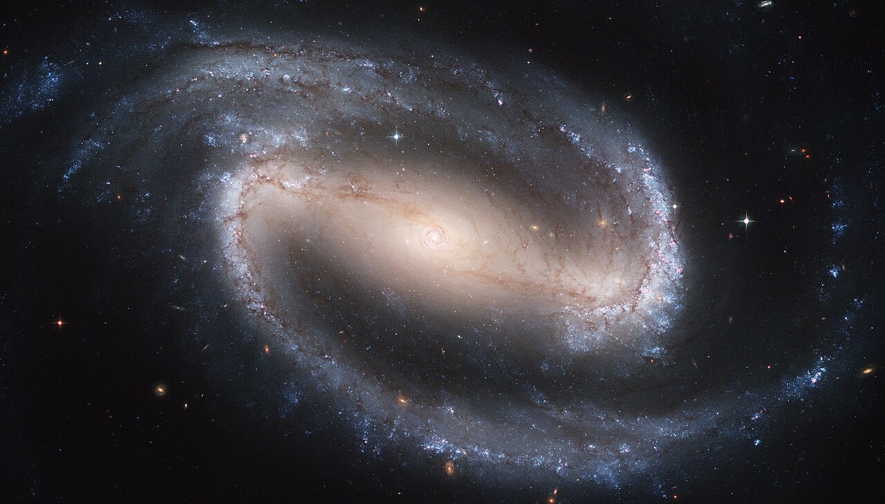

# 은하 막대를 찾는 AI BRAHMa, 정답표만큼만 정확하다

_사람이 만든 정답표 두 개가 공통 은하 586개에서 평균 0.99kpc 어긋나고, BRAHMa의 오차는 1.14kpc다_

## Executive Summary

> [!callout]
> 이 글은 2026년 10월 5일 arXiv에 올라온 논문 한 편을 읽는다. 은하 사진에서 중심을 가로지르는 '막대' 구조를 찾아 길이를 측정하는 공개 도구 BRAHMa를 소개하는 논문이다. 사진 한 장을 수십 밀리초에 처리하니 속도 자체는 놀랄 일이 아니다. 눈여겨볼 곳은 저자들이 그 모델의 정확도를 무엇에 대고 말했는가다.

> 은하 막대 길이에는 모두가 인정하는 정답표가 없다. 사람이 만든 목록이 둘 있는데 서로 어긋난다. 두 목록에 모두 올라 있는 은하 586개에서 평균 0.99kpc 차이가 난다. 저자들은 한쪽을 정답으로 세우는 대신 이 어긋남을 측정의 바닥으로 선언했다. 그 위에 올려놓은 자기 모델의 오차가 1.14kpc다. 간격은 0.15kpc이고, 저자들은 이것을 자원자를 신경망으로 바꾸는 값이라고 적었다.

> 1절부터 3절까지는 논문(arXiv:2610.07410)에 적힌 사실이다. 4절과 5절은 그 사실을 라벨을 다루는 사람의 눈으로 다시 읽은 이 글의 해석이다.

### 주요 수치

이 논문은 숫자 네 개로 좁혀진다. 앞의 둘은 사람 정답표끼리의 차이와 모델의 오차이고, 뒤의 둘은 그 두 수치의 간격, 그리고 한 목록을 만드는 동안 사람끼리 갈린 폭이다.

출처: [Shrivastava, Patra & K (2026), arXiv:2610.07410](https://arxiv.org/abs/2610.07410).

<!-- stat-card -->
**0.99kpc** — 사람이 만든 정답표 둘의 평균 차이 — 두 목록이 공통으로 담은 은하 586개의 막대 길이를 비교한 값

<!-- stat-card -->
**1.14kpc** — BRAHMa의 평균 오차 — Hoyle 목록의 은하 3,150개에 보정식을 적용한 뒤 측정한 값

<!-- stat-card -->
**0.15kpc** — 사람을 모델로 바꾼 값 — 저자들이 자원자를 신경망으로 교체하는 겉보기 값이라 적은 간격

<!-- stat-card -->
**20%** — 자원자끼리 막대 길이가 일치한 범위 — 같은 자원자가 같은 막대를 다시 측정하면 3%로 좁아진다

## 은하를 가로지르는 막대를 왜 측정하나

나선은하 사진을 보면 중심부가 동그란 것도 있고, 가운데에 곧은 막대가 가로질러 있고 나선팔이 그 끝에서 뻗어 나가는 것도 있다. 뒤쪽을 막대나선은하라고 부른다. 우리 은하도 여기에 속한다. 논문은 근적외선으로 보면 가까운 원판은하 셋 중 둘꼴로 막대가 보인다고 적는다. 가시광에서는 넷 중 하나에서 둘 사이로 내려간다. 논문은 이 폭이 벌어지는 까닭을 막대를 무엇이라 정의하느냐와 어느 해상도로 보느냐에 돌린다. 같은 은하를 봐도 정의가 바뀌면 막대가 있다고 셀지 말지가 바뀐다는 뜻이다. 막대라는 구조의 경계가 어디인지부터 합의돼 있지 않다는 첫 신호다.

*▲ 막대나선은하 NGC 1300. 중심을 가로지르는 막대와 그 끝에서 이어지는 나선팔이 보인다. 이 은하는 3절에서 BRAHMa가 재학습 없이 시험해 본 사례로 다시 나온다. Source: [NASA, ESA, Hubble Heritage Team (Wikimedia Commons, Public Domain)](https://commons.wikimedia.org/wiki/File:Hubble2005-01-barred-spiral-galaxy-NGC1300.jpg)*

막대는 사진을 꾸미는 무늬가 아니라 은하를 실제로 바꾸는 장치다. 막대가 만드는 비대칭 중력은 가스에 토크를 걸어 중심으로 밀어 넣고, 거기서 별이 새로 태어난다. 막대는 또 천천히 회전하면서 주변 암흑물질 헤일로와 각운동량을 주고받는다. 그래서 막대의 길이는 그 자체로 결론이 아니라 다른 계산의 입력값이 된다. 막대가 도는 속도를 추정할 때, 은하 중심부의 암흑물질 밀도에 제약을 걸 때 이 숫자가 들어간다. 길이를 1kpc 틀리면 그 뒤에 붙는 계산이 함께 틀어진다. 1kpc는 약 3,260광년이고, 논문이 실은 비교 산점도에서 막대 길이는 대체로 2kpc에서 12kpc 사이에 흩어져 있다.

지금까지 이 측정은 사람 몫이었다. 전문가가 하거나, 시민과학 프로젝트에 모인 자원자가 했다. 문제는 규모다. 가동을 앞둔 서베이들이 내놓을 은하는 수억에서 수십억 개 단위이고, 사람이 하나씩 보는 방식으로는 닿지 않는다. 논문이 적용 대상으로 이름을 올린 것만 해도 DESI 레거시 서베이 전 영역과 유클리드 우주망원경, LSST, 그리고 더 먼 우주를 들여다보는 제임스 웹 영상이다. 최근의 기계학습 접근은 픽셀 단위로 막대 영역을 칠하는 분할 방식을 썼는데, 계산이 무겁고 칠한 영역에서 길이라는 물리량을 뽑아내려면 후처리가 또 필요했다.

BRAHMa는 그 사이를 노린다. 항공사진 벤치마크 DOTA로 사전학습한 YOLO11x-OBB를 가져다 썼고, 파라미터는 5,880만 개다. 일반 탐지 모델이 그리는 수평 박스와 달리 OBB는 박스를 회전시킬 수 있어서, 상자 하나에 막대의 위치와 길이와 기울기가 함께 담긴다. 실제 은하로 들어가기 전에 합성 영상으로 먼저 학습해 방식이 통하는지 확인했고, 그다음 Galaxy Zoo 3D의 막대 마스크에서 뽑은 은하 3,091개를 8대 1대 1로 나눠 썼다. 이때 모델이 본 사진은 DESI 레거시 서베이 영상이다. 뒤에 비교 대상으로 나오는 Hoyle 목록은 SDSS 사진 위에서 만들어졌으니, 모델이 배운 하늘과 채점 기준이 된 하늘은 같은 서베이가 아니다. 은하마다 대비를 따로 조정한 것도 특징이다. 국소 히스토그램 평활화 설정 50가지를 돌려 보고, 막대 구조에 해당하는 m=2 푸리에 진폭이 가장 커지는 설정을 은하별로 골랐다.

탐지 자체는 잘 된다. 검증 세트에서 정밀도 0.972, 재현율 0.984가 나왔고 시험 세트 정밀도는 0.968이다. 속도도 이 작업을 하려는 이유에 맞는다. 저자들은 1024픽셀 이미지 기준 한 장에 약 30밀리초를 잡으면 은하 1억 개를 GPU 한 장으로 다섯 주 정도에 처리할 수 있다고 계산했다.

> [!callout]
> 여기까지는 흔한 이야기다. 사람이 하던 측정을 모델이 훨씬 빨리 한다. 논문이 갈라지는 지점은 그다음에 나온다. 그래서 이 모델이 얼마나 정확한지를, 무엇에 대고 말할 것인가.

## 정답표가 둘이고, 둘이 서로 다르다

막대 길이를 사람이 적어 둔 대규모 목록은 둘이 있고, 만들어진 방식이 서로 다르다. 어떻게 다른지를 먼저 보는 편이 뒤에 나오는 숫자를 읽는 데 도움이 된다.

| 목록 | 사람이 한 일 | 규모 |
| --- | --- | --- |
| Hoyle 외 (2011) | 구글 지도 방식 화면에서 막대를 따라 선을 한 줄 긋는다 | SDSS 저적색이동(z<0.06) 원판은하 3,150개 |
| Galaxy Zoo 3D (2021) | 은하 한 개당 자원자 15명이 막대와 나선팔 둘레에 다각형을 그린다 | MaNGA 표적 은하 29,831개 |

▲ 출처: arXiv:2610.07410이 정리한 두 목록의 제작 방식.

Hoyle 목록은 선 한 줄이 결과물이다. 선의 양끝이 곧 막대의 양끝이다. 이 목록을 만들 때 모든 막대를 적어도 세 번씩 긋게 했고, 덕분에 측정이 얼마나 흔들리는지를 따져 본 수치가 논문에 함께 인용돼 있다. 같은 자원자가 같은 막대를 다시 측정하면 산포가 3%에 그쳤는데, 다른 자원자끼리는 20% 범위 안에서 일치했다. 한 사람 안에서는 손이 매우 일정한데, 사람이 바뀌면 그 일곱 배 가까이 벌어진다는 뜻이다.

Galaxy Zoo 3D는 다른 물건을 남긴다. 자원자 열다섯 명이 각자 다각형을 그리면, 픽셀마다 몇 개의 다각형이 겹쳤는지를 센 숫자가 마스크로 공개된다. 어떤 픽셀은 열다섯 명이 모두 막대라고 봤고, 어떤 픽셀은 네 명만 봤다. 사람들 사이의 의견 분포가 지워지지 않고 그대로 데이터에 남아 있는 셈이다. BRAHMa는 이 마스크를 학습에 쓰려고 겹친 비율 0.4를 경계로 이진화했다. 0.10부터 0.90까지 값을 바꿔 가며 Hoyle 목록과 맞춰 본 끝에 고른 숫자다.

▲ 페블러스 원본 도식(재해석) — 같은 은하의 막대를 측정하는 두 방식의 차이. 이 방식 차이가 두 목록 사이 보정식의 기울기 0.545로 나타난다. Source: arXiv:2610.07410이 설명하는 제작 절차를 토대로 재구성.

두 목록에 함께 들어 있는 은하는 586개다. 같은 은하의 같은 막대를 두 집단이 각자 측정한 결과를 맞대면, 평균절대오차 0.99kpc, 제곱평균제곱근오차 1.40kpc가 나온다. 상관계수는 0.94로 높다. 두 목록은 같은 방향을 보고 있지만 눈금이 어긋나 있다.

어긋남의 성격은 저자들이 두 목록 사이에서 구한 보정식에 드러난다. Hoyle 길이 = 0.545 × GZ3D 길이 + 0.152kpc다. 기울기가 0.545라는 것은 GZ3D 쪽이 같은 막대를 거의 두 배 길게 적었다는 뜻이다. 다각형을 그리면 막대가 흐려지며 사라지는 바깥쪽까지 손이 나가고, 선을 그으면 또렷한 구간에서 멈추기 쉽다. 이 차이는 무작위로 흔들리는 잡음이 아니라 한쪽으로 쏠린 체계적 간격이다.

> [!callout]
> 그래서 0.99kpc는 사람의 실수가 쌓인 양이 아니다. 막대가 어디서 끝나는가를 두 집단이 다르게 정의했고, 그 정의 차이가 킬로파섹 단위로 환산돼 나온 숫자다. 둘 중 어느 쪽이 틀렸다고 말할 근거는 없다.

## 오차 1.14kpc는 바닥에서 0.15kpc 위다

BRAHMa는 Galaxy Zoo 3D 마스크로 배웠다. 그러니 이 모델은 GZ3D의 버릇을 물려받은 채 세상에 나온다. 저자들도 그렇게 적는다. GZ3D로 학습한 어떤 모델이든 두 목록 사이의 0.99kpc 불일치를 물려받으리라고 봐야 한다는 것이다.

평가는 Hoyle 목록의 은하 3,150개 전체에 모델을 돌려서 했다. 여기에도 보정식을 한 번 통과시키는데, 앞 절에서 본 목록끼리의 식과는 다른 식이다. 모델이 내놓은 길이에 적용하는 쪽은 보정 길이 = 0.570 × 모델 길이 + 0.550kpc다. 이 보정을 거친 뒤 평균절대오차 1.14kpc, 제곱평균제곱근오차 1.59kpc, 피어슨 상관 0.91, 스피어만 상관 0.92가 나왔다. 논문 초록은 이 값을 1.1kpc로 반올림해 적고, 본문 표는 1.14kpc로 적는다. 같은 숫자다.

두 수치를 나란히 두면 이 논문의 주장이 한 줄로 보인다. 사람 두 집단이 Hoyle 목록을 기준으로 0.99kpc 어긋나 있고, 모델은 같은 기준에서 1.14kpc 어긋나 있다.

▲ 두 수치는 모두 Hoyle 목록을 기준으로 측정한 평균절대오차다. 출처: arXiv:2610.07410, 표 2.

그 간격 0.15kpc를 저자들은 이렇게 부른다.

추가된 0.15kpc가 자원자를 신경망으로 바꾸는 데 드는 겉보기 값이다.

저자들은 여기에 한마디를 더 보탠다. 이 비교를 지배하는 것은 사람의 두 관례가 서로 어긋난 폭이지 모델이 아니라는 것이다.

모델 평가에서 흔히 쓰는 틀과 비교하면 차이가 분명해진다. 보통은 정답표 하나를 기준선으로 두고 모델이 거기서 얼마나 떨어져 있는지만 적는다. 그러면 1.14kpc는 그냥 1.14kpc다. 크다고 해야 할지 작다고 해야 할지 판단할 좌표가 없다. 저자들은 정답표를 하나 더 가져와 둘 사이의 거리를 먼저 측정했고, 그 거리를 좌표의 원점으로 삼았다. 같은 숫자가 이제 다르게 읽힌다.

### 3.1. 논문이 스스로 적어 둔 한계

이 틀을 그대로 받아들이기 전에 저자들이 직접 밝힌 조건을 함께 봐야 한다. 논문이 적어 둔 한계 가운데 이 글의 두 숫자를 읽는 데 바로 걸리는 것은 다섯이다.

- •이진화 기준 0.4와 보정식을 평가에 쓴 바로 그 은하들에서 골랐다. 자기 데이터로 채점한 셈이라 성능이 다소 좋게 나왔을 수 있다
- •Hoyle 목록의 은하 3,150개 가운데 최대 586개는 GZ3D 은하이기도 하고, 그중 상당수가 학습 쪽에 들어갔을 것으로 본다. 나머지 은하만 따로 평가하지 않았으므로 학습 자료와 겹친 몫이 정확도에 섞여 있을 가능성을 배제하지 못한다
- •학습 표본이 태양질량 10억 배 이상, z<0.15의 MaNGA 표적 은하에 쏠려 있다. 약한 막대, 왜소은하, 많이 기울어진 원판은 충분히 들어 있지 않다
- •내놓는 값은 하늘에 투영된 길이다. 은하가 기울어진 정도를 보정하지 않았으므로 실제 3차원 길이가 아니다
- •클래스 하나에 상자 하나만 내놓는 구조라 이중 막대나 막대 끝의 안사 구조는 다루지 못한다. 앞쪽에 밝은 별이 겹치면 중심을 잘못 잡기도 한다

학습에 쓰지 않은 자료에서도 되는지는 따로 확인했다. 재학습 없이 WISE 중적외선 영상의 NGC 1300과 NGC 3627에 모델을 돌려 보니 상자가 막대를 제대로 따라갔다. 저자들이 이 확인으로 말하려는 바는 분명하다. 모델이 레거시 서베이 사진의 생김새를 외운 것이 아니라 막대라는 모양을 배웠다는 것이다. 다만 이 확인에 저자들이 붙인 평가는 짧고 솔직하다. 은하 두 개는 통계가 아니다.

남은 숙제도 함께 적어 두었다. 근적외선으로 만든 막대 목록과 수치로 맞대 보는 일, 그리고 이 도구가 내놓는 막대 기하를 막대의 회전 속도를 재는 고전적 방법(Tremaine–Weinberg)에 넣는 일이다. 뒤쪽 숙제는 막대 길이를 다른 계산의 입력값으로 쓰는 일이라, 1절에서 본 자리로 돌아간다.

## 은하 밖에서도 라벨은 사람 손에서 나온다

이 구조는 은하에만 있는 것이 아니다. 전문가가 같은 자료를 보고도 다르게 적는 일은 의료 영상에서 잘 기록돼 있다. 2022년 학술지 Diagnostics에 실린 연구에서 경력 1년부터 16년까지의 방사선과 의사 여섯 명이 흉부 X선 100장을 각자 두 차례 판독했다. 소견 항목별 일치도를 랜돌프 카파로 재니 0.40에서 0.99 사이에 퍼졌다. 가장 낮은 항목은 무기폐로 0.40이었다. 같은 사진, 같은 항목, 훈련받은 전문가 여섯 명인데도 그렇다.

그런데 보통의 데이터 작업은 이 지점을 다르게 처리한다. 판독 소견이든 제조 라인의 불량 사진이든 주행 영상 속 물체 상자든, 여러 사람이 라벨을 붙이고 나면 다수결이나 중재로 하나를 고르고, 그 하나를 정답으로 확정한 뒤 모델 평가를 시작한다. 확정하는 순간 사람들이 갈렸다는 사실은 데이터에서 사라진다. 모델 점수는 소수점 셋째 자리까지 관리되는데, 그 점수를 떠받치는 정답표가 얼마나 흔들리는지는 아무 데도 적히지 않는 상태가 된다.

▲ 페블러스 원본 도식 — 여러 라벨러의 경계가 다수결로 하나의 정답표로 확정되는 순간, 그들이 서로 갈렸다는 사실 자체가 데이터에서 사라진다.

BRAHMa 논문이 한 일은 그 반대에 가깝다. 두 목록을 하나로 합치거나 한쪽을 버리지 않고 끝까지 둘 다 살려 뒀고, 둘의 거리를 숫자로 적었다. 덕분에 모델 오차를 적을 때 비교 대상이 생겼다. Galaxy Zoo 3D가 사람들의 의견 분포를 다수결로 지우지 않고 픽셀별 중첩 수로 공개해 둔 것도 같은 성격의 선택이다.

> [!callout]
> 정답표의 불일치를 측정해 두면 오차의 바닥이 곧 모델 점수의 천장이 된다. 사람들이 서로 0.99kpc 어긋나는 자리에서 오차 0.1kpc를 주장하는 모델이 나왔다면, 그 모델은 더 정확해진 것이 아니라 한쪽 집단의 손버릇을 외운 것일 가능성이 높다. 천장이 없으면 그 구분이 불가능하다.

## 페블러스가 이 논문을 주목하는 이유

모델 정확도 99%라는 보고를 받았다고 하자. 이 숫자는 정답표를 분모로 삼아 계산된다. 그러므로 정답표가 얼마나 단단한지를 모르면 99%가 무엇을 뜻하는지도 모른다. 라벨러 둘이 같은 데이터에서 90%만 같은 답을 내는 작업이라면, 99%를 주장하는 모델은 사람보다 잘하게 된 것이 아니라 측정 자체가 불가능한 자리를 가리키고 있을 수 있다.

데이터를 다루는 팀이라면 모델 성능을 올리는 작업에 들어가기 전에 세 가지를 확인해 볼 만하다.

- •같은 데이터를 두 사람에게 따로 맡겼을 때 결과가 얼마나 갈리는지를 숫자로 말할 수 있는가. 없다면 모델 점수와 비교할 기준선이 아직 없는 것이다
- •그 불일치가 실수인가 정의 차이인가. 한쪽이 늘 길게 또는 늘 넓게 잡는다면 사람을 더 훈련시킬 문제가 아니라 지침을 고칠 문제다
- •모델 오차와 사람 사이의 불일치를 같은 단위로 나란히 적은 보고서가 있는가. 두 수치가 함께 있어야 모델이 바닥에 닿았는지 아직 멀었는지 말할 수 있다

페블러스가 AI-Ready Data를 말할 때 되풀이하는 전제가 있다. 데이터의 품질은 데이터만 들여다봐서 알 수 없고, 그 데이터가 어떻게 만들어졌는지가 함께 기록돼야 한다. 라벨도 마찬가지다. 누가 어떤 지침으로 붙였고 서로 얼마나 갈렸는지가 남아 있어야, 그 라벨 위에서 계산한 정확도가 비로소 의미를 가진다. 은하 막대를 다루는 논문 한 편이 이 전제를 천문학 쪽에서 다시 보여 준 셈이다.

여기까지 읽어 주셔서 감사하다. 이 글의 수치와 인용문은 모두 [arXiv:2610.07410](https://arxiv.org/abs/2610.07410) 원문에서 확인했고, 도구는 논문이 공개한 웹 인터페이스로 직접 써 볼 수 있다. 여러분의 팀은 정답표의 일치도를 어떤 숫자로 적어 두는지 나눠 주시면 좋겠다.

## 참고문헌

- 1.Shrivastava, R., Patra, N. N., K, Keerthi. (2026). "[BRAHMa: Bar Recognition And Hatching using Machine learning](https://arxiv.org/abs/2610.07410)." arXiv:2610.07410.
- 2.Hoyle, B., Masters, K. L., Nichol, R. C. 외. (2011). "[Galaxy Zoo: bar lengths in local disc galaxies](https://arxiv.org/abs/1104.5394)." Monthly Notices of the Royal Astronomical Society, 415, 3627-3640.
- 3.Masters, K. L., Krawczyk, C., Shamsi, S. 외. (2021). "[Galaxy Zoo: 3D -- Crowd-sourced Bar, Spiral and Foreground Star Masks for MaNGA Target Galaxies](https://arxiv.org/abs/2108.02065)." Monthly Notices of the Royal Astronomical Society, 507(3), 3923-3935.
- 4.Li, D., Pehrson, L. M., Tøttrup, L. 외. (2022). "[Inter- and Intra-Observer Agreement When Using a Diagnostic Labeling Scheme for Annotating Findings on Chest X-rays](https://pmc.ncbi.nlm.nih.gov/articles/PMC9776917/)." Diagnostics, 12(12), 3112.
