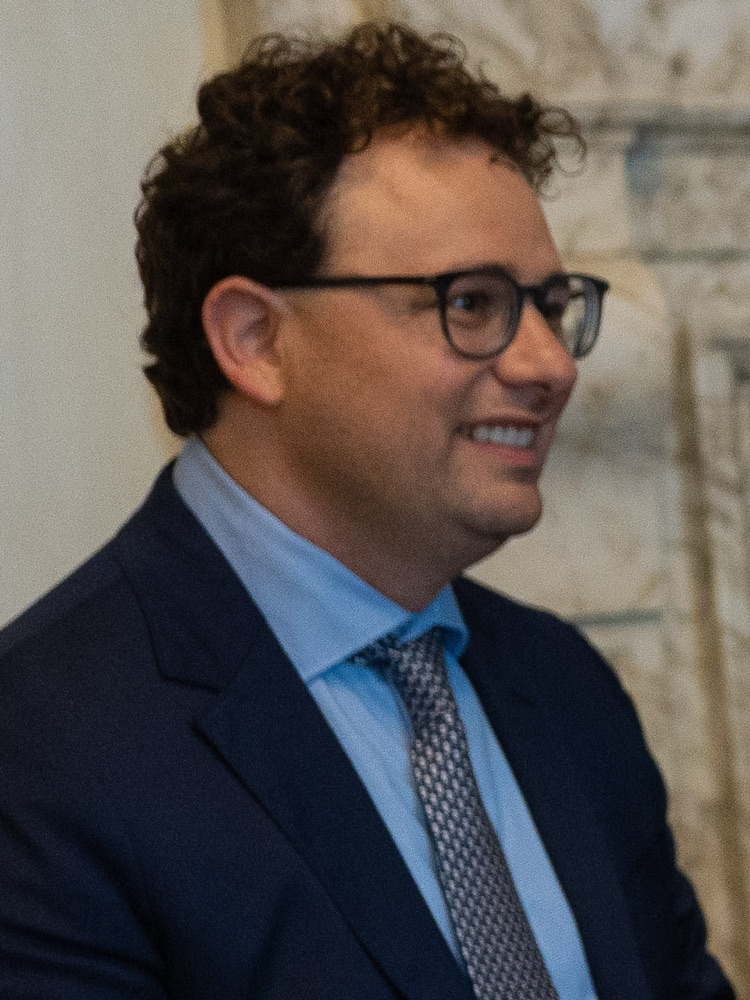

# California Decides Who Can Audit AI, but Auditors Decide the Test

_Newsom signed SB 813 and AB 1405 on September 9, the first state framework in which auditor applicants propose their own benchmarks and audits stay voluntary_

## Executive Summary

> [!callout]
> On September 9, Governor Gavin Newsom of California signed SB 813 and AB 1405. Neither law tells anyone to audit AI. Both give the state the job of deciding who is qualified to audit it. The governor's office called the framework a first in the nation. This article puts what that qualification regime settled side by side with the places it left blank.

> Those gaps are not hard to find. SB 813 asks an applicant that wants to become an independent verification organization to write down the benchmarks, metrics and methodologies it intends to use. Whether to be audited at all remains the company's call. Clauses on financial independence went into both laws, yet neither of them blocks the basic arrangement in which the audited party pays. AB 1405 goes as far as to state that reasonable compensation for performing an audit shall not, by itself, constitute a prohibited interest. The METR report published in late August shows how far those clauses reach. METR took no payment from OpenAI, but the roughly $400,000 in analysis credits it spent over six days came free from OpenAI, and the model it ran the analysis on was OpenAI's own, one of the models implicated in that incident.

> The state has until January 1, 2028 to write the designation criteria, and from January 1, 2029 no one may perform a covered audit without registering. Until then the yardstick stays empty. Two things are already fixed in the meantime. One is the records an auditor must keep for ten years. The other is the list of items an audit report must contain, and that list includes a line asking the auditor to write down what the auditor could not see.

### Key Figures

Sources: [SB 813](https://leginfo.legislature.ca.gov/faces/billTextClient.xhtml?bill_id=202520260SB813) and [AB 1405](https://leginfo.legislature.ca.gov/faces/billTextClient.xhtml?bill_id=202520260AB1405) as chaptered (signed 2026-09-09); METR and Redwood Research, [independent investigation of the Hugging Face incident](https://metr.org/blog/2026-08-26-openai-hugging-face-incident-investigation/) (2026-08-26)

<!-- stat-card -->
**2028** — Deadline for the state to write designation criteria — January 1, 2028. Until then, applicants propose their own yardstick

<!-- stat-card -->
**2029** — Year an AI audit becomes impossible without registration — January 1, 2029. Before that date the state registry does not exist at all

<!-- stat-card -->
**10 years** — Minimum period an auditor must retain records — It covers material handed to the auditee and documents behind the results, and the law names no document types

<!-- stat-card -->
**$400K** — Analysis credits the METR investigation spent over six days — METR took no fee, but the company under investigation supplied the credits at no charge

## California Registers AI Auditors the Way It Registers Accountants

When the word audit comes up in AI regulation news, the question at issue is usually who should have to be audited. That was the case in July, when Illinois required frontier AI developers to undergo an annual third-party audit under SB 315, and it was the side the Pebblous blog examined in [its piece on that law](/blog/illinois-sb315-frontier-ai-audit/en/). The two laws California signed on September 9 define the opposite side. They regulate the auditors.

SB 813 creates a process by which a state agency designates an "independent verification organization," or IVO. The statutory definition reads as follows. An IVO is an AI auditor designated by the agency as having demonstrated expertise in assessing the risks posed by an AI system or model and in identifying the metrics and methodologies that form the basis for that assessment. The agency has until January 1, 2028 to develop the designation criteria. AB 1405 covers a different layer. It requires any person, partnership or corporation seeking to conduct audits of compliance with state law to enter a state registry, and from January 1, 2029 it bars anyone unregistered from conducting such an audit.

That framework comes straight out of financial auditing. The Government Operations Agency opens a registry website and issues each auditor a unique registration number, which must be displayed conspicuously on advertising materials. A fund for registration fees is created in the State Treasury, and certified public accountants and accounting firms already licensed in California are deemed to satisfy the reporting and independence requirements. That deeming is not free. It holds only where the auditor complies with the California Accountancy Act, the AICPA Code of Professional Conduct and the attestation standards that body promulgates. Of the several lanes these laws open, the accountancy lane is the only one whose yardstick is already written down. Whistleblower protection went in as well. An auditor may not prevent an employee from reporting a violation, nor retaliate for such a report.

Senator Jerry McNerney, who authored SB 813, said that "AI has the potential to improve our lives, but without effective guardrails, it poses significant risks." Assemblymember Rebecca Bauer-Kahan, who authored AB 1405, said that industry cannot be expected "to simply grade its own homework" and that third-party auditors are essential to ensuring AI is safe for communities and critical infrastructure. Newsom's own words pointed at Washington. The governor wrote that the scale and potential consequences of this technology demand sustained action from every level of government, and that the federal government must step forward with robust, national regulations that match the urgency of this moment. The Pebblous blog [covered the independent verification idea](/blog/gaaia-ivo-ai-audit-license/en/) under discussion at the federal level back in June, when it was still a draft that had not passed. The version that actually got signed arrived first at the state level.

*▲ Governor Gavin Newsom of California, who signed SB 813 and AB 1405 on September 9 | Source: [Office of the Governor of California, Wikimedia Commons (Public Domain)](https://commons.wikimedia.org/wiki/File:Governor_of_California_Gavin_Newsom,_2026_Official_Portrait_2_(cropped).jpg)*

## The Yardstick Itself Is Still Blank

SB 813 asks an applicant for designation to submit several things, and one of them is a list of its own instruments. The statute has the applicant write into the application "the benchmarks, technologies, metrics, and methodologies the IVO proposes using to conduct the IVO's work." The party doing the measuring writes out its own ruler. The criteria the state must produce by 2028 do not start from nothing either. The statute tells the agency to identify and consider standards, frameworks, guidelines and best practices already developed by government agencies, national and international auditing and assurance organizations, AI auditors, companies that develop or deploy AI systems, and independent experts. But that work has barely begun.

Neither law ever names the material an auditor would actually open. Where the training data came from, who labeled it and when, what the evaluation runs recorded. The ten-year retention AB 1405 requires is written in general terms too, covering any information provided to an auditee and any documentation necessary to demonstrate the basis of the results. Retention therefore follows the material the auditor chose to open, and the reach of that choice is drawn by the methodology the auditor wrote into its application.

The contents of the audit report, by contrast, are spelled out line by line. AB 1405 fixes six items for an audit report, and two of them stand out. The auditor must produce the results together with any documentation necessary to demonstrate the basis of those results, and must describe the limitations of the audit. Those limitations include "any matters within the scope of the audit that were not assessed and any material gaps in the evidence, information, systems, or access available to the AI auditor." The law left the question of what to examine open, and then required the auditor to record what went unexamined.

The methodology an auditor proposes does not stop at the application. SB 813 requires a designated IVO to report annually to the agency and the Legislature, with summaries of its standards and methodologies and a description of any changes to its governance policies or sources of funding relevant to its conflicts of interest or independence. AB 1405 takes a standard operating procedure with the registration application, and the applicant must state which standards it applies, including those published by the International Organization for Standardization or the National Institute of Standards and Technology, along with the basis for any claims it makes about the accuracy, reliability or validity of its protocols. The state publishes that material in the registry. Both laws do allow redactions for reasons such as trade secrets, and SB 813 adds that the redacting party must describe the character and justification of the redaction and retain the unredacted version for five years.

> [!callout]
> The state runs the review, and the party that passes it brings the yardstick. If each auditor may propose a different methodology, then which auditors a company can call on comes down to which records that company can produce. The law settled the person. The material is the variable left over.

## An Investigation That Took No Fee Still Had a Gap

Financial independence went into each of the two laws in one passage. SB 813 handles the terms of the money.

"An IVO may accept payment from a party being assessed at reasonable market rates but shall not accept terms which condition any payment or the amount of any payment on the results of their assessment."

California SB 813, Government Code section 8898.1(c)(2)

AB 1405 handles the terms of the relationship. A registered auditor must maintain independence from the auditee and may not conduct an audit if it holds a financial, business, employment or other interest or relationship that would reasonably be expected to impair its independence or objectivity. The same subparagraph then carves one thing out in its very next sentence. "Reasonable compensation received for performing a covered AI audit shall not, by itself, constitute an interest prohibited by this subparagraph." The clauses that follow bar three more things: auditing subject matter the auditor materially designed or built for the auditee, negotiating employment with the auditee while the audit is under way, and assigning anyone who held material responsibility for that subject matter at the auditee during the preceding twelve months. It is a dense list. A recent case already shows where the list runs out.

The case is the report METR and Redwood Research published on August 26 after investigating OpenAI's Hugging Face breach. METR wrote in the report that, per its standard policy, it did not take payment from OpenAI for the independent assessment. That much is stricter than either clause above asks for. The same report also records this. OpenAI provided a dump of roughly 1.2 million entries from the main message board and a dataset of about 1,300 transcripts, along with free API credits for GPT-5.6 Sol for the analysis. The team estimates it spent roughly $400,000 in those credits over the six days of the investigation. The report sets down the limits of its access as well. The investigators could not query the model at the center of the incident, and they could not directly access relevant data from OpenAI infrastructure, so they requested additional datasets as they went. On the second and third periods on premises, OpenAI raised the rate limits at their request.

The model used for the analysis was OpenAI's own, the very one that had joined out-of-scope collaboration in that incident. The report lists three limits to the approach. Errors the analysis agents made may not all have been caught. The write-ups may have taken on the perspective of the agents in the transcripts and turned overly charitable. And the setup was not robust to the possibility that those agents were deceptive in the analysis itself. Ryan Greenblatt, who did the transcript analysis, semi-jokingly called the effort a "slop-vestigation" on X, because the work leaned so heavily on AI to establish what had happened.

In this case the channel through which independence bent was not the fee. It was the instrument. The sequence of events, including who set the scope of the investigation, is laid out in [an earlier piece](/blog/openai-agent-incident-investigation-scope/en/). The sentences in which these two laws deal with independence have a direction. SB 813 covers compensation tied to results and, alongside it, operational or management dependence on the party being assessed. AB 1405 covers the case where an auditor audits something it built with its own hands. The case where the investigative tool is the product of the investigated party runs the other way. The auditor's own product did not become the object of the audit; the auditee's product became the means of the audit. No sentence prohibits this direction. Since SB 813 does require an IVO to report annually on changes in funding sources relevant to independence, one can say it handles this through disclosure rather than prohibition. And the access gaps METR wrote down for itself are exactly the item AB 1405 will require in every audit report from 2029.

## The Law Requires No Audit, and Courts May Only Take One Into Account

SB 813 gathers the things it does not do into one section. Among them is the voluntariness of being audited. The chapter does not require any person, partnership or corporation that develops, deploys or operates an AI system or model to engage an IVO or to undergo a covered AI audit as a condition of doing that business in California. Nor does liability arise from a failure to comply with a standard alone. When the state publishes the designation requirements, it must post a statement prominently on its website disclosing that the publication is not a recommendation or endorsement by the state of any AI system or model.

So what does a company that gets audited receive? The statute answers in a single sentence. In an action alleging that a defendant's development, modification or use of an AI system or model caused harm, the fact that an audit has been performed in accordance with a standard identified under the chapter is "relevant to, but not conclusive of, the action." Not immunity. Evidentiary weight.

This passage is worth reading against a criticism published at the end of July. Gabriel Weil, a professor at the University of Houston Law Center, argued in AI Frontiers on July 29 that the IVO model reproduces the credit-rating agencies of the years before the 2008 financial crisis. Issuers chose and paid the raters, so competing raters came under pressure to grade gently. Weil proposed mandatory liability insurance instead, on the logic that an insurer has its own capital riding on the assessment. Price the risk too low and the insurer pays out claims; price it too high and the insurer loses customers.

But the text Weil was reading differs from the version now signed. The provision Weil criticized would have let developers earn a shield from tort liability by meeting standards set by a private organization accredited by the state attorney general, and Weil wrote that the bill had failed that session. The legislative record says otherwise. On July 29, the day the essay went up, SB 813 was pending in the Assembly Appropriations Committee, and after three rounds of amendment in August it passed the Assembly on August 30. There is no liability shield in the signed text. In its place sits "relevant to, but not conclusive of." As it happens, that construction resembles the approach Weil described in the same essay as Connecticut's, under which certification would help companies in court without entirely shielding them from liability. California moved toward the model Weil held up, not the one Weil struck at.

Half the criticism stands all the same. The party that chooses the auditor and pays market rates is still the company being audited. The other half aims squarely at the signed text. Weil argued that the proponents' own fix, having a government entity license the IVOs and revoke the licenses of any that grade too easily, reintroduces the problem the IVO model was meant to solve in the first place. Policing a market of verifiers well enough to keep it honest takes a public body with the expertise to second-guess technical judgments and the independence to withstand pressure from powerful firms, and if the government could reliably field such a body, much of the reason to outsource verification at all would fall away. California built exactly that structure of licensing and revocation. SB 813 lists six grounds to consider when suspending or terminating a designation. Failures to adhere to appropriate standards, material misrepresentations, conflicts of interest that impair independence, conduct that calls integrity or competence into question, lapses in cybersecurity, and failure to maintain adequate documentation. AB 1405 lets the agency investigate a report, remove the auditor from the registry, or refer the matter to the Attorney General.

## Whether the Evaluator Stands Outside or Sits Inside, the Records Come First

Six days after the signing, on September 15, OpenAI's global policy chief Chris Lehane confirmed that the company had been working with Anthropic and Google DeepMind on AI safety for weeks. The trigger was an essay Dario Amodei published on September 12, calling on the industry to slow the pace of frontier AI together and avoid catastrophic risks. Sam Altman voiced agreement and said OpenAI would join Anthropic in embedding third-party evaluators into the company to monitor for safety. Along with that came the observation that such coordination could run afoul of antitrust law if it were found to suppress competition. Amodei's essay proposed a narrow government waiver, while Lehane said the firms do not need one. Next to an industry that is wary about gathering among itself, California wrote the opposite into law. The working groups the state convenes to develop the designation criteria must include engineers from AI companies that are competitors, and AI safety experts.

*▲ Anthropic CEO Dario Amodei. His September 12 essay preceded the confirmed safety talks with OpenAI and Google DeepMind | Source: [Wikimedia Commons (CC BY 2.0)](https://commons.wikimedia.org/wiki/File:Dario_Amodei_in_2023_(cropped).jpg)*

At the same meeting, Lehane also said OpenAI supports a provision in the federal FRONTIER Act that would force top frontier labs to allow "independent verification organizations" into their companies. That is the name California has just defined. So the two directions only look opposed at first glance. One has the state vet an auditor's qualifications and station the auditor outside, while the other brings the evaluator inside the company, and the first tries to guarantee independence through status where the second tries to guarantee it through access. Yet the two strands are using the same words. The state decides who may be called an IVO, and the federal bill would decide who must let an IVO in. The two models ask the same thing of a company. Material an outsider can open and judge. Resident evaluator or registered auditor carrying a number, it makes no difference. If no record survives of where the training data came from, of when and through whose hands the labels passed, of which evaluations ran under which conditions, there is nothing to look at.

California's yardstick does not take shape until 2028, and the registry opens in 2029. However the audit standards get settled in those two-odd years, one thing is unaffected. The records piling up right now. The same records are the ones that cannot be created retroactively once that time arrives. The question a data team can put to itself today is simpler than the statute. Would the provenance of our data, the history of our labels and our evaluation records hold up if a third party opened them as they are?

Thank you for reading.

## References

### Official Documents & Legislation

- 1.Office of Governor Gavin Newsom. (2026). "[Governor Newsom Signs First-in-the-Nation AI Safeguards to Protect Californians, Calls on the Federal Government to Do Its Part](https://www.gov.ca.gov/2026/09/09/governor-newsom-signs-first-in-the-nation-ai-safeguards-to-protect-californians-calls-on-the-federal-government-to-do-its-part/)." California Governor's Office, September 9, 2026.
- 2.McNerney, J. (2026). "[Senate Bill No. 813, Independent Verification Organizations](https://leginfo.legislature.ca.gov/faces/billTextClient.xhtml?bill_id=202520260SB813)." Chapter 179, Statutes of 2026, California Government Code §8898 et seq.
- 3.Bauer-Kahan, R. (2026). "[Assembly Bill No. 1405, Artificial Intelligence: Auditors: Registration](https://leginfo.legislature.ca.gov/faces/billTextClient.xhtml?bill_id=202520260AB1405)." Chapter 178, Statutes of 2026, California Government Code §11549.80 et seq.

### Investigation & Commentary

- 4.METR, Redwood Research. (2026). "[Independent Investigation of the OpenAI Hugging Face Incident](https://metr.org/blog/2026-08-26-openai-hugging-face-incident-investigation/)." METR Blog, August 26, 2026.
- 5.Weil, G. (2026). "[Don't Let AI Developers Hire Their Own Referees](https://ai-frontiers.org/articles/dont-let-ai-developers-hire-their-own-referees)." AI Frontiers, July 29, 2026.

### Industry Press

- 6.Bellan, R. (2026). "[OpenAI, Anthropic, Google Have Been in Talks on AI Safety for Weeks](https://techcrunch.com/2026/09/15/openai-anthropic-google-have-been-in-talks-on-ai-safety-for-weeks/)." TechCrunch, September 15, 2026.
