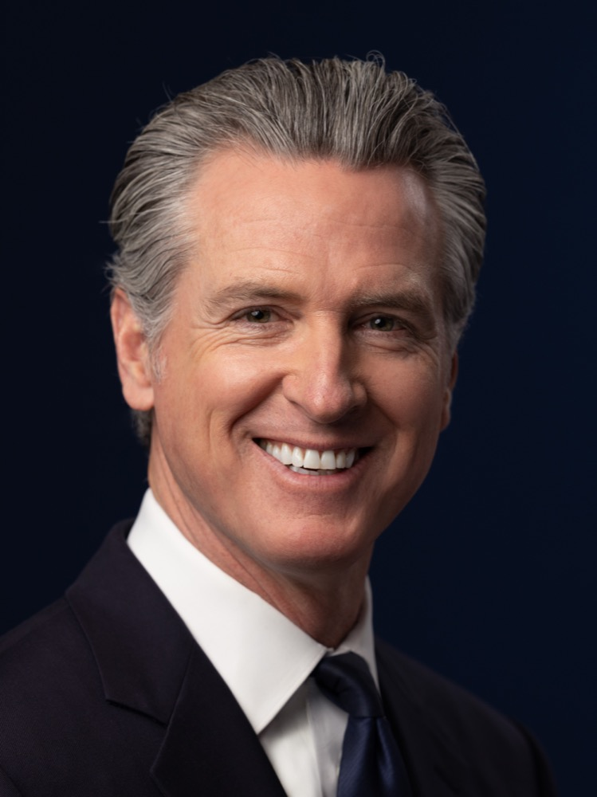

# AI 감사인 자격은 주정부가, 잣대는 감사인이 고른다

_뉴섬 주지사가 9월 9일 서명한 SB 813·AB 1405, 평가 방법론은 감사인이 제안하고 수검 여부는 기업이 정한다_

## Executive Summary

> [!callout]
> 9월 9일 개빈 뉴섬 캘리포니아 주지사가 SB 813과 AB 1405에 서명했다. 두 법은 AI를 감사하라고 요구하지 않는다. AI를 감사할 자격이 누구에게 있는지를 주정부가 정하게 한다. 주지사실은 이를 전국에서 처음이라고 밝혔다. 이 글은 그 자격 제도가 정한 것과 비워 둔 것을 나란히 본다.

> 빈자리부터 뚜렷하다. SB 813은 독립 검증 기관이 되겠다는 신청자에게 자신이 쓸 벤치마크와 지표, 방법론을 직접 적어 내게 한다. 감사를 받을지 말지도 기업이 정한다. 재정적 독립 조항은 두 법에 나뉘어 들어갔지만, 감사 대상이 비용을 대는 구조 자체는 두 법 모두 막지 않는다. AB 1405는 감사의 대가로 받은 합리적인 보수가 그 자체만으로는 금지된 이해관계가 아니라고 못 박기까지 했다. 8월 말 공개된 METR 보고서를 겹쳐 보면 그 조항들이 어디까지 미치는지 드러난다. METR는 오픈AI(OpenAI)에게서 보수를 받지 않았지만, 엿새 동안 쓴 약 40만 달러어치 분석 크레딧은 오픈AI가 무상으로 댄 것이었고 분석에 쓴 모델도 그 사건에 연루된 오픈AI 자체 모델이었다.

> 주정부가 지정 기준을 만들 기한은 2028년 1월 1일, 등록 없이 감사를 수행할 수 없게 되는 시점은 2029년 1월 1일이다. 그때까지 잣대는 비어 있다. 그 사이에도 확정된 것이 둘 있다. 감사인이 10년 동안 보관해야 하는 기록, 그리고 감사 보고서에 반드시 담아야 하는 항목이다. 그 목록에는 감사인이 보지 못한 것을 적으라는 항목이 들어 있다.

### 주요 수치

출처: [SB 813](https://leginfo.legislature.ca.gov/faces/billTextClient.xhtml?bill_id=202520260SB813)·[AB 1405](https://leginfo.legislature.ca.gov/faces/billTextClient.xhtml?bill_id=202520260AB1405) 조문(2026-09-09 서명), METR·레드우드 [허깅페이스 사건 독립 조사 보고서](https://metr.org/blog/2026-08-26-openai-hugging-face-incident-investigation/)(2026-08-26)

<!-- stat-card -->
**2028년** — 주정부가 지정 기준을 만들 기한 — 1월 1일까지다. 그때까지는 신청자가 자기 잣대를 제안한다

<!-- stat-card -->
**2029년** — 등록 없이 AI 감사를 할 수 없게 되는 해 — 1월 1일부터다. 그 전까지 주 등록부 자체가 존재하지 않는다

<!-- stat-card -->
**10년** — 감사인이 기록을 보관해야 하는 최소 기간 — 피감사자가 건넨 자료와 결과의 근거 문서가 대상이고, 문서 종류는 적혀 있지 않다

<!-- stat-card -->
**40만 달러** — METR 조사가 엿새 동안 쓴 분석 크레딧 — 보수는 받지 않았지만 크레딧은 조사 대상 회사가 무상으로 댔다

## 캘리포니아는 AI 감사인을 회계사처럼 등록부에 올린다

AI 규제 뉴스에서 감사라는 말이 나오면 보통 "누구에게 감사를 받게 할 것인가"가 쟁점이었다. 올해 7월 일리노이가 SB 315로 프런티어 AI 개발사에 연례 제3자 감사를 의무화했을 때도 그랬고, 페블러스 블로그가 [그 법을 다룬 글](/blog/illinois-sb315-frontier-ai-audit/ko/)에서 본 것도 감사를 받는 쪽이었다. 캘리포니아가 9월 9일에 서명한 두 법은 반대쪽을 규정한다. 감사하는 쪽이다.

SB 813은 주정부 기관이 "독립 검증 기관(IVO)"을 지정하는 절차를 만든다. 조문의 정의는 이렇다. AI 시스템이나 모델이 지닌 위험을 평가하고 그 평가의 근거가 되는 지표와 방법론을 제시할 전문성을 입증해 기관으로부터 지정받은 AI 감사인이다. 지정 기준은 주정부 기관이 2028년 1월 1일까지 만든다. AB 1405는 다른 층을 맡는다. 주법 준수를 확인하는 감사를 수행하려는 개인·조합·법인을 주 등록부에 올리게 하고, 2029년 1월 1일부터는 등록 없이 그 감사를 수행할 수 없게 한다.

그 틀은 회계 감사에서 그대로 가져왔다. 행정기관(Government Operations Agency)이 등록 웹사이트를 열고 감사인마다 고유 등록번호를 발급한다. 그 번호는 광고물에 눈에 띄게 표시해야 한다. 등록 수수료를 담을 기금이 주 국고에 신설되고, 이미 캘리포니아 회계사 면허를 가진 공인회계사와 회계법인은 보고·독립성 요건을 충족한 것으로 간주된다. 그 간주는 공짜가 아니다. 캘리포니아 회계사법과 미국공인회계사회의 직업윤리강령, 그 단체가 정한 인증 업무 기준을 지켜야 인정된다. 이 법이 낸 여러 갈래 가운데 잣대가 이미 적혀 있는 쪽은 회계사 갈래뿐이다. 내부고발자 보호 조항도 들어갔다. 감사인은 직원이 법 위반을 신고하는 것을 막거나 그 이유로 보복할 수 없다.

SB 813을 발의한 제리 맥너니 상원의원은 "AI는 우리 삶을 개선할 잠재력이 있지만 효과적인 안전장치가 없으면 상당한 위험을 낳는다"고 말했다. AB 1405를 낸 리베카 바우어카한 의원은 업계가 자기 숙제를 스스로 채점하도록 맡겨 둘 수는 없다고 했다. 뉴섬 주지사 본인의 말은 연방을 향했다. 그는 이 기술의 규모와 파장이 모든 층위의 정부에 지속적인 행동을 요구한다며, 연방정부가 이 순간의 시급성에 맞는 국가 차원의 규제로 나서야 한다고 적었다. 연방 차원에서 논의되던 독립 검증 기관 구상을 페블러스 블로그가 [6월에 다룬 적](/blog/gaaia-ivo-ai-audit-license/ko/)이 있는데, 그때는 통과되지 않은 초안이었다. 실제로 서명된 판본은 주 단위에서 먼저 나왔다.

*▲ 개빈 뉴섬 캘리포니아 주지사. 9월 9일 SB 813과 AB 1405에 서명했다 | Source: [Office of the Governor of California, Wikimedia Commons (Public Domain)](https://commons.wikimedia.org/wiki/File:Governor_of_California_Gavin_Newsom,_2026_Official_Portrait_2_(cropped).jpg)*

## 무엇을 자로 삼을지는 비어 있다

SB 813은 지정을 신청하는 기관에게 여러 자료를 요구하는데, 그중 하나가 자기가 쓸 도구 목록이다. 조문은 "IVO가 업무 수행에 사용하겠다고 제안하는 벤치마크, 기술, 지표, 방법론"을 신청서에 적게 한다. 재는 쪽이 잣대를 스스로 써 내는 셈이다. 주정부가 2028년까지 만들 지정 기준도 백지에서 출발하지는 않는다. 조문은 정부기관, 국내외 감사·보증 기구, AI 감사인, AI 개발·배포사, 독립 전문가가 이미 만들어 둔 표준과 프레임워크를 참고하라고 일러 둔다. 다만 그 작업은 아직 시작 단계다.

두 법을 끝까지 읽어도 나오지 않는 말이 있다. 학습 데이터의 출처, 라벨 작업의 이력, 평가 실행 기록처럼 감사인이 실제로 열어 볼 자료의 종류다. AB 1405가 10년 보관을 요구하는 대상도 "피감사자에게 제공한 정보"와 "감사 결과를 입증하는 문서"라는 일반 문구로 적혀 있다. 보관 대상은 결국 감사인이 무엇을 열어 봤느냐에 따라 정해지고, 그 범위는 신청서에 적어 낸 방법론이 가른다.

감사인이 보고서에 담을 내용은 반대로 또박또박 정해 두었다. AB 1405는 감사 보고서에 담을 항목을 여섯 가지로 못 박는데, 그중 둘이 눈에 띈다. 결과와 함께 그 결과의 근거를 입증하는 데 필요한 문서를 낼 것, 그리고 감사의 한계를 적을 것이다. 한계에는 감사 범위 안에 있으면서도 평가하지 못한 사항, 그리고 감사인이 확보할 수 있었던 증거와 정보, 시스템, 접근권의 중대한 공백이 포함된다. 무엇을 봐야 하는지는 비어 있지만 무엇을 못 봤는지는 적어야 한다.

감사인이 제안한 방법론은 신청서에서 끝나지 않는다. SB 813은 지정된 IVO에게 자기 표준과 방법론의 요약, 그리고 이해상충이나 독립성과 관련된 지배구조와 자금 출처의 변화를 해마다 주정부와 주의회에 보고하게 한다. AB 1405는 등록 신청서에 표준 운영 절차를 받는데, 국제표준화기구나 미국 국립표준기술연구소가 낸 표준 가운데 어느 것을 적용하는지, 자기 절차가 정확하다는 근거는 무엇인지를 밝혀야 한다. 주정부는 그 내용을 등록부에 공개한다. 물론 두 법 모두 영업비밀 같은 사유로 가리는 것을 허용하고, SB 813은 가린 쪽에 가림의 사유를 밝히고 원본을 5년간 보관하라고 덧붙였다.

> [!callout]
> 심사는 주정부가 하고, 무엇으로 잴지는 심사를 통과한 쪽이 들고 온다. 감사인마다 다른 방법론을 제안할 수 있다면 기업이 어느 감사인을 부를 수 있느냐는 결국 어떤 기록을 내놓을 수 있느냐로 갈린다. 법이 정한 것은 사람이고, 남은 변수는 자료다.

## 보수를 받지 않은 조사에도 구멍이 있었다

재정적 독립은 두 법에 각각 한 대목씩 들어갔다. SB 813은 돈의 조건을 다룬다.

"IVO는 평가 대상인 당사자로부터 합리적인 시장 가격으로 대가를 받을 수 있으나, 대가의 지급 또는 그 액수를 평가 결과에 연동하는 조건은 받아들여서는 안 된다."

캘리포니아 SB 813 정부법전 제8898.1조 (c)(2)

AB 1405는 관계의 조건을 다룬다. 등록된 감사인은 피감사자로부터 독립을 유지해야 하고, 감사인의 독립성이나 객관성을 해칠 것으로 합리적으로 예상되는 재정적·사업적·고용상 이해관계가 있으면 그 감사를 맡을 수 없다. 같은 항은 바로 다음 문장에서 하나를 빼 둔다. 감사를 수행한 대가로 받은 합리적인 보수는 그 자체만으로는 금지된 이해관계가 아니다. 이어지는 조항들은 세 가지를 더 막는다. 감사인이 자기가 설계하거나 구축해 준 대상을 감사하는 일, 감사가 진행되는 동안 피감사자와 고용을 협상하는 일, 직전 12개월 안에 그 감사의 대상 업무를 맡았던 사람을 감사에 투입하는 일이다. 촘촘한 목록이다. 다만 이 문장들이 놓치는 자리는 최근 실제 사례에서 이미 드러났다.

METR와 레드우드 리서치가 오픈AI의 허깅페이스 침해를 조사하고 8월 26일에 낸 보고서다. METR는 자체 방침에 따라 이 조사에 대한 보수를 오픈AI로부터 받지 않았다고 보고서에 적었다. 여기까지는 위의 두 조항이 요구하는 것보다 엄격하다. 그런데 같은 보고서가 이런 사실도 함께 밝힌다. 오픈AI가 메시지 보드 항목 약 120만 건과 전사본 약 1,300건을 제공했고, 분석용 GPT-5.6 Sol API 크레딧을 무상으로 제공했다는 것이다. 조사팀은 엿새 동안 그 크레딧을 약 40만 달러어치 썼다고 추산한다. 보고서는 접근의 한계도 숨기지 않았다. 사건의 중심에 있던 모델에는 질의할 수 없었고, 오픈AI 인프라의 데이터에 직접 접근할 수도 없어 필요한 자료를 그때그때 요청해 받았다. 두 번째와 세 번째 방문에서는 요청에 따라 오픈AI가 속도 제한을 풀어 주었다.

분석에 쓴 모델은 바로 그 사건에서 범위 밖 협력에 가담한 오픈AI 자체 모델이었다. 보고서는 이 방식의 한계를 세 가지로 꼽았다. 분석 에이전트가 낸 오류를 다 잡지 못했을 수 있고, 전사본 속 에이전트의 관점에 물들어 서술이 관대해졌을 수 있으며, 그 에이전트가 분석에서 기만했을 가능성에 대비가 되어 있지 않았다는 것이다. 조사에 참여한 라이언 그린블랫은 X에서 자기들의 작업을 반농담으로 "슬롭베스티게이션(slop-vestigation)"이라고 불렀다. 무슨 일이 있었는지 파악하는 일 자체를 AI에 크게 의존해야 했기 때문이라고 그는 썼다.

이 사례에서 독립이 흔들린 통로는 대가가 아니었다. 조사 수단이었다. 조사 범위를 누가 정했는지를 포함한 사건의 경과는 [앞선 글](/blog/openai-agent-incident-investigation-scope/ko/)에 정리해 두었다. 두 법이 독립을 다루는 문장에는 방향이 있다. SB 813은 결과에 연동된 대가와 함께 피감사자에 대한 운영상·경영상의 종속을 건다. AB 1405는 감사인이 자기 손으로 만든 것을 감사하는 경우를 건다. 조사 도구가 조사 대상의 제품인 경우는 그 반대쪽이다. 감사인이 만든 것이 감사의 대상이 되는 게 아니라, 피감사자가 만든 것이 감사의 수단이 된다. 이쪽을 금지하는 문장은 없다. SB 813이 IVO에게 독립성과 관련된 자금 출처의 변화를 해마다 보고하게 하니, 금지 대신 공개로 다룬다고는 말할 수 있다. 그리고 METR가 스스로 적어 둔 저 접근의 공백은, AB 1405가 2029년부터 감사 보고서에 반드시 적으라고 한 바로 그 항목이다.

## 법은 감사를 요구하지 않고, 법정은 참작만 한다

SB 813은 자기가 하지 않는 일을 한 조항에 모아 두었다. 그중 하나가 수검의 자발성이다. 이 장은 AI 시스템이나 모델을 개발·배포·운영하는 어떤 개인이나 조합, 법인에게도 IVO를 고용하거나 감사를 받는 것을 캘리포니아에서 사업할 조건으로 요구하지 않는다. 기준 미준수만을 이유로 책임이 생기지도 않는다. 주정부는 지정 요건을 공개하면서 그것이 특정 AI 시스템에 대한 주의 추천이나 보증이 아니라는 문구를 웹사이트에 눈에 띄게 걸어야 한다.

그러면 감사를 받은 기업이 얻는 것은 무엇인가. 조문이 한 문장으로 답한다. 피고의 AI 시스템 개발·수정·사용이 피해를 일으켰다고 주장하는 소송에서, 이 장이 정한 표준에 따라 감사가 수행되었다는 사실은 "해당 소송에 관련은 있으나 결정적이지는 않다". 면책이 아니라 증거 능력이다.

이 대목은 7월 말에 나온 비판과 겹쳐 읽을 만하다. 휴스턴대 로스쿨의 가브리엘 웨일은 7월 29일 AI Frontiers에 쓴 글에서 IVO 모델이 2008년 금융위기 전 신용평가사를 재현한다고 봤다. 발행사가 평가사를 고르고 비용을 대니 평가사끼리 관대해지려는 압력을 받았다는 것이다. 그는 대안으로 배상책임보험 의무화를 제안했다. 보험사는 잘못 값을 매기면 보험금으로 물어내고 비싸게 매기면 고객을 잃으므로 위험 평가에 자기 돈이 걸린다는 논리다.

다만 웨일이 읽은 조문은 지금 서명된 판본과 다르다. 그가 비판한 조항은 주 법무장관이 인가한 민간 기구의 표준을 지키면 개발사가 불법행위 책임에서 면책을 받는 구조였고, 그는 그 법안이 이번 회기에 무산됐다고 썼다. 의사일정 기록은 달리 말한다. 그가 글을 올린 7월 29일에 SB 813은 하원 세출위원회에 계류 중이었고, 8월에 세 차례 수정을 거쳐 8월 30일 하원을 통과했다. 서명된 본문에는 면책이 없다. 대신 "관련은 있으나 결정적이지는 않다"가 들어갔다. 공교롭게도 이 문구는 웨일이 같은 글에서 코네티컷의 방식이라며 소개한 것과 닮았다. 인증이 법정에서 기업에 도움이 되기는 하되 책임까지 벗겨 주지는 않는다. 캘리포니아는 그가 때린 쪽이 아니라 그가 소개한 쪽으로 옮겨 갔다.

그래도 비판의 절반은 그대로 남는다. 감사인을 고르고 시장 가격으로 비용을 대는 쪽은 여전히 감사받는 기업이다. 나머지 절반은 오히려 서명된 본문을 정면으로 겨눈다. 웨일은 정부가 IVO를 인가하고 후하게 점수를 주는 곳의 인가를 취소한다는 해법이 애초에 IVO 모델로 풀려던 문제를 되불러온다고 봤다. 검증자를 감독할 전문성과 독립성을 갖춘 공적 기구를 꾸릴 수 있는 정부라면, 검증을 밖에 맡길 이유부터 줄어든다는 것이다. 캘리포니아가 세운 것이 정확히 그 인가와 취소의 구조다. SB 813은 지정을 중단하거나 종료할 때 고려할 사유를 여섯 가지로 나열한다. 표준 미준수, 중대한 허위 기재, 독립성을 훼손하는 이해상충, 무결성이나 역량을 의심하게 하는 행위, 사이버보안 실패, 그리고 문서를 제대로 갖추지 못한 경우다. AB 1405는 신고를 받아 조사하고 등록부에서 지우거나 법무장관에게 넘길 수 있게 했다.

## 평가자를 밖에 세우든 안에 들이든 자료가 먼저다

서명 엿새 뒤인 9월 15일, 오픈AI의 글로벌 정책 책임자 크리스 르헤인은 자사가 앤트로픽, 구글 딥마인드와 몇 주째 AI 안전을 두고 협의해 왔다고 확인했다. 계기는 9월 12일 다리오 아모데이가 낸 에세이였다. 프런티어 AI의 속도를 업계가 함께 늦추고 재앙적 위험을 피하자는 내용이었다. 샘 올트먼은 이에 공감하면서, 오픈AI도 앤트로픽처럼 제3자 평가자를 회사 안에 상주시켜 안전을 살피게 하겠다고 밝혔다. 이런 조율이 경쟁을 억제한다고 판단되면 반독점법에 걸릴 수 있다는 지적이 따라붙었고, 아모데이는 좁은 범위의 정부 면제를 제안한 반면 르헤인은 그런 면제가 필요 없다고 말했다. 업계가 자기들끼리 모이는 일을 조심스러워하는 그 옆에서, 캘리포니아는 정반대를 법에 적어 두었다. 지정 기준을 만들 때 주정부가 소집할 실무그룹에는 서로 경쟁 관계인 AI 기업의 엔지니어와 AI 안전 전문가가 반드시 들어가야 한다.

*▲ 다리오 아모데이 앤트로픽 CEO. 9월 12일 낸 에세이가 오픈AI·구글 딥마인드와의 안전 협의 확인으로 이어졌다 | Source: [Wikimedia Commons (CC BY 2.0)](https://commons.wikimedia.org/wiki/File:Dario_Amodei_in_2023_(cropped).jpg)*

같은 자리에서 르헤인은 연방 FRONTIER 법안의 한 조항을 지지한다고도 했다. 최상위 프런티어 연구소가 "독립 검증 기관"을 회사 안에 들이도록 강제하는 조항이다. 캘리포니아가 방금 정의한 그 이름이다. 그러니 언뜻 방향이 반대로 보일 뿐이다. 한쪽은 국가가 감사인의 자격을 심사해 밖에 세우고 다른 쪽은 평가자를 회사 안으로 들이며, 전자는 독립을 신분으로 보장하려 하고 후자는 접근권으로 보장하려 한다. 그런데 두 줄기가 같은 낱말을 쓰고 있다. 주는 누가 IVO라고 불릴 수 있는지를 정하고, 연방 법안은 누가 IVO를 들여야 하는지를 정하려 한다. 두 모델이 기업에 요구하는 것도 같다. 바깥 사람이 열어 봐서 판단할 수 있는 자료다. 상주하는 평가자든 등록번호를 단 감사인이든, 학습 데이터가 어디서 왔고 라벨이 언제 누구 손을 거쳤으며 어떤 평가를 어떤 조건에서 돌렸는지가 남아 있지 않으면 볼 것이 없다.

캘리포니아의 잣대는 2028년에야 모습을 갖추고, 등록부는 2029년에 열린다. 그 2년 남짓한 사이에 감사 기준이 어떻게 정해지든 영향을 받지 않는 것이 하나 있다. 지금 쌓이는 기록이다. 그때 가서 소급해 만들 수 없는 것도 같은 기록이다. 데이터 팀이 지금 던져 볼 질문은 법 조문보다 단순하다. 우리 데이터의 출처와 라벨 이력, 평가 기록을 제3자가 그대로 열어 봐도 설명이 되는가.

읽어 주셔서 감사하다.

## 참고문헌

### 공식 문서·법령

- 1.Office of Governor Gavin Newsom. (2026). "[Governor Newsom Signs First-in-the-Nation AI Safeguards to Protect Californians, Calls on the Federal Government to Do Its Part](https://www.gov.ca.gov/2026/09/09/governor-newsom-signs-first-in-the-nation-ai-safeguards-to-protect-californians-calls-on-the-federal-government-to-do-its-part/)." California Governor's Office, 2026-09-09.
- 2.McNerney, J. (2026). "[Senate Bill No. 813, Independent Verification Organizations](https://leginfo.legislature.ca.gov/faces/billTextClient.xhtml?bill_id=202520260SB813)." Chapter 179, Statutes of 2026, California Government Code §8898 et seq.
- 3.Bauer-Kahan, R. (2026). "[Assembly Bill No. 1405, Artificial Intelligence: Auditors: Registration](https://leginfo.legislature.ca.gov/faces/billTextClient.xhtml?bill_id=202520260AB1405)." Chapter 178, Statutes of 2026, California Government Code §11549.80 et seq.

### 조사·비평

- 4.METR, Redwood Research. (2026). "[Independent Investigation of the OpenAI Hugging Face Incident](https://metr.org/blog/2026-08-26-openai-hugging-face-incident-investigation/)." METR Blog, 2026-08-26.
- 5.Weil, G. (2026). "[Don't Let AI Developers Hire Their Own Referees](https://ai-frontiers.org/articles/dont-let-ai-developers-hire-their-own-referees)." AI Frontiers, 2026-07-29.

### 업계 보도

- 6.Bellan, R. (2026). "[OpenAI, Anthropic, Google Have Been in Talks on AI Safety for Weeks](https://techcrunch.com/2026/09/15/openai-anthropic-google-have-been-in-talks-on-ai-safety-for-weeks/)." TechCrunch, 2026-09-15.
