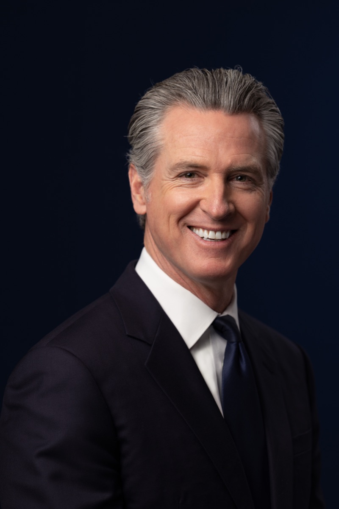
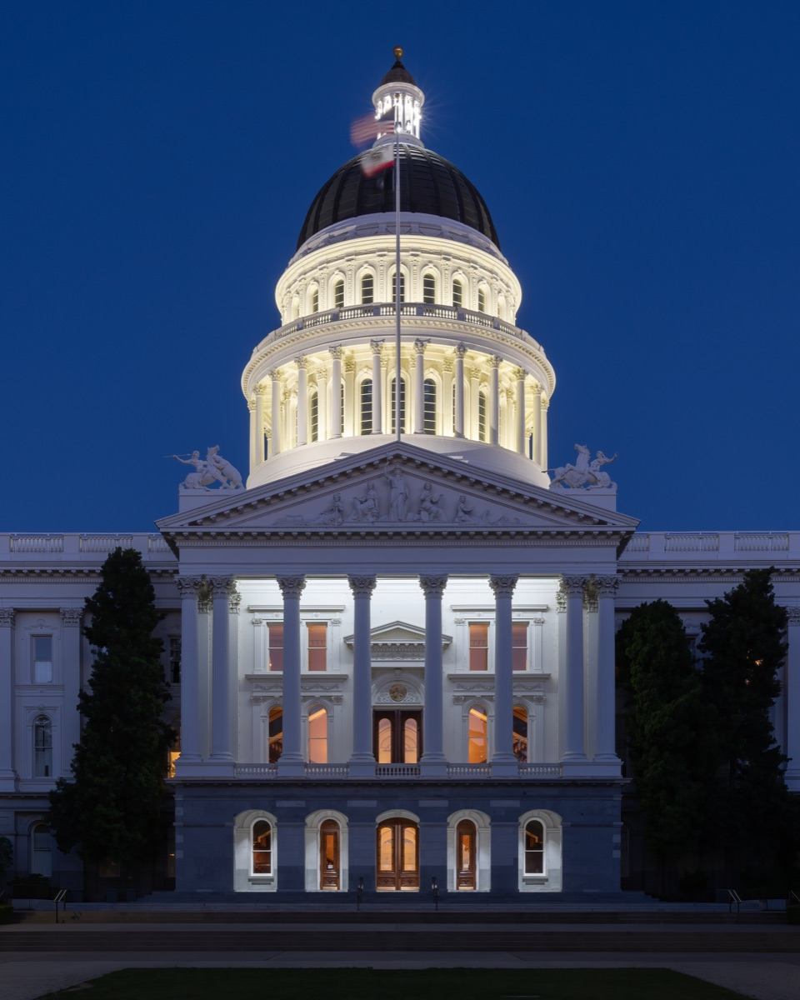
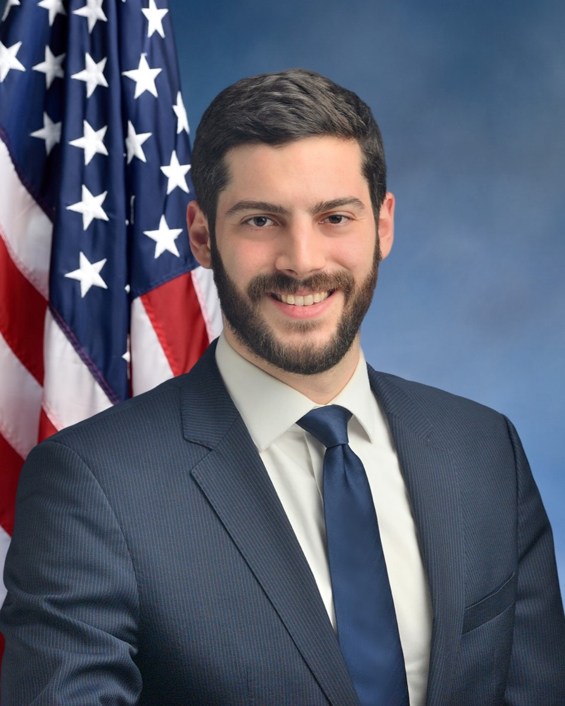

# California Wants the Profits of AI to Be Shared With Workers

_Beyond a duty to report layoffs, Newsom_

## Executive Summary

> [!callout]
> For the past few years, regulatory debate around AI and labor has mostly converged on a single demand: that a company give advance notice of the fact and timing when it lays people off. The demand California made in the spring of 2026 is different in kind. Executive Order N-6-26, signed by Governor Gavin Newsom on May 21, directs state agencies to review, alongside safety nets and retraining, "mechanisms for sharing the profits AI companies create with workers and the public." This piece looks at why those two demands differ in kind, and why that difference ultimately comes down to a data problem.

> Reporting a layoff can be answered with personnel records a company already holds. Sharing profits cannot. Answering it requires knowing which tasks automation displaced or expanded and by how much, and where the resulting productivity gain flowed — into wages, revenue, or profit. Newsom's order carries no legal force; it is a research directive, and the review of profit-sharing options is due by November 2026. The direction, however, is clear. The demand is shifting from "when do you cut" to "who owns the gains."

> This shift is not California's alone. In New York, a proposal for an "AI dividend" funded by a tax on AI use and by equity stakes in AI companies has surfaced, and at the federal level there is discussion of stronger disclosure when AI is a material factor in mass layoffs. This piece maps that terrain with California as its axis.

Before the main discussion, four numbers sketch its outline: the advance-notice period the notice track demands, the scale of jobs disappearing through the AI transition, how concentrated the first-round distribution of the surplus already is through the stock market, and the size of the workforce exposed to displacement risk.

<!-- stat-card -->
**90 days** — SB 951 advance notice — When AI-driven layoffs hit 25 people or 25% of staff

<!-- stat-card -->
**114,000** — Silicon Valley jobs lost — During the AI transition · per NYT DealBook

<!-- stat-card -->
**93%** — Stocks held by top 10% of households — Directly held stock · concentration of the first-round surplus

<!-- stat-card -->
**~11 million** — At displacement risk — Goldman Sachs base case · 6–7% of the US workforce

## A Question Beyond Notice

On May 21, 2026, California Governor Gavin Newsom signed Executive Order N-6-26 — effectively the first comprehensive AI workforce order from a US governor. It directs state agencies, including the Labor and Workforce Development Agency (LWDA), to study AI's effect on employment and to reexamine safety-net, collective-bargaining, and retraining policies. Several law firms issued client alerts almost immediately, and most read the order in a compliance key: "prepare for an expansion of WARN."

*▲ California Governor Gavin Newsom. On May 21, 2026 he signed Executive Order N-6-26, directing state agencies to study AI's employment impact and review profit-sharing mechanisms | Source: [Office of the Governor of California, Wikimedia Commons (Public Domain)](https://commons.wikimedia.org/wiki/File:Governor_of_California_Gavin_Newsom,_2026_Official_Portrait_2.jpg)*

But the order contains one item that stronger notice requirements alone cannot explain — the passage asking the state to review "mechanisms by which workers and the public can share in the profits AI companies create." This sits on a different plane from the procedural demand to give advance warning of when people will be cut. It asks head-on who owns the productivity gains automation produces.

The order itself is not law. It is a non-binding research directive, and it sets only deadlines: the safety-net review (including severance and equity compensation) is due by November 17, 2026, and the collective-bargaining review by October 15. What makes that one line matter anyway is that California has changed the question regulation asks. From notice to distribution.

## Two Tracks

Two currents of a different nature are now moving in parallel in California. One is a notice track that requires layoffs to be announced in advance; the other is a distribution track that reopens the question of who owns the profits automation creates. The two tracks differ from the outset in the kind of data they require.

### 2.1. The Notice Track — SB 951 and Cal-WARN

Cal-WARN, California's layoff-notice regime, requires an employer of 75 or more to give 60 days' notice before laying off 50 or more. SB 617, signed in October 2025 and effective January 1, 2026, added workforce-board coordination and CalFresh guidance to what that notice must contain. None of this singles out AI.

What aims directly at AI is SB 951, the so-called Worker Technological Displacement Act. Introduced by the California Federation of Labor, the bill would require 90 days' advance notice when AI-driven technological displacement affects 25 people or 25% of a workforce, and would bar termination without just cause during the 60 days from notice to layoff. Penalties for violations would accrue to a newly created Technological Displacement Act Fund. The nature of the demand is still procedural: disclose the fact, timing, and reason for a layoff in advance.

*▲ The California State Capitol in Sacramento. SB 951 and other AI labor bills are being debated in this legislature | Source: [Frank Schulenburg, Wikimedia Commons (CC BY-SA 4.0)](https://commons.wikimedia.org/wiki/File:California_State_Capitol_during_blue_hour-3982.jpg)*

### 2.2. The Distribution Track — Universal Basic Capital

The language of the distribution track shows most clearly in Newsom's own remarks. The idea he described to The New York Times' DealBook in May is "universal basic capital." It is not a universal basic income (UBI) that hands out cash, but the notion of giving workers an equity stake. "We're still running a system designed in 1935," Newsom said, arguing that what's needed is "ownership, not charity." Describing public resentment toward AI, he also put it bluntly: "the pitchforks are here."

Newsom is not alone in raising the idea of worker equity. He pointed out that AI executives such as OpenAI's Sam Altman and Anthropic's Dario Amodei have publicly floated similar concepts. The regulators and the regulated have begun saying the same sentence, for different reasons.

> [!callout]
> The data the two tracks require is fundamentally different. The notice track asks for the number, timing, and reason of layoffs — values already sitting in an HR system. The distribution track asks how large the productivity gain from automation is and where it went — values most companies do not yet hold.

## Not Only California

It is hard to read this shift in the center of gravity as one state's experiment. Similar signals are emerging at the same time across several states and at the federal level.

- **New York's AI dividend** — Assemblymember Alex Bores has proposed an "AI dividend" funded by a tax on AI use (metered per token) and by equity stakes in AI companies. It is designed to trigger payouts on signals such as a falling labor-force participation rate, wage declines in specific sectors, and jobless productivity growth.
- **Stronger federal disclosure** — A draft of the Great American AI Act under discussion would tighten transparency disclosures when AI is a material factor in mass layoffs. It is a demand at the level of information disclosure, not distribution.
- **California ballot initiative 25-0033** — A measure is in preparation that would place an oversight board over public-benefit-corporation AI companies, with obligations to support displaced workers and a requirement for approval before capability expansions.

*▲ New York Assemblymember Alex Bores. He proposed an "AI dividend" funded by a tax on AI use and by equity stakes in AI companies | Source: [New York State Assembly, Wikimedia Commons (CC BY-SA 4.0)](https://commons.wikimedia.org/wiki/File:AlexBoresAssemblyHeadshot.jpg)*

The intensity of the demands varies. Some stop at disclosure; others reach as far as equity and taxation. The direction, though, points one way. The question "who gets the profits AI creates" has begun to be written down in policy documents.

## The Surplus, in Numbers

A handful of numbers explain why the distribution debate is arriving now. Up front, though: those numbers are not fully agreed upon.

Goldman Sachs estimated that over the past year AI adoption cut roughly 16,000 jobs a month on average, and that in its base case 6–7% of the US workforce, about 11 million people, fall into the at-risk group. Looking at Silicon Valley alone, The New York Times' DealBook reported that about 114,000 jobs vanished during this transition. Morgan Stanley, by contrast, offered the opposing read that the effect on the labor market has so far been mild. In other words, the very measurement of how much surplus was created and how many jobs it displaced is still in dispute.

Behind distribution becoming a policy agenda is a concentration that has already occurred. In the US, the top 10% of households own about 93% of directly held stock. The first-round distribution of AI's productivity gains, mediated by the stock market, is already skewed toward a tiny few. JPMorgan CEO Jamie Dimon warned at Davos in January 2026 that serious social unrest could follow unless governments and companies intervene.

*▲ JPMorgan Chase CEO Jamie Dimon. At Davos in January 2026 he warned that serious social unrest from AI could follow without government and corporate intervention | Source: [World Economic Forum, Wikimedia Commons (CC BY-SA 2.0)](https://commons.wikimedia.org/wiki/File:The_Global_Financial_Context_James_Dimon.jpg)*

Yet the Brookings Institution points to a more fundamental gap. A substantial share of the productivity gain AI creates may not be captured at all by today's frameworks for GDP and productivity statistics. Before we can debate what to distribute, we cannot even properly count how much of it there is.

## Why Pebblous Is Watching

The measurement gap Brookings identified in national statistics repeats itself, unchanged, inside the company. Most firms can produce a WARN notice one way or another, because the number, timing, and reason of a layoff already sit in personnel records. But they do not have the data infrastructure to answer the question, "of this team's increase in output, what share is thanks to AI?"

Here is the decisive difference between the notice track and the distribution track. The data the notice track requires already exists. The data the distribution track requires must be created: data that traces, at the level of individual tasks, which tasks AI displaced or expanded and by how much, how large the resulting productivity gain is, and whether that gain flowed into wages, revenue, or profit. This automation-attribution data cannot be bolted on retroactively. It has to be recorded at the very moment AI is adopted.

So preparing for California's next demand is not the same as a legal team readying documents. It is putting the work, output, and headcount data from before and after AI adoption into a state where they can be linked and traced — in short, becoming AI-ready in your data. To answer a demand to share profits, you first have to be able to explain and measure those profits. That is why Pebblous reads this policy current as a data problem.

## References

### Industry & Press

- 1.K&L Gates. (2026). "[California Lays the Groundwork for More Sweeping AI Workforce Regulation](https://www.klgates.com/California-Lays-the-Groundwork-for-More-Sweeping-AI-Workforce-RegulationEmployers-Should-Start-Preparing-Now-6-8-2026)." K&L Gates HUB.
- 2.Mintz. (2026). "[AI: The Washington Report, July 2026 Edition](https://www.mintz.com/insights-center/viewpoints/54941/2026-07-08-ai-washington-report-july-2026-edition)." Mintz Insights Center.
- 3.A&O Shearman. (2026). "[California governor executive order mandates review of labor policies amid AI workforce displacement](https://www.aoshearman.com/en/insights/ao-shearman-on-tech/california-governor-executive-order-mandates-review-of-labor-policies-amid-ai-workforce-displacement)." A&O Shearman on Tech.
- 4.Ogletree Deakins. (2026). "[Cal. Governor's Executive Order Aims at Shielding Workers From AI Displacement](https://ogletree.com/insights-resources/blog-posts/cal-governors-executive-order-aims-at-shielding-workers-from-ai-displacement/)." Ogletree Deakins Insights.
- 5.Duane Morris. (2026). "[California State Agencies Ordered to Study the Impact of AI in Employment](https://www.duanemorris.com/alerts/california_state_agencies_ordered_study_impact_ai_employment_0526.html)." Duane Morris Alerts.
- 6.Ogletree Deakins. (2026). "[California Legislature Proposes 90-Day Layoff Notice Requirement Due to Employer's AI Use](https://ogletree.com/insights-resources/blog-posts/california-legislature-proposes-90-day-layoff-notice-requirement-due-to-employers-ai-use/)." Ogletree Deakins Insights.
- 7.Alston & Bird. (2025). "[California Adds Requirements for Cal-WARN Notices Beginning 2026](https://www.alston.com/en/insights/publications/2025/10/cal-warn-requirements-january-2026)." Alston & Bird Publications.
- 8.AOL. (2026). "[Newsom says AI resentment to dominate future elections. 'The pitchforks are here'](https://www.aol.com/news/newsom-says-ai-resentment-dominate-190532690.html)." AOL News.
- 9.CoinCentral. (2026). "[US Lawmaker Proposes AI Dividend to Offset Job Loss Fears](https://coincentral.com/us-lawmaker-proposes-ai-dividend-to-offset-job-loss-fears/)." CoinCentral.
- 10.Brookings Institution. (2026). "[AI growth acceleration versus distributional fairness](https://www.brookings.edu/articles/ai-growth-acceleration-versus-distributional-fairness/)." Brookings.

### Official Documents

- 11.CalMatters Digital Democracy. (2026). "[SB 951 — Worker Technological Displacement Act (bill tracker)](https://calmatters.digitaldemocracy.org/bills/ca_202520260sb951)." CalMatters Digital Democracy.
- 12.California State Legislature. (2026). "[SB 951 — Worker Technological Displacement Act, bill text](https://legiscan.com/CA/text/SB951/id/3437536)." LegiScan.
- 13.California Office of the Attorney General. (2026). "[Title and Summary, Initiative 25-0033](https://oag.ca.gov/system/files/initiatives/pdfs/Title%20and%20Summary%20%2825-0033%29.pdf)." California OAG.
