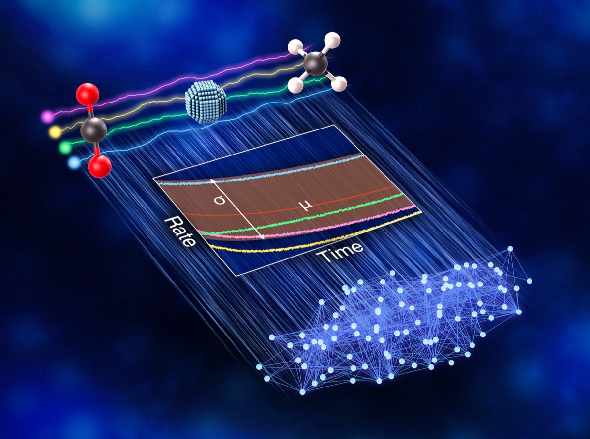
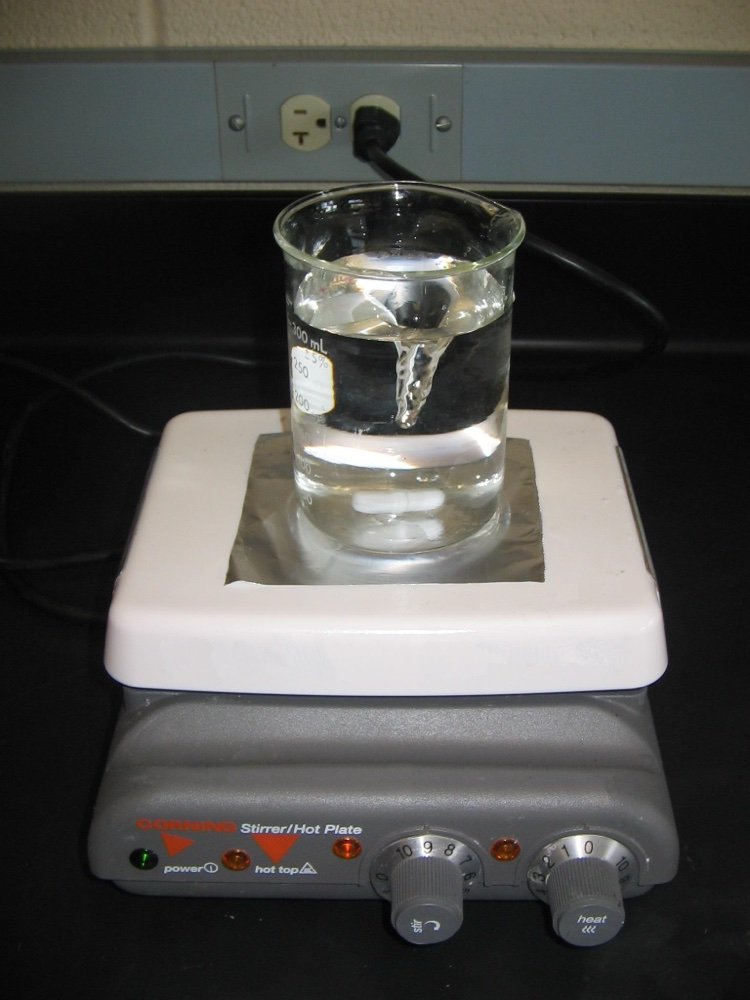

# 네 실험실이 같은 촉매를 시험했지만 데이터가 갈렸다

_SLAC·스탠퍼드 등 4개 실험실의 라운드로빈 실험이 드러낸 AI 학습 데이터 재현성 문제_

## Executive Summary

> [!callout]
> 네 곳의 실험실이 같은 로듐 촉매를 받아, 사전에 합의한 같은 프로토콜로 이산화탄소를 연료로 바꾸는 반응을 각자 돌렸습니다. 그런데 목표 생성물인 일산화탄소도, 부산물인 메탄도 실험실마다 다른 양이 나왔습니다. 2026년 7월 _Nature Catalysis_에 실린 이 라운드로빈 연구는, AI에게 먹일 실험 데이터가 실험실을 옮기는 것만으로 흔들린다는 사실을 정면으로 보여 줍니다. 이 글은 그 갈라짐이 어디서 왔고, AI 학습 데이터에 무엇을 뜻하는지를 봅니다.

> 원인은 뜻밖이었습니다. 알고리즘도, 데이터 정제 과정도 아니었습니다. 여러 미세한 차이 가운데 가장 크게 작용한 것은 반응 혼합물을 젓는 세기, 곧 교반 강도였습니다. 프로토콜에 "저어 준다"라고 적혀 있어도 얼마나 세게 젓는지는 실험대마다 갈렸고, 그 차이가 데이터로 남았습니다. 서로 다른 결과를 담은 네 데이터셋을 한데 모으면, AI 모델은 진짜 신호와 실험실 편차를 구분하지 못합니다.

> 페블러스 블로그는 재현성을 여러 번 다뤘지만 대개 "도구를 다시 돌릴 수 있는가"의 문제였습니다. 이번 연구는 한 단계 더 상류를 가리킵니다. 데이터가 태어나는 실험대에서 이미 품질이 갈린다는 것입니다. AI-Ready Data가 정제 단계가 아니라 데이터가 만들어지는 순간의 프로토콜에서 결정된다면, 우리는 품질 관리를 어디서부터 시작해야 하는지 함께 따라가 보겠습니다.

## 네 실험실, 같은 촉매, 다른 수율

이산화탄소를 일산화탄소 같은 유용한 연료로 되돌리는 촉매를 AI로 예측하려면, 먼저 그 촉매의 실험 데이터가 있어야 합니다. SLAC 국립가속기연구소가 주도한 연구팀은 데이터를 쌓기 전에 한 가지를 먼저 확인하기로 했습니다. 같은 촉매를 여러 실험실이 각자 시험했을 때 정말 같은 결과가 나오는가 하는 물음입니다. AI 모델의 신뢰도는 그 모델이 학습할 데이터의 신뢰도를 넘어설 수 없기 때문입니다.

SLAC, 펜실베이니아 주립대, 스탠퍼드, UC 산타바바라 네 곳이 참여했습니다. 네 실험실은 동일한 로듐 기반 촉매와 사전에 합의한 동일한 프로토콜을 받아, 이산화탄소를 일산화탄소로 전환하는 같은 반응을 각자 독립적으로 돌렸습니다. 여러 실험실이 같은 대상을 돌려 가며 검증하는 이 방식을 라운드로빈이라고 부릅니다. 표준이 잘 지켜진다면 네 곳의 데이터는 서로 겹쳐야 합니다.

결과는 겹치지 않았습니다. 목표 생성물인 일산화탄소의 양도, 부산물인 메탄의 양도 실험실마다 달랐습니다. 같은 촉매에 같은 프로토콜인데 데이터가 서로 맞지 않았습니다. 교신저자인 SLAC의 애덤 호프먼 연구원은 [SLAC 보도](https://www6.slac.stanford.edu/news/2026-08-03-ai-drive-science-discoveries-highly-reproducible-data-key)에서 이를 "눈이 번쩍 뜨이는 일"이었다고 표현했습니다. 연구팀조차 예상하지 못한 갈라짐이었습니다.

*▲ 네 실험실의 로듐 촉매 반응 속도 곡선(σ, μ)이 서로 갈리고, 그 데이터가 AI 모델 학습으로 이어지는 개념도 | Source: [Greg Stewart/SLAC National Accelerator Laboratory](https://www6.slac.stanford.edu/news/2026-08-03-ai-drive-science-discoveries-highly-reproducible-data-key)*

## 범인은 알고리즘이 아니라 교반 강도였다

연구팀은 왜 결과가 갈렸는지 되짚었습니다. 원인은 AI 모델도, 데이터를 정리하는 후처리 과정도 아니었습니다. 여러 미세한 조건 차이가 겹쳐 있었지만, 그중 가장 크게 기여한 것은 반응 혼합물을 젓는 세기, 곧 교반 강도였습니다. 실험실 물리 조건 하나가 데이터셋 전체의 품질을 좌우한 셈입니다.

프로토콜에 "반응물을 저어 준다"라고 적혀 있어도, 얼마나 세게 젓는지는 실험대마다 손끝에서 갈립니다. 젓는 세기가 달라지면 반응물과 촉매가 만나는 정도가 달라지고, 그만큼 생성물의 비율도 달라집니다. 문장으로 쓰면 같은 절차지만, 실제로 몸이 수행하는 값은 실험실마다 다른 숫자였던 것입니다. 표준 프로토콜의 문장과 실제 실행 사이에 이런 틈이 있었습니다.

*▲ 프로토콜엔 "저어 준다"고만 적히지만, 다이얼의 실제 눈금은 실험실마다 다르다 | Source: [Ruhrfisch, Wikimedia Commons (CC BY-SA 3.0)](https://commons.wikimedia.org/wiki/File:Magnetic_Stirrer.JPG)*

네 곳의 데이터가 수렴한 것은, 반응기 설계와 운영 절차, 실험 조건을 한층 촘촘히 표준화한 뒤였습니다. 바꿔 말하면 데이터를 신뢰할 수 있게 만든 것은 더 나은 알고리즘이 아니라 더 엄격한 실험 통제였습니다. 품질 문제의 해법이 데이터가 컴퓨터에 들어온 이후가 아니라, 데이터가 만들어지는 실험대 위에 있었다는 뜻입니다.

## 서로 다른 데이터로는 기계가 배울 수 없다

이 발견이 중요한 이유는 실험의 출발점이 애초에 AI였기 때문입니다. 촉매는 시간이 지나면서 성능이 떨어집니다. 그런데 이 열화는 보통 수개월에서 수년에 걸쳐 일어나는 반면, 실험실에서 지켜보는 시간은 대개 며칠에 그칩니다. 연구팀이 AI 모델에 기대한 것은 짧은 관찰로 긴 거동을 예측하는 능력이었습니다. 그러려면 모델에 먹일 데이터가 실험실을 옮겨도 일관되게 나와야 합니다.

제1저자인 UC 산타바바라의 셀린 박 박사후연구원은 AI 모델에 어떤 데이터를 먹이는지부터 신중해야 한다고 말했습니다. 실험 데이터가 일관되지 않으면 결과의 신뢰성이 흔들린다는 것을 연구자 스스로 알고 있어야 한다는 것입니다. 서로 다른 결과를 담은 네 데이터셋으로는 기계가 제대로 배울 수 없습니다.

AI 모델은 데이터에 담긴 진짜 신호와, 실험실 간 편차에서 생긴 노이즈를 스스로 구별하지 못합니다. 교반 강도 차이로 흔들린 수율을 그대로 학습하면, 모델은 촉매의 성질이 아니라 네 실험실의 습관을 배웁니다. 데이터가 많아도 그 데이터가 서로 어긋나 있으면, 학습된 예측은 어느 실험실도 재현할 수 없는 평균으로 수렴할 뿐입니다.

> [!callout]
> **핵심**: 데이터의 양이 아니라 일관성이 학습을 가능하게 합니다. 실험실마다 다른 결과를 담은 데이터는, 아무리 많이 모아도 신뢰할 수 있는 학습 신호가 되지 못합니다.

## 품질은 정제가 아니라 실험대에서 결정된다

페블러스 블로그는 재현성을 여러 번 다뤘습니다. 폐쇄 모델의 프로버넌스 부재를 짚었고, 논문에 실린 코드가 절반 남짓만 재현된다는 문제도 살폈습니다. 이 논의들의 공통점은 재현성을 "도구를 다시 돌릴 수 있는가"의 문제로 봤다는 데 있습니다. 모델이든 코드든, 이미 만들어진 도구를 같은 조건에서 재실행할 수 있느냐를 물었습니다.

이번 연구는 그보다 한 단계 상류를 가리킵니다. 재현이 갈린 지점은 소프트웨어가 아니라 실험대였습니다. 데이터 품질 논의는 흔히 "수집한 다음 어떻게 정제하는가"에 초점을 맞춥니다. 결측값을 채우고, 이상치를 걸러 내고, 형식을 맞추는 작업입니다. 그런데 이 연구는 그 앞을 봅니다. 데이터가 태어나는 순간, 장비 설정과 조작 조건이 이미 품질을 결정해 버립니다. 교반 강도처럼 프로토콜 문장에 담기지 않는 값이 데이터에 새겨지면, 정제 단계에서는 그것을 되돌릴 수 없습니다.
