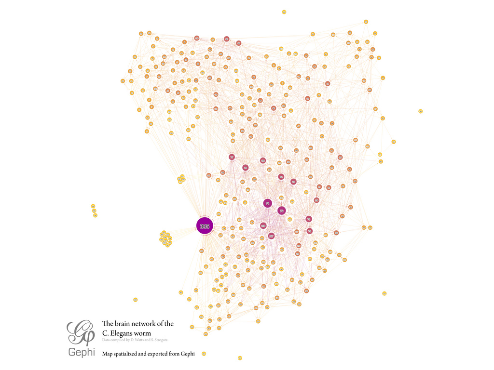
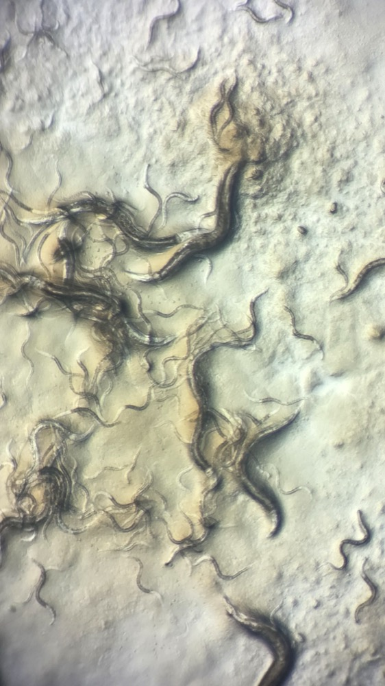

# 벌레 뇌를 베낀 AI 회로, 아무렇게나 엮은 회로보다 낫지 않다

_노르웨이 연구진이 예쁜꼬마선충 신경 지도를 AI 회로로 만들었고, 다섯 과제 중 실제 배선이 앞선 것은 기억 하나뿐이었다_

## Executive Summary

> [!callout]
> 예쁜꼬마선충은 흙 속에 사는 몸길이 1밀리미터짜리 벌레다. 신경세포가 302개뿐이라, 어느 세포가 어느 세포와 이어져 있는지를 하나도 빠짐없이 그려 낸 첫 동물이 됐다. 그 연결 지도를 커넥톰이라 부른다. 진화가 오랜 시간에 걸쳐 다듬어 놓은 배선이니 그대로 옮겨 AI 회로로 쓰면 아무렇게나 엮은 회로보다 나을 것이라는 기대가 이 분야에 오래 있었다. 노르웨이 외스트폴 응용과학대의 펠릭스 라이머스와 스테파노 니켈레를 비롯한 네 명이 9월 24일 arXiv에 올린 논문은 그 기대를 시험대에 올렸다. 이 글은 그 시험이 무엇을 내놓았는지를 본다.

> 연구진은 커넥톰 22개를 저장소 컴퓨팅이라는 틀에 거의 손대지 않고 집어넣었다. 회로 자체는 학습시키지 않고 회로가 뱉어낸 신호를 읽는 작은 출력부만 훈련하는 방식이라, 배선의 성질이 성적에 비교적 또렷하게 드러난다. 같은 크기로 무작위로 다시 엮은 대조군 세 종류를 세워 놓고 다섯 과제를 겨루게 했다. 실제 배선이 이긴 과제는 기억 하나뿐이었고 나머지는 무작위가 앞서거나 차이가 없었다. 그 하나의 승리마저 뇌 지도를 어떤 방법으로 측정했는지, 성적을 어떤 지표로 매겼는지에 따라 사라졌다.

> 1절부터 4절까지는 논문에 적힌 내용이다. 5절은 그 내용에서 이 글이 끌어낸 해석이다.

### 주요 수치

출처: Reimers 외, [arXiv:2609.30508](https://arxiv.org/abs/2609.30508) 본문 결과절과 표 1·표 2.

<!-- stat-card -->
**5개 중 1개** — 실제 배선이 앞선 과제 — 기억 용량 하나뿐이었다. 혼돈 시계열 예측 두 과제에서는 무작위가 앞섰고, 나머지 둘은 대조군에 따라 갈렸다

<!-- stat-card -->
**22개** — 회로가 된 신경 지도 — 개체 8마리에서 뽑은 7개 발달 시점을 세 가지 측정 방식으로 각각 그린 것이다. 뉴런은 지도마다 180개

<!-- stat-card -->
**+0.35 → −0.20** — 측정 방식이 뒤집은 부호 — 같은 기억 과제인데 시냅스 개수로 그린 지도는 원본이 앞서고, 물리적 접촉 지도는 무작위가 앞섰다

<!-- stat-card -->
**7 → 0** — 지표를 바꾸자 남은 승수 — 상관계수로 매기면 7개 나이 구간 전부에서 원본이 앞섰는데, RMSE로 바꾸자 한 구간도 남지 않았다

## 벌레의 뇌를 그대로 회로에 심었다

보통의 신경망은 배선의 세기를 학습으로 정한다. 데이터를 흘려 보내며 수십만 개의 연결 하나하나를 조금씩 고쳐 나가는 방식이다. 저장소 컴퓨팅은 그 순서를 뒤집는다. 뒤엉킨 회로를 하나 만들어 두고 그 안의 연결은 처음 모습으로 고정한 채, 회로가 입력에 반응해 만들어 낸 신호만 받아 읽는 작은 출력부를 훈련한다. 회로는 입력을 시간축으로 흩뿌려 주는 역할만 한다. 학습이 닿지 않는 만큼 회로의 배선 구조가 성적에 남는다.

이 구조에 커넥톰은 유난히 잘 맞는다. 어느 세포가 어느 세포로 이어지는지를 적은 표가 곧 회로의 인접행렬이기 때문이다. 연구진이 한 전처리는 행렬의 스펙트럴 반경이 1이 되도록 크기를 맞춘 것 정도였다. 회로가 발산하지도 금세 잦아들지도 않게 하는 최소한의 조정이다. 그러고는 에코 스테이트 네트워크라는 이름의 순환 신경망 자리에 앉혔다.

*▲ 예쁜꼬마선충의 신경 연결을 노드-엣지 그래프로 시각화한 예시다. 이 논문이 실제로 쓴 지도는 아니며, 커넥톰이 회로의 인접행렬로 바뀌는 모습을 보여 주는 참고 이미지다 | Source: [Wikimedia Commons (Mentatseb, CC BY-SA 3.0)](https://commons.wikimedia.org/wiki/File:C.elegans-brain-network.jpg)*

쓰인 지도는 비트블리엣 등이 2021년에 공개한 것이다. 유전적으로 같은 예쁜꼬마선충 여덟 마리를 발달 단계별로 갈라 전자현미경으로 훑은 자료로, 부화 직후 애벌레 시기 네 시점(L1.1부터 L1.4까지)과 L2, L3, 그리고 성체 두 마리를 담고 있다. 지도 하나에 들어간 것은 뇌 뉴런 180개에 체벽근육과 아교세포, 배설관 연결 뉴런 두 개를 더한 것이다. 신경세포 302개를 모두 담은 지도가 아니라 머리 쪽 뇌를 재구성한 자료이므로, 회로가 된 범위도 거기까지다.

같은 개체를 세 가지 방법으로 각각 측정했다는 점이 이 자료의 특징이다. 시냅스를 몇 개 이어 붙였는지 세는 방법, 그 시냅스의 접합부가 얼마나 큰지 재는 방법, 그리고 두 세포가 실제로 맞닿은 면적을 구하는 방법이다. 앞의 둘은 신호가 흐르는 방향이 있는 지도가 되고, 마지막 하나는 방향이 없는 지도가 된다. 세 방법을 발달 시점마다 적용해 모두 22개의 지도가 나왔다. 성체 한 마리는 시냅스 크기와 물리적 접촉 자료가 없어 8개가 아니라 7개씩이다.

*▲ 몸길이 1밀리미터의 예쁜꼬마선충. 논문에 쓰인 개체는 아니지만 같은 종의 실제 모습이다 | Source: [Wikimedia Commons (Gannu03, CC BY-SA 4.0)](https://commons.wikimedia.org/wiki/File:Caenorhabditis_elegans_under_a_light_microscope_02.jpg)*

회로에 신호를 넣고 빼는 자리도 생물을 따랐다. 입력은 감각뉴런 가운데에서, 출력은 체벽근육 가운데에서 골랐다. 벌레가 바깥을 느끼고 몸을 움직이는 경로를 옮긴 셈이다. 다만 이 선택이 유리한지 확인하려면 다른 선택도 있어야 하므로, 연구진은 입출력 자리를 바꿔 가며 다섯 가지 구성을 돌렸다. 첫 둘은 감각과 근육이라는 생물학적 구분을 지켰고, 나머지 셋은 그 구분을 풀고 각 무리의 30퍼센트·50퍼센트·80퍼센트를 입출력으로 삼았다.

과제는 다섯이다. 기억 용량은 최대 스무 시간 단계 전에 들어온 신호를 다시 뱉어 내게 하는 과제다. 에농 지도와 맥키-글래스는 혼돈 시계열의 다음 값을 맞히는 과제이고, 지각적 판단은 두 시계열 가운데 평균이 큰 쪽을 고르는 과제다. Go/No-go는 신호가 왔는지 안 왔는지만 답하면 된다. 과제마다 무작위로 뽑은 문제 15묶음을 미리 저장해 두고, 그중 70퍼센트로 출력부를 훈련한 뒤 나머지 30퍼센트로 채점했다.

## 배선보다 입출력 자리가 성적을 더 움직인다

비교 대상이 될 무작위 회로는 세 가지로 만들었다. 첫째는 나가는 연결의 개수 분포는 그대로 두고 연결이 닿는 자리만 다시 엮은 것이다. 입출력 노드는 원래와 같은 무리에서 고른다. 둘째는 배선을 원래대로 두고 입출력 노드만 전체에서 무작위로 고른 것이다. 셋째는 둘 다 무작위다. 비교할 때마다 각 대조군을 15번씩 새로 뽑아, 한 번 운 좋게 잘 나온 회로가 결과를 끌고 가지 않게 했다.

성적은 베타 회귀로 모아 원본과 대조군의 차이를 계수 하나로 요약했다. 값이 양수면 실제 배선이 앞섰다는 뜻이고 음수면 무작위가 앞섰다는 뜻이다. 아래가 다섯 과제와 세 대조군을 교차한 결과다.
