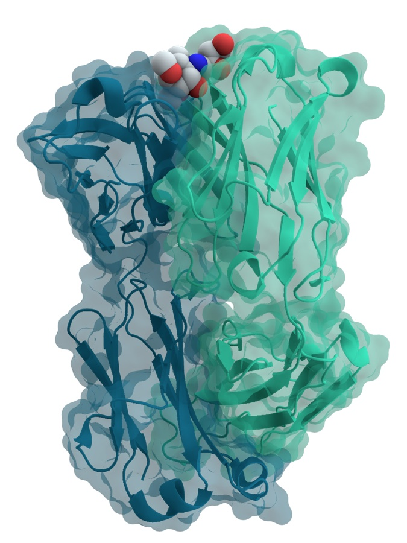

# What Pfizer Bought From an AI Drug Startup Was Data

_Chai Discovery tripled its valuation in seven months, but with $20B in generative AI drugs and zero approvals, the deal exposes a data bottleneck_

## Executive Summary

> [!callout]
> Chai Discovery, a startup that designs antibodies with AI, raised a $400M Series C in July 2026. The round valued the company at $3.8 billion, roughly triple the $1.3 billion it commanded just seven months earlier. Pfizer, Eli Lilly, and Novartis all appear on its customer list. So where is that capital flowing, and where does the real moat in this field actually sit?

> The detail worth studying is the structure of the Pfizer deal. Pfizer did not simply buy access to a shared, off-the-shelf model. It also licensed a private version retrained on its own proprietary data. Over the same stretch, generative AI drug discovery has absorbed a cumulative $20 billion, yet not a single drug it produced has cleared regulatory approval, while more than 173 AI-derived candidates have entered clinical trials. Design has gotten dramatically faster; the layer of data that would prove one of those molecules actually becomes a drug is still largely empty.

> That gap is redrawing the asset map of the industry. What is scarce is not the foundation model but decades of experimental data and clinical deployment history. The structure of the Pfizer deal spells that fact out, clause by clause.

<!-- stat-card -->
**$400M** — Chai Discovery Series C — $3.8B valuation, ~$630M raised to date

<!-- stat-card -->
**×2.9** — Valuation jump in 7 months — $1.3B (Dec 2025) → $3.8B (Jul 2026)

<!-- stat-card -->
**0** — AI-discovered drugs approved — against $20B invested to date

<!-- stat-card -->
**173+** — AI-derived candidates in trials — design surged, validation stalled

## Triple the Valuation in Seven Months

Chai Discovery builds AI models that predict how biomolecules interact with one another. In December 2025 it raised $130 million in a Series B at a $1.3 billion valuation. Then on July 13, 2026, it pulled in $400 million in a Series C, and its valuation jumped to $3.8 billion. In a little over half a year the company's value roughly tripled, a 2.9x move, bringing its total raised to $630 million.

Index Ventures led the round, with Kleiner Perkins, Sequoia Capital, and Dimension as co-leads. Bain Capital Ventures, Battery Ventures, and Baillie Gifford came in as new investors, while existing backers Thrive Capital, OpenAI, and Menlo Ventures held their positions. CEO Joshua Meier, a former OpenAI researcher, framed the announcement around execution: AI drug discovery, he said, has moved from promise to deployment.

Investors did not re-price the company threefold in half a year on technical progress alone. The more decisive signal is the customer list. The fact that large pharmaceutical companies — Pfizer, Eli Lilly, Novartis — adopted the model under real contracts read as evidence that Chai had crossed the gap between lab demo and commercial deployment. So what, exactly, did they buy?

*▲ A Pfizer facility (Middleton, Wisconsin, US) | Source: [Wikimedia Commons](https://commons.wikimedia.org/wiki/File:Pfizer_Inc_Middleton_Research_Pharmaceutical_laboratory_-_panoramio.jpg)*

## What Chai-3 Actually Sells

Chai Discovery's core product is a model called Chai-3. It predicts how biomolecules bind to each other — proteins and ligands, antibodies and antigens. In drug discovery, that prediction amounts to screening, inside a computer, which molecules will latch onto a target before anything touches a lab bench. What the company emphasized most in this announcement was its antibody design capability.

*▲ An antibody (blue/green) binding to an antigen (ball-and-stick) — the kind of interaction Chai-3 predicts | Source: [Wikimedia Commons (Thomas Splettstoesser)](https://commons.wikimedia.org/wiki/File:Mouse_cholera_antibody_2.png)*

Chai says the model doubled its success rate over the previous generation and delivers a hit rate of roughly 35–40% on candidate molecules. In other words, out of many candidates it flags the ones that genuinely bind to the target at a high proportion. This is precisely the point where time and cost drop sharply in the design stage.

There is a caveat worth naming, though. What improved here is the design score inside a computer. Hit rate is a measure of computational performance, not evidence that the molecule becomes a safe and effective drug in a human body. Notably, the announcement disclosed no wet-lab validation data or clinical results. "Design got faster" and "it became a drug" sit on different layers, and that distinction is the key to reading the Chai Discovery deal.

## What Pfizer Really Bought

The most revealing part of the announcement is the structure of the Pfizer deal. Pfizer did not just receive access to Chai-3. It also licensed a private model trained separately on its own accumulated proprietary data. Eli Lilly signed a customer agreement to accelerate biologics design, and Novartis entered a formal collaboration.

Unpack what Pfizer bought and it comes in two layers. One is the shared foundation model that anyone can access; the other is a dedicated model retrained solely on Pfizer's data, usable only by Pfizer. The first is an asset you rent; the second is an asset you lock up. The real weight of the deal sits on the second.

## $20B In, Zero Approvals Out

Zoom out from one company's success to the industry as a whole, and the picture changes. Generative AI drug discovery has absorbed a cumulative $20 billion so far. Yet among the drugs discovered with that money, the number that have won approval from a regulator like the FDA is still zero. More than 173 AI-derived programs have entered clinical trials, but not one has crossed the finish line.

Line those numbers up and one fact becomes clear. Money and candidate molecules have exploded, but the rate at which they convert into actual drugs is not yet a value you can measure. AI has largely solved the design-stage bottleneck. The validation-stage bottleneck — proving "is this molecule really a safe and effective drug" — remains almost untouched.
