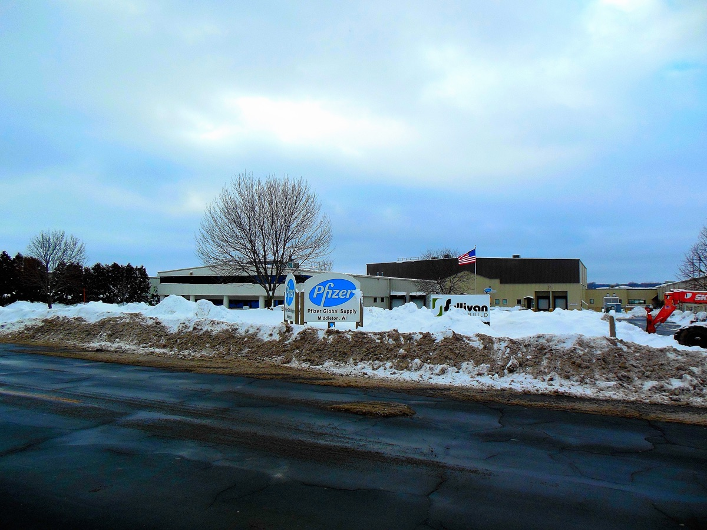

# 화이자가 AI 신약 스타트업에서 사들인 것은 데이터였다

_생성 AI 신약에 200억 달러가 몰렸지만 승인은 0건, 차이 디스커버리 계약이 드러낸 데이터 병목_

## Executive Summary

> [!callout]
> AI로 항체를 설계하는 스타트업 차이 디스커버리(Chai Discovery)가 2026년 7월 4억 달러 규모의 시리즈 C를 유치했습니다. 밸류에이션은 38억 달러로, 불과 7개월 전 13억 달러의 약 세 배입니다. 화이자, 일라이 릴리, 노바티스가 고객 명단에 이름을 올렸습니다. 그렇다면 그 자금은 어디로 흐르고, 이 분야의 진짜 해자는 어디에 있을까요.

> 눈여겨볼 대목은 화이자 계약의 구조입니다. 화이자는 누구나 쓸 수 있는 공용 모델을 산 것이 아니라, 자사의 독점 데이터로 다시 학습된 전용 모델을 함께 받았습니다. 같은 시기 생성 AI 신약 개발에는 누적 200억 달러가 투입됐지만 규제 승인을 받은 약은 아직 0건이고, 임상에 올라간 AI 유래 후보는 173개가 넘습니다. 설계는 폭발적으로 빨라졌는데, 그 분자가 진짜 약이 된다는 것을 증명할 데이터층은 여전히 비어 있습니다.

> 이 격차가 이 산업의 자산 지형을 다시 그립니다. 희소한 것은 파운데이션 모델이 아니라 수십 년치 실험 데이터와 임상 배치 이력입니다. 화이자 계약 구조가 그 사실을 계약서 조항으로 보여줍니다.

<!-- stat-card -->
**$4억** — 차이 디스커버리 시리즈 C — 밸류에이션 38억 달러, 누적 조달 약 6.3억

<!-- stat-card -->
**×2.9** — 7개월 밸류에이션 배수 — 13억(2025.12) → 38억(2026.7)

<!-- stat-card -->
**0건** — AI 발굴 신약 규제 승인 — 누적 투자 200억 달러 대비

<!-- stat-card -->
**173+** — 임상 진행 AI 유래 후보 — 설계는 폭발, 검증은 정체

## 7개월 만에 몸값 3배

차이 디스커버리는 생체분자 사이의 상호작용을 예측하는 AI 모델을 만드는 회사입니다. 2025년 12월 시리즈 B에서 1억 3천만 달러를 조달하며 13억 달러로 평가받았습니다. 그리고 2026년 7월 13일, 시리즈 C로 4억 달러를 유치하면서 밸류에이션이 38억 달러로 뛰었습니다. 반년 남짓 만에 회사 가치가 약 2.9배가 된 셈이고, 누적 조달액은 6억 3천만 달러에 이릅니다.

이번 라운드는 인덱스 벤처스가 리드했고 클라이너 퍼킨스, 세쿼이아 캐피털, 디멘션이 공동 리드로 참여했습니다. 베인 캐피털 벤처스와 배터리 벤처스, 베일리 기포드가 새로 들어왔고, 기존 투자자였던 스라이브 캐피털과 OpenAI, 멘로 벤처스도 자리를 지켰습니다. CEO 조슈아 마이어(전 OpenAI 연구자)는 "AI 신약 개발이 약속에서 배치 단계로 넘어갔다"는 말로 이번 발표의 무게를 실행 쪽에 실었습니다.

투자자들이 반년 만에 회사를 세 배로 다시 값 매긴 이유는 기술 자체의 진전만은 아닙니다. 더 결정적인 신호는 고객 명단입니다. 화이자, 일라이 릴리, 노바티스라는 대형 제약사가 실제 계약으로 이 모델을 도입했다는 사실이, 연구실 데모와 상업 배치 사이의 간극을 건넜다는 증거로 읽혔습니다. 그렇다면 이들이 산 것은 정확히 무엇일까요.

*▲ 화이자 사업장(미국 위스콘신 미들턴) | Source: [Wikimedia Commons](https://commons.wikimedia.org/wiki/File:Pfizer_Inc_Middleton_Research_Pharmaceutical_laboratory_-_panoramio.jpg)*

## Chai-3가 파는 것

차이 디스커버리의 핵심 제품은 Chai-3라는 모델입니다. 단백질과 리간드, 항체와 항원처럼 생체분자가 서로 어떻게 결합하는지를 예측합니다. 신약 개발에서 이 예측은 "어떤 분자가 표적에 잘 달라붙을 것인가"를 컴퓨터 안에서 미리 가려내는 일에 해당합니다. 이번 발표에서 회사가 특히 강조한 것은 항체 설계 역량입니다.

*▲ 항체(파랑·초록)가 항원(구슬 형태)에 결합하는 구조 — Chai-3가 예측하는 결합 방식의 예시 | Source: [Wikimedia Commons (Thomas Splettstoesser)](https://commons.wikimedia.org/wiki/File:Mouse_cholera_antibody_2.png)*

회사는 Chai-3가 이전 대비 성공률을 두 배로 끌어올렸고, 후보 물질의 힛레이트(hit rate)가 35~40% 수준이라고 밝혔습니다. 수많은 후보 중 실제로 표적에 결합하는 분자를 그만큼 높은 비율로 짚어낸다는 뜻입니다. 설계 단계에서 시간과 비용이 크게 줄어드는 지점이 바로 여기입니다.

다만 짚고 넘어갈 것이 있습니다. 여기서 좋아진 것은 컴퓨터 안에서의 설계 성적입니다. 힛레이트는 계산 성능 지표이지, 그 분자가 사람 몸에서 안전하고 효과 있는 약이 된다는 증거가 아닙니다. 실제로 이번 발표에도 젖은 실험실(wet lab) 검증 데이터나 임상 성적은 공개되지 않았습니다. 설계가 빨라졌다는 사실과 약이 됐다는 사실은 서로 다른 층위에 있습니다. 이 구분이 차이 디스커버리 사례를 읽는 열쇠입니다.

## 화이자가 실제로 산 것

이번 발표에서 가장 많은 것을 말해 주는 대목은 화이자 계약의 구조입니다. 화이자는 Chai-3에 대한 접근권만 받은 것이 아닙니다. 자사가 축적한 독점 데이터로 별도로 학습된 전용 모델을 함께 라이선스했습니다. 일라이 릴리는 바이오로직스 설계 가속을 위한 고객 계약을 맺었고, 노바티스는 공식 협업을 체결했습니다.

화이자가 산 것을 뜯어보면 두 겹입니다. 하나는 모두가 접근할 수 있는 공용 파운데이션 모델이고, 다른 하나는 화이자의 데이터로만 다시 학습돼 화이자만 쓸 수 있는 전용 모델입니다. 앞의 것은 빌리는 자산이고, 뒤의 것은 가두는 자산입니다. 계약의 진짜 무게는 뒤쪽에 실립니다.

## 200억 달러, 승인 0건

한 회사의 성공 사례에서 산업 전체로 시야를 넓히면 그림이 달라집니다. 생성 AI 신약 개발에는 지금까지 누적 200억 달러가 투입됐습니다. 그런데 이 돈으로 발굴된 신약 가운데 FDA 같은 규제기관의 승인을 받은 사례는 아직 0건입니다. 임상시험에 올라간 AI 유래 프로그램은 173개가 넘지만, 결승선을 통과한 약은 하나도 없습니다.

이 숫자들을 나란히 놓으면 한 가지 사실이 분명해집니다. 돈과 후보 물질은 폭발적으로 늘었는데, 그것이 실제 약으로 전환된 비율은 아직 측정할 수 있는 값이 아닙니다. 설계 단계의 병목은 AI가 상당히 풀었습니다. 그러나 "이 분자가 진짜 안전하고 효과 있는 약인가"를 증명하는 검증 단계의 병목은 거의 그대로입니다.
