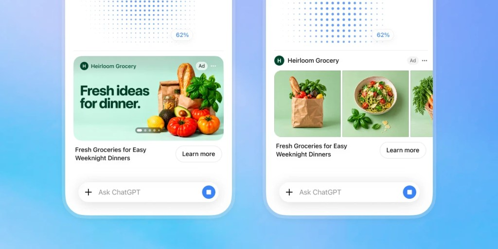

# ChatGPT Puts an Ad Beside Your Image. What Measures It?

_OpenAI starts testing ads beside image generation in the US this month. The conversation does not go to advertisers, and the advertisers_

## Executive Summary

> [!callout]
> This article reads the ChatGPT advertising announcement OpenAI published on October 5, 2026. When a user asks for a picture, an ad now appears beside the screen where the result arrives. The trial starts later this month in the United States with an initial group of advertisers, and ChatGPT reaches 1.2 billion people every week. OpenAI stated that the ads stay separate from the image being created, that they do not influence the answers, and that outside partners do not read private user conversations.

> Then what measures the ads? The companies named in the post work by joining an ad click to the purchase that follows it, and no conversation enters that work. Reporting on the privacy policy update says purchase records sent by advertisers come in to OpenAI, and that cookie IDs and device IDs go out to marketing partners. The conversation stays and the numbers travel.

> Sections 1 through 3 are facts recorded in OpenAI's announcement and in the reporting that carried it. Section 4 is this article's reading of those facts through the eyes of someone who works with data.

### Key numbers

The four numbers below name, in order, how many people use ChatGPT each week, the advertising revenue OpenAI disclosed, the promise to keep conversations private, and a result one advertiser reported.

Source: [TechCrunch (2026-10-05)](https://techcrunch.com/2026/10/05/openai-launches-visual-ads-that-appear-alongside-image-generation-results/), [PPC Land (2026-10-05)](https://ppc.land/openai-to-test-ads-during-chatgpt-image-generation-in-us-this-month/).

<!-- stat-card -->
**1.2 billion** — ChatGPT weekly users — The trial starts in the US. Existing ChatGPT ads run on the Free and Go plans only

<!-- stat-card -->
**$1 billion** — ChatGPT ads annualized run rate — Reported on August 31. A month's revenue multiplied by twelve, not a year's takings

<!-- stat-card -->
**Zero** — Outside partners reading private chats — OpenAI's account. Then what does a suitability call rest on?

<!-- stat-card -->
**15.3%** — Acquisition cost cut one advertiser reported — WeightWatchers against its own paid-search benchmark. Sample and period undisclosed

## An ad beside the picture

OpenAI opened a new advertising format in ChatGPT on October 5, 2026. A user asks for a picture, and beside the screen where the result arrives sits an ad carrying an image, a one-line headline and a "Learn more" button. In OpenAI's description, the slot shows product inspiration, how a product is used, or the experiences a service makes possible.

*▲ ChatGPT's new visual ad format — it sits below the result screen, separate from the generated image | Source: [TechCrunch, Image Credits: OpenAI](https://techcrunch.com/2026/10/05/openai-launches-visual-ads-that-appear-alongside-image-generation-results/)*

Position is the core of the post. Ads will be "clearly labeled, and remain separate from the image being created." No brand mark gets mixed into the generated picture, and no answer changes because of an ad. That is the line OpenAI drew.

The trial begins later this month in the United States with an initial group of advertisers, and that is as far as the announcement takes the visual format. ChatGPT advertising itself has already crossed borders: live in the US on February 9, then the UK on June 6, then Japan and South Korea on June 22, with the ad platform's availability list now covering 63 countries. Korean users already see ads on their ChatGPT screens. What this announcement adds is the place where an ad can sit.

OpenAI wrote in the same post that ChatGPT reaches 1.2 billion people each week, so that is the pool once the format expands. The people who see ads are users on the Free and Go plans. OpenAI's help page says Plus, Pro, Business, Enterprise and Edu accounts carry no ads, and that accounts identified as belonging to users under 18 carry none either, nor do Temporary Chats. The October post stops at the format and leaves the plan split to the help page, which limits advertising in general to those two plans.

The Free plan has a separate way to switch ads off, and it bears directly on this announcement. According to the help page, a Free user who moves to the ads-free setting gets lower message limits and loses access to some tools, and the examples given for those tools are image generation and deep research. When PPC Land read the same documentation in April, the text said ads did not appear after a user generated an image, and that Free users who chose the ad-free configuration lost access to image creation. So this announcement fills a slot that used to be explicitly empty. And on the Free plan, the way to avoid the ad in that slot is to give up making pictures.

The reason for hurrying shows up in the numbers. OpenAI said on August 31 that ChatGPT advertising had reached a $1 billion annualized run rate before the product's 200th day, and a comparison circulated alongside it: Google AdWords took four years to reach the same marker. The arithmetic deserves a look. An annualized run rate is that month's revenue multiplied by twelve, which works back to roughly $83 million a month. It is not money that actually came in over a year. The same measure stood at $100 million on March 26, so it rose tenfold in a little over five months. Advertiser retention, average spend and profitability have not been published.

## How the ads get measured without the chat

Price explains why the measurement news arrived when it did. When the pilot began on February 9, a thousand impressions cost $60 and minimum commitments ran $200,000 to $250,000. By mid-April the impression price had fallen to $25 and the minimum spend to $50,000. A practitioner quoted by Digiday argued at the time that crediting an impression is hard to defend until someone independent can verify what that impression is worth. David Dugan, who leads OpenAI's advertising solutions, called independent verification a natural next step on June 30. Ad load grew through the same months. Sensor Tower counted ads per user per hour on the US mobile app up 163% in August against April.

Half of this announcement is the ad format and the other half is measurement. Sorted by role, the companies OpenAI named come out like this. Three data connection vendors feed advertiser-side data into ChatGPT Ads: Hightouch, Tealium and LiveRamp. Ten attribution vendors join a click to the behaviour that follows it: AppsFlyer, Triple Whale, Adjust, DV Rockerbox, Northbeam, Branch, Singular, Kochava, Airbridge and Tenjin. Three advanced measurement partners read the whole funnel: Fospha, Measured and INCRMNTAL. Three run geo-based experiments to measure incrementality: Haus, Measured and WorkMagic. Measured sits in two of the boxes, so counting names gives eighteen companies.

Peel back one layer of attribution and the reason no conversation is needed comes into view. The moment a user clicks an ad, an identifier travels with the click, and it follows the user into the advertiser's app or website. If an install or a purchase happens there, the same identifier joins the two events. Whatever the user typed as a picture request enters none of this.

How far that number travels is recorded in reporting on OpenAI's privacy policy update. According to Search Engine Land and eMarketer, OpenAI receives purchase data from advertisers in order to measure advertising performance, and shares limited identifiers such as cookie IDs and device IDs with marketing partners. Free-plan users have marketing cookies on by default and can turn them off in settings, while the Plus and Business plans fall outside the scope to begin with. An OpenAI spokesperson said conversations and private user content are not shared with advertisers.

The two accounts do not collide, because "we do not hand conversations to advertisers" and "no data moves at all" are different statements. The conversation is what stays put, and identifiers and purchase records are what move.

▲ The data items named in the announcement and in the privacy policy reporting, sorted here by which side of the boundary they sit on.

Which signals pick the ad is set out as a list on OpenAI's help page: the context and intent of the current conversation, the ad's landing page, title and copy, and advertiser-provided context hints and targeting selections. By PPC Land's account, those context hints attach at the ad group level rather than to keywords. With ads personalization enabled, interactions with ads, past chats and memory join the list. With it switched off, only the current chat thread and basic context such as general location and language remain. Personalized ads are not initially available in the European Economic Area or Switzerland. The list stops short of the picture request.

Measurement results are already out as numbers. The post offered three cases. According to DV Rockerbox, WeightWatchers' acquisition cost ran 15.3% below its own paid-search benchmark. WorkMagic's experiment for Dose found 67% of incremental purchases coming from net-new customers. According to Triple Whale, 93% of Portland Leather's visitors from ChatGPT ads were new. None of the three arrived with a sample size, a period or a spend figure, and OpenAI itself wrote that its incrementality work is "still in its early stages." The three numbers also measure different things. The first sets an attributed cost against WeightWatchers' own paid-search average, a figure only WeightWatchers can see. The second gives the make-up of a lift without the size of the lift. The third counts how many visitors were new, which is a different quantity from how many came because of the ad.

The click, which is the unit measurement rests on, carries a question of its own. The ad verification company TrafficGuard published an analysis of 40,021 clicks on ChatGPT ads on September 30 and found invalid rates running from 0.1% to 34% depending on the advertiser. Clicks from hosting, proxy and malicious IP space came to 3.34%, against 0.92% on the same advertisers' Google Ads campaigns. The company sells click verification, the advertisers were anonymized, and the materials do not establish that the flagged clicks are the clicks OpenAI billed for. The rates are hard to take at face value, and they do show the floor that attribution stands on.

## The post never says what the suitability call rests on

Keeping ads away from places they should not appear is work the advertising industry calls brand suitability. OpenAI said it is developing evaluation pilots with DoubleVerify and Integral Ad Science. One condition comes attached: the two companies assess "in a controlled testing environment, without accessing private user conversations." Keeping ads out of emotionally vulnerable, sensitive or otherwise unsuitable contexts is the standard OpenAI set out. Part of that standard is already public. The help page says ads are not eligible near sensitive or regulated topics including personal health, mental health and politics, that political advertising is not allowed in ChatGPT at all, and that advertisers in verticals such as health and financial services can run only if they meet strict eligibility criteria.

That leaves one box empty. A verifier that does not read the conversation has to read something else, and OpenAI did not say what. Advertisers gained a new control called Negative Phrases, which screens out particular wording in line with a brand's own policies. That is the whole of the published description. Who qualifies for the control, how many phrases a brand can list, how a match is decided? OpenAI said only that automated review, human oversight and ongoing monitoring decide whether a conversation is a place where an ad can run.

### 3.1. If the context is the conversation, what do the verifiers read?

Mark Zagorski, chief executive of DoubleVerify, put the problem in its shortest form. In ChatGPT, "context is defined by the conversation itself rather than a page or video." Zagorski added that a context of that kind keeps shifting inside a single conversation, which calls for an approach different from established media. Lidiane Jones, chief executive of Integral Ad Science, said marketers need confidence that brand safety protections are durable, consistent and built to operate at scale. If the verifiers do not read that conversation, what do they follow the shifting context with?

The vocabulary itself has acquired a rule. On October 18, 2025 the Media Rating Council restricted the phrase "brand safety" to vendors that analyze content such as images, video and audio rather than domains or keywords alone, and the grace period ended on April 18, 2026. Integral Ad Science issued its own announcement on the same day as OpenAI's, saying it had begun providing ChatGPT advertising reports to a select group of advertisers. Neither that release nor OpenAI's post claims the accreditation, names the content types the reporting examines, or says whether the two documents point at one program or two.

On the image generation screen the question gains another layer. A suitability tier was built for pages, and here the "page" is a one-line picture request. Only the placement is settled: the ad sits beside the picture. Whether a verifier judges the request, the image or the whole conversation is the next thing the pilot has to settle.

### 3.2. One company sits on both lists

Read the roster again and one more name repeats. Among the ten attribution vendors, DV Rockerbox belongs to DoubleVerify, and DoubleVerify is also one of the two companies verifying suitability. The same corporate name appears on the side that tallies advertising performance and on the side that checks where the ad is placed. How the two roles are separated in practice is not in the post.

Who the verifiers are has changed recently too. Novacap took Integral Ad Science private for $1.9 billion, and Nielsen agreed on August 6 to acquire DoubleVerify for about $2.15 billion. One of them moves under a private equity firm, the other inside a company that measures audiences. There is also an Integral Ad Science survey from October 2025, which found 75% of advertisers saying they would not want their ads next to AI-generated content. It is vendor-run research, and this format by design places an ad in exactly that spot.

Where the discretion over that screen sits showed up a month ago. The Information reported that in September OpenAI stopped accepting ads for standalone image and audio generation tools and notified its advertising partners. There was no public announcement. Adobe, which had joined the early ad pilot to promote Acrobat Studio and Firefly, was affected, and Doug Wyatt, Adobe's head of media for the Americas, confirmed the notice. Ads for video generation products were reported to continue. This is a different matter from suitability calls, and the two share one thing: the authority over what runs on that screen sits in one place.

## Why Pebblous Is Watching This Announcement

The context an ad attaches to has been a page, a search term, a video. One more joins the list now. It is what a person typed when they asked for a picture.

A search term and a picture request differ in kind. A search term looks for something that already exists, while a picture request asks for something that does not exist yet. "Draw me a two-seat sofa for the living room in a Nordic style" is a sentence about making rather than finding, which is why it reads as closer to purchase intent. That is probably why the advertising aimed at this slot in the first place.

So who keeps this signal and who gets to read it. A published answer does exist, up to a point. In the ad controls screen under settings, a user can open the record of ads they have seen and the list of topics used to target them, and can delete that data. The help page says deleted data is removed from the servers within 30 days. What is published, though, is the deadline that applies once a user asks for deletion, not a retention period. How long is data that nobody deletes kept, and who inside the company reads it? Ads are selected on the context of a conversation and measured on identifiers and purchase records, and the rules for the place that joins the two are blank.

Two clues inside the help page suggest the boundary is more tangled than it looks. The first is the age prediction model that keeps ads away from accounts belonging to users under 18. The signals it reads include how long the account has existed and the typical times of use, and also the general topics a person discusses. A guardrail built to block ads runs on conversation signals. The second is what happens when a user messages an advertiser through an ad. The help page records that the advertiser sees the messages sent to them directly. The promise not to hand conversations over has one stated exception right there.

> [!callout]
> An organization that works with data can take three questions from this announcement. First, what sits inside the conversion records we send to advertising platforms, and how much of it is an identifier? Second, which intermediaries do we share those identifiers with, and can we draw that path on a single page? Third, when a suitability or safety judgment is handed to an outside party, does the contract say what that party actually reads?

This is why Pebblous asks about the origin and the route of data first whenever it talks about AI-Ready Data. Without a written record of where data came from, whose hands it passed through and where it went, one sentence is enough to put the matter to rest: we do not hand conversations over. That sentence may well be true. The questions it cannot answer remain anyway.

Thanks for reading this far. The announcement was carried by [TechCrunch](https://techcrunch.com/2026/10/05/openai-launches-visual-ads-that-appear-alongside-image-generation-results/) and [BleepingComputer](https://www.bleepingcomputer.com/news/artificial-intelligence/openai-will-show-visual-ads-in-chatgpt-while-you-generate-images/), the partner roster and the early results are gathered in [PPC Land's write-up](https://ppc.land/openai-to-test-ads-during-chatgpt-image-generation-in-us-this-month/), and the tier split, the ad signals and ads data deletion are on [OpenAI's help page](https://help.openai.com/en/articles/20001047-ads-in-chatgpt). Open the list of data your own organization sends to advertising platforms. If anything on it amounts to a conversation, tell us what you found.

## References

### Primary reporting

- 1.Perez, S. (2026). [OpenAI launches visual ads that appear alongside image generation results](https://techcrunch.com/2026/10/05/openai-launches-visual-ads-that-appear-alongside-image-generation-results/). TechCrunch.
- 2.Parmar, M. (2026). [OpenAI will show visual ads in ChatGPT while you generate images](https://www.bleepingcomputer.com/news/artificial-intelligence/openai-will-show-visual-ads-in-chatgpt-while-you-generate-images/). BleepingComputer.

### Official documentation

- 3.OpenAI. [Ads in ChatGPT](https://help.openai.com/en/articles/20001047-ads-in-chatgpt). OpenAI Help Center.

### Industry and verification reporting

- 4.Rijo, L. (2026). [OpenAI to test ads during ChatGPT image generation in US this month](https://ppc.land/openai-to-test-ads-during-chatgpt-image-generation-in-us-this-month/). PPC Land.
- 5.Rijo, L. (2026). [TrafficGuard finds up to 34% of clicks on some ChatGPT ads were invalid](https://ppc.land/trafficguard-finds-up-to-34-of-clicks-on-some-chatgpt-ads-were-invalid/). PPC Land.
- 6.Rijo, L. (2026). [ChatGPT Ads gains IAS brand safety measurement in closed pilot](https://ppc.land/chatgpt-ads-gains-ias-brand-safety-measurement-in-closed-pilot/). PPC Land.
