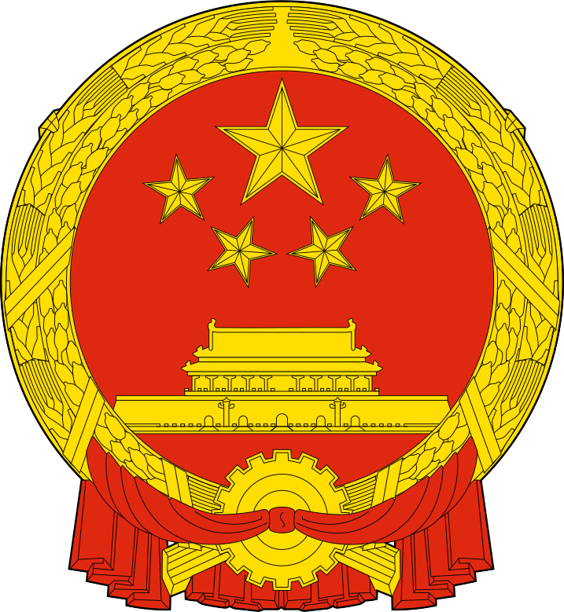
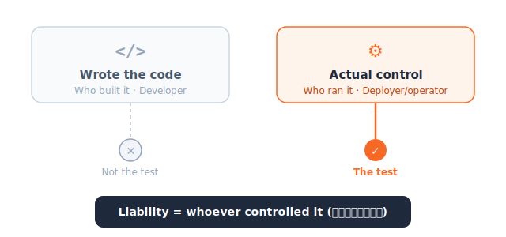
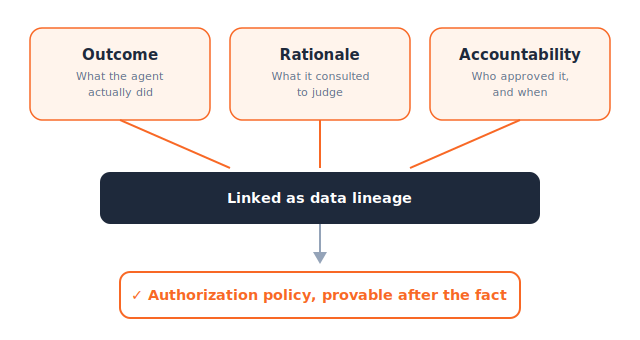

# China

_Authorization policy can_

## Executive Summary

> [!callout]
> On July 15, 2026, China put into effect the world's first national policy document to treat AI agents as their own regulated category. Issued jointly by the Cyberspace Administration of China (CAC), the National Development and Reform Commission, and the Ministry of Industry and Information Technology, the _Implementation Opinions on Standardizing the Application and Promoting the Innovative Development of Intelligent Agents_ require, in Article 6, that an agent's decision authority be sorted into three tiers before it is deployed: decisions only a human may make, decisions that need user approval first, and decisions the agent may handle on its own.

> Sorting decisions into tiers is something a single page of policy can declare. The hard part is proof. When an auditor later asks which tier a given decision actually fell into, whether the user really approved it, and on what basis the agent judged, the answer lives neither in the code nor in the policy document. It can only be reconstructed if the outcome, the rationale, and the approval record for every action were left behind in the data layer.

> This article lays out what the three tiers in China's rules actually say, and why proving those tiers after the fact requires audit trails and data lineage to be in place first. It also looks at how Illinois, in the United States, answered the same pressure with a different mechanism: mandatory third-party audits.

Four numbers frame the rule: when it took effect, how many tiers it defines, and what industry itself named as the biggest obstacle to deploying agents.

<!-- stat-card -->
**Jul 15** — Effective date — CAC · NDRC · MIIT, jointly

<!-- stat-card -->
**3 tiers** — Decision authority — Human-only · approval · autonomous (Art. 6)

<!-- stat-card -->
**62%** — Named it the top barrier — Data-rights & security compliance

<!-- stat-card -->
**58.7%** — Named it their top goal — Governance & compliance (IDC)

## The Day the Law Drew the Line

AI regulation has mostly aimed at the model. What data was it trained on, is its output biased, how does it handle personal information. The Implementation Opinions that China put into effect on July 15 shifted the focus one notch over. What is being governed is not the model but the agent: the **behavior** of a system that perceives, remembers, decides, and acts on its own.

Article 6 requires that the reasonable boundaries of an agent's authority be set down in a document before it is actually deployed. That boundary is divided into three compartments: decisions only a human may make, actions the agent may execute only after user approval, and matters the agent may handle autonomously within a delegated scope. The text states that users retain the right to be informed of, and the final say over, an agent's autonomous decisions, and that an agent's execution must not exceed the scope the user approved.

*▲ National Emblem of the People's Republic of China | Source: [Wikimedia Commons](https://commons.wikimedia.org/wiki/File:National_Emblem_of_the_People%27s_Republic_of_China.svg)*

> [!callout]
> Put plainly: some judgments stay with the human, some require approval, and only some are left to the agent alone. In being the first law to draw the boundary of autonomy, this rule carries more weight than a single line of news.

## Three Tiers and the Logic Behind Them

Two things ultimately separate the three tiers: how sensitive an action is, and whether it can be undone. The heavier and more irreversible the outcome—moving money between bank accounts, signing a contract—the higher the tier; the lighter and more reversible the action, like summarizing search results or tidying a schedule, the lower. Here is the substance of the three compartments as the regulatory commentary lays them out.

<!-- stat-card -->
**Tier 1** — Human decides — Actions the agent may not take on anyone's behalf. Judgments that are irreversible or that touch personhood and rights directly stay in human hands.

<!-- stat-card -->
**Tier 2** — Execute after approval — The agent may propose, but it must obtain user approval before acting. This is the buffer zone between autonomy and control.

<!-- stat-card -->
**Tier 3** — Autonomous execution — Within an explicitly delegated scope, the agent handles matters on its own. The user keeps the right to be informed and to override at any time.

**Who checks the tier** is handled along a separate axis. Article 11 varies the intensity of oversight by sector. In sensitive, high-risk fields such as healthcare, transportation, media, and public safety, information authorities and the relevant industry regulators jointly define the open-use scenarios and require registration, compliance testing, and recall of problematic products. The registration threshold for agents deployed in sensitive fields is reported to sit around one million subscribers or 100,000 monthly active users. Lower-risk fields such as lifestyle and entertainment, by contrast, are managed through self-assessment tools, industry self-regulation, and credit ratings, leaning on market mechanisms rather than enforcement.

## Sorting Is Not the Same as Proving

Legal analysis inside China has summed up the rule's liability principle in a short phrase: "看控制而非看代码"—look at control, not at code. Responsibility falls not on the developer who wrote the code but on whoever actually controlled the agent in that situation, usually the company that deployed and operated it. The test of liability is not who wrote which code but who controlled the behavior.

But that principle hides a premise. To judge control, you must be able to reconstruct after the fact which tier the control actually belonged to, and whether the user's approval really existed. The verifiable, traceable mechanism required by Article 7 is precisely the condition for that reconstruction. The text mentions verifying and back-tracing an agent's behavior with technologies such as blockchain to prevent improper conduct. In short, declaring a tier and proving that the system operated according to that tier are entirely different things.

*▲ Pebblous original diagram — the liability test: control, not code*

This is where the problem Pebblous has addressed before meets the new rule. In [agents do not inherit the entitlements of their sources](https://blog.pebblous.ai/report/agent-entitlement-inheritance-retrieval/en/), we looked at cases where permissions were already defined, yet the agent failed to inherit them properly at the moment of search and retrieval, and data leaked. That was an after-the-fact failure: the permission existed but was not enforced. This regulation flips the direction and asks the opposite. Pin the authority itself into tiers in advance, and enforce it. The center of gravity of regulation has shifted from failures revealed after the fact to enforcement demanded before it.

## Without a Data Layer, Policy Is Just Paper

The authorization policy the regulation demands—the document that sets which decision belongs to which tier—is by itself only a promise. To prove that promise was kept, three things must be recorded for every single decision. First, the outcome: what did the agent actually do. Second, the rationale: what data and documents did it consult to reach that judgment. Third, accountability: who approved the execution, and when.

*▲ Pebblous original diagram — the data lineage that proves an authorization policy*

If those three are not left behind in the data layer, then in front of an auditor or a regulator the authorization policy becomes an unreconstructable sheet of paper. The declaration that tiers were assigned exists, but the evidence that the system moved according to those tiers does not. Without an audit trail and data lineage, the very principle of "looking at control, not code" rings hollow, because there is no record of the control it claims to look at.

Industry already senses this gap. In an IDC survey, 62% of enterprises named data rights and security compliance as the biggest obstacle to agents executing across systems, and 58.7% cited governance and compliance as their top goal in adopting an agent platform. The signal is that the problem of making an agent smarter comes second to the problem of making what an agent did explainable later.

China's regulatory ecosystem is itself moving to fill this gap with technology. The Agent Interconnection Protocol (AIP), backed by more than 100 organizations including Huawei and Xiaomi, aims to build the infrastructure for stitching many agents together at scale. Analysis inside China reads the protocol as governance infrastructure that translates regulatory requirements into technical architecture, embedding compliance verification and audit functions directly into the interconnection workflows agents use to talk to one another. The idea is to enforce, at the layer of the records agents leave behind, the tier distinctions the regulation demanded on paper.

> [!callout]
> The demand to tier autonomy looks like a policy problem on the surface, but at the execution stage it settles into a data-architecture problem. Unless outcome, rationale, and approval are left behind, linked as lineage, no authorization policy can be proven after the fact.

## Illinois's Answer: Third-Party Audits

A different continent answered the same pressure a different way. The AI Safety Measures Act (SB315), signed by the governor of Illinois on July 6, 2026, made Illinois the third U.S. state—after California and New York—to have a frontier AI safety law. What sets it apart is a clause the California and New York laws lack: it mandates an independent audit by a disinterested third party. Large frontier developers must undergo an annual independent audit, and while the developer pays the audit fee, that payment cannot be tied to the audit's findings, a safeguard for the audit's independence.

*▲ Illinois State Capitol (Springfield) | Source: [Wikimedia Commons](https://commons.wikimedia.org/wiki/File:Illinois_State_Capitol_pano.jpg) (Daniel Schwen, CC BY-SA 4.0)*

Both the subject and the method differ from China's. China makes the agent's autonomous behavior itself be sorted into tiers in advance; Illinois has a third party verify the safety-management system of frontier model developers. Yet the two approaches point to the same place.

|  | China's Implementation Opinions | Illinois SB315 |
| --- | --- | --- |
| Regulated subject | The agent's autonomous behavior | Frontier model developers |
| Core mechanism | Pre-documented authorization policy + user's final say | Independent third-party audit + public report |
| Method of proof | Verifiable, traceable mechanism; behavior logs (Art. 7) | A report signed by the auditor |
| Common ground | Both demand proof, not declaration. Saying you have a policy or a safety framework is not enough; you must show, through third-party audit or after-the-fact tracing, that it actually operated that way. |  |

The method splits—advance documentation and tracing on one side, third-party audit on the other—but both take aim at the same target. It is not enough to **declare** that something is safe; you must **prove** that it operated safely. And either kind of proof, in the end, begins with the record.

## What Tiering Autonomy Really Demands

The demand to decide in advance how much decision authority to grant an agent, and then to enforce it, will only grow. China pinned it into statute and Illinois backed it with audits; the concept of meaningful human control long debated in Europe points the same way. The wording and the procedures differ, but the question converges on one: how far did this agent decide on its own, and how will you show that it did not cross that line?

The ability to answer that question was already a practical problem, regulation or not. The finer the tiers of autonomy become, the wider the distance grows between organizations that have kept the outcome, rationale, and approval of each decision as lineage and those that have not. For the former, responding to regulation means pulling out records they have already accumulated; for the latter, it is the impossible homework of manufacturing a past that does not exist. What tiering autonomy really demands is that you first build the data infrastructure to prove the tiers you drew.

## References

### Official Documents

- 1.Cyberspace Administration of China, National Development and Reform Commission, Ministry of Industry and Information Technology. (2026). "[Notice on Issuing the Implementation Opinions on the Standardized Application and Innovative Development of Intelligent Agents](https://www.cac.gov.cn/2026-05/08/c_1779979789523320.htm)." Cyberspace Administration of China.
- 2.Cyberspace Administration of China. (2026). "[Official Commentary on the Implementation Opinions on Intelligent Agents](https://www.cac.gov.cn/2026-05/08/c_1779983775418216.htm)." Cyberspace Administration of China.

### Legal Analysis & Industry Coverage

- 3.AI Governance. (2026). "[China's Agent Rules Take Effect July 15 and Illinois Mandates Third-Party Safety Audits](https://aigovernance.com/news/chinas-agent-rules-take-effect-july-15-and-illinois-mandates-third-party-safety-audits)." aigovernance.com.
- 4.IAPP. (2026). "[China's New AI Rules: Ethics, AI Agents, and Anthropomorphic AI](https://iapp.org/news/a/china-s-new-ai-rules-ethics-ai-agents-and-anthropomorphic-ai)." iapp.org.
- 5.Rimon Law. (2026). "[China AI Law Brief](https://www.rimonlaw.com/china-ai-law-brief/)." rimonlaw.com.
- 6.Huxiu. (2026). "[Liability Under China's New Agent Rules: Look at Control, Not Code](https://www.huxiu.com/article/4857793.html)." huxiu.com.
- 7.Crowell & Moring LLP. (2026). "[Illinois Imposes Transparency and Safety Obligations on Frontier AI Systems](https://www.crowell.com/en/insights/client-alerts/illinois-imposes-transparency-and-safety-obligations-on-frontier-ai-systems)." Client Alert.
- 8.Davis Wright Tremaine LLP. (2026). "[Illinois Frontier AI Safety Law](https://www.dwt.com/blogs/artificial-intelligence-law-advisor/2026/07/illinois-frontier-ai-safety-law)." Artificial Intelligence Law Advisor.
