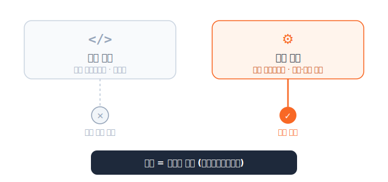
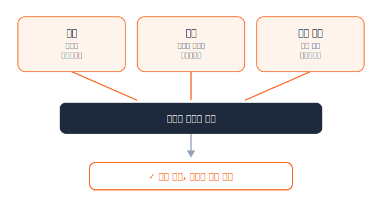

# AI 에이전트 결정 권한을 세 등급으로 나눈 중국의 첫 규정

_인가 정책은 감사 추적과 데이터 계보 없이는 증명할 수 없다_

## Executive Summary

> [!callout]
> 2026년 7월 15일, 중국은 AI 에이전트만을 독립된 규율 대상으로 삼은 세계 첫 국가 정책 문서를 시행했다. 국가인터넷정보판공실(CAC)과 국가발전개혁위원회, 공업정보화부가 공동으로 낸 《지능체 규범 응용 및 혁신 발전 실시의견》이다. 이 규정의 제6조는 에이전트를 배치하기 전에 그 결정 권한을 세 등급으로 나눠 놓으라고 요구한다. 사람만 결정할 수 있는 일, 사용자 승인을 받아야 하는 일, 에이전트가 알아서 해도 되는 일이다.

> 등급을 나누는 일 자체는 정책 문서 한 장으로 선언할 수 있다. 어려운 것은 증명이다. 나중에 감사관이 "이 결정이 실제로 어느 등급이었고, 사용자가 정말 승인했으며, 무엇을 근거로 판단했는가"를 물었을 때 답할 수 있어야 한다. 그 답은 코드에도 정책 문서에도 없다. 행위 하나하나의 결과와 근거, 승인 기록이 데이터 계층에 남아 있어야만 재구성된다.

> 이 글은 중국 규정이 실제로 정의한 3등급의 조문 내용을 정리하고, 그 등급을 사후에 입증하려면 감사 추적과 데이터 계보가 먼저 갖춰져야 한다는 점을 짚는다. 미국 일리노이가 같은 압력에 제3자 감사라는 다른 방식으로 답한 사례도 함께 본다.

규정의 윤곽은 네 개의 숫자로 잡힌다. 언제 시행됐는지, 몇 등급으로 나뉘는지, 그리고 산업이 에이전트 도입에서 무엇을 가장 큰 걸림돌로 꼽았는지다.

<!-- stat-card -->
**7.15** — 규정 시행일 — CAC·NDRC·MIIT 공동

<!-- stat-card -->
**3등급** — 결정 권한 분류 — 사람만·승인 후·자율 (제6조)

<!-- stat-card -->
**62%** — 최대 장벽으로 꼽은 기업 — 데이터 권한·보안 컴플라이언스

<!-- stat-card -->
**58.7%** — 도입 1순위 목표로 꼽은 기업 — 거버넌스·컴플라이언스 (IDC)

## 자율의 경계를 법이 그은 날

지금까지 AI 규제는 대체로 모델을 겨냥했다. 어떤 데이터로 학습했는지, 출력에 편향은 없는지, 개인정보를 어떻게 다루는지를 물었다. 7월 15일 중국이 시행한 실시의견은 초점을 한 칸 옮겼다. 규율 대상이 모델이 아니라 에이전트, 즉 스스로 인지하고 기억하고 결정하고 실행하는 시스템의 **행동**이다.

규정의 제6조는 에이전트를 실제로 배치하기 전에 그 권한의 합리적 경계를 문서로 정해 두라고 요구한다. 그 경계는 세 개의 칸으로 나뉜다. 사람만 결정할 수 있는 일, 사용자 승인을 받아야 실행할 수 있는 일, 그리고 위임된 범위 안에서 에이전트가 자율로 처리해도 되는 일이다. 조문은 사용자가 에이전트의 자율 결정에 대해 알 권리와 최종 결정권을 가지며, 에이전트의 집행이 사용자가 승인한 범위를 넘어서는 안 된다고 명시한다.

*▲ 중화인민공화국 국장 | Source: [Wikimedia Commons](https://commons.wikimedia.org/wiki/File:National_Emblem_of_the_People%27s_Republic_of_China.svg)*

> [!callout]
> 정리하면 이렇다. 어떤 판단은 사람에게 남기고, 어떤 판단은 승인을 받게 하고, 어떤 판단만 스스로 하게 한다. 자율의 경계를 법이 처음으로 그었다는 점에서 이 규정은 뉴스 한 줄 이상의 무게를 지닌다.

## 세 등급, 그 선을 그은 논리

세 등급을 가르는 기준은 결국 두 가지다. 그 행위가 얼마나 민감한가, 그리고 되돌릴 수 있는가. 은행 계좌를 옮기거나 계약을 체결하는 일처럼 결과가 무겁고 비가역적일수록 위쪽 등급으로, 검색 결과를 요약하거나 일정을 정리하는 일처럼 가볍고 되돌릴 수 있을수록 아래쪽 등급으로 배치된다. 규정 해설이 정리한 세 칸의 실질은 다음과 같다.

<!-- stat-card -->
**등급 1** — 사람만 결정 — 에이전트가 대신할 수 없는 행위. 비가역적이거나 인격·권리에 직접 닿는 판단은 반드시 사람 손에 남긴다.

<!-- stat-card -->
**등급 2** — 승인 후 실행 — 에이전트가 제안하되 실행 전에 사용자 승인을 받는다. 자율과 통제 사이의 완충 지대다.

<!-- stat-card -->
**등급 3** — 자율 실행 — 명시적으로 위임된 범위 안에서 에이전트가 알아서 처리한다. 사용자는 언제든 알 권리와 무효화 권한을 유지한다.

등급을 **누가 확인하느냐**는 또 다른 축에서 다뤄진다. 제11조는 분야에 따라 감독 강도를 달리 둔다. 의료, 교통, 미디어, 공공안전 같은 민감·고위험 분야에서는 정보 당국과 업종 주관부처가 함께 개방 시나리오를 확정하고, 등록과 컴플라이언스 테스트, 문제 제품 리콜을 의무화한다. 민감 분야에 배치되는 에이전트의 등록 기준선은 가입자 100만 명 또는 월간 활성 이용자 10만 명 수준으로 알려졌다. 반면 생활·오락처럼 위험이 낮은 분야는 자율 측정 도구와 업계 자율규제, 신용평가로 관리해 강제보다 시장 메커니즘에 무게를 둔다.

## 나누는 것과 증명하는 것은 다르다

중국 내 법률 분석이 이 규정의 귀책 원리를 짧은 문장으로 요약했다. "看控制而非看代码", 코드가 아니라 통제를 본다는 뜻이다. 책임은 코드를 짠 개발자가 아니라 그 상황에서 에이전트를 실제로 통제한 주체, 대개는 배포하고 운영한 기업에게 돌아간다. 누가 어떤 코드를 썼느냐가 아니라 누가 그 행동을 통제했느냐가 책임의 기준이 된다.

그런데 이 원리는 하나의 전제를 숨기고 있다. 통제를 판정하려면 그 통제가 실제로 어느 등급이었는지, 사용자 승인이 정말 있었는지를 사후에 재구성할 수 있어야 한다. 제7조가 요구하는 검증 가능하고 추적 가능한 메커니즘이 바로 그 재구성의 조건이다. 조문은 블록체인 같은 기술로 에이전트의 행위를 검증하고 역추적해 부적절한 행동을 막으라고 언급한다. 등급을 선언하는 것과 그 등급대로 작동했음을 증명하는 것은 전혀 다른 일이라는 이야기다.

*▲ 페블러스 원본 도식 — 책임 판정 원리: 코드가 아니라 통제*

페블러스가 앞서 다룬 문제와 이 지점에서 만난다. [에이전트는 출처의 권한을 물려받지 못한다](https://blog.pebblous.ai/report/agent-entitlement-inheritance-retrieval/ko/)는 글에서 우리는, 권한이 이미 정해져 있는데도 에이전트가 검색과 리트리벌 시점에 그 권한을 제대로 물려받지 못해 데이터가 새어 나간 사례를 봤다. 그때는 권한이 있어도 강제되지 않는 사후 실패였다. 이번 규정은 방향을 뒤집어 묻는다. 권한 자체를 사전에 등급으로 못박고 그것을 강제하라. 사후에 드러난 실패에서 사전에 요구되는 강제로 규제의 무게중심이 옮겨 간 셈이다.

## 인가 정책은 데이터 계층 없이는 서류다

규제가 요구하는 인가 정책, 즉 어떤 결정이 어느 등급에 속하는지를 정한 문서는 그 자체로는 약속에 불과하다. 그 약속이 지켜졌음을 증명하려면 결정 하나하나에 세 가지가 기록으로 남아야 한다. 첫째는 결과다. 에이전트가 실제로 무엇을 실행했는가. 둘째는 근거다. 어떤 데이터와 문서를 참조해 그렇게 판단했는가. 셋째는 책임 소재다. 누가 언제 그 실행을 승인했는가.

*▲ 페블러스 원본 도식 — 인가 정책을 증명하는 데이터 계보*

이 세 가지가 데이터 계층에 남아 있지 않으면, 감사관이나 규제기관 앞에서 인가 정책은 재구성 불가능한 종잇장이 된다. 등급을 나눴다는 선언은 있는데 그 등급대로 움직였다는 증거가 없는 상태다. 결국 감사 추적과 데이터 계보가 없으면 "코드가 아니라 통제를 본다"는 원칙 자체가 공허해진다. 통제를 본다면서 통제의 기록이 없는 셈이기 때문이다.

산업도 이 격차를 이미 감지하고 있다. IDC 조사에서 기업의 62%는 데이터 권한과 보안 컴플라이언스를 에이전트의 시스템 간 실행에서 가장 큰 걸림돌로 꼽았고, 58.7%는 에이전트 플랫폼 도입의 1순위 목표로 거버넌스와 컴플라이언스를 들었다. 에이전트를 더 똑똑하게 만드는 문제보다, 에이전트가 한 일을 나중에 설명할 수 있게 만드는 문제가 먼저 걸린다는 신호다.

중국 규제 생태계 자체도 이 지점을 기술로 메우려는 움직임을 보인다. 화웨이·샤오미를 비롯한 100여 개 기관이 참여하는 에이전트 상호연결 프로토콜(AIP)은 다수의 에이전트를 대규모로 이어 붙이는 인프라를 목표로 하는데, 중국 내 분석은 이 프로토콜을 규제 요건을 기술 아키텍처로 옮기는 거버넌스 인프라로 읽는다. 컴플라이언스 검증과 감사 기능을 에이전트들이 주고받는 상호연결 워크플로우 안에 아예 내장하겠다는 구상이다. 규정이 문서로 요구한 등급 구분을, 결국 에이전트가 남기는 기록의 층위에서 강제하려는 시도인 셈이다.

> [!callout]
> 자율의 등급을 나누라는 요구는 겉보기에 정책의 문제지만, 실행 단계에서는 데이터 아키텍처의 문제로 내려앉는다. 결과와 근거와 승인이 계보로 이어져 남지 않으면, 어떤 인가 정책도 사후에 입증할 수 없다.

## 일리노이의 답, 제3자 감사

같은 압력에 다른 대륙이 다른 방식으로 답했다. 2026년 7월 6일 일리노이 주지사가 서명한 AI 세이프티 조치법(SB315)은 캘리포니아, 뉴욕에 이어 미국에서 세 번째로 프론티어 AI 세이프티 법을 갖춘 주로 일리노이를 올렸다. 이 법의 차별점은 캘리포니아와 뉴욕에는 없는 조항, 즉 이해관계 없는 제3자의 독립 감사를 의무화한 데 있다. 대형 프론티어 개발사는 매년 독립 감사를 받아야 하고, 감사비는 개발사가 내되 그 지급을 감사 결과에 연동할 수 없다. 감사의 독립성을 지키기 위한 장치다.

*▲ 일리노이 주 의사당(Springfield) | Source: [Wikimedia Commons](https://commons.wikimedia.org/wiki/File:Illinois_State_Capitol_pano.jpg) (Daniel Schwen, CC BY-SA 4.0)*

규율 대상도 방법도 중국과 다르다. 중국은 에이전트의 자율 행위 자체를 사전에 등급으로 나누게 하고, 일리노이는 프론티어 모델 개발사의 세이프티 관리 체계를 제3자가 검증하게 한다. 그런데 두 접근이 향하는 곳은 같다.

|  | 중국 실시의견 | 일리노이 SB315 |
| --- | --- | --- |
| 규율 대상 | 에이전트의 자율 행위 | 프론티어 모델 개발사 |
| 핵심 장치 | 사전 문서화된 인가 정책 + 사용자 최종 결정권 | 제3자 독립 감사 + 공개 보고서 |
| 증명 방식 | 검증·추적 가능 메커니즘, 행위 로그 (제7조) | 감사인이 서명한 리포트 |
| 공통점 | 선언이 아니라 증명을 요구한다. 정책이나 세이프티 프레임워크가 있다고 말하는 것으로는 부족하고, 제3자 감사나 사후 추적으로 실제로 그렇게 작동했음을 보여야 한다. |  |

방법은 사전 문서화와 추적이냐 제3자 감사냐로 갈리지만, 둘 다 같은 곳을 겨눈다. 안전하다고 **선언**하는 것으로는 부족하고, 안전하게 작동했음을 **증명**하라는 것이다. 그리고 어느 쪽 증명이든 결국 기록에서 시작한다.

## 등급을 나눈다는 것의 진짜 의미

에이전트에게 얼마만큼의 결정권을 줄지 미리 정하고 강제하라는 요구는 앞으로 늘어날 것이다. 중국이 조문으로 못박았고 일리노이가 감사로 뒷받침했다면, 유럽에서 오래 논의돼 온 유의미한 인간 통제라는 개념도 같은 방향을 가리킨다. 표현과 절차는 달라도 질문은 하나로 모인다. 이 에이전트가 어느 선까지 스스로 결정했고, 그 선을 넘지 않았음을 어떻게 보일 것인가.

이 질문에 답하는 능력은 규제가 없어도 이미 실무의 문제였다. 자율의 등급이 촘촘해질수록, 각 결정의 결과와 근거와 승인을 계보로 남겨 둔 조직과 그러지 못한 조직 사이의 거리는 벌어진다. 앞의 조직에게 규제 대응은 이미 쌓아 둔 기록을 꺼내 보이는 일이지만, 뒤의 조직에게는 없는 과거를 사후에 만들어 내야 하는 불가능한 숙제다. 등급을 나눈다는 것의 진짜 의미는, 나눈 등급을 증명할 데이터 인프라를 먼저 갖추라는 요구에 있다.

## 참고문헌

### 공식 문서

- 1.国家互联网信息办公室·国家发展改革委·工业和信息化部. (2026). "[关于印发《智能体规范应用与创新发展实施意见》的通知](https://www.cac.gov.cn/2026-05/08/c_1779979789523320.htm)" (지능체 규범 응용 및 혁신 발전 실시의견). 国家互联网信息办公室.
- 2.国家互联网信息办公室. (2026). "[《智能体规范应用与创新发展实施意见》政策解读](https://www.cac.gov.cn/2026-05/08/c_1779983775418216.htm)." 国家互联网信息办公室.

### 법률 분석·업계 보도

- 3.AI Governance. (2026). "[China's Agent Rules Take Effect July 15 and Illinois Mandates Third-Party Safety Audits](https://aigovernance.com/news/chinas-agent-rules-take-effect-july-15-and-illinois-mandates-third-party-safety-audits)." aigovernance.com.
- 4.IAPP. (2026). "[China's New AI Rules: Ethics, AI Agents, and Anthropomorphic AI](https://iapp.org/news/a/china-s-new-ai-rules-ethics-ai-agents-and-anthropomorphic-ai)." iapp.org.
- 5.Rimon Law. (2026). "[China AI Law Brief](https://www.rimonlaw.com/china-ai-law-brief/)." rimonlaw.com.
- 6.虎嗅 (Huxiu). (2026). "[智能体新规责任认定解读：看控制而非看代码](https://www.huxiu.com/article/4857793.html)." huxiu.com.
- 7.Crowell & Moring LLP. (2026). "[Illinois Imposes Transparency and Safety Obligations on Frontier AI Systems](https://www.crowell.com/en/insights/client-alerts/illinois-imposes-transparency-and-safety-obligations-on-frontier-ai-systems)." Client Alert.
- 8.Davis Wright Tremaine LLP. (2026). "[Illinois Frontier AI Safety Law](https://www.dwt.com/blogs/artificial-intelligence-law-advisor/2026/07/illinois-frontier-ai-safety-law)." Artificial Intelligence Law Advisor.
