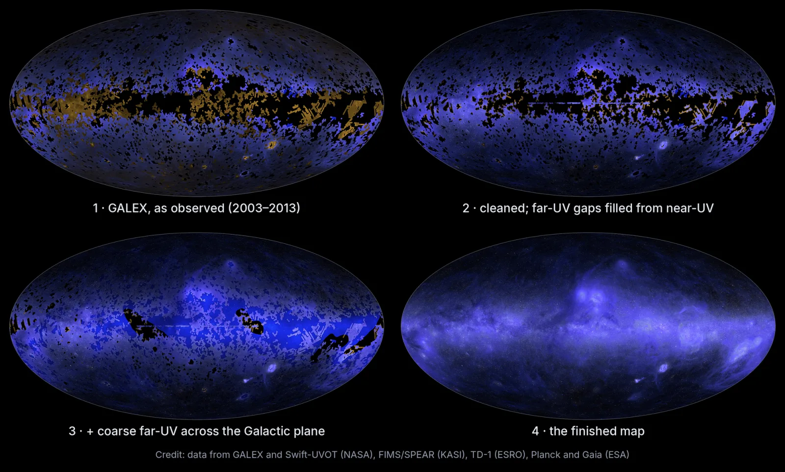
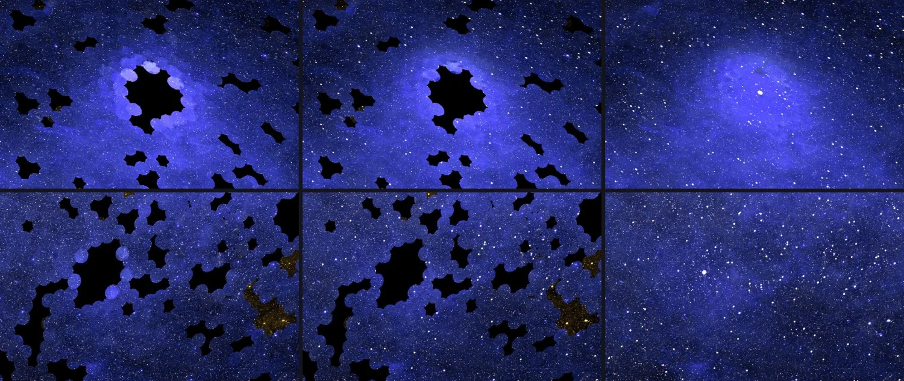

# A Third of Claude Science

_A third of the sky has never been observed in ultraviolet, and Claude Science filled that part in with estimates while marking every pixel as measured or predicted_

## Executive Summary

> [!callout]
> This article reads the ultraviolet sky map Anthropic published on October 8, 2026, from the data side. The ozone layer blocks ultraviolet light, so this band can only be observed from space, and NASA's GALEX, which flew from 2003 to 2013, imaged about two-thirds of the sky in some 38,000 observations. The remaining third has never been observed in ultraviolet at all.

> Claude Science, Anthropic's science agent, learned from the observed two-thirds how ultraviolet brightness relates to brightness at other wavelengths, then applied that relation to the empty third to estimate its values. In a test that deliberately hid patches where ultraviolet data already existed and asked the model to fill them back in, the estimates came within about 10% of the real measurements. The hidden patches, though, had been observed at least once, and the genuinely empty third holds much of the galactic plane, where the structure is far more tangled.

> The facts come from Anthropic's post and the coverage that followed it. The end of section 3, section 4, the end of section 5 and all of section 6 widen those facts toward data practice, looking at them through the eyes of someone who receives data with AI-filled values in it, and that reading belongs to this article.

### Key figures

Four numbers stand out. The first three say what this map estimated and how closely it hit, and the last one is both the count of GALEX observations the map was built on and the count that was reworked in full once a human pointed at a flaw.

Source: [Anthropic, "The Missing Map of the Sky" (2026-10-08)](https://www.anthropic.com/research/the-missing-map-of-the-sky).

<!-- stat-card -->
**One third** — Sky with no ultraviolet record — Much of the galactic plane falls here, and this share was filled entirely by estimate

<!-- stat-card -->
**About 10%** — Error on the hidden patches — After several rounds of refinement the gap from the real measurements came inside this

<!-- stat-card -->
**100 million+** — Stars inferred from visible light — The diffuse background was estimated first, then each star's ultraviolet brightness went on top

<!-- stat-card -->
**38,000** — GALEX observations behind the map — When a human pointed at the glow marks, every one of them was corrected again

*▲ The finished all-sky ultraviolet map. The brightest band is the plane of our own galaxy | Source: [Anthropic, "The Missing Map of the Sky"](https://www.anthropic.com/research/the-missing-map-of-the-sky)*

## A Third of Our Sky Has No Ultraviolet Record

Ultraviolet is light that cannot be observed from the ground. The ozone layer absorbs nearly all of it, so the telescope has to go up into space. Look at the sky in visible light and mostly you see stars. Look in ultraviolet and the dust lit by starlight comes out instead, in clouds wrapped around young stars and in the rings left where a star blew apart.

The widest sweep ever made in this band was NASA's GALEX. Between 2003 and 2013 it imaged roughly two-thirds of the sky across some 38,000 observations. There was a reason the rest was left out. Very bright stars can damage the detector, so they were skipped on purpose, and the plane of our own galaxy sits among the places avoided that way. The sky where the most stars are born was also the most awkward to observe.

*▲ From raw GALEX coverage (①) to the finished map (④). The black patches are where no ultraviolet observation existed | Source: [Anthropic](https://www.anthropic.com/research/the-missing-map-of-the-sky)*

Attempts to fill the gaps were made. NASA's Swift, the far-ultraviolet spectrograph FIMS/SPEAR aboard Korea's STSAT-1, and Europe's TD-1 each added observations of their own. Even so, a third of the sky was left with no ultraviolet record whatsoever. Gathering the scattered observations into one coordinate frame was still undone, and the reason it had been put off was not a missing technique. The calibration work is tedious and finicky and takes weeks or more. No astronomer had that much research time to give away.

The person who led this map is Brice Ménard, an astrophysicist at Johns Hopkins University and a researcher at Anthropic. The post Anthropic published carries his name as well. The account of the work and of the mistake that comes later is the account of the person who did the work.

## Filling the Blanks With What the Observed Two-Thirds Taught

Up to the point of merging the scattered observations into a single sheet, the job [Claude Science](/report/claude-science-workbench/en/) took on came in four pieces. It found and downloaded the ultraviolet data various missions had published, put the differing instrument scales onto terms that could be compared, cross-checked results from one telescope against another to merge them into one coordinate frame, and stripped the glare that spreads around bright stars. Ménard wrote that he would give the instructions and turn to other research while Claude Science ran the computations autonomously for hours.

The whole collaboration spread over several days. Work that nobody had touched because it would take weeks came down to days, but what caught Ménard's attention was not the time saved so much as the fact that the time no longer came out of his own research. He expects other scientists are sitting on projects shelved for the same reason.

The method used to fill the remaining third is called inpainting. The idea is the same as restoring an erased part of a photograph from its surroundings, except that the surrounding context here is not the neighboring pixel but another wavelength. Maps of the same patch of sky in visible, infrared and radio light already exist. Claude learned from the two-thirds where ultraviolet had been imaged how ultraviolet brightness relates to brightness in those bands, then applied that relation to the third with no ultraviolet data to estimate how each point would look.

*▲ The same sky in visible, infrared and radio light. The ultraviolet map estimated its blanks from the relation learned across these three | Source: [Anthropic](https://www.anthropic.com/research/the-missing-map-of-the-sky) (ESA Gaia DR3, NASA WISE, HI4PI)*

The underdrawing used for the blanks is written down by name. One is the dust map built by the European Space Agency's Planck, the other a hydrogen-alpha map that picks out one particular emission from hydrogen. Across the ultraviolet sky the broad glow comes mostly from dust and gas lit by starlight, so maps that already carry the distribution of those two became the base layer for the blanks.

This filled in the diffuse background. Stars were handled separately. From values the European Space Agency's Gaia satellite had measured in visible light, the ultraviolet brightness of more than 100 million stars was inferred and laid onto the estimated background one by one. The final map combines far-ultraviolet at 154 nanometers with near-ultraviolet at 232 nanometers, and the observations underneath it are GALEX and Swift, FIMS/SPEAR, TD-1, along with Planck and Gaia.

Look at the finished image alone and an observed pixel cannot be told from an estimated one. Below are the proportions and, beside them, what the labels shipped with the map record.

▲ Original Pebblous diagram. Layout and label content after Anthropic, "The Missing Map of the Sky" (2026-10-08).

## What 'Within About 10%' Proves and What It Does Not

How do you know how close an estimate is? The method used is plain enough. Some of the sky where ultraviolet data already existed was hidden on purpose, the model was asked to fill it back in, and the result was compared against the real measurements. It did not come out well at the first attempt. After several rounds of refinement the estimates landed within about 10% of the real measurements, a difference the eye can barely pick up.

What that number proves is clear. The relation that traces ultraviolet brightness back from other wavelengths does hold, and it can restore a hidden place with fair accuracy. What the number does not prove deserves the same attention. The hidden areas had been observed at least once. That means GALEX had been able to image them, which in turn means sky without very bright stars and with relatively simple structure. The technology outlet Runtimewire put the point this way: "The test shows performance in selected known regions; it does not establish that predictions in unobserved parts of the sky are equally accurate."

The empty third really is unlike what the test hid. Much of the galactic plane falls inside it, and the galactic plane is among the most tangled stretches of sky, with dust and gas and young stars wound together. A model that practiced on the easy problems and scored within 10% is not guaranteed the same score on the hard ones. This is not a condition peculiar to astronomy. It attaches to every piece of work that measures performance by setting aside a validation sample. The sample set aside is the sample that could be set aside, and the gap you actually want to fill is a gap precisely because there was no sample there to begin with.

## This Map Writes Down Which Pixels Are Estimates

The limit described in the previous section does not go away with more computation. Confirming accuracy in an unobserved region means observing that region, and had that been possible there would have been nothing to estimate in the first place. This map chose to write into the data where the limit sits, rather than to claim the limit had been removed.

The published map ships with separate layers. Every single pixel is marked 'measured' or 'predicted', and pixels classified as predicted carry an uncertainty estimate alongside. The map is posted on Ménard's research site, where anyone can download it.

> [!callout]
> The worth of this design is separate from the accuracy of the estimates. Whether the figure is 10% or 30%, a researcher coming later can decide for themselves as long as it is written down which pixels are estimates. They can narrow their scope to the measured regions outside the galactic plane, or use the predicted pixels while folding the uncertainty into their error budget, or check whether their result shows up only in the estimated regions. Without the labels every one of those options disappears. Only two branches remain: believe all of it, or throw all of it out.

Turn that around and the condition of unlabeled data comes into view as well. That estimates are mixed in is not itself the problem. Interpolation and extrapolation have always been used in science. The problem arrives when that fact stops traveling with the data. After a table has been copied once or twice, which cell came from where lives only in the head of whoever made the original, and that person is usually not in the room for the next analysis.

## Two Agent Reviews Missed a Mark a Human Eye Caught

With the map all but finished, Ménard saw something odd in the dark regions. Faint circles scattered about, each a shade brighter or darker than its surroundings. They were not objects in the sky but the footprint of the field of view GALEX left behind with every exposure. The cause was residual glow rising off the Earth's atmosphere, which mixed into each observation differently and had not been fully subtracted.

*▲ Left to right: individual-observation glow marks, faint traces remaining after a first correction, and the finished map. The flaw Ménard caught disappears across this sequence | Source: [Anthropic](https://www.anthropic.com/research/the-missing-map-of-the-sky)*

Ménard told Claude that he could see disks marked by individual observations and asked whether it could fix them, and Claude recalibrated that glow across all 38,000 observations. The part worth dwelling on is not the speed of the fix. Anthropic writes that the map had passed two rounds of review by other agents without the problem being caught.

It was not an overlooked problem, either. Claude had listed this glow as a known issue at the start of the project. It was an item already on the list, and two rounds of review let it through anyway.

It was also the kind of flaw that is easy to miss. The circles were faint, small enough in numerical terms to escape any statistic, and the data itself would have satisfied every check on format and range. Recognizing the mark as a flaw takes knowing at once what the GALEX field of view looks like and what shape atmospheric glow leaves behind. That knowledge is not inside the map. It is inside someone who has watched the field for a long time.

## Why Pebblous Is Watching This Map

The story is astronomy, but the structure turns up daily wherever data is handled. A column whose missing values were filled with the mean, a label a model supplied, a training set topped up with synthetic data in the ranges that ran short: all of them have the same shape. A relation learned on the observed part, applied to the part that was not observed, and once applied it sits in the table as a number indistinguishable from the original ones.

What makes this map uncommon is not that it estimated but that it left a record in the table of where it estimated. In data work that distinction is usually the first thing to go. It falls off while files are merged, gets wiped while column names are tidied, and folds into a single average on the way into a report. A distinction once lost does not come back. It is not a record that can be rebuilt afterward. It only survives if it is written down at the moment the blank is filled.

So three questions should follow data that AI has touched.

- Which cells are observations and which are filled-in values? If that cannot be answered cell by cell, the table has already lost the distinction.
- Did the filled-in values arrive with an uncertainty? An estimate on its own and an estimate with a range attached are used in completely different ways in the next calculation.
- What did the accuracy test cover and what did it leave empty? Whether the validation sample set aside resembles the gap you actually mean to fill is not written next to the score.

One share belongs to the human side. Ménard caught a flaw that neither a format check nor a statistic would have flagged, and the grounds for recognizing it were domain knowledge living outside the data. Adding more review does not solve it. Run the same automated review three times and it would have passed three times. The place where a human has to stay is the point only someone who knows the field can feel is wrong, not the place where every output gets looked at again.

Thanks for reading this far. The facts in this article were checked against [Anthropic's post](https://www.anthropic.com/research/the-missing-map-of-the-sky), and the point about the limits of the validation is quoted separately from [Runtimewire's report](https://runtimewire.com/article/anthropic-claude-science-ultraviolet-sky-map). Why no institution steps forward to merge observations from different surveys was covered in [an earlier article](/blog/cross-survey-infrastructure-gap/en/), and how far to trust the automated judgments an astronomy pipeline pours out was taken up in [the piece on alert classification at the Rubin Observatory](/report/rubin-observatory-alert-classification/en/). If your team has a way of marking the values a model filled in, we would be glad to hear it.

## References

### Primary sources

- 1.Ménard, B. (2026). "[The Missing Map of the Sky](https://www.anthropic.com/research/the-missing-map-of-the-sky)." _Anthropic_, 2026-10-08. — The primary source for most of the facts in this article. It carries the 38,000 GALEX observations and the two-thirds coverage, how avoiding bright stars left the galactic plane out, the method of learning the relation to other wavelengths to estimate the remaining third and the Planck dust and hydrogen-alpha templates used for gap-filling, the more than 100 million stars inferred from Gaia, far-ultraviolet at 154 nanometers and near-ultraviolet at 232 nanometers, the roughly 10% error on the hidden patches, the per-pixel measured and predicted labels with uncertainty estimates, the account of the whole collaboration spreading over several days where doing it properly would have taken weeks, and the account of two rounds of agent review missing the atmospheric glow even though Claude had listed it as a known issue at the start of the project.
- 2.Ménard, B. (2026). "[The UV Sky Map](https://menard.pha.jhu.edu/uvmap/)." _Johns Hopkins University_. — Where the finished map is published.

### Industry and press

- 3.Merket, R. (2026). "[Anthropic's Claude Science builds the first full ultraviolet map of the sky](https://runtimewire.com/article/anthropic-claude-science-ultraviolet-sky-map)." _Runtimewire_, 2026-10-08. — The source for the point that a test on hidden patches does not establish accuracy in unobserved regions. The sentence quoted in section 3 is here.
- 4.Bastian, M. (2026). "[Anthropic's Claude Science creates the first complete ultraviolet map of the sky](https://the-decoder.com/anthropics-claude-science-creates-the-first-complete-ultraviolet-map-of-the-sky/)." _The Decoder_. — Coverage confirming the summary that GALEX imaged two-thirds of the sky while skipping the bright regions where stars are born, and Ménard's observation that many scientists are sitting on comparable projects.
- 5.Park, C. (2026). "[Anthropic's Claude Science completes the first all-sky ultraviolet map](https://www.aitimes.com/news/articleView.html?idxno=216106)." _AI Times_, 2026-10-09. — The Korean-language source for the contribution of FIMS/SPEAR aboard Korea's STSAT-1, for the background that all-sky maps had been deferred because calibration takes weeks or more, and for Ménard's remark that the computation ran autonomously while he gave instructions and worked on other research.
