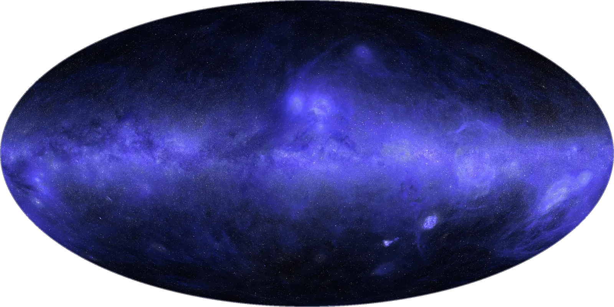
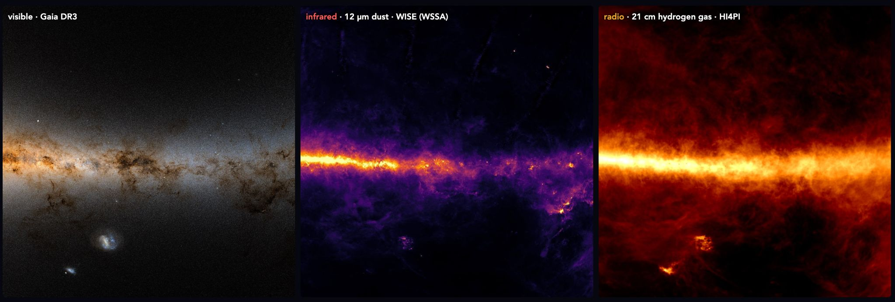

# 클로드 사이언스가 그린 자외선 하늘, 어디까지가 진짜 관측일까?

_하늘 3분의 1은 자외선으로 관측된 적이 없다 — 클로드 사이언스는 그 자리를 추정으로 채우고, 어디가 추정인지 표시했다_

## Executive Summary

> [!callout]
> 이 글은 앤트로픽이 2026년 10월 8일 공개한 자외선 하늘 지도를 데이터 쪽에서 읽는다. 오존층이 자외선을 막아 이 빛은 우주에 나가야만 관측할 수 있고, 2003년부터 2013년까지 날았던 미 항공우주국의 갈렉스(GALEX)가 약 3만 8천 회 관측으로 하늘의 3분의 2를 찍었다. 나머지 3분의 1은 지금까지 자외선으로 한 번도 관측된 적이 없다.

> 앤트로픽의 과학 에이전트 클로드 사이언스는 관측된 3분의 2에서 자외선 밝기가 다른 파장의 밝기와 어떻게 맞물리는지를 배운 뒤, 그 관계를 빈 3분의 1에 적용해 값을 추정했다. 이미 자외선 데이터가 있는 하늘을 일부러 가리고 맞혀 보는 시험에서 추정값은 실제 측정값과 약 10% 안쪽으로 들어왔다. 다만 가린 곳은 한 번은 관측된 적이 있고, 진짜 빈 3분의 1에는 구조가 훨씬 복잡한 은하면이 상당 부분 들어 있다.

> 사실관계는 앤트로픽 공식 글과 그것을 받은 보도에서 가져왔다. 그 사실을 데이터 실무 쪽으로 넓혀 읽는 3절 끝과 4절, 5절 끝, 그리고 6절은 AI가 채운 값이 섞인 데이터를 받아 쓰는 쪽의 눈으로 다시 본 이 글의 해석이다.

### 주요 수치

네 숫자를 뽑았다. 앞의 셋은 이 지도가 무엇을 추정했고 얼마나 맞혔는지를 말하고, 마지막 하나는 지도의 바탕이 된 갈렉스 관측의 수이자 사람이 결함을 짚었을 때 전부 다시 손댄 관측의 수다.

출처: [Anthropic, "The Missing Map of the Sky" (2026-10-08)](https://www.anthropic.com/research/the-missing-map-of-the-sky).

<!-- stat-card -->
**3분의 1** — 자외선 관측 기록이 없는 하늘 — 은하면 상당 부분이 여기 들어가고, 이 몫은 전부 추정으로 채웠다

<!-- stat-card -->
**약 10%** — 일부러 가리고 맞혀 본 오차 — 여러 차례 다듬은 끝에 실제 측정값과의 차이가 이 안으로 들어왔다

<!-- stat-card -->
**1억 개 이상** — 가시광에서 역산한 별 — 흐릿한 배경을 추정한 뒤 그 위에 별 하나하나의 자외선 밝기를 얹었다

<!-- stat-card -->
**38,000회** — 지도의 바탕이 된 갈렉스 관측 — 사람이 잔광 자국을 짚자 이 전부를 다시 보정했다

*▲ 완성된 전천 자외선 지도. 가장 밝은 띠가 우리 은하 평면이다 | Source: [Anthropic, "The Missing Map of the Sky"](https://www.anthropic.com/research/the-missing-map-of-the-sky)*

## 아무도 자외선으로 본 적 없는 하늘이 3분의 1이다

자외선은 지상에서 관측할 수 없는 빛이다. 오존층이 거의 전부 막아 버리기 때문에 망원경을 우주로 올려야 한다. 가시광으로 하늘을 보면 주로 별이 보이지만, 자외선으로 보면 별빛을 받아 빛나는 먼지가 드러난다. 어린 별을 감싼 구름이나 별이 터진 자리에 남은 고리 같은 것들이 여기 속한다.

이 파장을 가장 넓게 훑은 관측은 미 항공우주국의 갈렉스였다. 2003년부터 2013년까지 약 3만 8천 회에 걸쳐 하늘의 3분의 2가량을 찍었다. 나머지를 비워 둔 데에는 이유가 있다. 아주 밝은 별이 있으면 검출기가 상할 수 있어 일부러 건너뛰었는데, 그렇게 피한 곳에 우리 은하의 평면이 상당 부분 들어간다. 별이 가장 많이 태어나는 하늘이 곧 관측이 가장 부담스러운 자리였던 셈이다.

*▲ 갈렉스 원본 관측(①)부터 빈틈을 메운 완성 지도(④)까지. 검은 칸이 자외선 관측이 없던 자리다 | Source: [Anthropic](https://www.anthropic.com/research/the-missing-map-of-the-sky)*

빈칸을 메우려는 시도가 없었던 것은 아니다. 미 항공우주국의 스위프트(Swift), 한국 과학기술위성 1호에 실린 원자외선 분광기 FIMS/SPEAR, 유럽의 TD-1이 저마다 자외선 관측을 보탰다. 그런데도 하늘의 3분의 1은 자외선 기록이 아예 없는 상태로 남았다. 흩어진 관측을 한 좌표계로 모으는 일이 남아 있었고, 그 일이 미뤄져 온 이유는 기술이 없어서가 아니었다. 지루하고 까다로운 보정 작업에 수주일 이상이 걸리기 때문이다. 연구 시간을 그만큼 떼어 낼 천문학자가 없었다.

이번 지도를 이끈 사람은 존스홉킨스대 천체물리학자이자 앤트로픽 연구원인 브라이스 메나르다. 앤트로픽이 낸 글도 그의 이름으로 적혀 있다. 뒤에 나오는 작업 과정과 실수 이야기는 모두 작업한 당사자의 서술이다.

## 빈 자리는 관측된 3분의 2에서 배운 관계로 채웠다

흩어진 관측을 한 장으로 합치기까지 [클로드 사이언스](/report/claude-science-workbench/ko/)가 맡은 일은 네 토막이었다. 여러 미션이 공개해 둔 자외선 데이터를 찾아 내려받고, 기기마다 다른 눈금을 서로 견줄 수 있게 맞추고, 다른 망원경의 결과를 교차 확인해 하나의 좌표계로 합치고, 밝은 별 주변에 번진 빛을 걷어냈다. 메나르는 자기가 지시를 내리고 다른 연구를 하는 동안 클로드 사이언스가 몇 시간에 걸쳐 자율적으로 계산을 수행했다고 적었다.

전체 작업은 며칠에 걸쳐 이뤄졌다. 수주일이 걸려 아무도 손대지 않던 일이 며칠로 줄어든 셈인데, 메나르가 눈여겨본 것은 줄어든 시간 자체가 아니라 그 시간이 자기 연구에서 빠져나가지 않았다는 쪽이었다. 그는 비슷한 이유로 뒤로 미뤄 둔 프로젝트가 다른 과학자들에게도 많을 것으로 봤다.

남은 3분의 1을 채운 방법은 인페인팅이라 부르는 기법이다. 사진에서 지워진 부분을 주변 맥락으로 복원하는 것과 같은 발상인데, 여기서 주변 맥락 노릇을 한 것은 옆 픽셀이 아니라 다른 파장이다. 하늘의 같은 곳을 가시광·적외선·전파로 찍은 지도는 이미 있다. 클로드는 자외선이 찍힌 3분의 2에서 자외선 밝기가 이 파장들의 밝기와 어떻게 맞물리는지를 배운 뒤, 그 관계를 자외선 데이터가 없는 3분의 1에 적용해 각 지점이 어떻게 보일지를 추정했다.

*▲ 같은 하늘을 가시광·적외선·전파로 찍은 모습. 자외선 지도는 이 세 장에서 배운 관계로 빈 자리를 추정했다 | Source: [Anthropic](https://www.anthropic.com/research/the-missing-map-of-the-sky) (ESA Gaia DR3, NASA WISE, HI4PI)*

빈칸의 밑그림으로 무엇을 썼는지는 이름까지 적혀 있다. 유럽우주국 플랑크가 만든 먼지 지도와, 수소가 내는 특정 빛만 골라 찍은 수소-알파 지도다. 자외선 하늘에서 넓게 퍼져 보이는 것이 주로 별빛을 받은 먼지와 가스이니, 그 둘의 분포를 이미 담고 있는 지도가 빈 자리의 바탕이 됐다.

이렇게 채운 것은 흐릿하게 퍼진 배경이다. 별은 따로 다뤘다. 유럽우주국의 가이아(Gaia) 위성이 가시광으로 측정해 둔 값에서 별 1억 개 이상의 자외선 밝기를 역산해, 추정된 배경 위에 하나씩 얹었다. 최종 지도는 원자외선 154나노미터와 근자외선 232나노미터를 합친 것이고, 바탕이 된 관측은 갈렉스와 스위프트, FIMS/SPEAR, TD-1, 그리고 플랑크(Planck)와 가이아다.

결과물 한 장만 보면 관측된 곳과 추정된 곳은 구별되지 않는다. 아래는 그 비율과, 지도에 함께 실린 라벨이 무엇을 적어 두었는지를 나란히 놓은 것이다.

▲ 페블러스 원본 도식. 구성·라벨 내용의 출처는 Anthropic, "The Missing Map of the Sky" (2026-10-08).

## '10% 안쪽'이 증명하는 것과 증명하지 않는 것

추정이 얼마나 맞는지는 어떻게 아는가. 쓴 방법은 간단하다. 이미 자외선 데이터가 있는 영역 가운데 일부를 일부러 가리고, 모델이 그곳을 맞혀 보게 한 다음 실제 측정값과 비교했다. 처음부터 잘 맞은 것은 아니고, 여러 차례 다듬은 끝에 추정값이 실제 측정값과 약 10% 안쪽으로 들어왔다. 눈으로는 거의 구별되지 않는 차이다.

이 수가 증명하는 것은 분명하다. 다른 파장에서 자외선 밝기를 되짚는 관계가 실제로 성립하고, 그 관계로 가려진 값을 꽤 정확히 복원할 수 있다는 것이다. 그러나 증명하지 않는 것도 같이 봐야 한다. 가린 자리는 어디까지나 한 번은 관측됐던 곳이다. 갈렉스가 찍을 수 있었던, 아주 밝은 별이 없고 구조가 비교적 단순한 하늘이라는 뜻이다. 기술 매체 런타임와이어는 이 점을 두고 "이 시험은 골라낸 기존 관측 영역에서의 성능을 보여 줄 뿐, 관측되지 않은 하늘의 예측이 똑같이 정확하다는 것을 입증하지는 않는다"고 적었다.

실제로 빈 3분의 1은 가려 본 영역과 성격이 다르다. 그 안에는 은하면이 상당 부분 들어 있고, 은하면은 먼지와 가스와 어린 별이 뒤엉켜 하늘에서 가장 복잡한 구간에 속한다. 쉬운 문제로 연습해 10% 안쪽을 받은 모델이 어려운 문제에서도 같은 점수를 받으리라는 보장은 없다. 이것은 천문학에만 있는 사정이 아니라 검증용 표본을 떼어 내 성능을 재는 모든 작업에 따라붙는 사정이다. 떼어 낸 표본은 떼어 낼 수 있었던 표본이고, 정작 메우려는 공백은 애초에 표본이 없어서 공백이다.

## 이 지도는 어느 칸이 추정인지 적어 뒀다

앞 절의 한계는 더 많이 계산한다고 사라지지 않는다. 미관측 영역의 정확도를 확인하려면 그 영역을 관측하는 수밖에 없고, 그게 가능했다면 애초에 추정할 일도 없었다. 이 지도가 택한 쪽은 한계를 없앴다고 주장하는 것이 아니라 한계가 어디에 있는지를 데이터에 적어 두는 것이었다.

공개된 지도에는 별도의 층이 함께 실려 있다. 픽셀 하나하나에 '측정됨'인지 '예측됨'인지가 붙고, 예측으로 분류된 픽셀에는 불확실도 추정값이 따라붙는다. 지도는 메나르의 연구 사이트에 공개돼 누구나 내려받을 수 있다.

> [!callout]
> 이 설계의 값어치는 추정의 정확도와 별개다. 10%든 30%든, 어느 칸이 추정인지 적혀 있으면 뒤에 오는 연구자가 스스로 판단할 수 있다. 은하면 밖의 측정 영역만 써서 분석하겠다고 범위를 좁힐 수도 있고, 예측 칸을 쓰되 불확실도를 오차에 포함시킬 수도 있고, 자기 결과가 추정 영역에서만 나타나는지 확인해 볼 수도 있다. 라벨이 없으면 이 선택지가 전부 사라진다. 남는 것은 전부 믿거나 전부 버리는 두 갈래뿐이다.

뒤집어 보면 라벨이 붙지 않은 데이터가 어떤 상태인지도 드러난다. 추정이 섞여 있다는 사실 자체가 문제가 아니다. 과학에서 보간과 외삽은 늘 쓰여 왔다. 문제는 그 사실이 데이터와 함께 이동하지 않을 때 생긴다. 표가 두어 번 복사되고 나면 어느 칸이 어디서 왔는지는 원본을 만든 사람 머릿속에만 남고, 그 사람은 대개 다음 분석 자리에 없다.

## 에이전트 검토 두 번이 놓친 자국을 사람 눈이 잡았다

지도가 거의 완성됐을 무렵 메나르가 어두운 영역에서 이상한 것을 봤다. 주변보다 아주 조금 밝거나 어두운 희미한 원들이 흩어져 있었다. 하늘에 있는 천체가 아니라 갈렉스가 한 번 찍을 때마다 남긴 시야의 발자국이었다. 원인은 지구 대기에서 올라온 잔광이었다. 관측마다 다르게 섞여 들어간 그 몫이 다 걷히지 않았다.

*▲ 왼쪽부터 개별 관측의 잔광 자국, 1차 보정 후 남은 자국, 완성된 지도. 메나르가 짚어낸 결함이 이 과정에서 사라졌다 | Source: [Anthropic](https://www.anthropic.com/research/the-missing-map-of-the-sky)*

메나르는 클로드에게 개별 관측의 자국이 찍힌 원반들이 보인다며 고칠 수 있겠느냐고 물었고, 클로드는 3만 8천 회 관측 전부에 대해 그 잔광을 다시 보정했다. 여기서 눈여겨볼 대목은 고친 속도가 아니다. 앤트로픽은 이 지도가 다른 에이전트들의 검토를 두 차례 통과하는 동안 이 문제가 한 번도 잡히지 않았다고 적는다.

모르고 지나친 문제도 아니었다. 클로드는 프로젝트를 시작할 때 이 잔광을 알려진 문제로 이미 적어 두었다. 목록에 올라 있던 항목인데도 검토 두 번이 그대로 통과시킨 것이다.

놓칠 만한 결함이기도 했다. 원들은 희미했고, 수치로는 어느 통계에도 걸리지 않을 만큼 작았으며, 데이터 자체는 형식과 범위를 모두 만족했을 것이다. 이 자국이 결함이라는 것을 알아보려면 갈렉스 관측의 시야가 어떻게 생겼는지와 대기 잔광이 어떤 모양으로 남는지를 동시에 알고 있어야 한다. 그 지식은 지도 안에 들어 있지 않고 그 분야를 오래 본 사람에게 들어 있다.

## 페블러스가 이 지도를 주목하는 이유

천문학 이야기지만 데이터를 다루는 자리에서 매일 만나는 구조다. 결측치를 평균으로 메운 열, 모델이 채워 넣은 라벨, 부족한 구간을 합성 데이터로 보충한 학습 집합은 전부 같은 모양이다. 관측된 부분에서 배운 관계를 관측되지 않은 부분에 적용한 값이고, 적용한 뒤에는 원래 값과 똑같은 숫자로 한 표 안에 앉는다.

이 지도가 흔하지 않은 이유는 추정을 해서가 아니라 추정한 자리를 표에 남겼기 때문이다. 데이터 쪽 일에서 이 구분은 대개 가장 먼저 사라진다. 파일을 합치면서 떨어져 나가고, 열 이름을 정리하면서 지워지고, 보고서로 옮기면서 평균 하나로 접힌다. 그리고 한 번 사라진 구분은 복원되지 않는다. 사후에 다시 만들 수 있는 기록이 아니라 처음 채울 때 같이 적어야만 남는 기록이기 때문이다.

그래서 AI가 손댄 데이터를 넘겨받을 때 따라붙어야 할 질문이 셋이다.

- 어느 칸이 관측이고 어느 칸이 채워 넣은 값인가. 칸 단위로 답할 수 없다면 그 표는 이미 구분을 잃은 상태다.
- 채워 넣은 값에 불확실도가 같이 왔는가. 추정치 하나만 오는 것과 추정치에 폭이 붙어 오는 것은 다음 계산에서 전혀 다르게 쓰인다.
- 정확도를 잰 시험이 무엇을 덮고 무엇을 비웠는가. 떼어 낸 검증 표본과 실제로 메우려는 공백이 같은 성격인지는 점수 옆에 적히지 않는다.

마지막으로 사람 쪽 몫이 남는다. 메나르가 잡아낸 것은 형식 검사로도 통계로도 걸리지 않는 결함이었고, 그것을 알아본 근거는 데이터 밖에 있는 도메인 지식이었다. 검토를 더 늘리는 것으로는 해결되지 않는다. 같은 자동 검토를 세 번 돌렸어도 세 번 다 통과했을 것이다. 사람이 남아야 할 자리는 모든 산출물을 다시 보는 곳이 아니라, 그 분야를 아는 사람만 이상하다고 느낄 수 있는 지점이다.

여기까지 읽어 주셔서 감사하다. 이 글의 사실관계는 [앤트로픽 공식 글](https://www.anthropic.com/research/the-missing-map-of-the-sky)에서 확인했고, 검증의 한계에 관한 지적은 [런타임와이어 보도](https://runtimewire.com/article/anthropic-claude-science-ultraviolet-sky-map)에서 따로 인용했다. 서로 다른 관측을 합치는 일에 어느 기관도 나서지 않는 사정은 [앞선 글](/blog/cross-survey-infrastructure-gap/ko/)에서, 천문 파이프라인이 쏟아 내는 자동 판단을 어디까지 믿을지는 [루빈 천문대 알림 분류를 다룬 글](/report/rubin-observatory-alert-classification/ko/)에서 각각 짚은 적이 있다. 여러분의 팀은 모델이 채운 값을 어떤 방식으로 표시해 두는지 나눠 주시면 좋겠다.

## 참고문헌

### 1차 출처

- 1.Ménard, B. (2026). "[The Missing Map of the Sky](https://www.anthropic.com/research/the-missing-map-of-the-sky)." _Anthropic_, 2026-10-08. — 이 글의 사실관계 대부분이 나온 1차 출처. 갈렉스 3만 8천 회 관측과 하늘 3분의 2 커버리지, 밝은 별 회피로 은하면이 빠진 경위, 다른 파장과의 관계를 배워 3분의 1을 추정한 방법과 빈칸을 채울 때 쓴 플랑크 먼지·수소-알파 밑그림, 가이아에서 역산한 별 1억 개 이상, 원자외선 154나노미터·근자외선 232나노미터, 가린 자리를 맞혀 본 약 10% 오차, 픽셀별 측정·예측 라벨과 불확실도 추정값, 전체 작업이 며칠에 걸쳐 이뤄졌고 제대로 하자면 수주일이 걸리는 일이었다는 서술, 대기 잔광을 클로드가 프로젝트 초기에 알려진 문제로 적어 뒀음에도 저자가 발견할 때까지 에이전트 검토 두 차례가 놓쳤다는 서술이 모두 여기 있다.
- 2.Ménard, B. (2026). "[The UV Sky Map](https://menard.pha.jhu.edu/uvmap/)." _Johns Hopkins University_. — 완성된 지도가 공개된 자리.

### 업계·보도

- 3.Merket, R. (2026). "[Anthropic's Claude Science builds the first full ultraviolet map of the sky](https://runtimewire.com/article/anthropic-claude-science-ultraviolet-sky-map)." _Runtimewire_, 2026-10-08. — 가린 자리를 맞혀 본 시험이 미관측 영역의 정확도를 입증하지는 않는다는 지적의 출처. 3절에 인용한 문장이 여기 있다.
- 4.Bastian, M. (2026). "[Anthropic's Claude Science creates the first complete ultraviolet map of the sky](https://the-decoder.com/anthropics-claude-science-creates-the-first-complete-ultraviolet-map-of-the-sky/)." _The Decoder_. — 갈렉스가 하늘의 3분의 2를 찍고 별이 태어나는 밝은 영역을 건너뛰었다는 정리, 비슷한 작업을 미뤄 둔 과학자가 많을 것이라는 메나르의 관측을 확인한 보도.
- 5.박찬. (2026). "[앤트로픽 '클로드 사이언스', 인류 최초 자외선 전체 하늘 지도 완성](https://www.aitimes.com/news/articleView.html?idxno=216106)." _AI타임스_, 2026-10-09. — 한국 과학기술위성 1호에 실린 FIMS/SPEAR의 기여, 보정 작업에 수주일 이상이 걸려 전천 지도가 미뤄져 왔다는 배경, 지시를 내리고 다른 연구를 하는 동안 계산이 자율로 돌아갔다는 메나르 발언의 한국어 출처.
