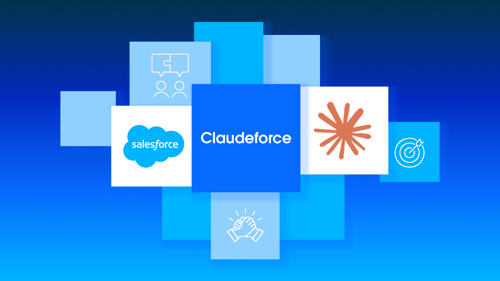
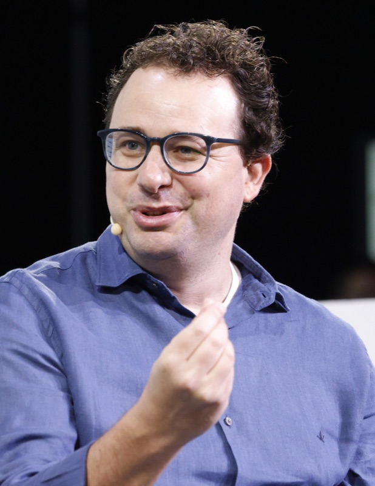

# 클로드 안으로 들어간 세일즈포스 영업 스킬 37개

_클로드포스는 서로의 인터페이스를 열었고, 권한 승인과 감사 추적은 세일즈포스에 남았습니다_

## Executive Summary

> [!callout]
> 2026년 8월 26일 세일즈포스와 앤트로픽이 클로드포스라는 이름으로 파트너십 확대를 발표했습니다. 발표의 절반은 익숙한 방향입니다. 클로드가 에이전트포스의 추론 모델로 들어가고 슬랙의 기본 모델이 됩니다. 이 가운데 세일즈포스 제품 쪽에서 도는 클로드는 아마존 베드록을 거쳐 세일즈포스가 트러스트 바운더리라고 부르는 경계 안에서 제공됩니다. 규제 산업 고객은 모델을 자기 기록 가까이 들이기 전에 바로 이 경로를 요구합니다.

> 나머지 절반은 방향이 반대입니다. 세일즈포스는 사전 구축한 영업 스킬 37개를 플러그인으로 묶어 클로드 인터페이스 안에 넣었습니다. 25년 동안 자사 화면이 기업 업무가 벌어지는 곳이라고 말해 온 회사가 자기 제품을 다른 회사 화면의 구성요소로 넣기로 했습니다. 그런데 실행 경로는 그대로 두었습니다. 세일즈포스 인 클로드는 작업을 세일즈포스를 거쳐 실행해, 조치가 일어날 때 비즈니스 규칙이 항상 적용되도록 합니다.

> 화면이 어디에 있느냐와 권한 승인과 감사 로그가 어디에 남느냐는 서로 다른 결정입니다. 이번 발표에서 세일즈포스는 앞의 것을 내주고 뒤의 것을 쥐었습니다. AI 벤더와 마주 앉을 때 먼저 확인해야 할 항목도 대부분 뒤쪽에 몰려 있습니다.

### 주요 수치

발표에서 반복해 인용되는 숫자는 넷입니다. 앞의 둘은 제품이 어떤 모양으로 나오는지를, 뒤의 둘은 두 회사가 발표 이전에 이미 서로에게 들인 규모를 말합니다.

출처: [세일즈포스 보도자료](https://www.salesforce.com/news/press-releases/2026/08/26/salesforce-and-anthropic-announce-claudeforce/) (2026-08-26) 및 [TheNextWeb](https://thenextweb.com/news/salesforce-anthropic-claudeforce-partnership) (2026-08-27)

<!-- stat-card -->
**37개** — 클로드 안에서 도는 영업 스킬 — 미팅 준비, 딜 헬스 리뷰, 파이프라인 리뷰 같은 영업 주간의 일과를 다룹니다. 세일즈포스와 앤트로픽이 함께 만들었습니다

<!-- stat-card -->
**1회** — 관리자가 연결하는 횟수 — 인증과 권한을 중앙에서 관리해, 사용자별 설정도 새 권한 모델도 계정별 재감사도 없이 팀 전원이 첫날부터 씁니다

<!-- stat-card -->
**3억 달러** — 올해 앤트로픽 토큰 지출 예상액 — 발표 전부터 두 회사의 관계가 어느 정도였는지 보여 주는 숫자입니다. 세일즈포스가 보유한 앤트로픽 지분은 약 50억 달러로 평가됩니다

<!-- stat-card -->
**810만 시간** — 슬랙봇이 만든 연환산 생산성 — 세일즈포스 사내 수치이며 전 분기 대비 두 배 넘게 늘었습니다. 슬랙봇을 구동하는 모델이 클로드라고 보도자료는 밝혔습니다

## 클로드포스는 세 방향을 한꺼번에 열었다

보도자료가 묶어 놓은 통합은 세 갈래입니다. 첫째, 세일즈포스 인 클로드입니다. 37개의 사전 구축 영업 스킬을 담은 플러그인으로, 판매자가 실시간 매출 맥락 위에서 추론하고 파이프라인을 갱신하며 클로드 안에서 통제된 조치를 실행하게 합니다. 둘째, 세일즈포스 안의 클로드입니다. 클로드는 아틀라스 추론 엔진의 추론 모델로 쓰이고, 에이전트포스 바이브스와 에이전트포스 코워커를 기본으로 구동하며, 에이전트 빌더에서도 선택할 수 있습니다. 셋째, 슬랙입니다. 클로드가 슬랙의 기본 모델이 되어 슬랙봇을 구동하고, 클로드 태그로 팀의 의사결정을 거들며, 슬랙 코드의 창립 파트너로 들어갑니다.

*▲ 세일즈포스와 앤트로픽이 공개한 클로드포스 공식 캠페인 이미지 | Source: [세일즈포스 뉴스룸](https://www.salesforce.com/news/press-releases/2026/08/26/salesforce-and-anthropic-announce-claudeforce/)*

클로드를 기본 모델로 앉힌 대형 벤더가 세일즈포스가 처음은 아닙니다. TheNextWeb은 그 점을 먼저 확인한 뒤, 추론 엔진과 에이전트 빌더와 메신저 제품을 한 번에 덮었다는 폭이 이번 발표에서 두드러진다고 봤습니다. 같은 기사에 따르면 에이전트포스 통합은 발표 시점에 이미 가동 중이었습니다.

세 갈래를 실제로 성립시키는 부품은 따로 있습니다. 세일즈포스는 세일즈포스 인 클로드가 AIforce 덕분에 가능하다고 적었습니다. AIforce는 업무 데이터와 워크플로를 MCP 서버와 API, CLI 도구를 통해 어떤 에이전트에게든 전달하는 하니스입니다. 프로토콜 표준화가 끝난 자리에 남아 있던 인가와 연결의 몫을 벤더가 직접 채워 넣은 형태이고, 페블러스 블로그가 [A2A와 MCP의 재단 통합을 다루면서](/blog/a2a-mcp-agentic-ai-foundation-authorization/ko/) 기업 몫으로 남는다고 짚었던 부분이 여기서 제품 사양으로 나타납니다.

네 번째로 보도자료가 따로 세운 항목은 상호 채택입니다. 세일즈포스는 앤트로픽이 선호하는 CRM이고, 앤트로픽 내부의 소통과 워크플로와 에이전트는 슬랙으로 이어집니다. 보도자료는 여기에 제품 이름까지 적어 두었습니다. 앤트로픽의 보안과 복원력, 개발을 세일즈포스 실드와 백업, 샌드박스가 받칩니다. 모델을 만드는 회사가 상대편의 보안 제품군을 통째로 들여 쓰고 있습니다. 반대편에서 세일즈포스는 클로드 코드와 클로드 엔터프라이즈를 전 개발자와 지식 근로자에게 제공하기로 했습니다. 두 회사는 서로에게 팔면서 동시에 서로의 고객이 됩니다. 발표 일정은 파일럿 고객 우선 제공이고, 오픈 베타는 2026년 9월, 추가 스킬은 2026년 말부터입니다. 가격은 어느 항목에도 공개되지 않았습니다.

클로드포스는 세일즈포스의 2027 회계연도 2분기 실적 발표와 같은 날 공개됐고, CRM 주가는 시간외 거래에서 급등했습니다. 실적 발표 자리에서 마크 베니오프 회장은 이른바 SaaS 종말론을 겨냥해 "이 SaaSpocalypse라는 헛소리, 이제 그만할 때가 됐다고 생각합니다"라고 말했습니다. AI가 기존 업무용 소프트웨어를 잠식한다는 시장의 이야기에 구조로 답한 셈입니다.

## 세일즈포스가 25년 지켜 온 전제를 접었다

엔터프라이즈 AI 배치에서 익숙한 그림은 한 방향입니다. 고객의 데이터는 움직이지 않고, 모델이 고객이 이미 심사를 마친 경계 안으로 들어옵니다. 베드록을 거쳐 세일즈포스 트러스트 바운더리 안에서 클로드를 쓰는 경로가 정확히 그 형태입니다. 이번 발표에서 새로운 쪽은 그 반대 방향입니다. 데이터를 쥔 회사가 자기 기능을 들고 모델 회사의 화면 안으로 걸어 들어갔습니다.

보도자료는 이 이동을 소프트웨어의 정의가 바뀌는 일로 설명합니다. 수십 년 동안 기업 소프트웨어는 사용자가 정적인 화면을 직접 눌러 가며 일을 처리하도록 요구했지만, 이제 에이전트가 데이터와 워크플로와 규칙에 곧바로 접근하므로 소프트웨어는 모든 인터페이스를 구동하는 시스템이 됩니다. 파는 쪽의 언어라 그대로 받을 필요는 없습니다. 다만 화면과 시스템을 갈라서 부르기 시작했다는 사실은 이번 계약의 구조와 정확히 맞물립니다.

TheNextWeb이 더 흥미롭게 본 절반은 이쪽입니다. 25년 동안 기업 업무가 벌어지는 곳은 자사 인터페이스라고 주장해 온 세일즈포스가, 이제 남의 인터페이스 안 구성요소가 되기로 합의했습니다. 같은 기사는 그것이 명백한 양보는 아니라고 덧붙입니다. 대안이 아예 우회당하는 것이기 때문입니다. 판매자가 어차피 채팅 인터페이스에서 하루를 시작한다면, 통제된 쓰기 권한을 들고 그 안에 나타나는 편이 나중에 탭을 옮겨 가며 여는 시스템으로 남는 것보다 낫습니다.

규모를 보면 이 결정이 갑작스러운 것도 아닙니다. 세일즈포스는 올해 앤트로픽 토큰에 약 3억 달러를 쓸 것으로 예상하고, 보유한 앤트로픽 지분의 평가액은 약 50억 달러입니다. 앤트로픽이 얻는 것은 유통입니다. 세일즈포스와 슬랙은 기업의 영업과 고객 지원 업무에서 상당한 몫을 차지하고 있고, 계약 하나로 그만큼의 일상 사용량이 따라옵니다.

다리오 아모데이 앤트로픽 대표는 "기업들은 수십 년 동안 세일즈포스에 쌓아 온 고객 정보와 비즈니스 맥락에 클로드를 겨눌 수 있고, 그것으로 실제로 사업을 운영하고 키울 수 있습니다"라고 말했습니다. TheNextWeb은 이 발언을 데이터 쪽에서 본 프레이밍이라고 정리했습니다. 모델이 어디론가 이동하는 것이 아니라, 이미 쌓여 있는 데이터를 향해 모델을 겨눕니다.

*▲ 마크 베니오프 세일즈포스 회장 겸 CEO(왼쪽)와 다리오 아모데이 앤트로픽 공동창업자 겸 CEO(오른쪽) | Source: [Wikimedia Commons](https://commons.wikimedia.org/wiki/File:Marc_Benioff,_2024_(cropped).jpg), [Wikimedia Commons](https://commons.wikimedia.org/wiki/File:Dario_Amodei_at_TechCrunch_Disrupt_2023_01_(cropped_2).jpg)*

남는 위험도 같은 기사가 짚었습니다. 공급사의 모델을 자사 제품 라인 전반의 기본값으로 삼고 자사 제품을 그 공급사 제품의 한 기능으로 넣는 것은, 그 공급사가 계속 파트너로 남아 준다는 데 거는 깊은 베팅입니다. 슬랙의 클로드 태그를 두고 세일즈포스 직원들이 이미 던지고 있던 질문이기도 합니다.

## 화면은 옮겨 가고 권한은 남았다

인터페이스가 넘어갔다고 해서 집행까지 넘어간 것은 아닙니다. 보도자료의 문장은 이렇습니다. "어느 두 회사도 영업을 똑같이 운영하지는 않기 때문에, 세일즈포스 인 클로드는 조치를 세일즈포스를 거쳐 실행해 조치가 일어날 때 비즈니스 규칙이 항상 적용되도록 돕습니다." 클로드 창에서 파이프라인을 갱신해도 그 요청은 세일즈포스의 규칙 엔진을 통과하고, 통과한 기록도 그쪽에 남습니다.

같은 구분은 마크 베니오프 회장의 발표 문구 안에도 있습니다. "확률적 지능만으로는 회사가 굴러가지 않고, 결정론적 시스템은 추론하지 못합니다." 바로 앞 문장에서 "여기서는 UI가 곧 AI"라고 말한 사람이, 그 화면 아래에 규칙을 집행하는 층이 따로 있다는 것을 같은 인용문 안에서 밝혀 둔 셈입니다. 화면을 내주는 발표와 집행을 붙잡아 두는 발표가 한 문단에 같이 있습니다.

이 경로는 플러그인 하나에만 걸린 예외가 아닙니다. 보도자료는 슬랙을 두고도 같은 말을 합니다. 팀이 슬랙 안에서 클로드와 함께 복잡한 결정을 논의한 다음, 통제된 조치는 세일즈포스에서 곧바로 실행합니다. 대화가 열리는 창이 여럿으로 늘어나도 실행이 모이는 지점은 하나로 남습니다.

관리자가 세일즈포스 인 클로드를 한 번 연결하면 인증과 권한은 중앙에서 관리되고, 팀의 모든 판매자가 첫날부터 접근합니다. 사용자별 설정도, 새로 구축할 권한 모델도, 계정별 재감사도 없습니다. 새 권한 모델을 만들지 않았으니 기존 권한 모델이 그대로 기준으로 남습니다. 읽기만 하는 에이전트는 시연이지만, 갱신하는 에이전트에는 권한과 감사 추적과 그것을 회수할 관리자가 필요합니다. 기업 구매자들이 기다려 온 것이 바로 그 조건이라고 TheNextWeb은 봤습니다.

반대 방향의 경로에는 오해하기 쉬운 대목이 하나 있습니다. 클로드는 아마존 베드록을 통해 세일즈포스 트러스트 바운더리 안에서 제공되며, 규제 산업 고객을 포함해 데이터와 AI 워크로드를 안전하게 유지한 채 도메인 특화 AI를 배치할 수 있게 합니다. 이 경계의 주인은 세일즈포스입니다. 고객사마다 각자의 가상사설망 안에 모델을 가두는 방식이 아니라, 세일즈포스가 관리하고 고객이 이미 벤더 심사를 마친 하나의 공통 경계 안으로 모델이 들어옵니다. 보도자료는 클로드가 세일즈포스 트러스트 바운더리 안에 완전히 통합된 첫 LLM 공급자라고 밝혔습니다.

스킬은 클로드로 갔고, 클로드 창에서 시작된 실행 요청과 그 기록은 세일즈포스로 돌아옵니다. 두 경로를 나란히 놓으면 이번 계약의 모양이 그대로 보입니다.
