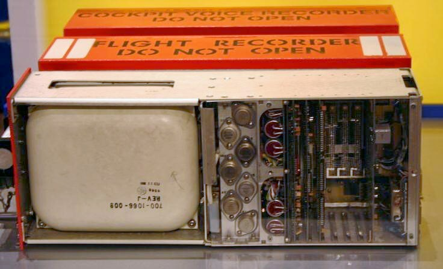

# Doing Science with a Tool You Cannot Reproduce

_OpenAI opened ChatGPT free to 100,000 scientists, but did not disclose the model weights or training data_

## Executive Summary

> [!callout]
> In July 2026, OpenAI launched a program that opens ChatGPT free to academics worldwide. It starts with 10,000 people and scales to 100,000 by 2027, offering the latest models, higher usage limits, and expanded deep research. The tools of science just grew that much more powerful. But this gift comes with a gap that is easy to miss. It is the question of whether an experiment run with that tool can later be run again under the same conditions.

> What is missing is the model weights and the training data. The model behind the API can change without notice, and in practice it does. In one tracking study, a GPT-4 bearing the same name saw its accuracy at identifying prime numbers fall from 84% to 51% within a few months. The version number stayed the same while the behavior shifted. When the tool holding up an experiment wavers this quietly, the reproducibility of a result loses even the means to check it.

> Science earns trust from the fact that others can obtain the same result under the same conditions. If a core component of those conditions is an API you cannot open up, reproducibility gets locked behind the closed model. In what follows, we will trace why this is a problem inside the lab, not outside it, through the lens of data and model provenance.

### Key Figures

Here are four numbers that gather the evidence the body of this piece unpacks one by one: the scale the program opened, how far a same-named model actually shifted, how common that change is across commercial APIs, and how large the reproducibility problem in AI research already was before this program.

Sources: the OpenAI announcement, the Chen et al. (2023) drift study, and OECD reporting cited in the body (see the links in each section)

<!-- stat-card -->
**100,000** — Scientists with free access — Starts at 10,000 and expands through 2027

<!-- stat-card -->
**84% → 51%** — Accuracy of the same GPT-4 — Prime-number accuracy fell this far in months

<!-- stat-card -->
**60%+** — Commercial APIs that changed over time — Observed in a longitudinal study of 63 commercial ML APIs

<!-- stat-card -->
**70%** — AI research estimated non-reproducible — A non-reproducibility rate flagged by one estimate

## OpenAI Opens ChatGPT to 100,000 Scientists

The [ChatGPT for Academic Researchers](https://openai.com/index/chatgpt-for-academic-researchers/) program that OpenAI announced in late July 2026 is a large-scale support effort aimed at academia. Beginning with 10,000 people and reaching 100,000 researchers by 2027, it opens ChatGPT, Codex, and the latest models for free, with higher usage limits, larger context, and expanded deep research. Approved participants can invite a few colleagues, and a free workspace comes with it for twelve months.

Performance figures came attached to the announcement: numbers showing the latest models substantially outpacing the previous generation on demanding math and genomics benchmarks. Those figures, however, were measured and published by the maker of the model, and have not been re-verified on each lab's own data and pipelines. [Coverage](https://siliconangle.com/2026/07/29/openai-opens-new-chatgpt-academic-researchers-program-100000-scientists/) likewise focused mostly on scale and specs. It was a story about how many people get how good a tool.

*▲ OpenAI's San Francisco headquarters, where the free-access program for 100,000 scientists was announced | Source: [Wikimedia Commons (Coolcaesar, CC BY 4.0)](https://commons.wikimedia.org/wiki/File:1515_Third_Street.jpg)*

## Open Access, Closed Internals

What was opened for free is "access," not "internals." The model weights and training data remain undisclosed. The headline of one [article](https://www.techtimes.com/articles/322124/20260729/openai-launches-free-ai-access-scientists-apply-now-model-weights-still-off-limits.htm) on the program summed up the gap exactly: "Model Weights Still Off-Limits." You hold the tool in hand, but you cannot see how it was built or what it was trained on.

For a researcher this is not a mere inconvenience. [Reporting](https://www.axios.com/2026/07/29/openai-academics-research-chatgpt-sol) pointed out that the program does not address the central concern of AI researchers who need to inspect model behavior independently. If you do not know what a model learned, you cannot trace the bias in a result; if you cannot see the internals, you cannot verify why a given output appeared. Science is the work of asking "on what basis did we reach this conclusion," yet a large part of that basis stays hidden behind the API.

*▲ In aviation accident investigations, even a "black box" marked DO NOT OPEN eventually gets opened for verification. An AI model's black box does not | Source: [Wikimedia Commons (Public Domain)](https://commons.wikimedia.org/wiki/File:Black_box.aeroplane.JPG)*

> [!callout]
> **The core point**: free access and open internals are different problems. Being able to use a tool does not mean you can verify or reproduce how that tool works.

## A Model That Changes Quietly, Reproducibility That Disappears

The real problem with closed models is that the API is a moving target. A Stanford team's [drift tracking](https://arxiv.org/abs/2307.09009) put a same-named GPT-4 to the same task at different points in time. Accuracy at identifying prime numbers fell from 84% to 51%, and the share of runnable code it produced dropped from 52% to 10%. The version label did not change while the behavior did. In the researchers' phrasing, it is "behavior change without a version change."

Nor is this an isolated incident. In an analysis of a [longitudinal dataset](https://arxiv.org/abs/2209.08443) observing 63 commercial machine-learning APIs over time, the predictions of a majority of them — well over half — changed materially over time. Getting a different answer today than yesterday to the same input is not rare in commercial AI services.

*▲ Models are served from behind servers like these. The same-named API can have a different model running behind it without notice (illustrative image) | Source: [Wikimedia Commons (CC BY-SA 2.0)](https://commons.wikimedia.org/wiki/File:Virginia_Tech_-_data_center.jpg)*

The closest example is GPT-4o in April 2025. OpenAI updated the model without a change log up front, and within days its overly flattering responses drew notice, so the company ultimately rolled that update back. It was a change confirmed only after users noticed it first. The episode showed publicly that a quiet update really can produce an observable change in behavior.

> [!callout]
> **Why it is fatal**: a scientific experiment stands on the premise that the same conditions yield the same result. But when the model at the heart of those conditions changes without notice, last month's experiment and this month's are in fact two different experiments run with two different tools.

## You Cannot Pin It Like Software

Traditional scientific software has a safeguard for reproduction. Pin the package versions, run the same code again, and you get the same result even years later. Writing "we used scikit-learn 1.3.0" in the methods section makes that one line a coordinate that reproduces the whole experimental environment. An LLM served over an API has no such coordinate. The sentence "we used the latest ChatGPT of July 2026" becomes an irreproducible record the moment the next update passes through. You are being asked to pin down the thing that cannot be pinned.

Academia is already debating this shift. One [commentary](https://elephantinthelab.org/the-invisible-orchestrator-how-chatgpt-5-redefines-scientific-reproducibility/) called the large models seeping through research pipelines "the invisible orchestrator" — something deeply involved in the result whose intervention cannot be traced or pinned. The scale of the problem is not small either. One estimate held that 70% of AI research is non-reproducible. Natural-science experiments run atop closed APIs add a fresh layer of opacity on top of this longstanding reproducibility crisis.

There are not zero signs that reproducibility is improving. In one large-scale analysis, the share of papers publishing code and data together rose from 11% in 2014 to 64% in 2024. But that improvement holds only for research that "can disclose what it used." If a model's internals are locked behind an API so that there is nothing to disclose in the first place, experiments atop closed models stay outside this trend. The better the tool gets, the murkier the history of that very tool becomes.

## Verifiable Data Belongs in the Lab Too

It is not a complete fix, but there is a minimum condition for protecting reproducibility. Use a time-pinned model snapshot, and record the exact model version, evaluation date, and access time in the paper's methods. It is the work of attaching a record that can prove what you ran your experiment with. Policy is moving in this direction too. The EU AI Act obliges providers of general-purpose AI models to publish a summary of training data, and the enforcement powers behind it become active in August 2026. What matters is that even if open-weight models are exempted from some obligations, the training-data summary still remains.

*▲ The Berlaymont building, European Commission headquarters in Brussels — the body overseeing the EU AI Act's training-data disclosure requirement | Source: [Wikimedia Commons (Ank Kumar, CC BY-SA 4.0)](https://commons.wikimedia.org/wiki/File:European_Commission_headquarters,_The_Berlaymont_Building,_Brussels,_Belgium_(_Ank_Kumar,_Infosys_Limited_).jpg)*

Boiled down to one line, these conditions converge on a single question: can you prove "what this result was made of"? Which version of which model, trained on what, produced that output when and under what conditions. This is the provenance of data and models. Reproducibility is, in the end, another name for provenance. A result whose sources and history cannot be traced struggles to become verifiable knowledge, however impressive it may be.

The latest models opened to 100,000 scientists are clearly powerful tools. But if that tool cannot be opened up and can change quietly, the results obtained with it need provenance attached as a safeguard. Science earns trust not from the splendor of a result but from its reproducibility, and right now much of that reproducibility is held behind the API.

<!-- stat-card -->
**Editor's Note** — Pebblous has worked on verifiable data — making what a dataset and a model "were" provable. That concern applies not only to AI on the industrial floor but just as directly to science in the lab. To trust a result, you have to be able to follow the sources and history of the data and model that produced it. This program's gap reaffirms that point.

## References

### R.1. Industry & Press

- 1.OpenAI. (2026). "[ChatGPT for Academic Researchers](https://openai.com/index/chatgpt-for-academic-researchers/)." OpenAI. — Official announcement of the free-access program for 100,000 scientists.
- 2.Axios. (2026). "[OpenAI opens ChatGPT to academic researchers](https://www.axios.com/2026/07/29/openai-academics-research-chatgpt-sol)." Axios. — Alongside benchmark figures, the point that undisclosed model weights and training data leave a concern for researchers who need independent inspection.
- 3.SiliconAngle. (2026). "[OpenAI opens new ChatGPT program for 100,000 scientists](https://siliconangle.com/2026/07/29/openai-opens-new-chatgpt-academic-researchers-program-100000-scientists/)." SiliconAngle. — A summary of the program's scale, expansion timeline, and model specs.
- 4.TechTimes. (2026). "[OpenAI Launches Free AI Access for Scientists — Model Weights Still Off-Limits](https://www.techtimes.com/articles/322124/20260729/openai-launches-free-ai-access-scientists-apply-now-model-weights-still-off-limits.htm)." TechTimes. — The headline sums up the structure of open access, closed weights.

### R.2. Academic & Research

- 5.Chen, L., Zaharia, M., & Zou, J. (2023). "[How Is ChatGPT's Behavior Changing over Time?](https://arxiv.org/abs/2307.09009)." _arXiv:2307.09009_. — The same GPT-4's prime-number accuracy fell 84%→51% and runnable-code rate fell 52%→10%. Empirical evidence of behavior change without a version change.
- 6.Chen, L., Zaharia, M., & Zou, J. (2022). "[HAPI: A Large-scale Longitudinal Dataset of Commercial ML API Predictions](https://arxiv.org/abs/2209.08443)." _NeurIPS 2022 / arXiv:2209.08443_. — A longitudinal analysis of 63 commercial ML APIs. The predictions of a majority changed over time.
- 7.Elephant in the Lab. "[The Invisible Orchestrator: How ChatGPT Redefines Scientific Reproducibility](https://elephantinthelab.org/the-invisible-orchestrator-how-chatgpt-5-redefines-scientific-reproducibility/)." — Conceptualizes the large models seeping into research pipelines as "the invisible orchestrator."
