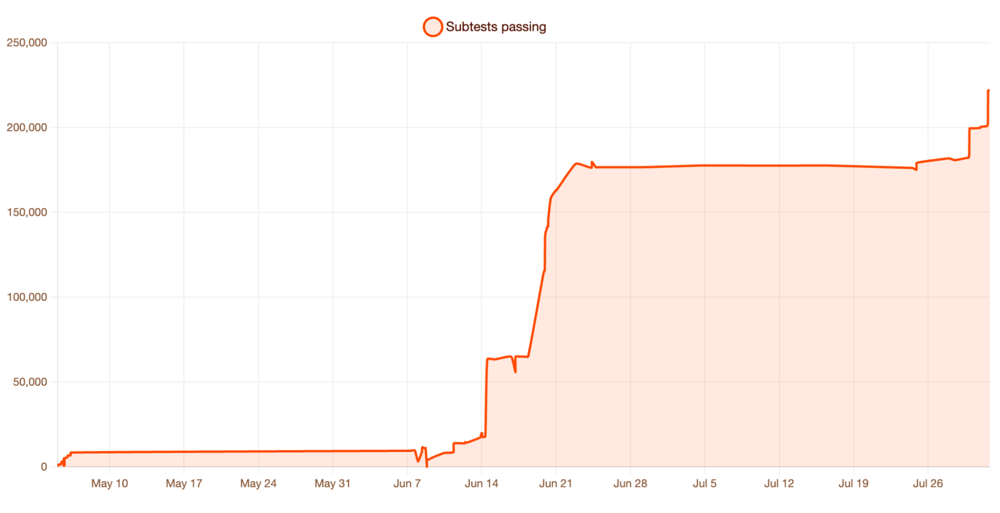

# Cloudflare

_Kitesurf was assembled in 12 weeks and uses up to 7 times less memory than Chromium on the same job_

## Executive Summary

> [!callout]
> Cloudflare released Kitesurf on August 6. It is a cloud browser built for AI agents rather than for people. Tabs, themes, extensions, and pixel-perfect 60-frame rendering are all gone. There is no Chromium inside it. The rendering parts are written in Rust, compiled to WebAssembly, and run on Workers, the company's serverless platform.

> Across the 14-URL corpus the company published, memory use on HTML extraction fell to a seventh of Chromium's. In exchange, the same runs took 1.7 to 1.8 times longer to finish, because software rendering gets none of the speed that JIT compilation buys. The trade works because what waits at the other end is not a human eye but the next token.

> That is where the performance story ends. When infrastructure absorbs the cost of reading the web, the people who make the content are handed a different problem. Of the HTML people see and the structured data agents read, which one is your site's canonical copy? Leave that undecided and the drift between the two becomes the next data quality problem.

### Key Numbers

The savings and the payment have to sit side by side for the design to read clearly. The first two numbers are resources Kitesurf spends less of than Chromium. The third is the time it spends more of in return. The last is the company's evidence that a browser without Chromium still handles ordinary pages.

Source: [Cloudflare engineering blog](https://blog.cloudflare.com/kitesurf/), measured across a 14-URL corpus

<!-- stat-card -->
**3.8x** — Less CPU on HTML extraction — Against Chromium. Screenshot work comes in at 3.1x

<!-- stat-card -->
**7.0x** — Less memory on HTML extraction — Screenshot work comes in at 4.7x

<!-- stat-card -->
**1.8x** — Longer to finish the same job — The price of being light. Software rendering gets no JIT benefit

<!-- stat-card -->
**215,000** — Web Platform Tests passed — Hundreds more pass every week

How quickly that last number piled up is laid out in a chart the company published alongside the announcement.

*▲ Passing tests climbed to 215,000 over the 12-week build | Source: [Cloudflare engineering blog](https://blog.cloudflare.com/kitesurf/)*

## What Did They Strip Out, and What Did It Cost?

Cloudflare's stated reasoning is simple. Agents do not use tabs, themes, extensions, or syncing across devices. What they weigh instead is token counts, context windows, scale, performance, and cost. Browsers made for people are built in exactly the opposite order of priority. They spend enough memory and compute that giving every agent its own browser stops adding up, and so, the company adds, much of the web is open only to whoever can afford to run expensive models against it.

Kitesurf contains no Chromium. Three Rust components were compiled to WebAssembly and put on top of Workers. Blitz parses the HTML and paints the text, Stylo, borrowed from Firefox, handles CSS, and Boa executes JavaScript. Every page gets its own V8 isolate, and outbound requests pass through a dedicated worker that enforces cookie and CORS boundaries. The structure treats threats specific to agents, prompt injection among them, as a matter of isolation.

Building it took 12 weeks. That schedule was possible because nobody wrote a browser engine from scratch; existing open-source parts were reassembled instead, starting from a prototype that ported the open-source headless engine Obscura onto Workers. It now passes more than 215,000 Web Platform Tests and renders Wikipedia, Hacker News, TodoMVC, and parts of Cloudflare's own dashboard correctly.

Performance was measured against Chromium on a corpus of 14 URLs. Taking a screenshot used 3.1 times less CPU and 4.7 times less memory, and extracting HTML widened the gap to 3.8 and 7.0 times. Wall-clock time in the same runs went the other way, rising by 1.7 to 1.8 times. Normalize Chromium to 1.0 and what was saved and what was given up are not the same size.
