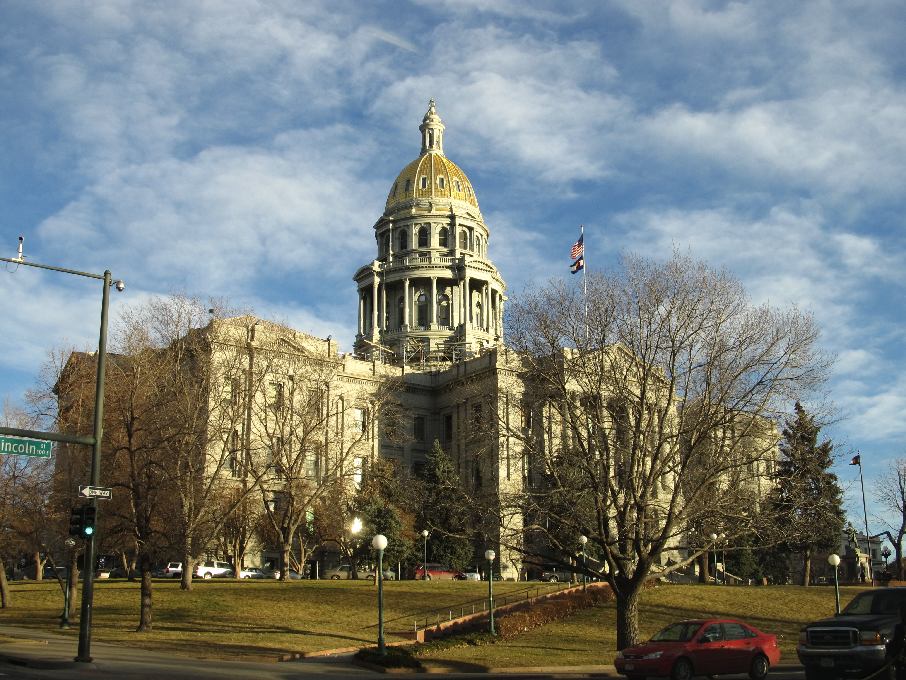

# The Word 

_Why Colorado moved the focus of regulation from the model to the data_

## Executive Summary

> [!callout]
> Today, June 30, 2026, was the day America's first comprehensive AI law, the Colorado AI Act, was supposed to take effect. Yet six weeks before that date, on May 14, Colorado repealed the law in its entirety and swapped in a much narrower one. The new law replaces an old law that never held force for a single day, and in doing so it deleted the very word "AI" (artificial intelligence) from the statute.

> What the new law (SB 26-189) regulates is not an "AI model." It regulates "technology that processes personal data to produce scores, rankings, or recommendations that influence consequential decisions about people," in other words, automated decision-making technology (ADMT). The unit of regulation moved from the sophistication of the model to the path along which data flows into a decision. The same spreadsheet falls under the law if it uses personal data to score job applicants, and falls outside it if it does not.

> For anyone who works with data, this event translates into a single insight. The real control point of AI governance is not the model, but the data layer: which data is processed, and how, to become a decision. This article looks at what Colorado repealed and what it replaced it with, why it deleted the word "AI," and what signal that choice sends to data governance.

### Key Figures

The shape of the event fits into four numbers. A law enacted two years ago disappeared without holding force for a single day, and that repeal was decided just six weeks before its original effective date. The new law that took its place comes into effect half a year later, and all of this unfolds in the middle of a patchwork in which 45 states are pouring out their own laws because there is no comprehensive federal AI statute.

Sources: [Hunton Andrews Kurth](https://www.hunton.com/privacy-and-cybersecurity-law-blog/colorado-ai-act-amended-and-effective-date-delayed), [Norton Rose Fulbright](https://www.nortonrosefulbright.com/en-us/knowledge/publications/18733d31/colorado-enacts-revised-ai-law)

<!-- stat-card -->
**0 days** — Time the old law was in force — Enacted in 2024 but repealed without taking effect for a single day

<!-- stat-card -->
**6 weeks** — Repealed before its effective date — Signed May 14, about six weeks before the original effective date (today)

<!-- stat-card -->
**Jan 1, 2027** — Effective date of the new ADMT law — Regulates "automated decision-making technology" instead of "AI"

<!-- stat-card -->
**45 states** — States with AI bills in 2026 — 1,561 bills in a patchwork left by the absence of a federal law

## Today Was the Effective Date

In 2024, Colorado became the first state in the United States to pass a comprehensive AI law. Its formal name is SB 24-205, commonly known as the Colorado AI Act. The law targeted "high-risk AI systems," imposing a duty of care on developers and deployers to guard against algorithmic discrimination and requiring annual impact assessments and risk management programs. It was the first American attempt comparable to the EU AI Act, and it drew attention as a model other states might follow.

The law's scheduled effective date was today, June 30, 2026. It was originally set to take effect on February 1, 2026, but was pushed back once to today. Then, about six weeks before that date, on May 14, Colorado Governor Jared Polis signed a bill that repealed the law and replaced it with an entirely different one. The result: America's first comprehensive AI law disappeared without ever holding force for a single day.

What drove this abrupt reversal? As the effective date approached, the old law drew growing criticism that its definitions were vague and its compliance burden heavy. In April 2026, Elon Musk's xAI mounted a legal challenge, and the state attorney general agreed to stay enforcement. Rather than tweak the law, lawmakers chose to tear it down and start over, by repealing it and rewriting it.

*▲ Colorado State Capitol, Denver — where America's first comprehensive AI law was passed in 2024 and repealed in 2026 | Source: [Ken Lund / Wikimedia Commons](https://commons.wikimedia.org/wiki/File:Colorado_State_Capitol,_Denver,_Colorado.jpg) (CC BY-SA 2.0)*

> [!callout]
> **The takeaway**: Today was the day America's first AI law should have entered the world. Instead, a different law took its place, one that does not even use the word "AI." Regulation did not disappear; its form changed.

## From High-Risk AI to ADMT

The new law (SB 26-189) is named for "Automated Decision-Making Technology" (ADMT). The change in terminology is not a simple rebranding. It redefines what is regulated. Where the old law regulated the category of an "AI system," a class of model, the new law regulates "technology that processes personal data to produce recommendations, rankings, or scores." As Norton Rose Fulbright's analysis notes, the amended law "does not contain the phrase 'artificial intelligence,' and instead uses the term 'automated decision-making technology.'"

The trigger that activates the regulation changed too. ADMT is covered when it "materially influences a consequential decision." The scope of consequential decisions, covering education, employment, housing, finance, insurance, healthcare, and government services, is nearly identical to the old law. The target domains stay the same; only the test for what gets regulated within them moved from the model to the processing of data.

The biggest change is in the content of the obligations. The old law's core requirements, a duty of care to prevent algorithmic discrimination, annual impact assessments, and risk management programs, are all gone. In their place, the new law sets out advance notice, an explanation within 30 days when an adverse outcome occurs, a meaningful human review, and a right to correct inaccurate personal data. The weight shifted from heavy ex-ante review to a lighter focus on transparency and correction.

From the term used to name the regulated subject, to the focus of regulation, to the core obligations, and to whether the law is actually in force, the two laws diverge along almost every axis. Placing what changed side by side makes clear that this swap was not a matter of changing the cover alone.

| Dimension | Old law: Colorado AI Act (SB 24-205) | New law: ADMT law (SB 26-189) |
| --- | --- | --- |
| Term for the regulated subject | High-risk AI system | Automated decision-making technology (ADMT) |
| The word "AI" | Used in the law's name and throughout the text | Deliberately deleted from the statute |
| Focus of regulation | The nature and risk tier of the model | Whether personal data is processed to make a decision |
| Core obligations | Duty of care against discrimination, annual impact assessments, risk management programs | Advance notice, explanation within 30 days, human review, correction of personal data |
| Enforcement status | Never took effect for a single day (repealed) | Scheduled to take effect January 1, 2027 |

> [!callout]
> **The takeaway**: Swapping the term was not just changing the cover. It redefined what is regulated, from an "AI model" to "technology that processes personal data to make decisions." The domains stay the same, but the point where regulation lays its hand has moved.

## Why 'AI' Was Deleted

There is a practical reason for deleting the word "AI." Even what to call an "AI system" is not agreed upon. Define it broadly and you sweep up calculators; define it narrowly and you leave loopholes. The old law tried to define an "AI system" as something that "infers from inputs to generate outputs," a definition resting on the abstract nature of the model, so its boundaries blurred. That became fuel for disputes in both litigation and enforcement.

The new law dropped its anchor somewhere else. Rather than how sophisticated the model is, it set the test as whether it "processes personal data to materially influence a consequential decision." Crowell & Moring's analysis sums up the shift in a single sentence: "This shift moves away from model-centric regulation toward operational impact assessment." The same piece adds that the new law "operationalizes its definitions around actual data flows rather than the sophistication of the algorithm."

Though the two laws regulate the same domains, the points where they drop their anchors are entirely different. The old law tried to capture the very nature of a model producing outputs from inputs; the new law captures the flow of personal data moving through scores and rankings to reach a decision. The diagram below traces that shift of the regulatory anchor, from the model to the data flow.

## The Real Control Point Is the Data Layer

"To regulate AI, regulate the model" is an intuitive instinct, because we assume the risk comes from the model. Yet Colorado's choice shows that this instinct did not work in legislative reality. The nature of a model could not draw a clear line around what to regulate, and in the end regulation came down to a place that can be measured: which personal data is processed to become which decision. That place is the data layer.

Take apart the new law's obligations one by one and this becomes clear. The right to correct inaccurate personal data, an explanation within 30 days after an adverse outcome, a meaningful human review. All three can only be fulfilled if you can trace, explain, and fix "which data made this decision." The substance of compliance is not model weights, but the lineage of the data and the traceability of the decision. As Crowell & Moring put it, under the new law "the processing of personal data itself becomes the basis for whether something is regulated."

The signal that the center of gravity has moved to data is not Colorado's alone. Rather than create a new AI regulator from scratch, many states are choosing to layer ADMT provisions on top of the privacy and consumer-protection frameworks they already have. California's CCPA has effectively become the template. Lawmakers are converging on the conclusion that "the most workable way to regulate AI is to regulate the processing of personal data."

> [!callout]
> **Editor's Note**: The core of what Pebblous means by AI-Ready Data sits in the same place. Can you trace which personal data flows into which decision (traceability)? Can you correct that data (correction)? Can a person look back into the decision process? Colorado's deletion of the word "AI" is a case where legislation showed that the responsibility for AI governance lies not above the model, but in the data layer.

## Not Just Colorado

The United States still has no comprehensive federal AI law. As states fill that vacuum each in their own way, 1,561 AI bills were introduced across 45 states through March 2026. Yet the direction of that flow points one way: from a broad "high-risk AI" framework toward a narrow, decision-centric model. Colorado is simply the most dramatic example of that direction.

The same pattern shows up in other states. In Texas, the Responsible AI Governance Act (TRAIGA) lost its high-risk impact-assessment provisions in the final version during the legislative process. Utah narrowed its regulatory scope through follow-on amendments. California regulates, through the CCPA's ADMT rules, "technology that processes personal data to replace or substantially replace human decision-making," and Colorado and Texas borrow that structure. Rather than heavy ex-ante regulation, they are converging on a focus on data processing and transparency.

*▲ U.S. Capitol, Washington D.C. — with no comprehensive federal AI law, 45 states are filling the gap with their own statutes | Source: [Wikimedia Commons](https://commons.wikimedia.org/wiki/File:United_States_Capitol_-_west_front.jpg) (Public Domain)*

In June 2026, an executive order emerged at the federal level seeking to preempt state AI laws, but so far it has had no real preemptive effect and is dogged by constitutional disputes. For the time being, US AI regulation is likely to remain a state-by-state patchwork. What that patchwork commonly points to is clear: regulation operates not on the abstraction called the model, but in the data layer, where personal data flows into a decision.

> [!callout]
> **The takeaway**: Colorado's repeal is not a single event but a signal of a shifting regulatory paradigm. The first attempt to "regulate the AI model" ran aground, and in its place a framework that regulates "how data is processed to become a decision" is taking hold. What an organization that works with data must prepare in advance is not a model spec sheet, but data equipped with provenance, consent, correction, and traceability.

## References

### Official Documents & Legislation

- 1.Colorado General Assembly. (May 14, 2026). "[SB26-189 Automated Decision-Making Technology](https://leg.colorado.gov/bills/sb26-189)."
- 2.Colorado General Assembly. (2024). "[SB24-205 Consumer Protections for Artificial Intelligence (Colorado AI Act)](https://leg.colorado.gov/bills/sb24-205)."

### Law Firm Analysis

- 3.Norton Rose Fulbright. (May 2026). "[Colorado enacts revised AI law](https://www.nortonrosefulbright.com/en-us/knowledge/publications/18733d31/colorado-enacts-revised-ai-law)."
- 4.Crowell & Moring. (May 2026). "[Colorado Hits Reset on AI Regulation: SB 26-189 Repeals and Reenacts the Colorado AI Act](https://www.crowell.com/en/insights/client-alerts/colorado-hits-reset-on-ai-regulation-sb-26-189-repeals-and-reenacts-the-colorado-ai-act)."
- 5.Hunton Andrews Kurth. (May 2026). "[Colorado AI Act Amended and Effective Date Delayed](https://www.hunton.com/privacy-and-cybersecurity-law-blog/colorado-ai-act-amended-and-effective-date-delayed)."
- 6.Troutman Pepper Locke. (May 2026). "[Colorado Legislature Passes Bill to Repeal and Replace Colorado AI Act](https://www.troutmanprivacy.com/2026/05/colorado-legislature-passes-bill-to-repeal-and-replace-colorado-ai-act/)."
- 7.Skadden, Arps, Slate, Meagher & Flom. (June 2026). "[Colorado Repeals and Replaces Its AI Act](https://www.skadden.com/insights/publications/2026/06/colorado-repeals-and-replaces-its-ai-act)."
- 8.Davis Wright Tremaine. (May 2026). "[Colorado AI Act Repealed and Replaced by Narrower Transparency Law](https://www.dwt.com/blogs/privacy--security-law-blog/2026/05/colorado-ai-act-repeal-new-transparency-law)."

### Trends & Comparison

- 9.Glacis. (2026). "[US State AI Laws Tracker 2026](https://www.glacis.io/guide-state-ai-laws)."
- 10.Norton Rose Fulbright. (2026). "[The Texas Responsible AI Governance Act (TRAIGA)](https://www.nortonrosefulbright.com/en/knowledge/publications/c6c60e0c/the-texas-responsible-ai-governance-act)."
