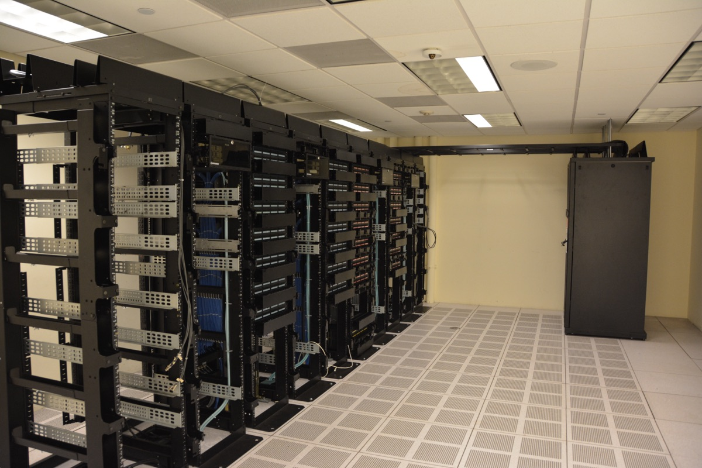

# AI가 쓰는 컴퓨터, 전기처럼 사고팔 수 있을까?

_리퀴드 컴퓨트가 시드 1,500만 달러로 CFTC에 거래소·청산소 인가 신청 — 실리콘 데이터는 10월 뉴욕상업거래소 상장_

## Executive Summary

> [!callout]
> 이 글은 AI를 돌리는 연산 용량이 사고파는 물건이 되어 가는 과정을 본다. 9월 15일 뉴욕의 리퀴드 컴퓨트(Liquid Compute)가 시드 1,500만 달러로 스텔스를 벗었다. 라운드는 퍼스트마크와 케미스트리가 공동 주도했다. 이 회사는 연산 용량을 실제로 주고받는 시장을 먼저 짓고 그 위에 현금으로 정산하는 금융시장을 얹겠다고 밝히면서, 그 금융시장을 스스로 열고 청산하기 위해 미 상품선물거래위원회에 거래소 자격과 청산소 자격을 함께 신청해 두었다.

> 이 판에 들어선 회사는 셋이다. 실리콘 데이터(Silicon Data)는 8월 11일 시리즈A 1차 마감으로 3,050만 달러를 받았고, 이 회사가 내는 지수를 정산 기준으로 삼는 컴퓨트 선물 두 종이 10월 5일 뉴욕상업거래소에 올라갈 예정이다. 오른(Ornn)은 5월 19일 인터컨티넨털 익스체인지와 GPU 연산 선물을 올리겠다고 함께 밝혔고, 6월에 시드 3,300만 달러를 받았다. 그런데 이 셋이 모두 부딪히는 자리는 같다. 연산 한 시간은 저마다 다르다는 사실이다. 실리콘 데이터 자신이 발표문에 적기를, 같은 칩으로 지은 클러스터 둘도 어떻게 엮었느냐에 따라 실제로 내는 성능이 서로 달라진다.

> 4절까지는 세 회사의 발표문과 거래소 공고, 회사들이 자사 이름으로 낸 리서치 노트, 그리고 이 시장을 앞서 다룬 두 편의 분석 글에 적힌 것을 따라간다. 규격을 먼저 정해야 선물시장이 선다는 주장 자체는 장을 지으려는 회사가 자기 발표 글에 적어 둔 것이다. 그 재료를 데이터 품질 등급의 문제로 옮겨 읽는 5절이 이 글의 해석이다.

### 주요 수치

출처: [리퀴드 컴퓨트 발표문 (2026-09-15)](https://www.businesswire.com/news/home/20260915989921/en/) · [실리콘 데이터 발표문 (2026-08-11)](https://www.businesswire.com/news/home/20260811404419/en/)

<!-- stat-card -->
**1,500만 달러** — 리퀴드 컴퓨트 시드 — 실물 시장과 그 위의 규제 금융시장을 함께 짓겠다는 계획에 붙은 값이다. 2025년 겨울 와이컴비네이터 기수에 플루토(Pluto)라는 이름으로 들어갔던 회사다

<!-- stat-card -->
**2종** — 10월 5일 상장 예정 계약 — 엔비디아 H100과 B200의 임대 지수를 각각 따르고, 한 계약이 한 달치 임대료에 해당한다. 규제 검토를 남겨 두고 있다

<!-- stat-card -->
**9개** — 실리콘 데이터의 금융 등급 지수 — 2025년 3월 470만 달러 시드로 출발했고, 선물시장이 생기기 전에 2년간 가격과 성능 이력을 쌓았다고 회사는 밝힌다

<!-- stat-card -->
**0건** — 상장일이 잡힌 실물 인도 계약 — 10월 5일 계약 두 종은 모두 현금결제다. 리퀴드 컴퓨트는 현금결제와 실물결제를 함께 다루는 장을 목표로 내걸었지만 아직 인가 심사 중이다

## 9월 15일에 벌어진 일

리퀴드 컴퓨트가 시드 1,500만 달러를 알리며 문을 열었다. 퍼스트마크와 케미스트리가 공동으로 이끌었고 K8 캐피털, 나이트 캐피털, 트루브리지, 브레인차일드 홀딩스, UFO 홀딩스, 와이컴비네이터가 참여했다. 드미트리 밸리애스니가 엔젤 투자자로 이름을 올렸다. 창업자는 로닛 자인과 아라브 파텔 두 사람이고, 버클리 캘리포니아대학교에서 공학을 공부하다 만났다. 회사의 전신은 와이컴비네이터 2025년 겨울 기수를 거친 플루토다.

발표에서 눈길이 가는 대목은 조달액이 아니라 규제다. 이 회사는 미 상품선물거래위원회에 두 가지 자격을 신청해 두었다. 하나는 지정계약시장(DCM)이고 다른 하나는 파생상품청산기구(DCO)다. 앞의 것은 선물 같은 계약을 정식으로 상장해 거래시킬 수 있는 거래소 자격이고, 뒤의 것은 그 거래의 반대편에 서서 한쪽이 못 갚아도 계약이 굴러가게 만드는 청산소 자격이다. 둘을 한꺼번에 신청했다는 것은 남의 거래소를 빌리지 않고 장을 열고 정산까지 자기 손으로 하겠다는 뜻이다. 신청을 낸 주체는 회사 웹사이트가 각주로 밝혀 둔 PMEX 마켓츠다. 회사는 인가 대응을 위해 컴플라이언스와 시장운영 인력을 새로 뽑고 있다고 밝혔다.

구조는 두 층이다. 아래층은 서로 다른 위치와 하드웨어와 기간에 흩어져 있는 연산 용량을 사는 쪽과 파는 쪽에 이어 붙이는 실물 시장이다. 위층은 그 실물 시장에서 만들어진 가격을 기준으로 삼는 금융시장이다. 발표문 본문은 위층을 현금결제 거래소라고만 적는다. 범위를 넓게 잡은 것은 자인이 같은 날 자사 블로그에 올린 발표 글이다. 현금결제 계약과 실물결제 계약을 함께 다루는 첫 규제 거래소를 짓겠다는 것이고, 회사 웹사이트와 와이컴비네이터 기업 소개도 같은 문장을 쓴다. 현금결제란 계약이 끝날 때 실제로 GPU를 넘겨받는 대신 기준 가격과 계약 가격의 차액만 주고받는 방식을 말한다. 연산을 쓰는 쪽은 값이 오를 위험을, 파는 쪽은 값이 내릴 위험을 그 차액으로 덜어 낸다. 회사가 이 일을 하려면 인가가 나와야 하고, 발표문 말미에는 규제 결과가 보장된 것이 아니라는 문장이 붙어 있다.

*▲ 리퀴드 컴퓨트가 거래 대상으로 삼겠다는 '연산 용량'은 결국 이런 서버랙 한 칸 한 칸에 흩어져 있다 | Source: [Carl Lender, Wikimedia Commons (CC BY 2.0)](https://commons.wikimedia.org/wiki/File:Datacenter_Server_Racks_(22370909788).jpg)*

금융권 상대도 이미 붙였다. 서스쿼해나 프리딕션스, BGC 그룹, 윈터뮤트와 거래 및 데이터 라이선스 계약을 맺었다. BGC의 전략 책임자 아란 로우셀은 이 제휴가 자사의 장외 연산 시장을 짓는 일을 받쳐 준다고 말했다. 거래소가 열리기 전에 장외에서 먼저 값이 오가기 시작했다는 뜻으로 읽힌다. 최고경영자 로닛 자인이 회사의 지향을 적은 문장은 이렇다.

“Our goal is to be the regulated financial infrastructure for a new asset class, similar to what NYMEX was to oil, CBOE was to volatility, and Kalshi was to event contracts.”

원유에는 뉴욕상업거래소가, 변동성에는 시카고옵션거래소가, 사건의 결과에는 칼시가 한 일을 연산에 하겠다는 말이다. 새 자산군이라는 표현이 핵심이다. 지금까지 연산은 클라우드 사업자와 GPU 운영사와 데이터센터와 사적 계약에 흩어져 있었고, 널리 인용되는 기준 가격도 성숙한 파생시장도 없었다. 자인이 그날 올린 글은 비슷한 목록을 한 번 더 드는데, 원유 자리에 뉴욕상업거래소 대신 인터컨티넨털 익스체인지를 넣고 왜 그 셋을 들었는지도 밝혀 둔다. 셋 다 후발 주자였는데도 각자의 시장에서 값의 대부분을 가져갔는데, 규제 자격을 먼저 확보하면서 자기 시장의 물리적 특성을 깊이 판 덕이라고 본다.

## 왜 석유가 아니라 전력망인가

두 창업자가 도달한 전제를 발표문은 이렇게 요약한다. 연산은 기름 같은 통상적인 상품시장보다 전력망에 가깝게 조직되어야 한다는 것이다. 근거로 세 가지를 든다. 용량이 균질하지 않고, 위치에 매여 있고, 상하기 쉽다. 앞의 둘은 짐작이 가고 셋째가 결정적이다. 오늘 아무도 쓰지 않은 GPU 한 시간은 창고에 쌓아 두었다가 내일 파는 물건이 아니다. 그냥 사라진다. 그래서 이 시장의 중심 과제는 재고 관리가 아니라 시간과 지역과 설비를 가로질러 공급과 수요를 맞붙이는 일이 된다.

*▲ 창업자들이 연산을 빗댄 자리는 원유가 아니라 이런 송전망이다 | Source: [Varistor60, Wikimedia Commons (CC BY-SA 4.0)](https://commons.wikimedia.org/wiki/File:500kV_3-Phase_Transmission_Lines.png)*

이 전제가 회사의 공정 순서를 정한다. 케미스트리의 매니징 파트너 마크 골드버그는 투자 이유를 설명하며 기름과 전기의 대비를 다시 꺼냈다.

“Most people building in this space are treating compute as a fungible commodity like oil, and most of the infrastructure being built reflects that. Liquid Compute started from a different premise. They are building the physical market first, then the regulated financial layer on top of it, closer to how power markets actually work.”

연산을 기름처럼 바꿔치기 가능한 상품으로 보면 지수부터 만들어 선물을 얹는 길이 빠르다. 전기처럼 보면 순서가 뒤집힌다. 실제 용량이 오가는 판을 먼저 만들어 거기서 값이 형성되게 한 다음, 그 값을 기준 삼아 금융 층을 올린다. 리퀴드 컴퓨트가 실물 시장을 먼저 짓는 이유가 여기 있다.

비유를 어디에 걸지는 아직 합의된 바 없다. 10월 계약을 올리는 시카고상업거래소에서 이 상품을 맡은 사람은 에너지·환경 상품 총괄 피트 키비인데, 정작 그가 발표문에 남긴 말은 기름에 가깝다. 20세기 경제를 굴린 원유가 현물 거래에서 세계 파생시장으로 자란 것처럼 연산도 표준화된 거래 상품이 되리라고 그는 내다본다. 그런데 리퀴드 컴퓨트의 발표 글은 반대편에 선다. 그 글의 주소에 박아 둔 문구가 연산은 배럴이 아니라 전력망이다. 거래소는 연산을 에너지 상품 곁에 두었고, 장을 새로 지으려는 쪽은 그 에너지 중에서도 기름이 아니라 전기라고 말한다.

회사가 8월에 낸 리서치 노트는 비유를 한 번 더 조인다. 연산은 전력과 석유와 개별 기업 신용에서 성질을 하나씩 빌려 오되 어디에도 속하지 않는다는 것이다. 근거로 든 것은 둘이다. 하나는 값싼 시간을 사 두었다가 나중에 파는 일이 불가능하니 현물값과 선물값을 묶어 주는 차익거래 고리가 아예 없다는 점이다. 곡선은 기대와 위험 프리미엄만으로 그려지고 밑을 받치는 닻이 없다. 다른 하나는 값이 서서히 닳지 않고 신형 칩이 출하되는 날짜에 한 번씩 뛴다는 점이다. 그 밑에 깔린 숫자가 잔존가치인데, 노트에 따르면 그날이 오기 전에는 누구도 검증할 수 없는 값이다.

전력망 비유는 회사 밖에서도 나온다. 오토 살미가 2025년 11월에 쓴 분석 글은 연산의 상품화를 석유와 전력과 주파수 세 가지 선례에 비추어 정리한다. 석유에서는 브렌트와 서부텍사스산과 두바이유를 인도 가능한 등급으로 정의해 두고 나머지 차이는 등급 간 가격차로 처리하게 만들었다. 전력에서는 PJM과 ERCOT 같은 지역 계통운영자가 현물시장과 선도곡선과 부가서비스 경매를 지었고, 그 핵심은 참여자가 복잡한 선호를 그대로 적어 낼 수 있게 한 입찰 방식이었다. 주파수에서는 폴 밀그럼의 조합경매가 주파수 대역과 지역과 면허 종류를 묶어 입찰할 수 있게 해서 복잡한 재배분을 가능하게 했다. 셋째 선례는 비유에 그치지도 않는다. 그 경매를 설계한 밀그럼이 지금 원크로노스와 함께 연산을 거래할 시장을 짓고 있다고 살미는 전한다.

> [!callout]
> 세 선례가 함께 말하는 것은 하나다. 완전히 똑같아야 거래되는 것이 아니다. 다른 것을 다르다고 적을 수 있는 규격만 있으면 차이는 가격차로 옮겨지고, 그때 거래가 성립한다. 살미는 전기가 저장이 안 되고 즉시 소비되어야 한다는 점에서 연산보다도 덜 균질한 상품이라고 짚는다. 그런데도 전력시장은 굴러간다.

## 장을 여는 쪽과 값을 재는 쪽

같은 분기에 세 회사가 움직였다고 해서 셋이 같은 것을 짓는 것은 아니다. 거래소 자체를 지으려는 쪽과 기존 거래소에 정산 기준 가격만 대는 쪽으로 갈린다. 리퀴드 컴퓨트가 앞이고, 실리콘 데이터와 오른이 뒤다.

| 회사 | 이번 라운드 | 짓는 것 | 계약이 오르는 곳 |
| --- | --- | --- | --- |
| 리퀴드 컴퓨트 | 시드 1,500만 달러퍼스트마크·케미스트리 공동 주도 | 실물 매칭 시장 + 그 위 현금결제 시장 | 자사 거래소·청산소CFTC 인가 신청 중 |
| 실리콘 데이터 | 시리즈A 1차 마감 3,050만 달러밸러 아트레이데스 AI 펀드 주도 | 가격 지수와 성능 벤치마크 | 시카고상업거래소 산하 뉴욕상업거래소10월 5일 상장 예정 |
| 오른(Ornn) | 시드 3,300만 달러갤럭시 벤처스·a16z 크립토 공동 주도 | 연산 마켓플레이스와 OCPI 가격지수 | 인터컨티넨털 익스체인지규제 승인 전제 |

각 행은 해당 회사의 발표문과 거래소 공고에 적힌 것이다. 실리콘 데이터 라운드에는 시카고상업거래소의 벤처 부문인 CME 벤처스와 DRW, F-프라임, 삼성 넥스트, 반에크, 점프, 윈터뮤트 등이 함께 들어왔다. 오른의 공동 주도는 갤럭시 벤처스와 a16z의 크립토 펀드다.

10월에 올라갈 계약의 모양은 이미 공고돼 있다. 실리콘 데이터 H100 임대 지수 선물과 B200 임대 지수 선물 두 종이고, 둘 다 하이퍼스케일러가 아닌 네오클라우드의 시간당 온디맨드 임대료를 따르는 지수를 기준으로 삼는다. 한 계약이 해당 GPU 한 달치 임대료에 해당하며, 시카고상업거래소 규칙 아래 뉴욕상업거래소에 상장된다. 지수를 내는 실리콘 데이터의 최고경영자 카먼 리는 이 상품이 무엇을 바꾸는지를 이렇게 썼다.

“For years, two companies buying the exact same GPU capacity could pay wildly different prices with no way to know who got the better deal. They will now have a benchmark to check that against. … Silicon Data’s benchmarks make that price real; CME makes it tradable.”

똑같은 GPU 용량을 산 두 회사가 전혀 다른 값을 치르고도 누가 잘 샀는지 알 길이 없었다는 진술이다. 대조해 볼 기준이 생긴다는 것이 이 상품의 효용이고, 카먼 리는 시리즈A 발표에서 그 기준을 성숙한 시장의 독립 심판에 비유했다. 무엇이 얼마인지, 약속한 대로 작동하는지, 위험을 어떻게 재야 하는지를 참여자에게 말해 주는 자리다. 그 발표문은 연산을 재고 다루는 기반이 아직 놀랄 만큼 미성숙하다는 문장도 함께 담고 있다.

*▲ 10월 5일 실리콘 데이터의 컴퓨트 선물 두 종이 올라갈 뉴욕상업거래소(NYMEX) | Source: [Kidfly182, Wikimedia Commons (CC BY-SA 4.0)](https://commons.wikimedia.org/wiki/File:New_York_Mercantile_Exchange_004.jpg)*

그래서 정작 갈리는 것은 거래소가 아니라 지수다. 셋이 각기 다른 방식으로 값을 만든다. 오른의 OCPI는 실제로 찍힌 체결만으로 지은 첫 연산 지수라고 발표문에 적혀 있고, 블룸버그 단말로 배포되며, H100과 H200과 B200과 RTX 5090을 다룬다. 실리콘 데이터는 네오클라우드와 하이퍼스케일러와 코로케이션 시장과 사설 임대 플랫폼에서 임대 기록과 사적 체결을 함께 모아 기준선을 맞춘 뒤 영업일마다 한 번씩 낸다. 리퀴드 컴퓨트는 자사 주문장과 공개 자료에서 뽑은 자체 지수를 기관에 이미 라이선스하고 있는데, 리서치 노트 말미에 그 수치가 감사받지 않았고 표본이 작다는 단서를 스스로 달아 두었다. 이름은 셋 다 연산 가격 지수인데, 무엇을 세는지가 서로 다르다.

차이는 값에서도 드러난다. 실리콘 데이터가 공개하는 H100 지수는 네오클라우드와 하이퍼스케일러 두 갈래로 따로 발표되는데, 2026년 9월 17일 기준으로 앞쪽이 시간당 2.66달러, 뒤쪽이 7.18달러다. 같은 이름의 칩인데 약 2.7배다. 10월에 올라갈 계약이 따르는 쪽은 앞쪽, 곧 네오클라우드 지수다. 하이퍼스케일러에서 연산을 사는 기업이 이 계약으로 값을 묶어도, 정작 자기가 치르는 요금과는 다른 곡선을 붙잡게 된다.

## 등급표에는 무엇이 들어가는가

GPU 한 시간이라는 말은 쓰기 편해서 자주 쓰이지만, 그 한 시간들은 서로 바꿔 쓸 수 있는 물건이 아니다. 데이브 프리드먼이 6월에 쓴 파생상품 입문서는 값을 실제로 가르는 항목을 이렇게 나열한다. 지역, 인터커넥트, 가동률, 중단 가능 여부, 스토리지, CPU, 램, 보안, 클러스터 규모. 하나하나가 실제 경제적 가치를 바꾼다는 것이다. 지수를 만들려면 이 항목들을 정규화해야 하고, 정규화한다는 말은 결국 무엇을 같은 것으로 볼지 정한다는 뜻이다.

스펙표가 말해 주지 않는 몫이 남는다. 실리콘 데이터는 시리즈A 자금의 일부를 실리콘마크(SiliconMark)에 쓴다고 밝혔는데, 이것은 물리적 GPU 설비가 실제로 어떻게 작동하는지를 독립적으로 재는 벤치마크다. 회사가 든 이유가 바로 그 지점이다. 똑같은 칩으로 지은 클러스터 둘이라도 네트워킹과 토폴로지와 구성에 따라 실제 산출이 눈에 띄게 달라진다. 카탈로그에 적힌 칩 이름은 같은데 손에 쥐는 결과가 다른 것이다. 회사는 성능을 가로질러 정규화해야 이 산출 위험을 헤지할 수 있고 그것이 앞으로의 실물 인도로 가는 길을 연다고 덧붙인다.

등급표가 어떤 모양이 될지는 살미가 한 줄짜리 예시로 남겨 두었다. FP8 연산의 A급 GPU 한 시간, HBM3 메모리 80기가바이트 이상, 노드 안 인터커넥트 400기가비피에스 이상, US-East-1 구역, 가동률 99퍼센트. 여기에 프리드먼이 꼽은 중단 가능 여부를 더하면 여섯 칸이다. 다만 살미가 이 줄을 어디에 놓았는지는 같이 읽어야 한다. 그는 연산 시장이 갈 법한 길을 셋으로 나누어 놓았고, 이 규격은 그중 가장 멀리 간 세 번째 길에 붙어 있다. 깊은 유동성과 규제 정비가 함께 갖춰져야 하니 십 년 넘게 걸린다는 단서도 달려 있다. 지금 당장 필요한 최소치로 그가 꼽은 것은 따로 있다. 칩 등급과 지역과 가동률 등급, 셋이다.

그런데 이 목록에는 값을 가장 크게 가르는 항목 하나가 빠져 있다. 리퀴드 컴퓨트의 최고제품책임자 스탠리 리가 8월에 낸 리서치 노트의 첫 문장이 그것이다. 같은 GPU가 오늘 세 가지 값에 임대된다. 얼마나 길게 묶느냐에 따라서다. 회사가 예시로 든 수준은 온디맨드가 시간당 9달러, 3개월에서 12개월짜리 예약이 5.75달러, 다년 텀이 3.85달러다. 같은 칩이고 같은 주인데 값이 두 배 넘게 벌어진다. 실리콘 데이터가 지수를 만들 때 값을 보정하는 축 넷 중 맨 앞에 둔 것도 임대 유형이다. 그러니 등급표의 칸은 여섯이 아니라 일곱이고, 일곱째가 하필 제일 크다.
