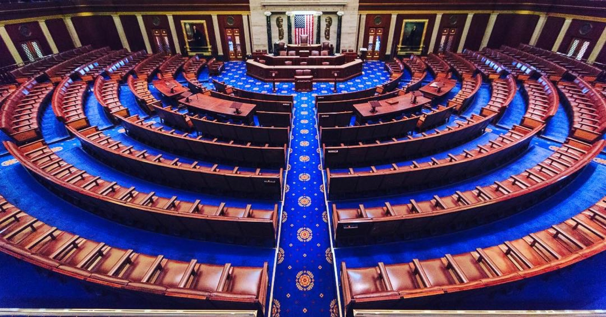

# 미 하원 AI 지출의 88%를 챗GPT가 가져갔다

_법안 요약과 민원 응대에 오간 대화는 조달 통계에도 보존 규정에도 남지 않는다_

## Executive Summary

> [!callout]
> 미국 하원 의원실이 지난 1년 동안 AI 도구에 쓴 돈은 11만 3,740달러였다. 그중 10만 580달러가 챗GPT 한 곳으로 갔다. CNBC가 하원의 회계 지출 기록을 훑어 8월 3일 내놓은 집계이고, 같은 날 테크크런치가 이를 받아 정리했다.

> 달러로 따지면 88%다. 쏠림의 출발점은 2023년으로 거슬러 올라간다. 하원 디지털서비스가 초당적 보좌진 모임에 챗GPT Plus 라이선스를 무상으로 풀었고, 그때 손에 익은 도구가 나중에 의원실 예산으로 결제되는 도구가 됐다. 다만 이 집계는 무료 계정과 오피스 패키지에 딸려 들어온 AI, 상원 지출 대부분을 빼고 센 것이라 실제 사용량의 아랫단만 보여 준다.

> 이 글은 벤더 순위보다 그 빠진 부분을 본다. 법안 요약과 청문회 준비, 지역구 민원 응대에 AI가 들어갈 때 무엇이 입력됐고 무엇이 최종 문안에 반영됐는지는 조달 통계에도 보존 규정에도 잡히지 않는다.

### 주요 수치

출처: [CNBC 하원 지출 기록 분석](https://www.cnbc.com/2026/08/03/openai-chatgpt-anthropic-congress-house-ai-spending.html), 2025년 4월~2026년 3월

<!-- stat-card -->
**88%** — 하원 AI 지출 중 챗GPT 몫 — 11만 3,740달러 가운데 10만 580달러

<!-- stat-card -->
**798 : 37** — 챗GPT와 클로드의 결제 건수 — 금액 격차보다 건수 격차가 크다. 건수로는 96%

<!-- stat-card -->
**40개** — 2023년 무상 배포된 챗GPT Plus 라이선스 — 하원 디지털서비스가 초당적 보좌진 모임에 지급한 물량

<!-- stat-card -->
**1달러** — GSA가 매긴 기관당 연 이용료 — 2025년 OneGov 계약으로 연방기관 전체가 프론티어 모델에 접근

## 챗GPT가 798건, 클로드가 37건

CNBC가 집계한 기간은 2025년 4월 1일부터 2026년 3월 31일까지다. 벤더 이름이 명시된 AI 지출만 골라내니 총액이 11만 3,740달러로 잡혔다. 이 가운데 챗GPT가 10만 580달러를 798건의 거래에 걸쳐 가져갔고, 앤트로픽의 클로드가 1만 3,160달러를 37건에서 가져갔다. 금액으로 보면 8 대 1에 가깝지만 결제 건수로 보면 20 대 1이 넘는다. 챗GPT는 여러 의원실이 각자 구독을 결제했고, 클로드는 몇몇 의원실이 뭉텅이로 결제한 것으로 보인다.

*▲ 435명의 하원 의원 중 71곳의 의원실이 AI 지출 기록에 이름을 남겼다 | Source: [Wikimedia Commons (Architect of the Capitol, Public Domain)](https://commons.wikimedia.org/wiki/File:United_States_Capitol_west_front_edit2.jpg)*

정당별로도 갈렸다. 민주당 계열 의원실 44곳이 5만 4,165달러를 썼고 공화당 계열 27곳이 1만 5,782달러를 썼다. 세 배 넘는 격차다. AI 규제를 두고 누가 더 크게 말하는지와 누가 더 많이 결제하는지가 늘 같은 방향은 아니다.

두 숫자를 더하면 지출 기록에 이름이 남은 의원실은 71곳이다. 하원 의원 정수가 435명이니 여섯 곳 중 한 곳꼴로 AI 도구값을 의원실 예산에서 결제했다는 뜻이 된다. 무료 계정과 오피스 패키지에 딸려 들어온 AI가 빠진 수치라 이것은 바닥값이다. 실제로 AI를 업무에 끼워 넣은 의원실은 이보다 많고, 얼마나 더 많은지는 이 방식으로는 알 수 없다.

쏠림의 뿌리는 2023년에 있다. 하원 디지털서비스가 초당적 보좌진 모임에 챗GPT Plus 라이선스 40개를 무상으로 배포했다. 오픈AI는 의회경영재단과 손잡고 상하원 고위 보좌진을 상대로 사용 교육 세션을 열었다. 무상 라이선스로 손에 익히고, 익숙해진 도구를 의원실 예산으로 이어 결제하는 경로가 그때 깔렸다. 지금의 88%는 갑자기 생긴 점유율이 아니라 3년 전 배포의 지연된 청구서에 가깝다.

같은 시기에 두 회사는 규제를 만드는 쪽을 향해서도 돈을 썼다. 이슈원의 분석에 따르면 오픈AI는 2026년 1분기 연방 로비에 100만 달러를 지출했고, 앤트로픽은 약 160만 달러를 썼다. 각각 전년 같은 기간의 1.8배와 3배가 넘는다. 규제 논의의 대상인 산업이 규제를 설계하는 사무실에 도구를 납품하는 구도다.

## 법안 요약과 민원 응대가 같은 창으로 들어간다

지출 기록은 어느 의원실이 얼마를 냈는지까지만 말해 준다. 무엇에 썼는지는 보좌진의 입을 통해 알려졌다. 그렇게 모인 용도는 언뜻 흔한 생산성 도구의 목록처럼 읽힌다.

- •수백 쪽짜리 법안을 요약하고 쟁점을 뽑아내는 일
- •청문회에 들고 들어갈 질의 자료와 배경 메모를 만드는 일
- •정책 조사 자료를 검토하고 논점을 정리하는 일
- •지역구 유권자의 민원에 보내는 답신 초안을 쓰는 일
- •의원 명의로 나가는 소셜미디어 게시물 초안을 잡는 일

*▲ 법안 요약과 청문회 자료가 향하는 곳 — 미국 하원 본회의장 | Source: [Wikimedia Commons (Public Domain)](https://commons.wikimedia.org/wiki/File:United_States_House_of_Representatives_chamber.jpg)*

회의 일정을 잡거나 이메일을 다듬는 일이라면 도구를 무엇으로 쓰든 남는 문제가 없다. 위 다섯 가지는 그렇지 않다. 법안 요약은 의원의 표결 판단으로 이어지고, 민원 답신은 유권자에게 정부의 공식 답변으로 도착하며, 청문회 자료는 증인에게 던지는 질문이 된다. 최종 산출물은 사람의 이름으로 나가지만, 그 문안의 어느 대목이 모델의 요약에서 왔는지는 문서 자체에 표시되지 않는다.

입력 쪽도 마찬가지다. 요약을 시키려면 법안 원문이 챗GPT 창 안으로 들어가야 하고, 민원 답신을 쓰려면 유권자가 보낸 사연이 창 안으로 들어간다. 그중 어느 정도가 공개 문서이고 어느 정도가 개인이 보낸 편지인지를 구분해 기록하는 절차는 의원실 단위로 제각각이다. 브레넌 정의센터의 에릭 페트리는 입법자와 보좌진이 규제를 설계하기 전에 여러 AI 제품을 직접 다뤄 봐야 한다고 말한다. 타당한 지적이지만, 직접 다뤄 본 흔적을 무엇으로 남길지는 그 옹호론이 답하지 않는 대목이다.

## 돈은 세는데 대화는 세지 않는다

하원은 의원실의 지출 내역을 분기마다 공개한다. 벤더 이름과 금액, 날짜가 회계 시스템에 남으니 기자가 그것을 긁어모아 셀 수 있었다. 이 통계는 그렇게 나왔고, 같은 이유로 셀 수 있는 것은 결제뿐이다.

보좌진이 챗GPT 창을 한 번 열었을 때 시스템에 남는 것은 구독료가 빠져나갔다는 사실뿐이다. 어떤 법안을 창 안에 넣었는지, 모델이 무엇을 돌려줬는지, 그 답이 최종 문안에 얼마나 들어갔는지는 회계 항목이 아니라서 기록될 자리가 없다. 같은 한 번의 사용에서 무엇이 남고 무엇이 남지 않는지를 갈라 보면 아래와 같다.
