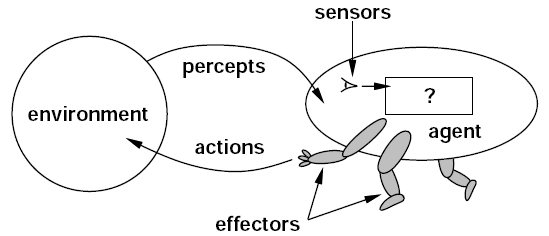

# Watching AI Agents Just Became a $200M Business

_Coralogix_

## Executive Summary

> [!callout]
> On June 3, 2026, the observability company **Coralogix** raised $200M in a Series F. The round put its valuation at $1.6B, on top of a customer base north of 5,000 and revenue growing more than 60% year over year. A company that once made its name pulling logs and metrics together to show the state of your systems just raised serious money to show something else: what your AI agents are actually doing. This piece reads that investment as a signal — of what, exactly.

> 57% of organizations now run AI agents in production. Yet in the same survey, observability scored the lowest of any layer in the AI stack. The agents have multiplied; the eyes meant to watch them are the least built-out part of the picture. Coralogix's $200M is capital markets placing a bet on exactly that gap.

> Automation is the easy part. Trust is the hard one. And trust doesn't arrive on its own — it has to be designed, and that design costs money. The more an agent decides and acts on its own, the more its invisibility turns autonomy from delegation into neglect. Who pays that cost, and for what, is the question this round puts on the table.

### Key Figures

Sources: [TechCrunch](https://techcrunch.com/2026/06/03/coralogix-raises-200m-in-race-to-build-the-monitoring-layer-for-ai-agents/), The Business Research Company

<!-- stat-card -->
**$200M** — Coralogix Series F — A single round flowing into the agent-watching layer

<!-- stat-card -->
**$1.6B** — post-money valuation — Backed by 5,000+ customers and 60%+ growth

<!-- stat-card -->
**57%** — organizations running agents — Yet observability ranks lowest in the AI stack

<!-- stat-card -->
**$9.26B** — 2030 market forecast — Roughly 3.4× the $2.69B of 2026

## What Happened

Coralogix is an observability company founded in Israel in 2014. Its job was traditionally clear: gather the logs, metrics, and traces that software leaves behind, analyze them in one place, and raise an alarm when something breaks. It serves more than 5,000 customers — including IBM, Tradeweb, and JFrog — with some 30 of them spending over $1M a year. Revenue grew more than 60% in a single year, and annual recurring revenue has crossed $100M.

This Series F of $200M is part of $550M raised to date, and it lifted the post-money valuation to $1.6B. The investor lineup is worth a second look. Alongside Advent, Greenfield Partners, and Brighton Park Capital came the Canada Pension Plan Investment Board (CPPIB). Large institutional capital like a pension fund doesn't chase fashion. When it moves, the move reads less like a trend bet and more like a judgment that demand for agent monitoring is structural, not seasonal.

*▲ Coralogix co-founders Yoni Farin (left) and CEO Ariel Assaraf, following the June 2026 Series F $200M announcement | Source: [TechCrunch](https://techcrunch.com/2026/06/03/coralogix-raises-200m-in-race-to-build-the-monitoring-layer-for-ai-agents/)*

The product is shifting in the same direction. Coralogix runs a built-in AI agent named 'Olly' that investigates incidents and answers questions about operational data in plain language. The more interesting move is at the interface. The company opened up MCP (Model Context Protocol) and a CLI so that AI agents — not just people — can reach into operational data and query it directly. CEO Ariel Assaraf describes "the interface layer slowly dissolving" as engineers move from dashboards toward talking to their systems through an AI assistant. In practice, more than half of its enterprise customers already work with operational data through a command line or an agent interface.

> [!callout]
> Here's the short version. The dashboard people used to watch is now watched by an agent. And what that agent sees and decides has to be watched, in turn, at another level by someone else. The $200M Coralogix raised is the price of that watching layer.

## Agents Fail Differently

Why do agents need a watching layer of their own? The crux is that they fail in a different way. Traditional software breaks honestly. A successful request returns a 200; a failed one throws an error. The log shows a red line, so you can trace what broke.

AI agents don't work that way. An agent can hand you a completely wrong answer in a confident tone, neatly formatted. It can call tools it didn't need, loop on the same task forever, and execute the wrong action — all without leaving an error anywhere. On the surface it looks like a successful run. That's why conventional APM (application performance management) tools miss this kind of failure. Response times are fine and the error rate is zero, yet the agent is making the wrong decision.

*▲ The agent-environment interaction loop. The agent's internal decision process ('?') is invisible from the outside — exactly what conventional APM cannot see | Source: [Wikimedia Commons](https://commons.wikimedia.org/wiki/File:Artificial_Intelligent_Agent.png) (CC0)*

The market data lays the gap bare. 57% of organizations now run agents in production, yet in the same survey observability scored the lowest of any layer in the AI stack. The pace of adoption has badly outrun the ability to watch. Gartner has warned that more than 40% of agentic AI projects will be canceled by 2027 in the absence of governance, observability, and clear ROI. IDC, meanwhile, expects enterprises to be running more than a billion agents by 2029. The things to watch are exploding in number, and the tools to watch them are still the weakest piece.

*▲ A conventional IT monitoring dashboard. It tracks well-defined metrics like response times and error rates — but cannot detect an AI agent's unstructured failures (wrong decisions, infinite loops) | Source: [Wikimedia Commons](https://commons.wikimedia.org/wiki/File:LogicMonitor-Product-Screenshot.png)*

So the money flows this way. The LLM observability platform market is forecast to grow from $2.69B in 2026 to $9.26B in 2030 — a 36.2% compound annual rate. Coralogix isn't the only one moving. Datadog shipped 'AI Agent Monitoring' that graphs an agent's decision path, and New Relic added 'Agentic AI Monitoring' for existing customers at no extra cost in February 2026. Dynatrace is extending its AI-driven APM into the agent space, and Braintrust, which specializes in agent evaluation, raised $80M that same February. Incumbents and newcomers are sprinting toward the same empty seat at once.

So why did a company founded back in 2014 pull in $200M in a space already crowded with strong players? Where the incumbent APM names bolt agent-monitoring features onto products they built for an earlier era, Coralogix rebuilt the data architecture itself around the agent age. Instead of forcing data into a fixed schema, it keeps a schema-agnostic telemetry data lake in the customer's own cloud — well suited to absorbing the irregularly shaped records of agent behavior as they come. What investors bet on wasn't simply the growth curve, but this difference: a stack designed from the ground up for a new failure mode.

<!-- stat-card -->
**Traditional software vs. AI agents: how failure shows up** — Traditional software — 200 on success, an error on failure. Leaves a trace in the log, so it's traceable. Conventional APM is enough. — AI agents — Confidently wrong answers, needless tool calls, infinite loops. Bad decisions with no error. Needs a new watching layer.

## Observability Is the Price of Autonomy

Pebblous has written about the agent economy more than once. We traced [agents becoming economic actors](https://blog.pebblous.ai/project/AgentEconomy/en/), [the moment frameworks proliferated](https://blog.pebblous.ai/blog/agentic-framework-explosion/en/), and [the structure that lets agents handle payments](https://blog.pebblous.ai/story/ai-agent-payment-stack-pb/ko/) — and each time we circled back to the same question. Once there are more agents, what's the next problem?

The Coralogix round is one piece of the answer. Building agents keeps getting easier. Frameworks pour out, models get stronger, tools grow plentiful. But the easier they are to build, the harder they are to trust. The more autonomously something moves, the less you can control it once you can no longer see it move. Automation ends with the code; trust holds only as long as you can keep watching what that code actually does.

This is where observability meets the data-trust problem. The 'AI-Ready Data' Pebblous has long talked about is the work of preparing inputs well so that agents make good decisions. But no matter how cleanly you tidy the inputs, if you can't see how the agent actually used that data and what action it took, trust stays a belief you can never verify after the fact. If data quality is trust at the starting line, observability is trust in motion. They're two sides of the same problem.

> [!callout]
> Autonomy without observability isn't delegation — it's neglect. Handing work to an agent and abandoning it to its own devices are a hair's breadth apart, and what separates them is whether you can see what it's doing right now. Coralogix's $200M is the price the market put on that line.

## Conclusion

Before it's a growth story about one company, the $200M Coralogix raised is a message from the market: the center of gravity is shifting from building agents to trusting them. And that trust isn't free — it demands its own infrastructure and its own investment.

If you're an organization looking to adopt agents, it's worth reversing the order of your questions. Before "which agent should we use," ask "can we see what this agent is doing?" Autonomy you can't see isn't efficiency — it's risk. Grow the eyes that watch your agents at the same rate you grow their autonomy: that's the direction this round points to most clearly.

If this piece was useful, feel free to tell us what topic or question you'd like us to take on next. At the intersection of the agent economy and data trust, Pebblous will keep building the record.

**Pebblous Data Communication Team**  
June 19, 2026

## References

### Press & Official Announcements

- 1.Lardinois, F. (2026, June 3). Coralogix raises $200M in race to build the monitoring layer for AI agents. _TechCrunch_. [techcrunch.com](https://techcrunch.com/2026/06/03/coralogix-raises-200m-in-race-to-build-the-monitoring-layer-for-ai-agents/)
- 2.Coralogix. (2026, June 3). Coralogix Raises $200M to Scale the Observability Backbone for the Age of AI. _GlobeNewswire_. [globenewswire.com](https://www.globenewswire.com/news-release/2026/06/03/3306135/0/en/coralogix-raises-200m-to-scale-the-observability-backbone-for-the-age-of-ai.html)
- 3.Coralogix. (2026, June 3). Coralogix Raises $200M to Scale the Observability Backbone for the Age of AI. _Coralogix Blog_. [coralogix.com](https://coralogix.com/blog/coralogix-raises-200m-to-scale-the-observability-backbone-for-theage-of-ai/)
- 4.Crunchbase News. (2026, June 5). The Biggest VC Funding Rounds of the Week: June 5, 2026. _Crunchbase News_. [news.crunchbase.com](https://news.crunchbase.com/venture/biggest-funding-rounds-june-5-2026/)

### Industry & Competitive Analysis

- 5.Datadog. (2026). Datadog Expands LLM Observability with New Capabilities to Monitor Agentic AI. _Datadog Press Releases_. [datadoghq.com](https://www.datadoghq.com/about/latest-news/press-releases/datadog-expands-llm-observability-with-new-capabilities-to-monitor-agentic-ai-accelerate-development-and-improve-model-performance/)
- 6.New Relic. (2026, February). Beyond the Black Box: Next-Gen Agentic AI Monitoring. _New Relic Blog_. [newrelic.com](https://newrelic.com/blog/ai/beyond-the-black-box-next-gen-agentic-ai-monitoring)
- 7.Gupta, D. (2026). AI Agent Observability, Evaluation & Governance: The 2026 Market Reality Check. [guptadeepak.com](https://guptadeepak.com/ai-agent-observability-evaluation-governance-the-2026-market-reality-check/)
