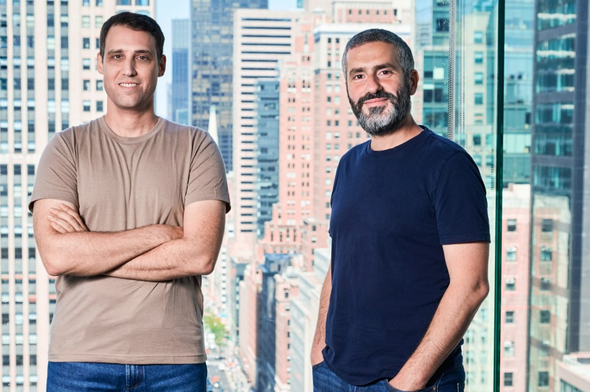
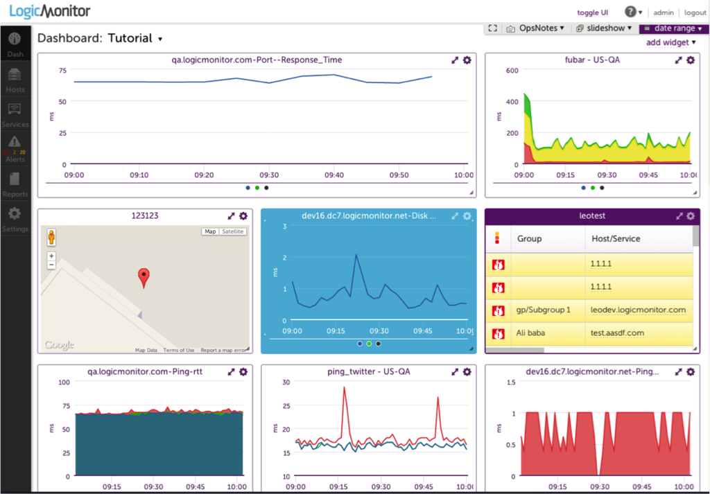

# 에이전트를 지켜보는 일에 2억 달러가 모였다

_Coralogix Series F $200M — 에이전트 경제의 다음 인프라는 _

## Executive Summary

> [!callout]
> 2026년 6월 3일, 관측 가능성(observability) 회사 **Coralogix**가 Series F로 2억 달러를 받았다. 밸류에이션은 16억 달러, 고객은 5,000곳을 넘었고 매출은 한 해 60% 넘게 자랐다. 로그와 메트릭을 모아 시스템 상태를 보여 주던 회사가, 이번에는 "AI 에이전트가 무슨 짓을 하고 있는지" 보여 주는 일로 큰돈을 끌어모았다. 이 글은 그 투자가 무엇의 신호인지를 본다.

> 지금 조직의 57%가 AI 에이전트를 실제 운영에 올려 두고 있다. 그런데 같은 조사에서 관측 가능성은 AI 스택에서 가장 낮은 점수를 받았다. 에이전트는 늘었는데 그들을 지켜볼 눈은 가장 덜 갖춰진 상태다. Coralogix의 2억 달러는 바로 이 빈자리에 자본 시장이 베팅했다는 뜻이다.

> 자동화는 비교적 쉽다. 어려운 쪽은 신뢰다. 그리고 신뢰는 저절로 생기지 않고 설계해야 하며, 그 설계에는 돈이 든다. 에이전트가 스스로 결정하고 행동하는 만큼, 그 행동이 보이지 않으면 자율성은 위임이 아니라 방치가 된다. 그 비용을 누가, 무엇에 치르는지가 이번 펀딩이 던지는 질문이다.

### 주요 수치

출처: [TechCrunch](https://techcrunch.com/2026/06/03/coralogix-raises-200m-in-race-to-build-the-monitoring-layer-for-ai-agents/), The Business Research Company

<!-- stat-card -->
**$200M** — Coralogix Series F — 에이전트 감시 레이어에 들어온 단일 라운드

<!-- stat-card -->
**$1.6B** — post-money 밸류에이션 — 5,000+ 고객·60%+ 성장이 떠받친 값

<!-- stat-card -->
**57%** — 에이전트를 운영 중인 조직 — 그러나 관측 가능성은 AI 스택 최하위 평가

<!-- stat-card -->
**$9.26B** — 2030년 시장 전망 — 2026년 $2.69B에서 약 3.4배

## 무슨 일이 있었나

Coralogix는 2014년 이스라엘에서 시작한 관측 가능성 회사다. 하는 일은 전통적으로 명확했다. 소프트웨어가 남기는 로그, 메트릭, 트레이스를 한곳에 모아 분석하고, 무언가 잘못되면 알려 준다. IBM, Tradeweb, JFrog를 포함해 5,000곳이 넘는 고객을 두고 있고, 연 100만 달러 이상을 쓰는 대형 고객도 30곳에 이른다. 매출은 한 해 60%를 넘게 자랐고 연간 반복 매출은 1억 달러를 넘어섰다.

이번 Series F 2억 달러는 누적 5억 5천만 달러 조달의 일부이며, post-money 밸류에이션을 16억 달러로 끌어올렸다. 눈여겨볼 대목은 투자자 면면이다. Advent, Greenfield Partners, Brighton Park Capital과 함께 캐나다 연금투자위원회(CPPIB)가 들어왔다. 연금 같은 대형 기관 자본은 유행을 좇아 베팅하지 않는다. 이들이 움직였다는 건 에이전트 감시 수요를 한철 트렌드가 아니라 구조적 수요로 봤다는 신호에 가깝다.

*▲ Coralogix 공동창업자 Yoni Farin(왼쪽)과 CEO Ariel Assaraf. 2026년 6월 Series F $200M 발표 | 출처: [TechCrunch](https://techcrunch.com/2026/06/03/coralogix-raises-200m-in-race-to-build-the-monitoring-layer-for-ai-agents/)*

제품도 그 방향으로 옮겨 가고 있다. Coralogix는 장애를 조사하고 운영 데이터를 자연어로 묻고 답하는 내장 AI 에이전트 'Olly'를 운영한다. 더 흥미로운 건 인터페이스 쪽이다. 회사는 MCP(Model Context Protocol)와 CLI를 열어, 사람이 아니라 AI 에이전트가 직접 운영 데이터에 접근하고 질의하도록 했다. CEO 아리엘 아사라프(Ariel Assaraf)는 엔지니어들이 대시보드 대신 AI 어시스턴트를 통해 시스템과 대화하는 쪽으로 옮겨 가면서 "인터페이스 계층이 서서히 허물어지고 있다"고 말한다. 실제로 엔터프라이즈 고객의 절반 이상이 이미 명령줄이나 에이전트 인터페이스로 운영 데이터를 다룬다.

> [!callout]
> 정리하면 이렇다. 사람이 보던 대시보드를 이제 에이전트가 본다. 그리고 그 에이전트가 무엇을 보고 무엇을 결정했는지를, 또 다른 층위에서 누군가 지켜봐야 한다. Coralogix가 받은 2억 달러는 그 '지켜보는 층'에 대한 값이다.

## 에이전트는 다르게 실패한다

왜 에이전트에는 별도의 감시 층이 필요할까. 핵심은 실패하는 방식이 다르다는 데 있다. 전통적인 소프트웨어는 정직하게 망가진다. 요청이 성공하면 200을 돌려주고, 잘못되면 에러를 던진다. 로그에 빨간 줄이 남으니 무엇이 깨졌는지 추적할 수 있다.

AI 에이전트는 그렇지 않다. 자신만만한 말투로, 형식도 멀쩡하게, 완전히 틀린 답을 내놓을 수 있다. 필요 없는 도구를 호출하고, 같은 작업을 무한히 반복하고, 엉뚱한 행동을 실행하면서도 어디에도 에러를 남기지 않는다. 겉보기에는 성공한 실행이다. 그래서 기존 APM(애플리케이션 성능 관리) 도구로는 이 실패가 잡히지 않는다. 응답 시간도 정상이고 에러율도 0인데, 에이전트는 잘못된 결정을 내리고 있는 상황이 생긴다.

*▲ 에이전트-환경 상호작용 구조. 에이전트의 내부 결정 과정('?')은 외부에서 보이지 않아 전통적 APM으로는 감지할 수 없다 | 출처: [Wikimedia Commons](https://commons.wikimedia.org/wiki/File:Artificial_Intelligent_Agent.png) (CC0)*

시장 데이터가 이 공백을 그대로 보여 준다. 지금 조직의 57%가 에이전트를 프로덕션에 올려 두고 있지만, 같은 조사에서 관측 가능성은 AI 스택 중 가장 낮은 평가를 받았다. 쓰는 속도가 지켜보는 능력을 한참 앞질러 버린 셈이다. 가트너는 거버넌스와 관측 가능성, ROI의 명확성이 갖춰지지 않으면 2027년까지 에이전틱 AI 프로젝트의 40% 이상이 취소될 것이라고 경고했다. 한편 IDC는 2029년이면 기업이 10억 개가 넘는 에이전트를 돌리게 될 것으로 본다. 지켜봐야 할 대상은 폭발적으로 늘고, 지켜보는 도구는 아직 가장 약하다.

*▲ 전통적인 IT 모니터링 대시보드. 응답 시간·에러율 등 정형 지표는 추적하지만, AI 에이전트의 비정형 실패(잘못된 결정·무한 루프)는 감지하지 못한다 | 출처: [Wikimedia Commons](https://commons.wikimedia.org/wiki/File:LogicMonitor-Product-Screenshot.png)*

그래서 돈이 이쪽으로 흐른다. LLM 관측 가능성 플랫폼 시장은 2026년 26억 9천만 달러에서 2030년 92억 6천만 달러로 커질 전망이다(연평균 36.2%). 움직이는 건 Coralogix만이 아니다. Datadog은 에이전트의 결정 경로를 그래프로 따라가는 'AI Agent Monitoring'을 내놓았고, New Relic은 2026년 2월 'Agentic AI Monitoring'을 기존 고객에게 추가 비용 없이 얹었다. Dynatrace 역시 AI 기반 APM을 에이전트 영역으로 넓히는 중이고, 에이전트 평가에 특화한 Braintrust도 같은 해 2월 8천만 달러를 받았다. 기존 강자와 신생 스타트업이 같은 빈자리를 향해 동시에 뛰고 있다.

그렇다면 이미 강자가 즐비한 자리에서 2014년에 출발한 회사가 왜 2억 달러를 받았을까. 기존 APM 강자들이 쌓아 둔 제품 위에 에이전트 감시 기능을 덧대는 쪽이라면, Coralogix는 에이전트 시대를 전제로 데이터 구조 자체를 다시 짠 쪽이다. 정해진 스키마에 데이터를 맞추는 대신 스키마에 얽매이지 않는 텔레메트리 데이터 레이크를 고객이 소유한 클라우드에 두는 방식인데, 형식이 들쭉날쭉한 에이전트 행동 기록을 그대로 받아 두기에 유리하다. 투자자들이 베팅한 건 단순한 성장세가 아니라, 새 실패 양식에 맞춰 바닥부터 설계됐다는 이 차별점이기도 하다.

<!-- stat-card -->
**전통 소프트웨어 vs AI 에이전트, 실패가 보이는 방식** — 전통 소프트웨어 — 성공이면 200, 실패면 에러. 로그에 흔적이 남아 추적 가능. 기존 APM으로 충분. — AI 에이전트 — 자신 있게 틀린 답, 불필요한 도구 호출, 무한 루프. 에러 없이 잘못된 결정. 새 감시 층이 필요.

## 자율성의 비용은 관측 가능성이다

페블러스는 에이전트 경제를 여러 차례 다뤄 왔다. [에이전트가 경제 주체가 되는 흐름](https://blog.pebblous.ai/project/AgentEconomy/en/), [프레임워크가 난립하는 국면](https://blog.pebblous.ai/blog/agentic-framework-explosion/ko/), [에이전트가 결제까지 처리하는 구조](https://blog.pebblous.ai/story/ai-agent-payment-stack-pb/ko/)를 차례로 짚으면서, 매번 같은 질문으로 돌아왔다. 에이전트가 더 많아지면, 그다음에 오는 문제는 무엇인가.

Coralogix 펀딩은 그 답의 한 조각이다. 에이전트를 만드는 일은 점점 쉬워진다. 프레임워크가 쏟아지고, 모델은 강해지고, 도구는 풍부해졌다. 그런데 만들기 쉬워진 만큼 신뢰하기는 어려워졌다. 자율적으로 움직이는 대상일수록, 그 움직임이 보이지 않으면 통제할 방법이 없기 때문이다. 자동화는 코드로 끝나지만, 신뢰는 그 코드가 무엇을 하는지 계속 들여다볼 수 있을 때만 성립한다.

이 지점에서 관측 가능성은 데이터 신뢰 문제와 만난다. 페블러스가 말해 온 'AI-Ready Data'는 에이전트가 좋은 결정을 내리도록 입력을 잘 준비하는 일이다. 하지만 입력을 아무리 잘 정돈해도, 에이전트가 실제로 그 데이터를 어떻게 쓰고 어떤 행동으로 옮겼는지가 보이지 않으면 신뢰는 사후에 확인할 수 없는 믿음에 머문다. 데이터 품질이 출발점의 신뢰라면, 관측 가능성은 작동 중의 신뢰다. 둘은 같은 문제의 앞면과 뒷면이다.

> [!callout]
> 관측 가능성 없는 자율성은 위임이 아니라 방치다. 에이전트에게 일을 맡기는 것과 에이전트를 내버려 두는 것은 종이 한 장 차이이고, 그 차이를 만드는 것이 바로 "지금 무엇을 하고 있는지 보이는가"다. Coralogix의 2억 달러는 이 경계선에 시장이 매긴 가격이다.

## 결론

Coralogix가 받은 2억 달러는 한 회사의 성장 스토리이기 전에 시장이 보낸 메시지다. 에이전트를 만드는 단계에서 에이전트를 신뢰하는 단계로 무게중심이 옮겨 가고 있다는 것. 그리고 그 신뢰는 공짜가 아니라 별도의 인프라와 투자를 요구한다는 것.

에이전트를 도입하려는 조직이라면 질문의 순서를 바꿔 볼 만하다. "어떤 에이전트를 쓸 것인가"보다 먼저 "이 에이전트가 무엇을 하는지 우리는 볼 수 있는가"를 물어야 한다. 보이지 않는 자율성은 효율이 아니라 위험이다. 자율성을 키우는 만큼 그것을 지켜볼 눈도 함께 키워야 한다는 것 — 이번 투자가 가장 분명하게 가리키는 방향이다.

이 글이 도움이 됐다면, 다음에 다뤄 보면 좋을 주제나 질문을 편하게 알려 주세요. 에이전트 경제와 데이터 신뢰가 만나는 지점에서 페블러스는 계속 기록을 쌓아 갑니다.

**(주)페블러스 데이터 커뮤니케이션팀**  
2026년 6월 19일

## 참고문헌

### 보도 및 공식 발표

- 1.Lardinois, F. (2026, June 3). Coralogix raises $200M in race to build the monitoring layer for AI agents. _TechCrunch_. [techcrunch.com](https://techcrunch.com/2026/06/03/coralogix-raises-200m-in-race-to-build-the-monitoring-layer-for-ai-agents/)
- 2.Coralogix. (2026, June 3). Coralogix Raises $200M to Scale the Observability Backbone for the Age of AI. _GlobeNewswire_. [globenewswire.com](https://www.globenewswire.com/news-release/2026/06/03/3306135/0/en/coralogix-raises-200m-to-scale-the-observability-backbone-for-the-age-of-ai.html)
- 3.Coralogix. (2026, June 3). Coralogix Raises $200M to Scale the Observability Backbone for the Age of AI. _Coralogix Blog_. [coralogix.com](https://coralogix.com/blog/coralogix-raises-200m-to-scale-the-observability-backbone-for-theage-of-ai/)
- 4.Crunchbase News. (2026, June 5). The Biggest VC Funding Rounds of the Week: June 5, 2026. _Crunchbase News_. [news.crunchbase.com](https://news.crunchbase.com/venture/biggest-funding-rounds-june-5-2026/)

### 업계·경쟁 분석

- 5.Datadog. (2026). Datadog Expands LLM Observability with New Capabilities to Monitor Agentic AI. _Datadog Press Releases_. [datadoghq.com](https://www.datadoghq.com/about/latest-news/press-releases/datadog-expands-llm-observability-with-new-capabilities-to-monitor-agentic-ai-accelerate-development-and-improve-model-performance/)
- 6.New Relic. (2026, February). Beyond the Black Box: Next-Gen Agentic AI Monitoring. _New Relic Blog_. [newrelic.com](https://newrelic.com/blog/ai/beyond-the-black-box-next-gen-agentic-ai-monitoring)
- 7.Gupta, D. (2026). AI Agent Observability, Evaluation & Governance: The 2026 Market Reality Check. [guptadeepak.com](https://guptadeepak.com/ai-agent-observability-evaluation-governance-the-2026-market-reality-check/)
