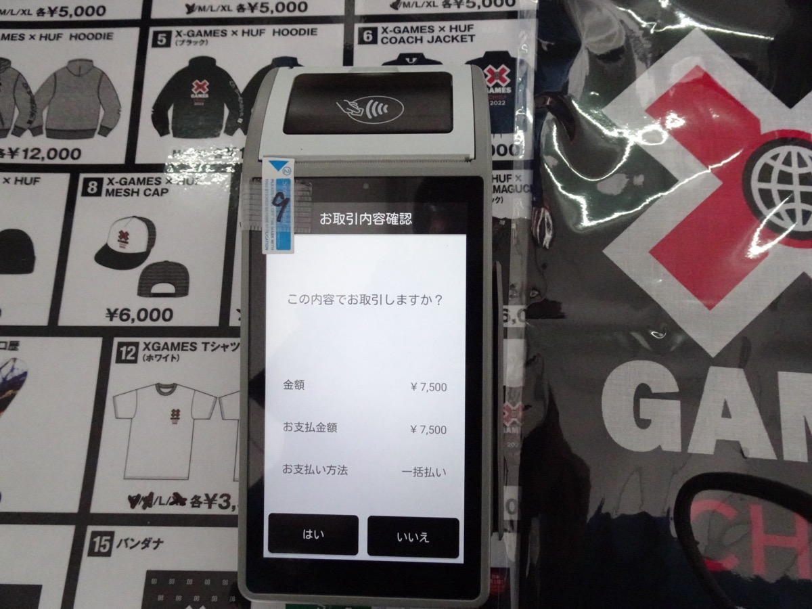
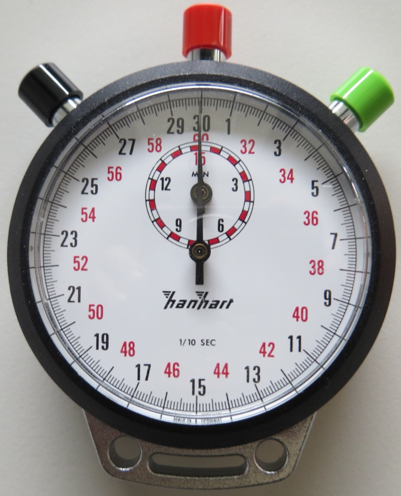
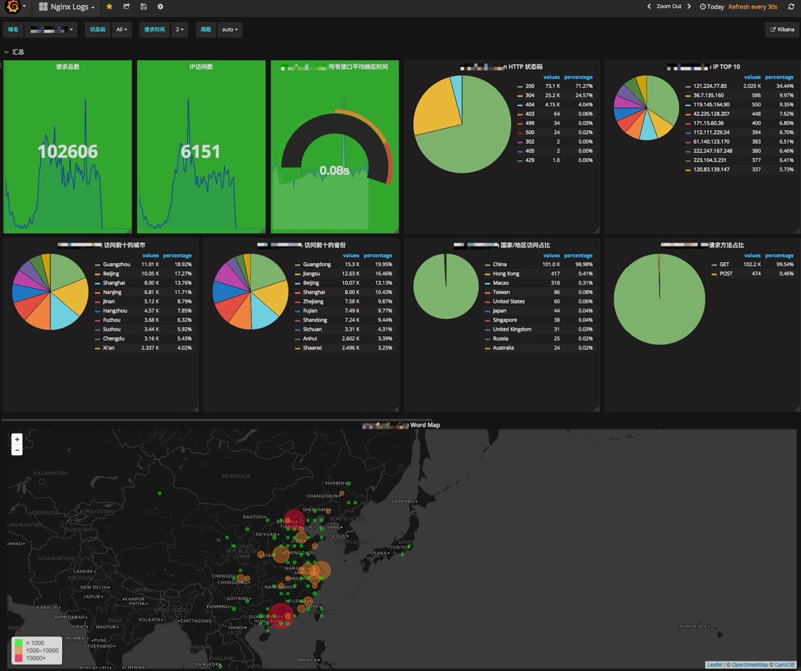

# 데이터도 유통기한이 있다

_AI-Ready Data를 위한 데이터 신선도(Freshness) 점검 7가지 체크리스트_

## Executive Summary

> [!callout]
> 데이터 품질을 말할 때 우리는 보통 정확성과 완전성을 떠올립니다. 그런데 가장 자주 놓치는 차원은 시간입니다. 50ms 만에 열리는 대시보드가 2시간 전 데이터를 보여줄 수 있습니다. 빠른 시스템과 신선한 데이터는 같은 말이 아닙니다. 데이터 신선도(freshness)는 실제 사건이 일어난 시점부터 그 데이터를 모델이 쓸 수 있게 되기까지의 시간 간격이며, 이 간격이 벌어질수록 AI는 조용히, 그러나 확실하게 틀립니다.

> 오래된 입력을 받은 ML 모델은 똑같은 신뢰도로 잘못된 예측을 내놓습니다. 오류처럼 보이지 않기 때문에 발견이 늦습니다. AI 에이전트 시대에는 이 문제가 증폭됩니다. 사람이 분기당 한 번 보던 예측을 에이전트는 초당 한 번씩 실행하고, 피처가 시간당 한 번만 갱신되면 그 한 시간 동안의 모든 결정이 같은 낡은 컨텍스트 위에 쌓입니다. 학계가 Age of Information(AoI)이라는 지표로 측정해 온 이 시간 차원이, 이제 실무 SLA의 핵심 항목으로 올라왔습니다.

> 이 글은 신선도가 무엇이고 어떻게 무너지는지를 먼저 정리한 뒤, 유즈케이스별 SLA 설정과 Training-Serving Skew의 메커니즘을 거쳐, 실무에서 바로 적용할 수 있는 7가지 점검 체크리스트와 도구 가이드로 마무리합니다. 페블러스는 AI-Ready Data의 다섯 가지 신호를 진단해 왔고, 신선도는 그 신호들이 시간 축 위에서도 유지되는지를 묻는 여섯 번째 질문입니다.

<!-- stat-card -->
**<1초** — sub-second 요구 — 사기탐지·실시간 에이전트

<!-- stat-card -->
**3,600** — 동일 컨텍스트 결정 — 피처를 1시간에 1회 갱신할 때

<!-- stat-card -->
**60%** — AI 프로젝트 폐기 전망 — Gartner, AI-Ready 데이터 부재 시

<!-- stat-card -->
**5차원** — 데이터 관찰성 — 신선도·볼륨·스키마·분포·계보

## 유통기한이 없는 데이터의 역설

우유에는 유통기한이 찍혀 있습니다. 데이터에는 없습니다. 그래서 많은 팀이 어제 만든 피처와 1분 전에 만든 피처를 같은 신뢰도로 다룹니다. 문제는 데이터가 우유보다 빨리 상하는 경우가 있다는 점입니다. 사기 탐지에서 "최근 15분간 거래 횟수"라는 피처가 한 시간 전 값이라면, 그것은 더 이상 최근 15분이 아닙니다. 신선도가 빠진 데이터는 형식은 멀쩡하지만 의미가 비어 있습니다.

*▲ 식품에는 제조일과 유통기한이 찍히지만, 데이터에는 그 표기가 없다. 신선도는 우리가 직접 정의해야 하는 값이다. | Source: [Wikimedia Commons](https://commons.wikimedia.org/wiki/File:Expiration_dates_of_food_products_in_Israel_02.jpg)*

먼저 두 개념을 분리해야 합니다. 지연(latency)은 쿼리가 응답하는 데 걸리는 시간입니다. 신선도(freshness)는 사건이 실제로 일어난 시점과 그 사건이 데이터로 시스템에 반영된 시점 사이의 간격입니다. 둘은 독립적입니다. 50ms 만에 응답하는 대시보드가 2시간 전 스냅샷을 그리고 있을 수 있고, 응답이 3초 걸리는 쿼리가 1초 전 이벤트를 반영하고 있을 수도 있습니다. 속도가 빠르다는 사실은 데이터가 새롭다는 보장이 전혀 되지 못합니다.

학계는 이 간격을 Age of Information(AoI)이라는 지표로 다룹니다. 가장 최근에 생성된 업데이트가 지금으로부터 얼마나 오래됐는지를 재는 값입니다. 자율주행, IoT, 금융 거래처럼 실시간 의사결정이 곧 안전·수익과 직결되는 영역에서 AoI 최소화는 오래된 연구 주제였고, 최근에는 6G 네트워크와 생성형 AI의 실시간 응답 품질을 논할 때도 핵심 메트릭으로 다시 등장하고 있습니다(Yates et al., 2021; Cheng et al., 2025). 학술 용어처럼 들리지만, 실무에서는 "이 피처, 지금 몇 분 됐어?"라는 단순한 질문과 같습니다.

> [!callout]
> **핵심 관찰**: 빠른 시스템이 신선한 데이터를 보장하지 않습니다. 지연을 줄이는 일과 신선도를 지키는 일은 서로 다른 작업이고, 둘 다 측정되지 않으면 둘 다 무너집니다. 데이터에 유통기한이 찍혀 있지 않다면, 그 유통기한은 우리가 직접 정의하고 측정해야 합니다.

## AI는 낡은 데이터에도 자신 있게 틀린다

오래된 데이터의 가장 위험한 점은 모델이 그것을 모른다는 사실입니다. 입력 피처가 한 시간 전 값이든 1초 전 값이든, 모델은 똑같은 확신을 담아 예측을 출력합니다. 신뢰도 0.97은 데이터가 신선해서 나온 0.97이 아닙니다. 그저 모델이 받은 숫자에 대해 0.97일 뿐입니다. stale feature는 자신 있되 틀린 예측을 만들어 내고, 그 예측은 오류처럼 보이지 않기 때문에 알림도 울리지 않습니다.

사기 탐지 모델이 "직전 15분 거래 빈도"를 본다고 해 봅시다. 이 피처가 한 시간 지연돼 들어오면 모델은 이상 급증을 평소 패턴으로 착각합니다. 추천 시스템에서 사용자가 방금 구매한 상품을 30분 뒤에도 계속 추천하면, 신선도 격차가 그대로 사용자 경험의 격차가 됩니다. 재고 최적화에서 어제 밤 배치로 갱신된 재고 수량은 오늘 오후의 품절을 예측하지 못합니다. 세 경우 모두 모델 자체는 정상이고, 무너진 것은 입력의 시간입니다.

*▲ 결제 단말기가 거래를 승인하는 순간, "직전 15분 거래 빈도" 같은 피처는 초 단위로 바뀐다. 한 시간 지연된 입력은 이상 급증을 평소 패턴으로 착각하게 만든다. | Source: [Wikimedia Commons](https://commons.wikimedia.org/wiki/File:%E3%83%9D%E3%83%BC%E3%82%BF%E3%83%96%E3%83%AB%E3%81%AA%E3%82%AD%E3%83%A3%E3%83%83%E3%82%B7%E3%83%A5%E3%83%AC%E3%82%B9%E6%B1%BA%E6%B8%88%E7%AB%AF%E6%9C%AB_Portable_cashless_payment_device.jpg)*

이 조용한 실패가 비즈니스 규모로 누적되면 숫자가 됩니다. Gartner는 AI-Ready 데이터로 뒷받침되지 않은 AI 프로젝트의 60%가 2026년까지 폐기될 것이라 전망했고, IBM의 2025년 조사에서는 COO의 43%가 데이터 품질을 최우선 과제로 꼽았습니다. 신선도는 그 데이터 품질 중에서도 가장 측정되지 않는 차원입니다. 정확도 리포트에는 어제의 데이터로 계산한 95%가 찍히지만, 그 95%가 오늘도 유효한지는 아무도 묻지 않습니다.

> [!callout]
> **왜 늦게 발견되나**: 신선도 격차는 곧 정확도 격차입니다(the freshness gap is the accuracy gap). 다만 이 격차는 에러 로그에 남지 않습니다. 모델은 낡은 입력에 대해서도 높은 신뢰도를 출력하므로, 신선도를 별도로 감시하지 않으면 성능 저하는 분기 리포트가 나온 뒤에야 발견됩니다.

## AI 에이전트가 임계점을 바꿨다

전통적인 ML 모델은 신선도에 비교적 너그러운 환경에서 살았습니다. 세션당 한 번, 페이지 로드마다 한 번 추론하면 충분했고, 피처가 시간 단위로 낡아 있어도 큰 사고로 이어지지 않았습니다. 그런데 AI 에이전트는 이 전제를 깹니다. 에이전트는 매 이벤트마다 판단하고, 그 판단을 곧바로 행동으로 옮깁니다.

숫자로 보면 차이가 분명해집니다. 에이전트가 초당 한 번 결정을 내리는데 피처가 한 시간에 한 번만 갱신된다면, 한 시간 동안 내려진 3,600번의 결정이 모두 같은 낡은 컨텍스트 위에 놓입니다. 첫 결정과 3,600번째 결정이 보는 세상은 동일하고, 그동안 실제 세상은 계속 움직였습니다. 시간당 갱신이라는, 과거에는 충분했던 주기가 에이전트 환경에서는 3,600배로 증폭된 위험이 됩니다.

*▲ 결정 빈도가 초 단위로 내려갈수록 허용 가능한 staleness도 함께 내려간다. Age of Information은 "이 피처, 지금 몇 분 됐어?"를 재는 시계다. | Source: [Wikimedia Commons](https://commons.wikimedia.org/wiki/File:Stoppuhr_hanhart.jpg)*

더 본질적인 차이는 결과의 성격입니다. 추천 모델이 틀리면 사용자는 관심 없는 상품을 한 번 보고 지나칩니다. 에이전트가 틀리면 잘못된 티켓을 처리하고, 잘못된 거래를 승인하고, 잘못된 주소로 배송을 라우팅합니다. 에이전트는 틀린 답을 출력하는 데 그치지 않고 틀린 행동을 실행합니다. 그래서 사기 탐지, 실시간 입찰, 자율 운영처럼 에이전트가 행동하는 영역에서는 sub-second 신선도가 더 이상 사치가 아니라 기본 요구가 되었습니다.

> [!callout]
> **에이전트 시대의 기준**: 에이전트 시대의 신선도 요구는 결정 빈도에 비례해 올라갑니다. 사람이 보던 예측을 에이전트에게 넘기는 순간, 허용 가능한 staleness는 시간 단위에서 초 단위로 내려갑니다. 에이전트를 도입하기 전에 "이 피처가 얼마나 자주 갱신되는가"를 먼저 점검해야 하는 이유입니다.

## 신선도 SLA는 유즈케이스마다 다르다

모든 데이터에 sub-second 신선도를 요구하면 비용이 감당되지 않고, 모든 데이터를 야간 배치로 갱신하면 실시간 의사결정이 무너집니다. 정답은 데이터 자산별로 허용 가능한 최대 staleness를 명시적으로 정의하는 것입니다. 아래 표는 유즈케이스를 신선도 요구가 높은 순서로 정리한 것으로, SLA 설계의 출발점으로 쓸 수 있습니다.

| 유즈케이스 | 허용 최대 staleness | 비고 |
| --- | --- | --- |
| 금융 거래·사기 탐지 | < 1초 (sub-second) | 실시간 의사결정, 손실 직결 |
| AI 에이전트 | 수 초 ~ 1분 | 행동 실행 포함 |
| 실시간 대시보드 | < 60초 | 운영 모니터링 표준 |
| 재고·가격 최적화 | 수 분 ~ 15분 | 품절·동적 가격 |
| 추천 시스템 | 수 분 ~ 1시간 | 세션 단위 갱신 |
| 분석 리포트 | 수 시간 ~ 일 단위 | 허용 가능 |
| 배치 ML 재학습 | 수 일 ~ 주 단위 | 정기 재학습 주기 |

****************************

여기서 배치 처리는 신선도의 구조적 적입니다. 야간 배치나 시간별 배치가 달성할 수 있는 최선의 신선도는 배치 간격 그 자체입니다. 한 시간마다 도는 배치는 아무리 빨라도 평균 30분, 최악의 경우 한 시간 낡은 데이터를 만듭니다. 신선도 요구가 분 단위 아래로 내려가면 배치를 더 빨리 돌리는 것으로는 한계가 있고, 이벤트 드리븐 스트리밍으로의 전환이 본질적인 해법이 됩니다.

SLA를 정의할 때는 단일 임계값이 아니라 2단계로 설정하는 편이 실무적입니다. 경고(warning) 임계값에서는 알림만 보내 운영자가 인지하게 하고, 오류(error) 임계값을 넘으면 파이프라인을 차단하거나 다운스트림에 명시적으로 stale 상태를 전파합니다. 임계값 없이 운영되는 신선도는 사실상 측정되지 않는 신선도와 같습니다.

## Training-Serving Skew는 재학습으로 고쳐지지 않는다

신선도 문제가 가장 발견하기 어려운 형태로 나타나는 곳이 Training-Serving Skew입니다. 이것은 모델이 학습할 때 본 데이터와 서빙할 때 받는 데이터가 서로 다를 때 생기는 불일치입니다. 드리프트(drift)가 시간이 흐르며 데이터 분포가 자연스럽게 변하는 통계적 현상이라면, skew는 같은 시점에 학습 경로와 서빙 경로가 다른 값을 만들어 내는 버그입니다.

skew의 원인은 여러 가지입니다. 피처 변환 로직이 학습 코드와 서빙 코드에서 미묘하게 다르거나, null 처리 방식이 갈리거나, 타임존이 어긋나는 경우가 흔합니다. 그중에서도 신선도와 직접 얽히는 원인은 "오래된 소스에서 파생된 피처"입니다. 학습 시에는 완결된 과거 데이터로 피처를 계산하지만, 서빙 시에는 아직 갱신되지 않은 실시간 소스에서 같은 피처를 계산하면, 같은 이름의 피처가 학습과 서빙에서 다른 신선도를 갖게 됩니다.

skew가 위험한 이유는 증상이 조용하기 때문입니다. 명확한 에러 없이 모델 성능이 서서히 저하되고, 오프라인 평가에서는 멀쩡한데 프로덕션에서만 정확도가 떨어집니다. 진단의 출발점은 학습 데이터와 서빙 데이터에 각각 타임스탬프를 남겨 두 경로의 신선도를 직접 비교하는 것입니다. 같은 피처가 학습 시점과 서빙 시점에 며칠씩 차이 나는 소스에서 나온다면, 그 피처는 skew의 1순위 용의자입니다.

> [!callout]
> **진단 순서**: skew는 통계 현상이 아니라 버그입니다. 따라서 재학습으로 고쳐지지 않고, 학습·서빙 두 경로의 피처 정의와 신선도를 일치시켜야 사라집니다. 오프라인 점수는 좋은데 프로덕션 점수만 나쁘다면, 드리프트를 의심하기 전에 신선도 불일치부터 확인하는 편이 빠릅니다.

## AI-Ready 데이터 신선도 점검 7가지 체크리스트

신선도가 왜 문제인지는 충분히 봤으니, 이제 무엇을 점검할 차례입니다. 아래 일곱 항목은 데이터 엔지니어와 MLOps 실무자가 자신의 파이프라인에 그대로 대입해 볼 수 있도록 구성했습니다. 순서는 측정 → 정의 → 자동화 → 감시로 이어집니다.

### 1. 파이프라인 전 구간 latency를 측정한다

이벤트가 발생한 시점부터 그 데이터를 모델이 쓸 수 있게 되는 시점까지, 각 단계에 타임스탬프를 남깁니다. 수집·적재·변환·서빙 구간 중 어디에서 시간이 새는지 보이지 않으면 신선도는 개선할 수 없습니다. 측정되지 않는 것은 관리되지 않습니다.

### 2. 데이터 자산별 신선도 SLA를 명시한다

"이 피처는 5분 이내, 저 테이블은 1시간 이내"처럼 각 자산에 구체적인 신선도 목표를 적어 둡니다. 4절의 유즈케이스 표가 출발점이 됩니다. 목표 없이 운영되는 신선도는 사후에야 문제로 드러납니다.

### 3. 자동 freshness 검증을 파이프라인에 심는다

dbt의 `source freshness`, Great Expectations의 최신성 검증, 관찰성 도구의 freshness 모니터를 파이프라인 안에 넣어 사람이 매번 확인하지 않아도 임계값 초과를 자동으로 잡아냅니다. 첫 방어선은 사람이 아니라 코드여야 합니다.

### 4. 학습 데이터의 타임스탬프를 관리한다

학습에 쓰인 데이터가 언제 시점의 것인지 기록하고, 서빙 데이터의 시점과 나란히 비교합니다. 이 비교가 Training-Serving Skew를 조기에 잡는 가장 직접적인 방법입니다. 같은 피처의 두 신선도가 크게 벌어지면 경보를 울립니다.

### 5. Feature Store의 staleness를 모니터링한다

피처 그룹별로 신선도 SLO를 설정하고, 어떤 그룹이 얼마나 오래됐는지 추적합니다. 업스트림 Kafka consumer lag을 함께 보면 좋습니다. lag이 늘어난다는 것은 스트림 프로세서가 병목에 걸려 피처가 낡아지기 시작했다는 가장 이른 신호입니다.

### 6. 배치 job 실패를 다운스트림에 전파한다

스케줄된 배치가 돌지 않으면 데이터는 조용히 어제 값에 멈춥니다. 배치 실패를 다운스트림 시스템에 명시적으로 알려, 모델이 stale 데이터를 정상 데이터로 오인하지 않게 합니다. 침묵하는 배치가 가장 위험합니다.

### 7. 신선도를 관찰성 5차원에 통합한다

신선도(freshness)는 데이터 관찰성의 다섯 차원 중 하나입니다. 볼륨, 스키마, 분포, 계보(lineage)와 함께 한 화면에서 감시할 때 비로소 "왜 신선도가 떨어졌는가"를 추적할 수 있습니다. 신선도만 따로 보는 모니터링은 원인 분석으로 이어지지 못합니다.

*▲ 처리량·평균 응답시간·상태 코드 분포를 한 화면에 모은 관찰성 대시보드. 신선도는 이렇게 볼륨·스키마·분포·계보와 나란히 감시될 때 원인 분석으로 이어진다. | Source: [Wikimedia Commons](https://commons.wikimedia.org/wiki/File:Grafana_Dashboard_(2017).jpg)*

> [!callout]
> **실무 팁**: 일곱 항목을 한꺼번에 도입할 필요는 없습니다. 1번(측정)과 2번(SLA 정의)만 먼저 갖춰도 어떤 데이터가 위험한지 보이기 시작합니다. 보이는 순간부터 나머지 다섯 항목의 우선순위가 저절로 정해집니다.

## 신선도 점검 도구는 환경에 맞춰 고른다

신선도 점검은 하나의 만능 도구로 끝나지 않습니다. 데이터가 어디에 있고 어떻게 흐르는지에 따라 맞는 도구가 다릅니다. 아래는 환경별로 자주 쓰이는 도구를 정리한 것으로, 체크리스트의 각 항목을 어디에 붙일지 고를 때 참고할 수 있습니다.

| 환경 | 도구 | 신선도 점검 방식 |
| --- | --- | --- |
| SQL 데이터 웨어하우스 | dbt source freshness | MAX(loaded_at) 기준 경고·오류 2단계 임계값 |
| 파이프라인 데이터 검증 | Great Expectations | 최신성 expectation으로 적재 시점 자동 검증 |
| 실시간 피처 | Feast, RisingWave, Tecton | 피처 그룹별 freshness SLO + alert |
| 스트리밍 파이프라인 | Kafka consumer lag 모니터링 | lag 증가 = 신선도 저하 조기 신호 |
| 종합 모니터링 | Monte Carlo, Acceldata | 관찰성 5차원에서 신선도 통합 감시 |

****``****************

도구를 고를 때 기준은 단순합니다. 데이터가 정적인 웨어하우스에 쌓인다면 dbt와 Great Expectations로 충분하고, 실시간 피처가 모델로 흐른다면 Feature Store의 신선도 모니터링이 핵심이 됩니다. 스트리밍이 끼어 있다면 consumer lag을 보는 것이 가장 이른 경보 장치이고, 여러 파이프라인을 한눈에 봐야 한다면 관찰성 플랫폼으로 다섯 차원을 묶습니다. 중요한 것은 도구의 이름이 아니라, 7가지 체크리스트의 각 항목에 책임지는 감시 장치가 하나씩 붙어 있는가입니다.

## 신선도는 AI-Ready Data의 여섯 번째 신호다

페블러스는 이미지 데이터의 AI-Ready 여부를 다섯 가지 신호로 진단해 왔습니다. 무결성, 균형, 픽셀 다양성, 피처 공간 분포, 클래스 분리도. 이 다섯 신호는 한 시점의 데이터를 정지 화면처럼 들여다본 결과입니다. 그런데 데이터는 멈춰 있지 않습니다. 어제 다섯 신호가 모두 초록이던 데이터셋도, 갱신이 끊기면 오늘은 낡은 데이터가 됩니다. 신선도는 그 다섯 신호가 시간 축 위에서도 유지되는지를 묻는 여섯 번째 질문입니다.

진단이 한 시점의 사진이라면, 신선도는 그 사진이 지금도 유효한지에 대한 보증입니다. 페블러스가 DataClinic의 진단 다음 단계로 데이터 그린하우스(에이전틱 자율 데이터 운영)를 두는 이유가 여기 있습니다. 진단은 데이터의 상태를 한 번 알려 주지만, 운영은 그 상태가 계속 유지되도록 자율적으로 갱신하고 모니터링합니다. 신선도는 진단과 운영을 잇는 시간의 다리입니다.

실무로 돌아오면 질문은 단순합니다. 지금 모델에 들어가는 피처 중, 신선도 SLA가 정의된 것이 몇 개입니까. 그중 자동으로 감시되는 것은 몇 개입니까. 두 답이 모두 "거의 없음"이라면, 새 데이터를 모으거나 모델을 바꾸기 전에 시간 축부터 점검할 차례입니다. 데이터에 유통기한이 없다면, 그 유통기한을 정의하는 일이 AI-Ready로 가는 다음 한 걸음입니다.

> [!callout]
> **마무리 질문**: 이 글의 7가지 체크리스트 중 지금 당장 답할 수 있는 항목은 몇 개입니까. 답이 비어 있는 항목이 바로 다음 스프린트의 작업 목록입니다. 측정되지 않은 신선도는, 측정될 때까지 그저 운에 맡긴 가정일 뿐입니다.

## 참고문헌

### 학술

- 1.Shisher, M. K. C., & Sun, Y. (2022). "[How Does Data Freshness Affect Real-time Supervised Learning?](https://arxiv.org/abs/2208.06948)" arXiv:2208.06948.
- 2.Cheng, N., et al. (2025). "[Redefining Information Freshness: AoGI for Generative AI in 6G Networks](https://arxiv.org/abs/2504.04414)." arXiv:2504.04414.
- 3.Yates, R. D., et al. (2021). "Age of Information: An Introduction and Survey." _IEEE Journal on Selected Areas in Communications_, 39(5).
- 4.Berkeley EECS. (2025). "Ensuring Data Freshness Across Clouds for Model Serving." UC Berkeley Technical Report.

### 업계·보도

- 5.Gartner. (2025). "60% of AI projects unsupported by AI-ready data will be abandoned by 2026."
- 6.IBM Institute for Business Value. (2025). "C-Suite Study: 43% of COOs rank data quality as the biggest priority."
- 7.Tacnode. "[What is Stale Data?](https://tacnode.io/post/what-is-stale-data)" Tacnode Blog.
- 8.RisingWave. "[Feature Pipeline Observability & Freshness Monitoring](https://risingwave.com/blog/feature-pipeline-observability-freshness-monitoring/)." RisingWave Blog.
