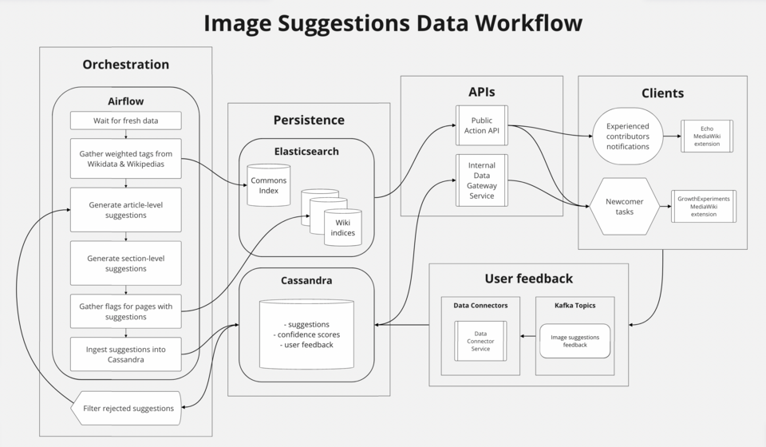

# Your Data Has a Family Tree

_Why and how to trace data lineage across your AI pipeline_

## Executive Summary

> [!callout]
> Data lineage is the record of every move and transformation a piece of data goes through, from the moment it is first created to the moment it reaches a dashboard or an AI model. In plain terms, it is the family tree of your data. This article lays out, without overstatement, why that family tree is a question of trust, and how teams running AI pipelines actually collect lineage and meet regulatory demands.

> The cost of having no lineage is not abstract. At one company, a single error — a null value misread as zero — burned through $250,000 overnight, and because the model itself looked fine, it took days to find the cause. When the model is healthy but the data lies, the whole system produces the wrong answer. Lineage is the map that tells you where to look.

> You do not need grand infrastructure to start. An open standard called OpenLineage and free tools like Marquez and MLflow are enough to draw end-to-end lineage. And as the EU AI Act made training-data documentation mandatory for high-risk AI in August 2026, lineage shifted from a recommendation to a precondition for compliance.

### Key Figures

Here are four numbers that gather the signals scattered across this article: the fine a regulator can levy, the overnight loss a missing lineage trail caused, the scale of people a bias reached, and the share of projects that collapse because of data. Different starting points, different domains — yet all four point to the same place. They are the price you pay when you cannot explain where your data came from and how it changed.

Sources: [EU AI Act Article 10](https://aivigilia.com/blog/eu-ai-act-article-10-data-governance-requirements) · [Medium](https://medium.com/@billygareth01/data-lineage-in-ai-systems-how-to-trace-production-failures-back-to-their-source-4ea1b9d90aa9) · [Prolific](https://www.prolific.com/resources/ai-bias-10-real-world-failures-and-what-they-reveal-about-training-data)

<!-- stat-card -->
**€35M** — Max AI Act fine — For breaching training-data documentation duties — or 7% of global revenue

<!-- stat-card -->
**$250K** — The cost of one night — One null→0 error; days to trace it with no lineage

<!-- stat-card -->
**200M** — People a bias reached — Annual reach of a healthcare algorithm trained on a flawed proxy

<!-- stat-card -->
**~30%** — Projects data brought down — Share of generative AI projects that fail over training-data quality

## Your Data Has a Family Tree

Looking at the chicken on the dinner table, we sometimes ask: which farm raised it, when, and through what distribution path did it reach here? That is the question food traceability answers. Data lineage answers exactly the same question about data. Which system did this number first appear in, what processing did it go through, and who is using it now?

More precisely, data lineage is a record of every path a piece of data travels and every transformation it undergoes, from the moment it is created to the moment it is consumed. It is easiest to understand along three axes.

- •**Origin**: Which system did this data first come from? A log collector, a payments database, an external API?
- •**Transformation**: What ETL, filters, aggregations, joins, and cleaning did it pass through? Did a unit change or a missing value get filled along the way?
- •**Consumption**: Which dashboard, ML model, or API ultimately uses this data?

*▲ A software library dependency graph — GTK and ATK both "depend on" GLIB, drawn as nodes and arrows (OpenGL stands alone). Data lineage uses the very same grammar to map "what came from what" | Source: [Wikimedia Commons](https://commons.wikimedia.org/wiki/File:DependencyGraph.svg)*

### 1.1. Lineage and Provenance Are Not the Same

The two terms are often used interchangeably in practice, but they emphasize different things. Lineage focuses on technical dependencies and the flow of transformations — connections of the kind "this column came from that table." Provenance looks more at the legal and ethical side: who owns this data, was there consent for its collection, and what are the license terms? Doing AI governance properly means managing both. If you know the transformation flow but not whether the source was legitimate, you may know what the model learned, yet still cannot answer whether it should have learned it.

> [!callout]
> Lineage is not a concern only for specialists. For ordinary users too, what data an AI service was trained on, and what biases that data carries, becomes the basis for deciding whether the service can be trusted at all. Data that cannot explain its own origins has a hollow foundation beneath its trust, however plausible the results may look.

## Failures Born Without Lineage

Nothing shows the value of lineage more clearly than the failures that happened for lack of it. The four cases below differ in scale and domain, but they all tell the same story: even when the model is fine, if the data lies, the whole system gets it wrong.

### 2.1. The Weekend $250,000 Disappeared

In one company's ad-bidding pipeline, null values started being misread as zero. As a result, the conversion rate was inflated from 0.8% to 80%. The bidding system was not broken — it worked exactly as designed. It simply trusted the bad signal and bid aggressively. Overnight, $250,000 was gone. The real problem came next. With no lineage, it took days to trace which transformation step the error had crept into. The team suspected the model and was slow to look at the data.

### 2.2. A Bias Applied to 200 Million People

A U.S. healthcare algorithm used healthcare spending as a proxy for gauging a patient's health needs. The algorithm was applied to roughly 200 million people a year. The problem was that it also learned a social pattern: for structural reasons, Black patients spend less on healthcare at the same level of illness. As "spends less" was turned into "needs less," patients who needed care were pushed out of the system. With training-data lineage, the dangerous substitution of "spending ≠ need" could have surfaced at the data stage, before the model ever shipped.

### 2.3. Treatment Recommendations That Changed by Race

A 2025 study in NPJ Digital Medicine tested major LLMs — Claude, ChatGPT, Gemini — on psychiatric patient cases. For identical symptoms, treatment recommendations changed when the patient's race was specified. In some cases an ADHD medication recommendation was dropped; in a depression case, guardianship was suggested. Where such discriminatory patterns originate in the training data is something you simply cannot trace without data lineage. That is why, before blaming the model, you have to look at what the model was fed as it grew.

### 2.4. The Quiet Collapse: Silent Feature Drift

Dramatic incidents are not the only danger. There is a more common and more subtle failure. An upstream team quietly changes the definition of some feature. There is no version-change notice. The data distribution drifts gradually. A downstream model's performance slips, little by little, without anyone noticing. This is so-called Silent Feature Drift. Drift detection can tell you "something is off." But "where to look" is something only lineage can answer. The two are not rivals — they are a pair.

> [!callout]
> What these four cases share is that the cause was the data, not the model. And had lineage been in place, tracing the cause would have shrunk from days to minutes, or the failures would have been caught before launch in the first place. Lineage is both the insurance that prevents incidents and the map you unfold fastest when one strikes.

## Three Ways to Collect Lineage

There are broadly three ways to gather lineage. Which one you choose depends on what your pipeline looks like, and mixing all three is common.

- •**Parsing-based**: Statically analyze SQL, Python, and Spark code to reverse-engineer the transformation logic. It is the most accurate and complete, but it struggles to follow dynamically generated queries or external functions.
- •**Log-based**: Extract the data movements that actually happened from a database's WAL/CDC logs or Kafka streams. It needs no code parsing and sees exactly what was executed.
- •**Self-contained**: Platforms like dbt where the very act of running a transformation generates lineage. With no separate collection apparatus, running the model produces the dependency graph alongside it.

### 3.1. Table-Level or Column-Level?

As important as the collection method is the granularity of the lineage. Table-level lineage sees only as far as "which table came from which table." That is enough to grasp the big picture quickly. But compliance and precise impact analysis require column-level lineage. Only when you can trace down to "this output column sums and normalizes three specific columns from the source table" can you answer what breaks when you change one field in the schema, and which column personal data flowed through.

> [!callout]
> The criterion for choosing is simple. If your goal is debugging and a high-level overview, starting at table level is fine. But if compliance, personal-data tracking, or schema-change impact analysis is on the line, pick a tool that supports column-level lineage from the start, so you don't have to rebuild later.

## How to Read a Lineage Graph

Collected lineage is usually visualized as a directed acyclic graph (DAG). It looks complex, but its components are simple. Nodes are datasets (tables, S3 buckets, Kafka topics, and so on), jobs, and models. Edges represent the relationship "A is transformed into B." The OpenLineage standard models this structure with three things: Job (the process definition), Run (a specific execution instance), and Dataset (inputs and outputs).

There are two directions in which you read the graph: upstream tracing, going back up, and downstream impact analysis, following it down.

- •**Upstream tracing**: When you spot a strange value, you follow "where did this data come from" backward to find the source of the error. The days-long hunt in the $250,000 incident in Section 2 was exactly this kind of trace.
- •**Downstream impact analysis**: You see in advance "what breaks if I change this column." Knowing which dashboards and models depend on this data lets you gauge the blast radius of a change beforehand.

*▲ A real pipeline's lineage graph — orchestration (Airflow), storage (Elasticsearch, Cassandra), APIs, and consumption linked as nodes and edges | Source: [Wikimedia Commons](https://commons.wikimedia.org/wiki/File:Image_suggestions_data_workflow.png)*

Representative tools that display this graph include Marquez's UI, DataHub's Lineage Graph tab, and dbt's Lineage Explorer. Amazon DataZone also released an OpenLineage-compatible visualization in preview in 2025, letting you query the history of how lineage changed across versions.

## A Tool Selection Guide

There are many tools, but the starting point really comes down to one thing: the open standard OpenLineage. Think of the rest as visualization, experiment tracking, and a catalog layered on top as needed, and the choice becomes easier.

### 5.1. Standard and Reference: OpenLineage + Marquez

OpenLineage is a project of the Linux Foundation's LF AI & Data, an open standard for collecting and representing lineage metadata. It supports major tools like Airflow, Spark, Flink, and dbt; for Spark, attaching a listener captures lineage automatically with no code changes. An extension structure called Facets lets you carry metadata such as schemas, data-quality metrics, and SQL queries alongside the lineage. There is no license cost and the community is active, but in exchange it has fewer connectors than commercial tools, and you should reckon on two to three months on average for the initial implementation. Marquez is the reference implementation of OpenLineage, storing a column-level graph in PostgreSQL and providing a visual UI. It is specialized purely for lineage tracking.

*▲ Apache Airflow — a leading orchestrator supported by OpenLineage; attach a listener and lineage is captured with no code changes | Source: [Wikimedia Commons](https://commons.wikimedia.org/wiki/File:AirflowLogo.svg)*

### 5.2. Transformation and Experiments: dbt and MLflow

If your team runs its transformation pipeline on dbt, dbt builds the model dependency graph automatically. Paired with Snowflake, it covers down to the column level. As a rule of thumb, while you are using only dbt and Snowflake, you don't really need a separate catalog layer; revisit it when BI tools, ML pipelines, and agent tools start to attach. On the ML side, MLflow records which experiment was trained on which dataset version. That is the heart of ML lineage — answering the question "which data was this model made from."

### 5.3. Open-Source Catalogs and Commercial Platforms

If you need broader governance, look at the catalog family. Apache Atlas is strong in the Hadoop ecosystem and can bundle in access control via Ranger integration, but it is heavy. OpenMetadata builds in quality testing and data profiling, making it more practical than Atlas, while DataHub is a polished catalog that unifies search, ownership, quality, and lineage. For enterprises with budget and dedicated staff, commercial platforms like Atlan, Alation, Collibra, and Informatica provide AI-driven automatic lineage mapping and visualization.

Simplified by scale, it looks like this. Small teams are well served by the OpenLineage + Marquez + MLflow combination. Mid-sized teams add DataHub or OpenMetadata as a catalog to reinforce search and governance. For large regulated industries, the automation and support of a commercial platform offset the labor cost.

## Compliance and Audit Trails

In 2026, lineage shifted in status from "nice to have" to "cannot do without." The EU AI Act is the turning point. As rules for high-risk AI systems took full effect in August 2026, documentation of training, validation, and test data became a legal obligation.

*▲ The European Parliament hemicycle in Strasbourg — the stage where the EU AI Act made training-data documentation for high-risk AI a legal duty | Source: [Diliff, Wikimedia Commons (CC BY-SA 3.0)](https://commons.wikimedia.org/wiki/File:European_Parliament_Strasbourg_Hemicycle_-_Diliff.jpg)*

### 6.1. What Article 10 Requires

EU AI Act Article 10 requires that, for the training, validation, and test data of high-risk AI, you record all of the design choices, the statistical properties of the data, and the bias-mitigation steps. The following Article 12 requires keeping records of input data checked against reference databases. The fine for a breach is up to €35 million or 7% of global revenue, whichever is greater. GDPR and DORA point in the same direction. Under GDPR, you must know which systems personal data passed through in order to honor deletion and correction requests; DORA demands real-time lineage and incident reporting from roughly 22,000 EU financial institutions.

### 6.2. The 'Unqueryable Format' Trap

The point where teams most often stumble on compliance is, surprisingly, not technology but format. You may have kept logs, but if they are raw log files that a person has to dig through by hand, they are useless for an actual audit. An audit trail only holds up once the compliance team can directly query "which data was this model trained on" without filing an engineering ticket. Keeping lineage in a queryable form — that is the practical dividing line of compliance.

### 6.3. An Internal Audit Readiness Checklist

To prepare for Article 10, you need at minimum the following five things.

- •Documentation of the source and collection time of the training data
- •A record of each filtering, deduplication, and preprocessing step
- •Dataset version control (Git-based or versions within a catalog)
- •A history of bias-mitigation measures
- •A mapping of which model was trained on which dataset version (MLflow experiment ↔ dataset)

## How to Start Right Now

The most common mistake when adopting lineage is setting out to build custom lineage infrastructure from scratch. There is no need. Building up in stages on top of a proven open standard is faster and safer. A small team can start with the following four steps.

- •**Step 1 — Start with high-impact pipelines**: Don't try to trace all your data at once. Pick the pipelines that are expensive when wrong — executive dashboards, regulatory reports, production model training.
- •**Step 2 — Set up OpenLineage events**: Turn on OpenLineage events in your orchestration tools (Airflow, Dagster) and transformation layer (dbt). Most of this can begin as configuration-level work.
- •**Step 3 — Connect collection and visualization**: Gather the emitted events into Marquez or DataHub and view them as a graph. From here, upstream and downstream tracing becomes possible.
- •**Step 4 — Link ML experiments with dataset versions**: Use MLflow to tie which dataset version was used in which experiment. Connecting these three layers through a catalog completes the end-to-end graph.

According to McKinsey research, employees waste 30% of their working hours dealing with low-quality data. Yet without lineage, you cannot even diagnose which data is low quality. As of 2026, 61% of organizations named data quality their top priority, and about 30% of generative AI projects fail over training-data quality. Lineage is the starting line for all of these diagnoses.

> [!callout]
> Editor's Note

> The incidents and regulations this article touched on all converge on one question: can you explain where this data came from and how it changed? That is also why Pebblous concentrates on AI-Ready Data and data-quality diagnostics. Lineage is the foundation that holds up that diagnosis, and it is only on well-ordered data that both the model and your compliance posture become solid.

## References

### Official Docs & Standards

- 1.OpenLineage (LF AI & Data). (2026). "[OpenLineage — Getting Started](https://openlineage.io/getting-started/)." openlineage.io.
- 2.OpenLineage. (2026). "[OpenLineage/OpenLineage](https://github.com/OpenLineage/OpenLineage)." GitHub.
- 3.AWS Big Data Blog. (2025). "[Amazon DataZone introduces OpenLineage-compatible data lineage visualization (preview)](https://aws.amazon.com/blogs/big-data/amazon-datazone-introduces-openlineage-compatible-data-lineage-visualization-in-preview/)." aws.amazon.com.

### Regulation & Governance

- 4.Atlan. (2026). "[EU AI Act Data Governance Requirements](https://atlan.com/know/eu-ai-act-data-governance-requirements/)." atlan.com.
- 5.Aivigilia. (2026). "[EU AI Act Article 10: Data Governance Requirements](https://aivigilia.com/blog/eu-ai-act-article-10-data-governance-requirements)." aivigilia.com.
- 6.Pulsr. (2026). "[GDPR Taught Us Data Governance; the AI Act Demands Data Lineage](https://medium.com/@pulsr-io-enrico/gdpr-taught-us-data-governance-the-ai-act-demands-data-lineage-heres-the-difference-eb3c3466f324)." Medium.

### Practice, Cases & Tools

- 7.Atlan. (2026). "[Data Lineage Tracking: A Complete Guide](https://atlan.com/know/data-lineage-tracking/)." atlan.com.
- 8.Atlan. (2026). "[Training Data Lineage for LLMs](https://atlan.com/know/training-data-lineage-for-llms/)." atlan.com.
- 9.DataHub. (2026). "[Data Lineage Tools (2026)](https://datahub.com/blog/data-lineage-tools/)." datahub.com.
- 10.Billy Gareth. (2026). "[Data Lineage in AI Systems: How to Trace Production Failures Back to Their Source](https://medium.com/@billygareth01/data-lineage-in-ai-systems-how-to-trace-production-failures-back-to-their-source-4ea1b9d90aa9)." Medium.
- 11.Prolific. (2026). "[AI Bias: 10 Real-World Failures and What They Reveal About Training Data](https://www.prolific.com/resources/ai-bias-10-real-world-failures-and-what-they-reveal-about-training-data)." prolific.com.
- 12.Atlan. (2026). "[Data Lineage Tools](https://atlan.com/data-lineage-tools/)." atlan.com.
