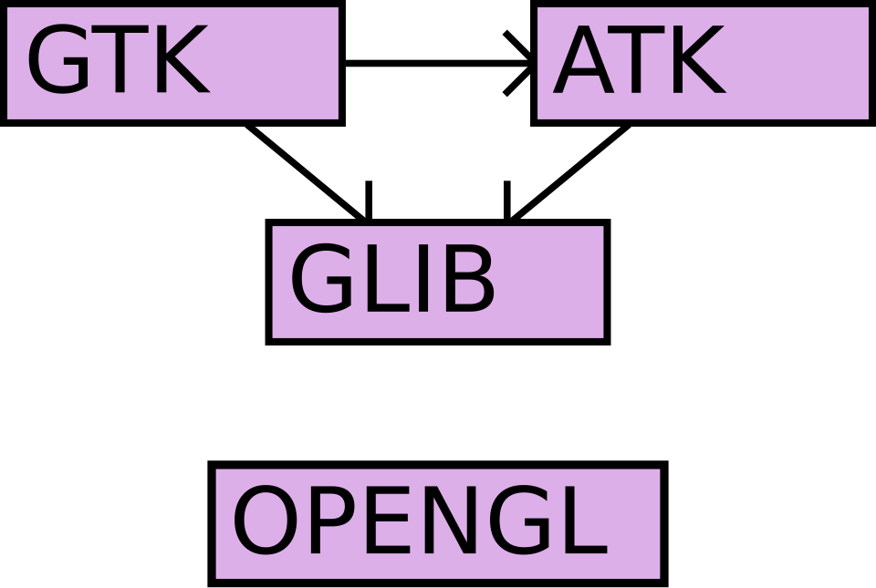

# 데이터에도 족보가 있다

_AI 파이프라인에서 데이터 계보(Data Lineage)를 추적해야 하는 이유와 방법_

## Executive Summary

> [!callout]
> 데이터 계보(Data Lineage)는 데이터가 처음 생성된 순간부터 대시보드와 AI 모델에 도달하기까지 거친 모든 이동과 변환을 기록한 이력이다. 쉽게 말하면 데이터의 족보다. 이 글은 그 족보가 왜 신뢰의 문제인지, 그리고 AI 파이프라인을 운영하는 팀이 계보를 어떻게 수집하고 규제에 대응하는지를 과장 없이 정리한다.

> 계보가 없을 때 치르는 비용은 추상적이지 않다. 한 기업에서는 null 값이 0으로 잘못 읽힌 오류 하나로 하룻밤에 25만 달러가 날아갔고, 모델은 멀쩡했던 탓에 원인을 찾는 데 며칠이 걸렸다. 모델이 정상이어도 데이터가 거짓말을 하면 시스템 전체가 틀린 답을 낸다. 계보는 "어디를 봐야 하는지"를 알려주는 지도다.

> 지금 시작하는 데 거창한 인프라는 필요 없다. OpenLineage라는 오픈 표준과 Marquez·MLflow 같은 무료 도구만으로도 엔드-투-엔드 계보를 그릴 수 있다. 2026년 8월 EU AI Act가 고위험 AI의 훈련 데이터 문서화를 의무로 못 박으면서, 계보는 권장 사항에서 규제 대응의 전제 조건으로 바뀌었다.

### 주요 수치

이 글에 흩어진 핵심 신호를 네 개의 숫자로 먼저 추린다. 규제가 매기는 벌금, 계보 부재가 부른 하룻밤의 손실, 편향이 닿은 사람의 규모, 그리고 데이터 때문에 무너지는 프로젝트의 비율이다. 출발점도 분야도 다르지만 네 숫자는 결국 같은 곳을 가리킨다. 데이터가 어디서 와서 어떻게 바뀌었는지 설명하지 못할 때 치르는 대가다.

출처: [EU AI Act Article 10](https://aivigilia.com/blog/eu-ai-act-article-10-data-governance-requirements) · [Medium](https://medium.com/@billygareth01/data-lineage-in-ai-systems-how-to-trace-production-failures-back-to-their-source-4ea1b9d90aa9) · [Prolific](https://www.prolific.com/resources/ai-bias-10-real-world-failures-and-what-they-reveal-about-training-data)

<!-- stat-card -->
**€35M** — AI Act 최대 과징금 — 훈련 데이터 문서화 의무 위반 시. 또는 전 세계 매출 7%

<!-- stat-card -->
**$250K** — 하룻밤의 대가 — null→0 오류 한 건, 계보 부재로 추적에 며칠 소요

<!-- stat-card -->
**2억 명** — 편향이 닿은 규모 — 잘못된 대리 지표를 학습한 의료 알고리즘의 연간 적용 인원

<!-- stat-card -->
**~30%** — 데이터가 무너뜨린 프로젝트 — 생성형 AI 프로젝트 중 훈련 데이터 품질 문제로 실패한 비율

## 데이터에도 족보가 있다

식탁에 오른 닭고기를 두고 우리는 가끔 묻는다. 어느 농장에서, 언제 키워, 어떤 유통 경로를 거쳐 여기까지 왔는가. 식품 이력 추적이 답하는 질문이다. 데이터 계보는 데이터에 대해 정확히 같은 질문에 답한다. 이 숫자는 어느 시스템에서 처음 생겼고, 어떤 가공을 거쳤으며, 지금 누가 쓰고 있는가.

조금 더 정확히 정의하면, 데이터 계보는 데이터가 생성된 순간부터 소비되는 순간까지의 모든 이동 경로와 변환 이력을 기록한 것이다. 세 가지 축으로 나눠 보면 이해가 쉽다.

- •**출처(Origin)**: 이 데이터는 어느 시스템에서 처음 생성됐는가. 로그 수집기인가, 결제 DB인가, 외부 API인가.
- •**변환(Transformation)**: 어떤 ETL, 필터, 집계, 조인, 정제를 거쳤는가. 중간에 단위가 바뀌거나 결측치가 채워지지는 않았는가.
- •**소비(Consumption)**: 최종적으로 어느 대시보드, ML 모델, API가 이 데이터를 사용하는가.

*▲ 소프트웨어 라이브러리 의존성 그래프 — GTK·ATK가 GLIB에 "의존한다"는 관계를 노드와 화살표로 나타냈다(OpenGL은 독립 모듈). 데이터 계보도 똑같은 문법으로 "무엇이 무엇에서 왔는가"를 그린다 | Source: [Wikimedia Commons](https://commons.wikimedia.org/wiki/File:DependencyGraph.svg)*

### 1.1. 계보(Lineage)와 프로비넌스(Provenance)는 다르다

실무에서 자주 섞여 쓰이지만 두 개념은 강조점이 다르다. 계보는 기술적 종속성과 변환 흐름에 집중한다. "이 컬럼은 저 테이블에서 왔다"는 식의 연결이다. 프로비넌스는 법적·윤리적 측면을 더 본다. 이 데이터의 소유권은 누구에게 있고, 수집에 동의가 있었으며, 라이선스 조건은 무엇인가. AI 거버넌스를 제대로 하려면 두 가지를 함께 관리해야 한다. 변환 흐름만 알고 출처의 정당성을 모르면, 모델이 무엇을 학습했는지는 알아도 그것을 학습해도 됐는지는 답할 수 없다.

> [!callout]
> 일반 사용자 입장에서도 계보는 남의 일이 아니다. 내가 쓰는 AI 서비스가 어떤 데이터로 학습됐는지, 그 데이터가 어떤 편향을 품고 있는지는 결국 그 서비스를 믿어도 되는지의 근거가 된다. 출처를 설명하지 못하는 데이터는, 아무리 결과가 그럴듯해도 신뢰의 바닥이 비어 있는 셈이다.

## 계보 없이 생긴 사고들

계보의 가치를 가장 분명하게 보여주는 건 계보가 없어서 벌어진 사고들이다. 아래 네 사례는 규모도 분야도 제각각이지만 결국 같은 이야기를 한다. 모델이 멀쩡해도 데이터가 거짓말을 하면 시스템 전체가 틀린다는 것이다.

### 2.1. 25만 달러가 사라진 주말

한 기업의 광고 입찰 파이프라인에서 null 값이 0으로 잘못 읽히는 일이 벌어졌다. 그 결과 전환율이 0.8%에서 80%로 부풀려졌다. 입찰 시스템은 고장 난 게 아니라, 오히려 정확하게 동작했다. 잘못된 신호를 그대로 믿고 공격적으로 입찰을 올렸을 뿐이다. 하룻밤 사이 25만 달러가 날아갔다. 진짜 문제는 그다음이었다. 계보가 없었던 탓에 오류가 어느 변환 단계에서 끼어들었는지 추적하는 데 며칠이 걸렸다. 모델을 의심하느라 정작 데이터를 늦게 본 것이다.

### 2.2. 2억 명에게 적용된 편향

미국의 한 의료 알고리즘은 환자의 건강 필요도를 가늠하는 대리 지표로 의료비 지출액을 썼다. 이 알고리즘은 연간 약 2억 명에게 적용됐다. 문제는 흑인 환자들이 같은 건강 상태에서도 구조적 이유로 의료비를 덜 지출한다는 사회적 패턴까지 그대로 학습됐다는 점이다. "지출이 적다"가 "필요가 적다"로 둔갑하면서 돌봄이 필요한 환자들이 시스템에서 밀려났다. 훈련 데이터 계보가 있었다면, "지출 ≠ 필요도"라는 위험한 대체가 모델 출시 전 데이터 단계에서 드러날 수 있었다.

### 2.3. 인종에 따라 달라진 치료 권고

2025년 NPJ Digital Medicine에 실린 연구는 Claude, ChatGPT, Gemini 같은 주요 LLM을 정신과 환자 케이스로 시험했다. 동일한 증상이라도 환자의 인종 정보가 명시되면 치료 권고가 달라졌다. 어떤 경우엔 ADHD 약물 추천이 빠졌고, 우울증 사례에 후견인 지정이 제안되기도 했다. 이런 차별적 패턴이 훈련 데이터 어디서 비롯됐는지는, 데이터 계보 없이는 추적할 길이 없다. 모델을 탓하기 전에 모델이 무엇을 먹고 자랐는지를 봐야 하는 이유다.

### 2.4. 조용히 무너지는 패턴: Silent Feature Drift

극적인 사고만 위험한 게 아니다. 더 흔하고 더 교묘한 실패가 있다. 업스트림 팀이 어떤 feature의 정의를 슬쩍 바꾼다. 버전 변경 알림은 없다. 데이터 분포가 서서히 이동한다. 다운스트림 모델의 성능이 누구도 모르게 조금씩 떨어진다. 이른바 'Silent Feature Drift'다. 분포 변화 탐지(drift detection)는 "뭔가 이상하다"까지는 알려준다. 하지만 "어디를 봐야 하는지"는 계보만이 답한다. 둘은 경쟁 관계가 아니라 짝이다.

> [!callout]
> 네 사례의 공통점은 모델이 아니라 데이터가 원인이었다는 것이다. 그리고 계보가 있었다면 원인 추적이 며칠에서 몇 분으로 줄거나, 애초에 출시 전에 걸러졌을 사고들이다. 계보는 사고를 막는 보험이자, 사고가 났을 때 가장 빨리 펼치는 지도다.

## 계보를 수집하는 세 가지 방법

계보를 모으는 방식은 크게 세 가지다. 무엇을 선택하느냐는 우리 파이프라인이 어떻게 생겼는지에 달려 있다. 셋을 섞어 쓰는 경우도 흔하다.

- •**파싱 기반(Parsing-based)**: SQL, Python, Spark 코드를 정적으로 분석해 변환 로직을 역공학한다. 가장 정확하고 완전하지만, 동적으로 생성되는 쿼리나 외부 함수까지 따라가기는 어렵다.
- •**로그 기반(Log-based)**: DB의 WAL·CDC 로그나 Kafka 스트림에서 실제 일어난 데이터 이동을 추출한다. 코드 파싱이 필요 없고 실행된 사실을 그대로 본다는 장점이 있다.
- •**셀프 컨테인드(Self-contained)**: dbt처럼 변환을 실행하는 행위 자체가 계보를 생성하는 플랫폼이다. 별도 수집 장치 없이, 모델을 돌리면 의존성 그래프가 따라 나온다.

### 3.1. 테이블 레벨이냐, 컬럼 레벨이냐

수집 방식만큼 중요한 것이 계보의 세분성(granularity)이다. 테이블 레벨 계보는 "어느 테이블이 어느 테이블에서 왔는가"까지만 본다. 큰 그림을 빠르게 파악하기엔 충분하다. 하지만 규제 대응이나 정밀한 영향 분석에는 컬럼 레벨 계보가 필요하다. "이 결과 컬럼은 소스 테이블의 어느 컬럼 세 개를 합산하고 정규화한 것"까지 추적할 수 있어야, 스키마 한 칸을 바꿨을 때 무엇이 깨지는지, 개인정보가 어느 컬럼을 타고 흘러갔는지 답할 수 있다.

> [!callout]
> 선택의 기준은 단순하다. 디버깅과 큰 그림 파악이 목적이면 테이블 레벨로 시작해도 된다. 그러나 컴플라이언스, 개인정보 추적, 스키마 변경 영향 분석이 걸려 있다면 처음부터 컬럼 레벨을 지원하는 도구를 골라야 나중에 다시 깔지 않는다.

## 계보 그래프를 읽는 법

수집된 계보는 보통 방향성 비순환 그래프(DAG)로 시각화된다. 복잡해 보이지만 구성 요소는 단순하다. 노드는 데이터셋(테이블, S3 버킷, Kafka 토픽 등)과 작업(Job), 모델이다. 엣지는 "A가 변환되어 B가 된다"는 관계를 나타낸다. OpenLineage 표준은 이 구조를 Job(프로세스 정의), Run(특정 실행 인스턴스), Dataset(입출력) 세 가지로 모델링한다.

그래프를 읽는 방향은 두 갈래다. 위로 거슬러 올라가는 업스트림 추적과, 아래로 따라 내려가는 다운스트림 영향 분석이다.

- •**업스트림 추적**: 이상한 값을 발견했을 때 "이 데이터는 어디서 왔는가"를 거꾸로 따라가 오류의 출처를 찾는다. 2장의 25만 달러 사고에서 며칠 걸렸던 일이 바로 이 추적이다.
- •**다운스트림 영향 분석**: "이 컬럼을 바꾸면 무엇이 깨지는가"를 미리 본다. 어느 대시보드와 모델이 이 데이터에 의존하는지 알면, 변경의 파급 범위를 사전에 가늠할 수 있다.

*▲ 실제 파이프라인의 계보 그래프 — 오케스트레이션(Airflow)·저장소(Elasticsearch·Cassandra)·API·소비가 노드와 엣지로 이어진다 | Source: [Wikimedia Commons](https://commons.wikimedia.org/wiki/File:Image_suggestions_data_workflow.png)*

이 그래프를 보여주는 대표적인 도구로는 Marquez의 UI, DataHub의 Lineage Graph 탭, dbt의 Lineage Explorer가 있다. Amazon DataZone도 2025년 OpenLineage 호환 시각화를 프리뷰로 내놓으며, 버전별로 계보가 어떻게 바뀌었는지 이력을 조회할 수 있게 했다.

## 도구 선택 가이드

도구는 많지만 출발점은 사실상 하나다. 오픈 표준인 OpenLineage다. 여기에 시각화·실험 추적·카탈로그를 필요에 따라 얹는 구조로 생각하면 선택이 한결 쉬워진다.

### 5.1. 표준과 레퍼런스: OpenLineage + Marquez

OpenLineage는 Linux Foundation LF AI & Data의 프로젝트로, 계보 메타데이터를 수집하고 표현하는 오픈 표준이다. Airflow, Spark, Flink, dbt 같은 주요 도구를 지원하며, Spark의 경우 Listener를 붙이면 코드 수정 없이 계보가 자동으로 캡처된다. Facets라는 확장 구조로 스키마, 데이터 품질 메트릭, SQL 쿼리 같은 메타데이터를 함께 실어 나를 수 있다. 라이선스 비용이 없고 커뮤니티가 활발한 대신, 상용 도구보다 커넥터 수가 적고 초기 구현에 평균 두세 달이 든다는 점은 감안해야 한다. Marquez는 OpenLineage의 레퍼런스 구현으로, PostgreSQL에 컬럼 레벨 그래프를 저장하고 시각 UI를 제공한다. 순수하게 계보 추적에 특화돼 있다.

*▲ Apache Airflow — OpenLineage가 지원하는 대표 오케스트레이터로, Listener를 붙이면 코드 수정 없이 계보가 캡처된다 | Source: [Wikimedia Commons](https://commons.wikimedia.org/wiki/File:AirflowLogo.svg)*

### 5.2. 변환과 실험: dbt와 MLflow

변환 파이프라인을 dbt로 운영하는 팀이라면, dbt가 모델 의존성 그래프를 자동으로 만들어 준다. Snowflake와 함께 쓰면 컬럼 레벨까지 커버된다. 실무 감각으로 말하면, dbt와 Snowflake만 쓰는 단계에서는 별도 카탈로그 레이어가 굳이 필요 없다. BI 도구, ML 파이프라인, 에이전트 도구가 붙기 시작할 때 다시 검토하면 된다. ML 쪽에서는 MLflow가 어느 데이터셋 버전으로 어느 실험이 훈련됐는지를 기록한다. 이것이 "어느 데이터로 만든 모델인가"라는 질문에 답하는 ML 계보의 핵심이다.

### 5.3. 오픈소스 카탈로그와 상용 플랫폼

더 넓은 거버넌스가 필요하면 카탈로그 계열을 본다. Apache Atlas는 Hadoop 생태계에서 강하고 Ranger 연동으로 접근 제어까지 묶을 수 있지만 무겁다. OpenMetadata는 품질 테스트와 데이터 프로파일링을 내장해 Atlas보다 실무 친화적이고, DataHub는 검색·소유권·품질·계보를 통합한 완성도 높은 카탈로그다. 예산과 전담 인력이 있는 엔터프라이즈라면 Atlan, Alation, Collibra, Informatica 같은 상용 플랫폼이 AI 기반 자동 계보 매핑과 시각화를 제공한다.

규모별로 단순화하면 이렇다. 소규모 팀은 OpenLineage + Marquez + MLflow 조합으로 충분하다. 중간 규모는 DataHub나 OpenMetadata를 카탈로그로 얹어 검색과 거버넌스를 보강한다. 대규모 규제 산업이라면 상용 플랫폼의 자동화와 지원이 인력 비용을 상쇄한다.

## 규제 대응과 감사 추적

2026년 들어 계보는 "있으면 좋은 것"에서 "없으면 안 되는 것"으로 위상이 바뀌었다. EU AI Act가 그 분기점이다. 2026년 8월 고위험 AI 시스템에 대한 규정이 본격 시행되면서, 훈련·검증·테스트 데이터에 대한 문서화가 법적 의무가 됐다.

*▲ 유럽의회 스트라스부르 본회의장 — EU AI Act가 고위험 AI의 훈련 데이터 문서화를 의무로 못 박은 입법의 무대다 | Source: [Diliff, Wikimedia Commons (CC BY-SA 3.0)](https://commons.wikimedia.org/wiki/File:European_Parliament_Strasbourg_Hemicycle_-_Diliff.jpg)*

### 6.1. Article 10이 요구하는 것

EU AI Act Article 10은 고위험 AI의 훈련·검증·테스트 데이터에 대해 설계 선택, 데이터의 통계적 특성, 편향 완화 단계를 모두 기록하도록 요구한다. 이어지는 Article 12는 참조 데이터베이스와 입력 데이터를 대조한 기록을 남기도록 한다. 위반 시 과징금은 최대 3,500만 유로 또는 전 세계 매출의 7% 중 큰 쪽이다. GDPR과 DORA도 같은 방향을 가리킨다. GDPR은 개인정보가 어느 시스템을 거쳤는지 알아야 삭제·수정 요청을 이행할 수 있고, DORA는 EU 금융기관 약 2만 2천 곳에 실시간 계보와 인시던트 리포팅을 요구한다.

### 6.2. '쿼리 불가 포맷'이라는 함정

규제 대응에서 가장 자주 걸려 넘어지는 지점은 의외로 기술이 아니라 포맷이다. 로그를 남기긴 했는데, 그것이 사람이 직접 뒤져야 하는 원시 로그 파일이라면 실질적인 감사에는 쓸 수 없다. 컴플라이언스팀이 엔지니어링 티켓을 끊지 않고도 "이 모델은 어느 데이터로 학습됐나"를 직접 질의할 수 있어야 비로소 감사 추적이 성립한다. 계보를 쿼리 가능한 형태로 보관하는 것, 그것이 규제 대응의 실질적 분기점이다.

### 6.3. 내부 감사 준비 체크리스트

Article 10에 대비하려면 최소한 다음 다섯 가지를 갖춰야 한다.

- •훈련 데이터의 출처와 수집 시점 문서화
- •필터링·중복 제거·전처리 각 단계의 기록
- •데이터셋 버전 관리(Git 기반 또는 카탈로그 내 버전)
- •편향 완화 조치의 이력
- •어느 데이터셋 버전으로 어느 모델이 학습됐는지의 매핑(MLflow 실험 ↔ 데이터셋)

## 지금 당장 시작하는 법

계보를 도입할 때 가장 흔한 실수는 처음부터 커스텀 계보 인프라를 직접 짓겠다고 나서는 것이다. 그럴 필요가 없다. 검증된 오픈 표준 위에 단계적으로 쌓는 편이 빠르고 안전하다. 작은 팀이라면 다음 네 단계로 시작할 수 있다.

- •**1단계 — 고영향 파이프라인부터**: 모든 데이터를 한 번에 추적하려 하지 말고, 경영진 대시보드·규제 리포트·프로덕션 모델 훈련처럼 틀리면 비싼 파이프라인부터 고른다.
- •**2단계 — OpenLineage 이벤트 설정**: 오케스트레이션 도구(Airflow, Dagster)와 변환 레이어(dbt)에 OpenLineage 이벤트를 켠다. 대부분 설정 수준의 작업으로 시작할 수 있다.
- •**3단계 — 수집과 시각화 연결**: 발생한 이벤트를 Marquez나 DataHub로 모아 그래프로 본다. 여기서부터 업스트림·다운스트림 추적이 가능해진다.
- •**4단계 — ML 실험과 데이터셋 버전 연동**: MLflow로 어느 데이터셋 버전이 어느 실험에 쓰였는지 묶는다. 이 세 레이어를 카탈로그로 연결하면 엔드-투-엔드 그래프가 완성된다.

McKinsey 조사에 따르면 직원들은 품질 낮은 데이터를 다루느라 업무 시간의 30%를 낭비한다. 그런데 계보가 없으면 "어느 데이터가 낮은 품질인지" 진단조차 할 수 없다. 2026년 기준 조직의 61%가 데이터 품질을 최우선 과제로 꼽았고, 생성형 AI 프로젝트의 약 30%가 훈련 데이터 품질 문제로 실패한다. 계보는 이 모든 진단의 출발선이다.

> [!callout]
> Editor's Note

> 이 글이 짚은 사고와 규제는 모두 한 가지 질문으로 수렴한다. 이 데이터가 어디서 와서 어떻게 바뀌었는지를 설명할 수 있는가. 페블러스가 AI-Ready Data와 데이터 품질 진단에 집중하는 이유도 여기에 있다. 계보는 그 진단을 떠받치는 토대이고, 정돈된 데이터 위에서야 모델도 규제 대응도 비로소 단단해진다.

## 참고문헌

### 공식 문서·표준

- 1.OpenLineage (LF AI & Data). (2026). "[OpenLineage — Getting Started](https://openlineage.io/getting-started/)." openlineage.io.
- 2.OpenLineage. (2026). "[OpenLineage/OpenLineage](https://github.com/OpenLineage/OpenLineage)." GitHub.
- 3.AWS Big Data Blog. (2025). "[Amazon DataZone introduces OpenLineage-compatible data lineage visualization (preview)](https://aws.amazon.com/blogs/big-data/amazon-datazone-introduces-openlineage-compatible-data-lineage-visualization-in-preview/)." aws.amazon.com.

### 규제·거버넌스

- 4.Atlan. (2026). "[EU AI Act Data Governance Requirements](https://atlan.com/know/eu-ai-act-data-governance-requirements/)." atlan.com.
- 5.Aivigilia. (2026). "[EU AI Act Article 10: Data Governance Requirements](https://aivigilia.com/blog/eu-ai-act-article-10-data-governance-requirements)." aivigilia.com.
- 6.Pulsr. (2026). "[GDPR Taught Us Data Governance; the AI Act Demands Data Lineage](https://medium.com/@pulsr-io-enrico/gdpr-taught-us-data-governance-the-ai-act-demands-data-lineage-heres-the-difference-eb3c3466f324)." Medium.

### 실무·사례·도구

- 7.Atlan. (2026). "[Data Lineage Tracking: A Complete Guide](https://atlan.com/know/data-lineage-tracking/)." atlan.com.
- 8.Atlan. (2026). "[Training Data Lineage for LLMs](https://atlan.com/know/training-data-lineage-for-llms/)." atlan.com.
- 9.DataHub. (2026). "[Data Lineage Tools (2026)](https://datahub.com/blog/data-lineage-tools/)." datahub.com.
- 10.Billy Gareth. (2026). "[Data Lineage in AI Systems: How to Trace Production Failures Back to Their Source](https://medium.com/@billygareth01/data-lineage-in-ai-systems-how-to-trace-production-failures-back-to-their-source-4ea1b9d90aa9)." Medium.
- 11.Prolific. (2026). "[AI Bias: 10 Real-World Failures and What They Reveal About Training Data](https://www.prolific.com/resources/ai-bias-10-real-world-failures-and-what-they-reveal-about-training-data)." prolific.com.
- 12.Atlan. (2026). "[Data Lineage Tools](https://atlan.com/data-lineage-tools/)." atlan.com.
