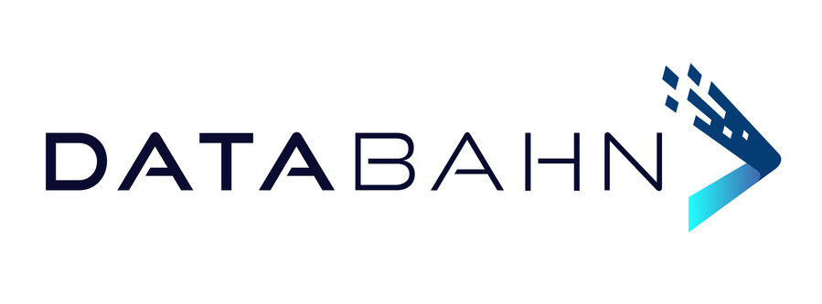

# The Data Control Layer Between 600 Sources and AI Agents

_DataBahn raised a $40M Series B. It_

## Executive Summary

> [!callout]
> On July 30, DataBahn, a startup based in Dallas, Texas, raised a $40 million Series B. Insight Partners led the round, which follows a $17 million Series A in June 2025. The company does not build smarter models. It sells the pipeline that sits between the 600-plus sources pouring out logs, events, and metrics and the tools that consume that data—ingesting it, shaping it, and routing it to where it needs to go.

> What changed is who is lining up to take that data. Telemetry was traditionally consumed by security platforms (SIEM) and data warehouses; now AI agents and copilots have joined the same line. But an agent does not want raw logs—it wants the context it needs to decide and act. That is why DataBahn calls itself an "agentic data control plane."

> This piece looks at where that $40 million points. For anyone who works with data, the investment translates into a single question: is AI-ready data the output of a batch job you run once, or an always-on infrastructure layer that has to normalize, route, and record data at every moment?

### The Numbers

Source: [SiliconANGLE, 2026-07-30](https://siliconangle.com/2026/07/30/databahn-raises-40m-ai-agents-queue-enterprise-telemetry/)

Four figures compress the backdrop to this round: the size of the Series B, the number of sources a single pipeline connects, revenue growth over the past year, and the rate at which customers who evaluated the product went on to sign.

<!-- stat-card -->
**$40M** — Series B — Led by Insight Partners, $59M raised to date

<!-- stat-card -->
**600+** — Connected sources — Logs, events, and metrics through one pipeline

<!-- stat-card -->
**400%+** — YoY revenue growth — 180% NRR · zero customer churn

<!-- stat-card -->
**97%** — PoC win rate — Evaluations that converted to contracts

## Agents Joined the Telemetry Line

Start with the deal. DataBahn was founded in Dallas in 2024. This $40 million Series B was led by Insight Partners, with participation from Forgepoint Capital, GTM Capital, and S3 Ventures. It follows a $17 million Series A led by Forgepoint in June 2025, bringing total funding to $59 million. The company says it will use the money to expand R&D and to broaden a customer base that has so far clustered among Fortune 100-scale enterprises, reaching down into the mid-market.

*▲ DataBahn, which raised $40 million in a Series B | Source: [PR Newswire](https://www.prnewswire.com/news-releases/databahn-raises-40-million-series-b-led-by-insight-partners-to-accelerate-innovation-across-the-agentic-data-control-plane-302838690.html)*

What DataBahn does fits in one sentence. It sits between the 600-plus sources that generate logs, events, and metrics and the tools that consume them, and it ingests, normalizes, and routes that data. Information the destination does not need gets stripped out along the way. The company calls this position an "agentic data control plane," and it sells its neutrality—any source, any destination, any model, tied to no particular vendor—as the pitch.
