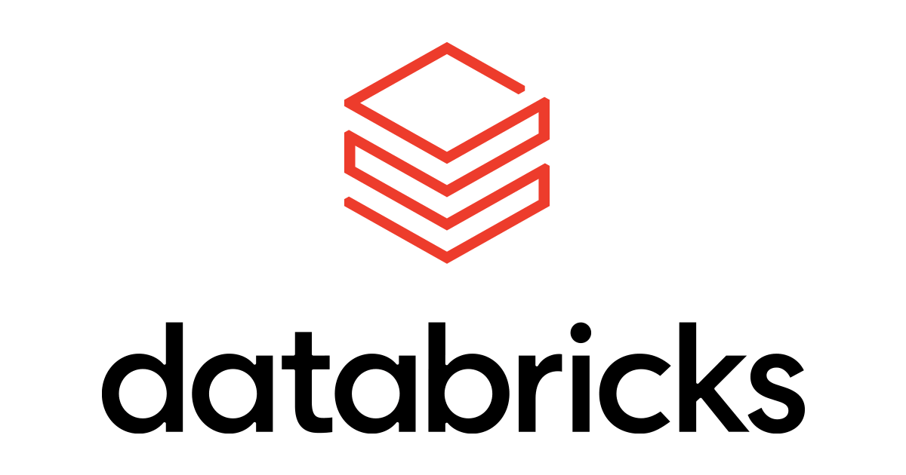

# 데이터브릭스 몸값 1,880억 달러를 만든 데이터 거버넌스

_투게더 AI·페레그린에 이어, 자본은 데이터를 다스리는 층에 반복해서 값을 매기고 있다_

## Executive Summary

> [!callout]
> 데이터·AI 플랫폼 회사 데이터브릭스가 기업가치 1,880억 달러를 기준으로 전략적 펀딩 라운드를 진행하고 있다. 불과 5개월 전인 2026년 2월 라운드에서 인정받은 1,340억 달러에서 40%가 뛴 값이다. 그런데 정작 눈여겨볼 것은 숫자 자체가 아니라 그 자금이 향하는 곳이다. 새 초거대 모델을 만들겠다는 이야기가 아니라, 어떤 AI가 어떤 업무를 처리할지 제어하고 비용과 보안을 감시하는 거버넌스 제품군이 이번 라운드의 명시적 용처다.

> CEO 알리 고드시는 이 전환에 이름을 붙였다. 기업들이 "토큰 최대화(tokenmaxxing)"에서 "가치 최대화(valuemaxxing)"로 옮겨간다는 것이다. 가장 비싼 모델의 토큰을 아무 데나 태우는 대신 달러당 최선의 결과를 원한다는 진단이다. 다만 시장이 값을 매긴 "거버넌스 계층"을 기술 문서 수준까지 열어 보면, 지금 그것은 접근 로그와 데이터 계보 그래프이지 "이 데이터가 더 나은 결과를 냈다"를 증명하는 지표는 아니다.

> 그래서 물음은 셋으로 좁혀진다. 이번 라운드는 무엇에 값을 매겼나. 투게더 AI·페레그린에 이어 자본이 반복해서 데이터 계층을 고르는 이유는 무엇인가. 그리고 그 거버넌스는 실제로 무엇을 재고, 무엇을 아직 재지 못하는가.

*▲ 데이터브릭스 로고. 겹쳐진 층 모티프가 이번 라운드가 값을 매긴 "데이터 계층"과 공교롭게 맞닿는다 | Source: [Wikimedia Commons](https://commons.wikimedia.org/wiki/File:Databricks_Logo.png) (CC BY-SA 4.0, Agrawroh)*

### 주요 수치

출처: [데이터브릭스 보도자료](https://www.databricks.com/company/newsroom/press-releases/databricks-raising-strategic-round-funding-188-billion-valuation) · 매출·고객 수치는 [SiliconANGLE](https://siliconangle.com/2026/07/17/databricks-raising-new-funding-188b-valuation/)

아래 네 숫자가 이 글의 뼈대다. 앞의 둘은 값이 얼마나 빨리 커졌는지, 뒤의 둘은 그 값을 떠받치는 사업의 실체가 무엇인지 보여 준다.

<!-- stat-card -->
**1,880억 달러** — 이번 라운드 기업가치 — 누적 조달액 약 202억 달러

<!-- stat-card -->
**+40%** — 5개월 만의 상승폭 — 2월 1,340억 → 7월 1,880억

<!-- stat-card -->
**54억 달러** — 연 매출(ARR) — 전년 대비 65% 성장

<!-- stat-card -->
**70%** — 포춘 500 중 고객 비율 — 전 세계 약 2만 개 조직

## 5개월 만에 40%

데이터브릭스의 이번 라운드는 속도가 먼저 눈에 띈다. 2026년 2월 라운드에서 1,340억 달러였던 기업가치가 7월에 1,880억 달러 기준으로 뛰었다. 다섯 달 사이 40%다. 기존 투자자인 Coatue Management가 리드를 맡았고, 라운드는 여름 안에 종료될 것으로 알려졌다. 누적 조달액은 약 202억 달러에 이른다. 이 값을 떠받치는 실적도 함께 나왔다. 연 매출은 54억 달러, 전년 대비 65% 성장이고, 전 세계 약 2만 개 조직이 고객이며 그중 포춘 500대 기업의 70%가 포함된다.

숫자만 보면 흔한 초대형 라운드다. 흥미로운 지점은 그다음이다. 이 자금이 어디로 가는가. 회사가 앞세우는 용처는 새 파운데이션 모델이 아니라 세 개의 제품이다. 어떤 AI 모델이 어떤 업무를 맡을지 제어하고 비용과 보안을 감시하는 **Unity AI Gateway**, 비즈니스 데이터를 신뢰할 수 있는 답변으로 바꾸는 AI 동료 **Genie**, 그리고 AI 에이전트의 작업용 서버리스 Postgres인 **Lakebase**다. 셋이 공유하는 문제의식은 하나로 모인다. 데이터가 여러 시스템에 흩어져 AI와 연결되지 않고 다스리기 어렵다는 "컨텍스트 갭"이다.

요약하면, 시장이 40%를 더 얹은 대상은 더 똑똑한 모델을 만들 능력이 아니라 흩어진 데이터를 제어 아래 두는 능력이다. 일부 매체는 이번 라운드를 "모델보다 그 아래 거버넌스 계층에 값이 붙었다"는 프레임으로 요약했다. 데이터브릭스 스스로도 자금을 멀티 AI 거버넌스와 에이전트 플랫폼에 쓰겠다고 명시했으니, 이 프레임은 회사의 자기 규정과도 맞닿는다.
