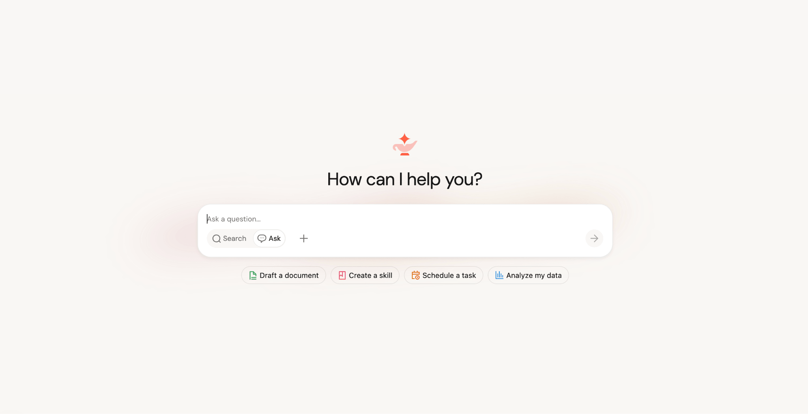
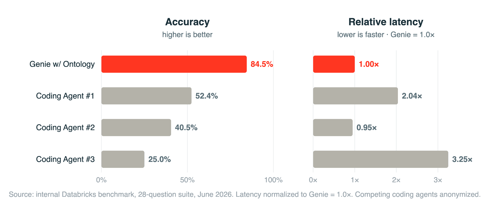

# Databricks Moved AI

_How Genie One replaces RAG, and why the real contest in the context layer is data quality_

## Executive Summary

> [!callout]
> On June 16, 2026, Databricks launched Genie One at its Data + AI Summit — an agentic coworker that lets marketing, finance, and sales teams ask questions of internal data in plain language and get answers back. What's new isn't the chatbot form factor. It's where those answers come from. Genie One doesn't embed documents and fetch the most similar chunks. It queries governed data directly with SQL.

> For the past two years, the default for enterprise AI has been RAG: turn documents into vectors and retrieve by similarity. Genie One pushes that premise back down to the data itself. In Databricks' own benchmark, Genie One answered 28 real business questions with 84.5% first-try accuracy. On the same questions, the strongest general-purpose coding agent managed 52.4%, and a context-starved agent landed at 25%. There's no independent verification yet, but the source of the gap is clear enough: it's not the model, it's how clean and governed the data is.

> So this is more than one product launch. The biggest data platform on the market just shipped a product that says, in effect, AI accuracy starts with the data, not the model. And that is the moment the AI-Ready Data thesis Pebblous has argued all along gets validated by the market itself.

### Key Numbers

Source: [Databricks press release, 2026](https://www.databricks.com/company/newsroom/press-releases/databricks-launches-genie-one-all-new-agentic-coworker-every-team) · 28-question internal benchmark

Four numbers capture the heart of the announcement. Same questions, same model, and accuracy still swings from 25% to 84.5% depending on the quality of the data context. The variable that made the difference wasn't reasoning ability. It was the data.

<!-- stat-card -->
**84.5%** — Genie One first-try accuracy — With ontology (data context) applied

<!-- stat-card -->
**52.4%** — Strongest general coding agent — Same 28 questions, first try

<!-- stat-card -->
**25%** — Context-starved agent — Naive Text-to-SQL territory

<!-- stat-card -->
**2×** — Faster than the top competitor — No accuracy-for-speed trade-off

## The Two-Year Default Cracked

For the past two years, "add AI to the enterprise" mostly meant one thing: chop internal documents into pieces, turn them into vectors, and when a question arrives, fetch the most similar chunks for the model to read and answer from. That's RAG. Push your PDFs, wikis, and Slack logs into an embedding index and plausible answers came out, which is exactly how RAG became the de facto standard.

The trouble is that a business's real context doesn't live in a pile of documents. "Last quarter's revenue in the West region" or "the SKU with the slowest inventory turnover" isn't a paragraph in some PDF — it lives in a governed table. Vector search retrieves text that looks like the question, but it doesn't know which definition is authoritative or who certified the number. So RAG-based agents are often confidently wrong.

Databricks CEO Ali Ghodsi named the problem plainly at the launch: "Most enterprise AI today is guessing with false confidence. For the business, that's not good enough." The starting point for Genie One wasn't building one more chatbot — it was moving the basis of an answer from document fragments to governed data.

*▲ Genie One's natural-language interface. Marketing, finance, and sales teams can query internal data directly without writing code. | Source: [Databricks Blog](https://www.databricks.com/blog/introducing-genie-one-genie-ontology-and-genie-agents)*

## Asking the Data Directly

The engine that actually makes that shift from document fragments to data possible is Genie Ontology. It automatically extracts business context from a company's tables, queries, dashboards, and pipelines, plus some 50 connected apps like Google Drive, Jira, and Slack, then weaves it into a living knowledge graph. The agent uses that graph as a guide to query governed data in Unity Catalog directly with SQL. Instead of inferring from document chunks, it asks the source data itself.

*▲ The three products launched at the June 2026 Data+AI Summit: Genie One (the coworker), Genie Ontology (the context layer), and Genie Agents (the agent builder). | Source: [Databricks Newsroom](https://www.databricks.com/company/newsroom/press-releases/databricks-launches-genie-one-all-new-agentic-coworker-every-team)*

Inside a single company, even the definition of "active customer" exists in conflicting versions scattered across teams. Genie Ontology decides which one to trust automatically, through a mechanism called OntoRank. Where Google's PageRank scored the authority of web pages by their links, OntoRank assigns authority to data definitions by combining the trustworthiness of the person or system that created them, how often they're referenced, their connection to Unity Catalog-certified assets, and how current they are. As Databricks engineer Ken Wong put it, "PageRank only had to rank web pages, but OntoRank has to rank different types of data."

### 2.1. How It Differs from RAG

The difference is the difference between "find similar documents" and "query the right data." The table below lays out the contrast.

| Dimension | Traditional RAG (vector search) | Genie Ontology |
| --- | --- | --- |
| Retrieval method | Document embedding similarity | Knowledge graph + direct SQL query |
| Target data | Mostly unstructured docs/PDFs | Governed structured + unstructured |
| Definition authority | No ranking | Auto-ranked by OntoRank |
| Permissions / governance | Handled separately | Unity Catalog row/column rules enforced |

In practice that difference comes back as token cost and trust. Because every answer is generated under source-level permissions, numbers you shouldn't see don't leak, and because long documents aren't shoved wholesale into the model, costs stay lower. Michael Leone, principal analyst at Moor Insights, sums it up: "RAG and vector search just retrieve what looks similar to the question; they don't understand the business. An ontology gives the agent the meaning a catalog can't."

## What 84.5% Is Telling Us

Databricks tested the agents on 28 questions drawn from real enterprise data-analysis work. Genie One got 84.5% right on the first try. On the same questions, the best general-purpose coding agent hit 52.4%, and the weakest came in at 25% — which roughly overlaps with the industry average for naive, context-free Text-to-SQL. And Genie pushed accuracy up while staying about twice as fast as its strongest competitor, meaning it didn't trade accuracy for speed.

*▲ 28-question enterprise benchmark. Genie w/ Ontology: 84.5%, leading coding agent: 52.4%, weakest: 25%. The accuracy lead comes with no latency penalty — Genie runs 2× faster than its strongest competitor. | Source: [Databricks Blog](https://www.databricks.com/blog/introducing-genie-one-genie-ontology-and-genie-agents) (internal benchmark)*

Let's be clear about one thing. These figures are an internal benchmark — Databricks measuring its own product in its own environment. There's no third-party verification yet. But the direction the numbers point is interesting. By Databricks' account, the baseline before applying the ontology's data context sat around 50%, and once the context was layered in, it rose to 84.5%. They didn't change the model. They organized the data, and accuracy jumped.

Field cases point the same way. The large supermarket chain Albertsons has bundled Genie into "merchandising intelligence" for product, pricing, promotion, and assortment decisions, and Foot Locker says it's changing how leadership works across its North American brands. Databricks' customer base runs past 20,000 organizations and includes 70% of the Fortune 500. The fact that a player of that scale has pointed its product direction toward data quality is itself a market signal.

> [!callout]
> Give the same model the same question, and without cleaning and governing the data you get 25%; organize it and you get 84.5%. The quality of the context layer is, in the end, the quality of the data.

## The Contest Is Data, Not Retrieval

Step back and the whole market is moving the same way. Snowflake and Microsoft are rolling out semantic, ontology, and context layers of their own. In one quarterly survey cited by VentureBeat, intent to adopt hybrid retrieval tripled from 10.3% to 33.3% in three months, and retrieval and context optimization passed model evaluation to become the top investment priority in enterprise AI. Bain & Company's read is concise: "Companies will pick the platform their data is already on."

So the real contest in the context layer isn't a smarter retrieval algorithm. It's whether the data underneath is clean and governed. You can tune vector similarity as finely as you like, but if the underlying data is inaccurate and its provenance is unknown, the agent will produce fast, confident, wrong answers. The distance between Genie One's 84.5% and 25% is a distance made by data quality, not by the algorithm.

This is the AI-Ready Data thesis Pebblous has argued all along: treat data as an asset rather than a cost, and keep its provenance, quality, and rights traceable. Genie One is close to the moment when the largest data-platform player confirms that thesis in a product. The claim that accuracy starts with the data, not with the model that comes after it — this time the market said it, not us.

> [!callout]
> **Editor's Note.** If Genie One is right, one question remains. Is your organization's data clean and governed enough for AI to use as the basis of an answer? Pebblous DataClinic is a tool built to diagnose exactly that data readiness. Checking the foundation before bolting on a flashy agent is what separates 84.5% from 25%.

## References

### Official Sources

- 1.Databricks Newsroom. (2026, June 16). _Databricks Launches Genie One — All-New Agentic Coworker for Every Team._ Databricks. [databricks.com/newsroom](https://www.databricks.com/company/newsroom/press-releases/databricks-launches-genie-one-all-new-agentic-coworker-every-team)
- 2.Databricks Engineering. (2026, June 16). _Introducing Genie One, Genie Ontology, and Genie Agents._ Databricks Blog. [databricks.com/blog](https://www.databricks.com/blog/introducing-genie-one-genie-ontology-and-genie-agents)

### Industry & Market Analysis

- 3.CIO Magazine. (2026, June). _From RAG to Ontology: Databricks Bets on Context as the Key to Trusted AI Agents._ CIO. [cio.com](https://www.cio.com/article/4186154/from-rag-to-ontology-databricks-bets-on-context-as-the-key-to-trusted-ai-agents-2.html)
- 4.InfoWorld. (2026, June). _From RAG to Ontology: Databricks Bets on Context as the Key to Trusted AI Agents._ InfoWorld. [infoworld.com](https://www.infoworld.com/article/4186146/from-rag-to-ontology-databricks-bets-on-context-as-the-key-to-trusted-ai-agents.html)
- 5.VentureBeat. (2026). _Context Architecture Is Replacing RAG as Agentic AI Pushes Enterprise Retrieval to Its Limits._ VentureBeat. [venturebeat.com](https://venturebeat.com/data/context-architecture-is-replacing-rag-as-agentic-ai-pushes-enterprise-retrieval-to-its-limits)
- 6.Atlan. (2026). _Databricks Genie One: What It Is and Why It Matters._ Atlan Knowledge Base. [atlan.com](https://atlan.com/know/ai-agent/databricks/genie-one/)
- 7.Atlan. (2026). _Databricks Genie Ontology Explained._ Atlan Knowledge Base. [atlan.com](https://atlan.com/know/ai-agent/databricks/genie-ontology/)
- 8.ITdaily. (2026). _Databricks Genie Ontology en OntoRank._ ITdaily. [itdaily.com](https://itdaily.com/blogs/cloud/databricks-genie-ontology/)
- 9.Bain & Company. (2026, June). _Databricks Data + AI Summit: The Lakehouse Becomes the Agentic Enterprise Control Plane._ Bain & Company. [bain.com](https://www.bain.com/insights/databricks-data-ai-summit-the-lakehouse-becomes-the-agentic-enterprise-control-plane/)
