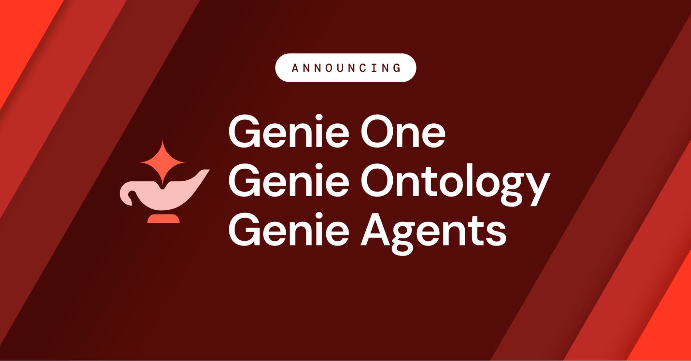

# 데이터브릭스가 AI 답변의 근거를 문서에서 데이터로 바꿨다

_Genie One이 RAG를 대체하는 방식, 그리고 컨텍스트 경쟁의 진짜 승부처가 데이터 품질이라는 신호_

## Executive Summary

> [!callout]
> 2026년 6월 16일, 데이터브릭스가 Data + AI Summit에서 Genie One을 정식 출시했다. 마케팅·재무·영업팀이 자연어로 사내 데이터를 묻고 답을 받는 에이전트 코워커다. 새로운 건 챗봇이라는 형식이 아니라, 그 답이 어디에서 나오는가다. Genie One은 문서를 임베딩해 비슷한 조각을 찾아오지 않는다. 거버넌스된 데이터를 SQL로 직접 쿼리한다.

> 지난 2년 동안 엔터프라이즈 AI의 기본값은 RAG, 곧 '문서를 벡터로 바꿔 유사도로 검색'하는 방식이었다. Genie One은 그 전제를 데이터 자체로 되돌린다. 데이터브릭스 자체 벤치마크에서 Genie One은 실제 업무 질문 28개에 첫 시도 84.5%를 맞혔다. 같은 문제에서 최강 범용 코딩 에이전트는 52.4%, 컨텍스트가 빈약한 에이전트는 25%에 그쳤다. 독립 검증은 아직 없지만, 격차의 출처는 분명하다. 모델이 아니라 데이터의 정제·거버넌스 수준이다.

> 그래서 이번 발표는 제품 하나의 출시로 끝나지 않는다. 시장에서 가장 큰 데이터 플랫폼이 'AI의 정확도는 모델이 아니라 데이터에서 시작된다'를 제품으로 못 박은 장면이고, 이는 페블러스가 줄곧 말해온 AI-Ready Data 명제가 시장에서 확인된 순간이기도 하다.

### 주요 수치

출처: [Databricks 보도자료, 2026](https://www.databricks.com/company/newsroom/press-releases/databricks-launches-genie-one-all-new-agentic-coworker-every-team) · 28문항 내부 벤치마크

네 숫자가 이번 발표의 핵심을 압축한다. 같은 문제, 같은 모델이라도 데이터 컨텍스트의 질에 따라 정확도가 25%에서 84.5%까지 벌어진다. 격차를 만든 변수는 추론 능력이 아니라 데이터였다.

<!-- stat-card -->
**84.5%** — Genie One 첫 시도 정확도 — 온톨로지(데이터 컨텍스트) 적용 시

<!-- stat-card -->
**52.4%** — 최강 범용 코딩 에이전트 — 같은 28문항, 첫 시도 기준

<!-- stat-card -->
**25%** — 컨텍스트 빈약한 에이전트 — 나이브 Text-to-SQL 수준

<!-- stat-card -->
**2배** — 최강 경쟁자 대비 응답 속도 — 정확도–속도 트레이드오프 없음

## 2년 동안의 기본값이 흔들렸다

지난 2년간 "엔터프라이즈에 AI를 붙인다"는 말은 대체로 한 가지를 뜻했다. 사내 문서를 잘게 쪼개 벡터로 바꾸고, 질문이 들어오면 비슷한 조각을 찾아 모델에게 읽혀 답을 만드는 것. RAG다. PDF, 위키, 슬랙 로그를 임베딩 인덱스에 밀어 넣으면 그럴듯한 답이 나왔고, 그래서 RAG는 사실상 표준이 됐다.

문제는 비즈니스의 진짜 맥락이 문서 더미에 있지 않다는 데 있다. "지난 분기 서부 지역 매출"이나 "재고 회전이 가장 느린 SKU"는 어느 PDF의 한 문단이 아니라 거버넌스된 테이블에 들어 있다. 벡터 검색은 질문과 모양이 비슷한 텍스트를 가져올 뿐, 어느 정의가 권위 있는지, 누가 그 숫자를 인증했는지는 알지 못한다. 그래서 RAG 기반 에이전트는 종종 자신만만하게 틀린다.

데이터브릭스 CEO 알리 고드시는 발표에서 이 지점을 직설적으로 짚었다. "오늘날 엔터프라이즈 AI는 대부분 거짓 자신감으로 추측하고 있다. 비즈니스에는 그걸로 충분하지 않다." Genie One의 출발점은 챗봇을 하나 더 만드는 것이 아니라, 답의 근거를 문서 조각에서 거버넌스된 데이터로 옮기는 것이다.

*▲ Genie One의 자연어 인터페이스. 마케팅·재무·영업팀이 코딩 없이 사내 데이터를 직접 질의할 수 있다. | Source: [Databricks Blog](https://www.databricks.com/blog/introducing-genie-one-genie-ontology-and-genie-agents)*

## 문서 대신 데이터로 직접 묻는다

답의 근거를 문서 조각에서 데이터로 옮기는 일을 실제로 가능하게 하는 엔진이 Genie Ontology다. 기업의 테이블·쿼리·대시보드·파이프라인, 그리고 구글 드라이브·지라·슬랙 같은 50여 개 연결 앱에서 비즈니스 컨텍스트를 자동으로 추출해 살아 있는 지식 그래프로 엮는다. 에이전트는 이 그래프를 길잡이 삼아 Unity Catalog의 거버넌스된 데이터에 SQL로 직접 질의한다. 문서 조각에서 유추하는 대신, 원본 데이터에 묻는 것이다.

*▲ 2026년 6월 Data+AI Summit 공식 발표. Genie One(코워커)·Genie Ontology(컨텍스트 레이어)·Genie Agents(에이전트 빌더) 세 가지를 동시 출시했다. | Source: [Databricks Newsroom](https://www.databricks.com/company/newsroom/press-releases/databricks-launches-genie-one-all-new-agentic-coworker-every-team)*

한 기업 안에는 "활성 고객"의 정의만 해도 팀마다 제각각인 버전이 흩어져 있다. Genie Ontology는 OntoRank라는 장치로 그중 어느 정의를 믿을지 자동으로 가린다. 구글의 PageRank가 링크로 웹페이지의 권위를 매겼다면, OntoRank는 정의를 만든 사람·시스템의 신뢰도, 참조 빈도, Unity Catalog 인증 자산과의 연결, 최신성을 종합해 데이터 정의에 권위를 부여한다. 데이터브릭스 엔지니어 켄 웡의 표현처럼, "PageRank는 웹페이지만 줄 세웠지만 OntoRank는 서로 다른 유형의 데이터를 줄 세워야 한다."

### 2.1. RAG와 무엇이 다른가

둘의 차이는 "비슷한 문서를 찾는다"와 "맞는 데이터를 조회한다"의 차이다. 아래 표가 그 대비를 정리한다.

| 비교 항목 | 전통 RAG (벡터 검색) | Genie Ontology |
| --- | --- | --- |
| 검색 방식 | 문서 임베딩 유사도 | 지식 그래프 + SQL 직접 쿼리 |
| 대상 데이터 | 주로 비정형 문서·PDF | 거버넌스된 정형 + 비정형 |
| 정의의 권위 | 랭킹 없음 | OntoRank로 자동 권위 부여 |
| 권한·거버넌스 | 별도 처리 필요 | Unity Catalog 행·열 권한 강제 |

실무에서 이 차이는 토큰 비용과 신뢰로 돌아온다. 모든 답이 소스 수준 권한 아래에서 생성되므로 보면 안 되는 숫자가 새지 않고, 긴 문서를 통째로 모델에 밀어 넣지 않으니 비용도 낮다. 무어 인사이트의 수석 애널리스트 마이클 리오니는 이렇게 정리한다. "RAG와 벡터 검색은 질문과 비슷해 보이는 걸 가져올 뿐 비즈니스를 이해하지 못한다. 온톨로지는 카탈로그가 줄 수 없는 의미를 에이전트에게 준다."

## 84.5%가 말하는 것

데이터브릭스는 실제 엔터프라이즈 데이터 분석 업무에서 뽑은 28개 질문으로 에이전트들을 시험했다. Genie One은 첫 시도에 84.5%를 맞혔다. 같은 문제에서 가장 뛰어난 범용 코딩 에이전트는 52.4%, 가장 약한 쪽은 25%였다. 25%는 컨텍스트 없이 던지는 나이브한 Text-to-SQL의 업계 평균과 거의 겹친다. 그리고 Genie는 정확도를 끌어올리면서도 최강 경쟁자보다 약 2배 빠른 응답을 유지했다. 정확도를 속도와 맞바꾸지 않았다는 뜻이다.

*▲ 엔터프라이즈 분석 업무 28문항 내부 벤치마크. 온톨로지(거버넌스 데이터 컨텍스트)를 적용한 Genie는 84.5%로 최강 코딩 에이전트(52.4%)를 32%p 앞서며, 속도도 2배 빠르다. | Source: [Databricks Blog](https://www.databricks.com/blog/introducing-genie-one-genie-ontology-and-genie-agents) (내부 벤치마크)*

한 가지는 분명히 해 두자. 이 수치는 데이터브릭스가 자사 환경에서 자사 제품으로 측정한 내부 벤치마크다. 제3자 독립 검증은 아직 없다. 그러나 숫자의 방향이 가리키는 바는 흥미롭다. 데이터브릭스 설명에 따르면 온톨로지라는 데이터 컨텍스트를 입히기 전의 기준선은 50% 안팎이었고, 컨텍스트를 입히자 84.5%로 올랐다. 모델을 바꾼 게 아니라 데이터를 정리했더니 정확도가 뛴 것이다.

현장 사례도 같은 방향을 가리킨다. 대형 슈퍼마켓 체인 알버트슨스는 Genie를 "머천다이징 인텔리전스"로 묶어 상품·가격·판촉·진열 의사결정에 쓰고 있고, 풋 로커는 북미 전 브랜드에 걸쳐 리더십이 일하는 방식 자체를 바꾸는 중이라고 말한다. 데이터브릭스의 고객 기반은 2만 곳이 넘고 포춘 500의 70%를 포함한다. 이 규모의 플레이어가 제품의 방향을 데이터 품질 쪽으로 잡았다는 사실 자체가 하나의 시장 신호다.

> [!callout]
> 같은 모델에 같은 질문을 줘도, 데이터를 정제·거버넌스하지 않으면 25%가 나오고 정리하면 84.5%가 나온다. 컨텍스트 레이어의 품질은 곧 데이터의 품질이다.

## 승부처는 검색이 아니라 데이터다

한 발 물러서서 보면 시장 전체가 같은 방향으로 움직이고 있다. 스노우플레이크와 마이크로소프트도 시맨틱·온톨로지·컨텍스트 레이어를 잇따라 내놓는 중이다. 벤처비트가 인용한 한 분기 조사에서 하이브리드 검색 도입 의향은 10.3%에서 33.3%로 3개월 만에 세 배가 됐고, 검색·컨텍스트 최적화는 모델 평가를 제치고 엔터프라이즈 AI의 1순위 투자 항목으로 올라섰다. 베인앤드컴퍼니의 진단은 간결하다. "기업은 자기 데이터가 이미 올라가 있는 플랫폼을 고를 것이다."

그래서 컨텍스트 레이어 경쟁의 진짜 승부처는 더 영리한 검색 알고리즘이 아니다. 그 아래 깔린 데이터가 정제·거버넌스되어 있는가다. 벡터 유사도를 아무리 정교하게 튜닝해도 바닥 데이터가 부정확하고 출처를 알 수 없으면, 에이전트는 빠르고 자신 있게 틀린 답을 낸다. Genie One의 84.5%와 25%의 거리는 알고리즘이 아니라 데이터 품질이 만든 거리다.

이것이 페블러스가 줄곧 말해온 AI-Ready Data 명제다. 데이터를 비용이 아니라 자산으로 다루고, 출처와 품질과 권리를 추적할 수 있게 만들어 두는 것. Genie One은 그 명제를 가장 큰 데이터 플랫폼 플레이어가 제품으로 확인한 장면에 가깝다. 정확도는 모델 다음이 아니라 데이터에서 시작된다는 이야기를, 이번엔 우리가 아니라 시장이 했다.

> [!callout]
> **Editor's Note.** Genie One이 옳다면, 남는 질문은 하나다. 지금 우리 조직의 데이터는 AI가 답의 근거로 삼을 만큼 정제·거버넌스되어 있는가. 페블러스의 DataClinic은 바로 그 데이터 준비도를 진단하는 도구다. 화려한 에이전트를 붙이기 전에 바닥부터 점검하는 일이, 84.5%와 25%를 가른다.

## 참고문헌

### 공식 자료

- 1.Databricks Newsroom. (2026, June 16). _Databricks Launches Genie One — All-New Agentic Coworker for Every Team._ Databricks. [databricks.com/newsroom](https://www.databricks.com/company/newsroom/press-releases/databricks-launches-genie-one-all-new-agentic-coworker-every-team)
- 2.Databricks Engineering. (2026, June 16). _Introducing Genie One, Genie Ontology, and Genie Agents._ Databricks Blog. [databricks.com/blog](https://www.databricks.com/blog/introducing-genie-one-genie-ontology-and-genie-agents)

### 업계·시장 분석

- 3.CIO Magazine. (2026, June). _From RAG to Ontology: Databricks Bets on Context as the Key to Trusted AI Agents._ CIO. [cio.com](https://www.cio.com/article/4186154/from-rag-to-ontology-databricks-bets-on-context-as-the-key-to-trusted-ai-agents-2.html)
- 4.InfoWorld. (2026, June). _From RAG to Ontology: Databricks Bets on Context as the Key to Trusted AI Agents._ InfoWorld. [infoworld.com](https://www.infoworld.com/article/4186146/from-rag-to-ontology-databricks-bets-on-context-as-the-key-to-trusted-ai-agents.html)
- 5.VentureBeat. (2026). _Context Architecture Is Replacing RAG as Agentic AI Pushes Enterprise Retrieval to Its Limits._ VentureBeat. [venturebeat.com](https://venturebeat.com/data/context-architecture-is-replacing-rag-as-agentic-ai-pushes-enterprise-retrieval-to-its-limits)
- 6.Atlan. (2026). _Databricks Genie One: What It Is and Why It Matters._ Atlan Knowledge Base. [atlan.com](https://atlan.com/know/ai-agent/databricks/genie-one/)
- 7.Atlan. (2026). _Databricks Genie Ontology Explained._ Atlan Knowledge Base. [atlan.com](https://atlan.com/know/ai-agent/databricks/genie-ontology/)
- 8.ITdaily. (2026). _Databricks Genie Ontology en OntoRank._ ITdaily. [itdaily.com](https://itdaily.com/blogs/cloud/databricks-genie-ontology/)
- 9.Bain & Company. (2026, June). _Databricks Data + AI Summit: The Lakehouse Becomes the Agentic Enterprise Control Plane._ Bain & Company. [bain.com](https://www.bain.com/insights/databricks-data-ai-summit-the-lakehouse-becomes-the-agentic-enterprise-control-plane/)
