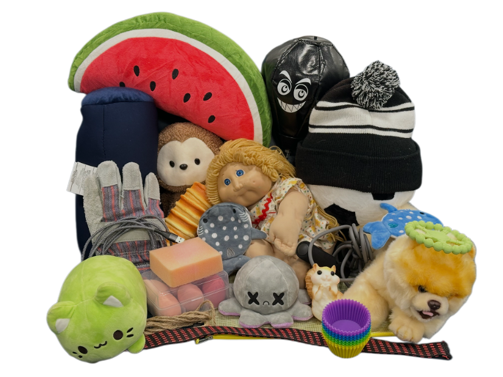

# Deform360 Touch Data for Deformable Objects

_198 deformable objects recorded with 41 cameras and tactile grippers to compare the 2D and 3D representations of robot world models_

Physical AI Datasets Hub · [View all →](/project/PhysicalAIDatasets/en/)

## Executive Summary

> [!callout]
> Robot-learning data has long had eyes but no fingertips. Camera footage was abundant, but the resistance and slippage of the moment a hand touches an object mostly went unrecorded. Deform360, released at ECCV 2026 by a joint team from Brown, Columbia, and MIT, chose the hardest target of all: deformable objects like cloth, rope, cable, and plush toys, whose shape keeps changing as you grip them. This article looks at what the dataset fills in, and what questions it leaves for the design of robot-learning data.

> At the core of its scale is this: 198 deformable objects recorded for 215.7 hours with 41 surround-view cameras and bimanual tactile grippers. But there is a more important contribution. On top of the same data, the team lined up the two representations of a robot world model side by side under controlled conditions: the 2D video approach and the 3D particle approach. Neither one always won. The winner shifted with the amount of data.

> For anyone working with robot data, this result translates into a practical question. If your training data is small, a 3D representation with structural priors is favored; if it is large, a 2D representation that scales well pulls ahead. Deform360 shows, in the form of a reproducible benchmark, how the next frontier of AI-ready data is moving from "what hasn't been seen" to "what hasn't been touched."

### Key Figures

The four numbers below compress what Deform360 captured, how much of it, and to what conclusion. The first three point to the scale of the data; the last points to the key finding confirmed with it.

Source: [arXiv:2607.05390](https://arxiv.org/abs/2607.05390) · [project page](https://deform360.lhy.xyz/)

<!-- stat-card -->
**198** — deformable objects — 1D·2D·3D shapes, 1,980 sequences

<!-- stat-card -->
**215.7 hrs** — visuotactile recording — about 23.3M frames

<!-- stat-card -->
**41** — surround-view cameras — synced with bimanual tactile grippers

<!-- stat-card -->
**3D↔2D** — winner splits — less data 3D, more data 2D

## Why Robots Learned Without Touch

Robot manipulation datasets were built around cameras for a long time. The reason is practical. Cameras are cheap and everywhere, and video is done once you store it. Recording the touch at a fingertip, by contrast, means attaching a sensor to the gripper, and that signal refreshes far faster than a camera, making it hard to align on the same time axis as the footage. Between collection difficulty, cost, and the synchronization problem, touch stayed outside the data for a long time.

This gap has already become a live topic in robotics research. In the first half of 2026 alone, work weaving touch and world models together appeared one after another, such as ContactWorld, Tactile-WAM, and OmniVTA. Pebblous, too, has previously covered a dataset in which AgiBot recorded the contact of failure moments—missed grasps, collisions, slips—as touch. The push to leave touch behind as data is already under way at the frontier.

Within that push, deformable objects are an especially thorny target. Rigid bodies like cups or blocks keep their shape while you pick them up, but cloth folds, rope stretches, and a plush toy compresses. Because the shape changes every instant, the degrees of freedom needed to represent its state explode, and the physics differs by material, making it hard to tie everything together under one rule. A person can fold a towel with their eyes closed, on fingertip feel alone, but erase that feel and the same motion becomes precarious. This is why data missing touch is uniquely shallow for robots that handle deformable objects.

*▲ Towels, rope, gloves, plush toys, sponges — a sample of the everyday deformable objects Deform360 captured | Source: [Deform360 project page](https://deform360.lhy.xyz/)*

> [!callout]
> This is exactly the point Deform360 aims at. Where AgiBot's data captured the texture of failure across varied manipulation, including rigid bodies, Deform360 focuses on one kind of object whose shape keeps changing—deformable objects—and records touch and 3D shape together. And it experiments head-on with how that data should be represented for a robot to learn well.

## 198 Objects, 215 Hours: The Scale of Deform360

Deform360 gathers 1,980 interaction sequences across 198 deformable objects, for a total of 215.7 hours and roughly 23.3M frames. The collection rig is 41 surround-view cameras encircling the object plus bimanual tactile grippers. While two arms fitted with tactile sensors actually grip and deform the object, dozens of cameras capture that moment from every angle at once. Overlaying vision and touch on the same object at this scale is the backbone of the dataset.

The objects are divided by the dimension of their shape. Line-like 1D objects such as rope, ribbon, cable, and chain number 28; sheet-like 2D objects such as cloth, airbags, plastic gloves, wrap, delivery bags, and bubble wrap number 98; and volumetric 3D objects such as plush toys, stress balls, sponges, and shoes number 72. It is a lineup that sweeps evenly across the spectrum of soft objects a robot has to handle in daily life, organized by shape.
