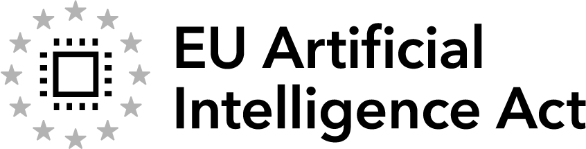
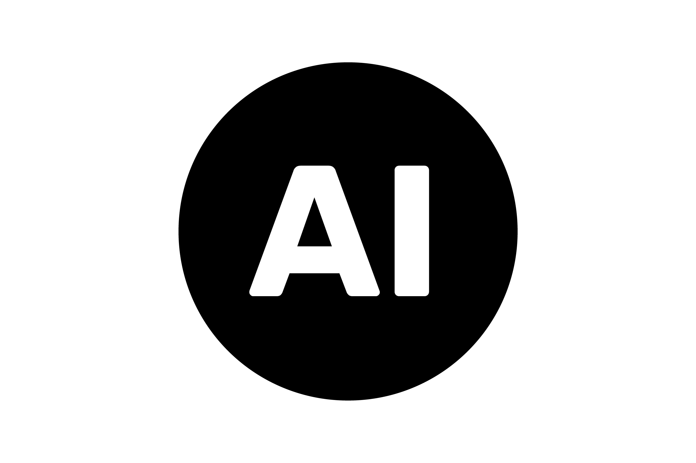
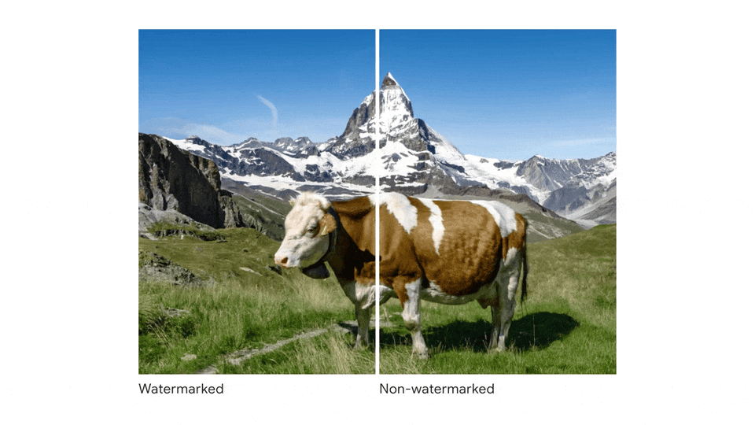
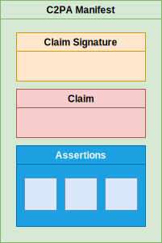

# 8월 2일, AI가 만든 글에는 꼬리표가 붙는다

_EU AI Act Article 50 시행과 데이터 프로비넌스가 컴플라이언스 자산이 되는 이유_

## Executive Summary

> [!callout]
> 2026년 8월 2일, EU AI Act의 투명성 조항인 Article 50이 집행을 시작한다. 이날부터 딥페이크, 공익 사안과 관련된 AI 생성 텍스트, 그리고 챗봇은 "이것은 AI가 만들었거나 조작한 콘텐츠"임을 밝혀야 한다. 6월 10일 유럽위원회가 확정한 실행 강령은 그 의무를 실무로 옮기는 방법, 즉 콘텐츠에 출처를 어떻게 새길지를 규정한다. 이 글은 그 변화가 한국 조직의 데이터 관리에 무엇을 요구하는지를 본다.

> 핵심은 표시 그 자체가 아니라 표시가 기록되는 방식이다. 단순한 문구 한 줄로는 부족하고, 강령은 C2PA 같은 암호화 서명 메타데이터와 비가시 워터마킹을 함께 쓰는 다층 접근을 요구한다. 라벨링 의무를 어기면 최대 €7.5M 또는 글로벌 매출의 1.5%가 과징금으로 부과된다. EU 사용자에게 서비스를 제공하는 한국 기업도 본사 위치와 무관하게 적용 대상이다.

> 출처 메타데이터가 자발적 거버넌스 관행에서 감사 제출용 법적 증거로 격상되는 순간, 데이터의 '족보'는 비용 항목이 아니라 자산이 된다. 그래서 8월 2일이 던지는 질문은 단순하다. 우리 조직의 데이터는 "어디서, 어떻게, 누가 만들었는지"를 증명할 수 있는가.

<!-- stat-card -->
**8월 2일** — Article 50 시행 — 딥페이크·공익 텍스트·챗봇 표시 의무 집행 시작

<!-- stat-card -->
**매출 1.5%** — 라벨링 위반 과징금 — 최대 €7.5M 또는 글로벌 매출의 1.5% 중 큰 금액

<!-- stat-card -->
**6,000+** — C2PA 채택 조직 — Adobe·MS·Google·BBC·AP 등 콘텐츠 출처 표준

<!-- stat-card -->
**~45일** — 남은 준비 기간 — 2026년 6월 17일 기준 시행일까지의 시간

## 6월 10일, 무슨 일이 있었나

2026년 6월 10일, 유럽위원회가 'AI 생성 콘텐츠 투명성에 관한 실행 강령(Code of Practice on Transparency of AI-Generated Content)'을 확정 발표했다. 이름만 보면 새 규제처럼 들리지만, 강령 자체는 법이 아니다. 강령은 이미 존재하는 법 조항인 EU AI Act Article 50을 어떻게 지킬지 알려주는 실무 지침서에 가깝다.

여기서 자주 혼동이 생긴다. 강령은 자발적(voluntary)이지만, 강령이 구현하려는 Article 50의 의무는 법적 강제 사항이다. EU AI Act(Regulation EU 2024/1689)는 2024년 발효했고, 투명성 계층인 Article 50은 발효 24개월 뒤인 2026년 8월 2일부터 집행된다. 강령에 서명하지 않아도 Article 50은 그대로 적용되며, 강령은 그 의무를 가장 안전하게 이행하는 경로를 제시할 뿐이다.

*▲ EU 인공지능법(Regulation EU 2024/1689) 공식 로고 — 2026년 8월 2일 Article 50 집행이 시작된다 | Source: [Wikimedia Commons (Public Domain)](https://commons.wikimedia.org/wiki/File:The_EU_Artificial_Intelligence_Act_Main_Logo.png)*

### 1.1. 표시 의무가 걸리는 세 가지 콘텐츠

Article 50이 표시를 요구하는 대상은 크게 세 갈래다. 각각 의무를 지는 주체와 요구 사항이 다르다.

- •**딥페이크** — AI로 생성하거나 조작한 이미지·음성·영상. 이를 배포하는 배포자(Deployer)가 "AI로 생성·조작된 콘텐츠"임을 명시해야 한다.
- •**공익 사안 관련 AI 생성 텍스트** — 뉴스, 정치, 공공 정보처럼 사회적 영향이 큰 글. 배포자가 AI 생성물임을 밝혀야 한다.
- •**챗봇·인터랙티브 AI** — 사람이 AI와 대화하고 있다는 사실을 인식할 수 있게, 제공자(Provider)가 시스템을 설계해야 한다.

면제 조항도 있다. 명백히 예술적·풍자적·허구적인 딥페이크는 경감된 고지만으로 충분하고, 형사수사 목적으로 승인된 콘텐츠는 제외된다. 특히 인간 편집자의 책임 아래 검토·수정을 거친 AI 생성 텍스트는 배포자의 표시 의무에서 면제된다. 마지막 조항은 뒤에서 다룰 '편집 개입 기록'의 실무적 이유가 된다.

## 8월 2일부터 무엇이 달라지나

8월 2일 이후 가장 먼저 따져야 할 것은 우리 조직이 어떤 역할인가다. 같은 콘텐츠라도 Provider냐 Deployer냐에 따라 의무가 갈린다. Provider는 모델·시스템을 만드는 쪽으로, 생성 단계에서 기계가 읽을 수 있는 AI 표시를 콘텐츠에 심어야 한다. Deployer는 그 콘텐츠를 실제로 배포·활용하는 쪽으로, 사람이 읽을 수 있는 고지를 붙여야 한다. 외부 API(예: OpenAI)를 가져다 서비스를 만드는 조직도 상황에 따라 Deployer로 분류될 수 있다는 점이 핵심이다.

### 2.1. 집행 일정과 제재

8월 2일은 시작점이고, 그 뒤로 단계가 이어진다. 출처: [EU AI Act Article 50](https://artificialintelligenceact.eu/article/50/).

<!-- stat-card -->
**2026-08-02Article 50 투명성 의무 집행 시작 — 주요 시행일** — 2026-12-02시장 출시 전 시스템에 대한 이행 유예 종료 — 2027-02-02탐지 도구 상호운용성 요구 사항 적용

제재는 위반 유형에 따라 폭이 크다. Article 50 라벨링 위반은 최대 €7.5M 또는 글로벌 매출의 1.5%, 더 광범위한 AI Act 위반은 최대 €15M 또는 매출 3%, 범용 AI(GPAI) 모델 의무 위반은 최대 €35M 또는 매출 7%까지 올라간다. 단순 표시 누락이라도 매출 비례 과징금으로 이어진다는 점에서, 라벨링은 형식적 절차가 아니라 재무 리스크다.

### 2.2. 한국 기업도 적용 대상이다

Article 50은 EU에 본사를 둔 조직만 겨냥하지 않는다. EU 사용자가 접근할 수 있는 서비스라면 본사가 한국이든 미국이든 일본이든 적용 범위에 들어간다. EU 이용자에게 AI 생성 콘텐츠를 노출하는 대부분의 B2B SaaS와 앱이 여기에 해당한다.

한국에는 이미 비슷한 법이 있다. 2026년 1월 22일 시행된 AI 기본법은 EU보다 먼저 생성형 AI 결과물 표시 의무를 발생시켰다. 두 규제는 방향이 같지만 강도가 다르다.

| 항목 | EU AI Act Article 50 | 한국 AI 기본법 |
| --- | --- | --- |
| 적용 시작 | 2026-08-02 | 2026-01-22 (계도기간 중) |
| 딥페이크 표시 | 배포자 의무, 명시적 고지 | 제31조, 워터마크 포함 |
| 생성 텍스트 | 공익 사안 해당 시 | 생성형 AI 결과물 전반 |
| 위반 제재 | 글로벌 매출 최대 7% | 1차 500만 원 / 2차 1,000만 원 / 3차 1,500만 원 |

*▲ EU AI 오피스가 배포자용으로 제공하는 공식 'AI GENERATED' 라벨 — Article 50(4) 표시 의무 이행에 자유롭게 사용 가능 | Source: [European Commission / EU AI Office](https://digital-strategy.ec.europa.eu/en/policies/eu-icons-labelling-ai-generated-content)*

한국이 더 일찍 출발했지만 제재 수준은 낮고 계도기간 중이다. 반대로 EU는 제재가 강하고 해외 기업에도 직접 적용된다. 글로벌 서비스를 운영하는 조직이라면 결국 더 엄격한 쪽인 EU 기준을 사실상의 베이스라인으로 삼게 된다.

이건 먼 나라 규제 뉴스로만 머물지 않는다. 국내에서도 카카오·네이버 같은 주요 플랫폼이 생성형 AI 결과물 고지를 반영하기 위해 약관을 손보는 작업이 이미 진행 중이다. 표시 의무가 추상적 조항이 아니라 서비스 화면과 데이터 파이프라인을 실제로 바꾸는 변경 작업으로 내려오고 있다는 신호다. EU 8월 2일과 한국 계도기간이 겹치는 이 시기에, 두 규제를 따로 대응하기보다 더 엄격한 기준에 맞춘 하나의 출처 기록 체계로 묶어 두는 편이 결국 비용이 덜 든다.

## 기계가 읽는 꼬리표, C2PA

'표시'라고 하면 화면 구석의 작은 문구를 떠올리기 쉽다. 그러나 Article 50이 요구하는 표시는 사람이 보는 고지와 기계가 읽는 마킹 두 층으로 나뉜다. 사람용 고지는 눈에 보이는 라벨이고, 기계용 마킹은 콘텐츠 파일 자체에 새겨진 메타데이터다. 후자를 만드는 사실상의 표준이 C2PA다.

### 3.1. 콘텐츠의 영양성분표

C2PA(Content Credentials)는 콘텐츠에 '영양성분표'를 붙이는 기술이다. 생성 일시, 사용한 AI 모델과 버전, 이후 인간이 가한 편집 이력을 암호화 서명으로 묶어 파일에 내장한다. Adobe, Microsoft, Google, Intel, BBC, AP 등 6,000곳이 넘는 회원이 채택한 오픈 표준이고, ISO/IEC 21694로 공식 표준화됐다. Article 50(2)이 말하는 '기계 판독 가능한 마킹' 요건을 충족하는 가장 유력한 후보가 바로 이것이다.

*▲ Content Credentials 작동 원리 — 사진 위 CR 아이콘을 클릭하면 생성 일시·사용 모델·편집 이력이 열린다 | Source: [Content Credentials (C2PA)](https://contentcredentials.org/)*

### 3.2. 왜 C2PA 하나로는 부족한가

문제는 C2PA가 의외로 약하다는 점이다. 스크린샷 한 장을 찍거나 파일 포맷을 한 번 변환하면 메타데이터가 통째로 떨어져 나갈 수 있다. 그래서 실행 강령은 단일 기술이 아니라 여러 층을 겹치는 다층(multi-layer) 접근을 명시한다. 강령의 표현을 옮기면 다음과 같다. "어떤 단일 기술도 그 자체로는 충분하지 않다."

| 레이어 | 기술 | 강점 | 한계 |
| --- | --- | --- | --- |
| L1 | C2PA 서명 메타데이터 | 모델·편집 이력을 암호화 서명으로 추적 | 스크린샷·포맷 변환 시 탈락 가능 |
| L2 | 비가시 워터마킹 (SynthID 등) | 콘텐츠에 내장돼 포맷 변환에도 생존 | 단독으로는 원본 사슬 증명 어려움 |
| L3 | 지문·레지스트리 | 생성 이벤트를 중앙에 기록 | 선택 사항, 인프라 부담 |

*▲ Google SynthID 비가시 워터마킹 — 워터마크가 픽셀에 삽입됐지만 인간 눈으로는 구별할 수 없다. C2PA가 탈락해도 L2 워터마크는 생존한다 | Source: [Google DeepMind](https://deepmind.google/blog/identifying-ai-generated-images-with-synthid/)*

세 층은 서로의 빈틈을 메운다. C2PA가 떨어져 나간 콘텐츠도 워터마크는 살아남고, 워터마크만으로 부족한 원본 추적은 레지스트리가 보완한다. 바꿔 말하면 'C2PA를 도입했으니 컴플라이언스 완료'라는 등식은 성립하지 않는다. 8월 2일까지 약 45일 남은 시점에서, 이 세 층을 통합하고 압축·재인코딩·SNS 업로드 후에도 마킹이 버티는지 검증할 시간이 있는 조직이 얼마나 될지가 현실적인 질문이다.

## 데이터 족보가 자산이 되는 순간

지금까지의 규제 이야기를 한 발 물러서서 보면, 그 밑에 깔린 것은 결국 데이터 출처(provenance) 문제다. 콘텐츠 하나하나에 "AI가 만들었나, 인간이 만들었나"를 기계가 읽을 수 있게 새기라는 요구는, 데이터의 창작 사슬을 추적 가능한 기록으로 남기라는 요구와 같다.

과거에 데이터 출처 추적은 자발적인 거버넌스 관행이었다. 하면 좋지만 안 해도 당장 문제는 없는, 비용으로 분류되던 작업이다. Article 50 시행 이후 이 그림이 뒤집힌다. C2PA 매니페스트는 생성 모델·버전·파라미터·프롬프트·편집 이력의 불변 기록이 되고, 이 기록은 감사에 제출해야 하는 법적 증거가 된다. 출처를 증명하지 못하는 콘텐츠는 이제 운영 리스크다.

> [!callout]
> 출처 메타데이터가 컴플라이언스 산출물이자 법적 증거가 되는 순간, 데이터의 족보는 비용이 아니라 자산이 된다. 조직이 "우리 데이터가 어디서 왔는지"를 증명할 수 없다면, 그것은 더 이상 미뤄둘 숙제가 아니라 당장의 재무·법무 리스크다.

*▲ C2PA 매니페스트 구조: Claim Signature(암호화 서명)·Claim·Assertions(메타데이터 단언) — 감사 제출용 불변 기록의 기술적 뼈대 | Source: [C2PA Technical Specification (CC BY 4.0)](https://spec.c2pa.org/)*

이 흐름은 EU 한 곳의 일이 아니다. Data & Trust Alliance가 2026년 발표한 8개 프로비넌스 표준은 데이터의 출처(source), 법적 권리(legal rights), 계보(data lineage)를 표준 항목으로 정의했다. Accenture의 연구도 AI 기반 메타데이터 자동화가 감사 추적을 개선하고 불완전·비일관 메타데이터에서 오는 리스크를 줄인다고 짚는다. 규제와 산업 표준이 같은 방향, 즉 '출처를 기계가 읽을 수 있게 기록하라'로 모이고 있다.

## 우리 조직은 준비됐는가

남은 시간이 짧다고 해서 손 놓을 일은 아니다. 실행 강령이 제시한 준비 단계를 조직 실무로 옮기면 다음 다섯 가지로 정리된다. 인증까지 통상 5~9개월이 걸린다는 점을 고려하면 지금 시작해도 8월 2일을 온전히 맞추긴 어렵지만, 시작 시점이 빠를수록 리스크는 줄어든다.

- •**밸류 체인 분류** — 우리가 Provider인지 Deployer인지부터 정한다. 오분류하면 적용되는 의무와 과징금 수준이 달라진다. 외부 API를 쓰는 조직도 Deployer가 될 수 있다.
- •**AI 활용 지도 그리기** — 조직 안에서 AI가 생성하는 콘텐츠를 빠짐없이 목록화한다. 어디서 무엇이 생성되는지 모르면 표시 대상도 특정할 수 없다.
- •**공익 콘텐츠 필터링** — 생성 텍스트 중 어떤 것이 '공익 사안'에 해당하는지 기준을 세운다. 뉴스·정치·공공 정보 성격의 글이 우선 대상이다.
- •**기술 스택 통합** — C2PA 서명과 워터마킹을 파이프라인에 임베딩하고, JPEG 압축·MP3 재인코딩·SNS 업로드 후에도 마킹이 살아남는지 견고성을 테스트한다.
- •**편집 개입 기록** — 인간 검토자가 손댄 지점을 메타데이터에 문서화한다. 이 기록이 있어야 인간 책임 하의 텍스트에 대한 배포자 의무 면제를 주장할 수 있다.

이 다섯 가지가 5~9개월이라는 숫자로 합쳐지는 과정도 따져 둘 만하다. 실행 강령이 그리는 준비 경로를 기간으로 풀면, 밸류 체인 분류에 약 1개월, C2PA 서명과 워터마킹을 파이프라인에 통합하는 데 2~4개월, 압축·재인코딩·SNS 업로드를 거친 뒤에도 마킹이 버티는지 보는 견고성 테스트에 1~2개월, 마지막 적합성 인증에 다시 1~2개월이 든다. 어느 한 단계도 건너뛰기 어려운 직렬 작업이라, 8월 2일까지 남은 45일은 전체 일정의 출발선에 불과하다.

다섯 단계를 관통하는 공통분모는 결국 하나다. 콘텐츠가 생성되는 그 순간에 출처를 기록할 준비가 되어 있는가. 표시 의무는 발행 직전에 라벨 한 줄 붙인다고 충족되지 않는다. 생성·편집·배포의 전 과정에서 데이터의 족보가 끊기지 않고 이어져야, 8월 2일 이후 누군가 "이건 어디서 왔는가"라고 물었을 때 답할 수 있다.

## 참고문헌

### 공식 문서

- 1.European Commission. (2026). "[Commission Publishes Code of Practice on Marking and Labelling of AI-Generated Content](https://digital-strategy.ec.europa.eu/en/news/commission-publishes-code-practice-marking-and-labelling-ai-generated-content)." Shaping Europe's Digital Future.
- 2.European Commission. (2026). "[Press Release IP/26/1328](https://ec.europa.eu/commission/presscorner/detail/en/ip_26_1328)." Press Corner.
- 3.EU AI Act. "[Article 50: Transparency Obligations for Providers and Deployers](https://artificialintelligenceact.eu/article/50/)."
- 4.EU AI Act. "[Transparency Rules under Article 50](https://artificialintelligenceact.eu/transparency-rules-article-50/)."

### 법률·업계 분석

- 5.ComplexDiscovery. (2026). "[Europe's AI Labeling Rules Arrive with a Voluntary Code and a Hard Deadline](https://complexdiscovery.com/europes-ai-labeling-rules-arrive-with-a-voluntary-code-and-a-hard-deadline/)."
- 6.Jones Day. (2026). "[European Commission Publishes Draft Code of Practice on AI Labelling and Transparency](https://www.jonesday.com/en/insights/2026/01/european-commission-publishes-draft-code-of-practice-on-ai-labelling-and-transparency)."
- 7.SoftwareSeni. (2026). "[EU AI Act and Content Provenance Regulations Making C2PA Urgent in 2026](https://www.softwareseni.com/eu-ai-act-and-content-provenance-regulations-making-c2pa-urgent-in-2026/)."
- 8.sota.io. (2026). "[EU AI Act GPAI Watermarking 2026: Technical Requirements & Implementation Guide](https://sota.io/blog/eu-ai-act-gpai-watermarking-2026-technical-implementation-guide)."
- 9.MagicLight. (2026). "[C2PA and Global Watermarking Mandates for AI Video in 2026](https://magiclight.ai/news/c2pa-and-global-watermarking-mandates-for-ai-video-in-2026/)."

### 한국 규제·해설

- 10.인공지능신문. "[EU, AI 생성 콘텐츠 표시·라벨링 '행동 강령' 초안 공개](https://www.aitimes.kr/news/articleView.html?idxno=37900)."
- 11.피카부랩스. "[AI 기본법 완전 정리 — 2026년 시행, 고영향 AI·생성형 AI 의무사항](https://peekaboolabs.ai/blog/ai-basic-law-guide)."
- 12.clobe.ai. "[오늘부터 시행된 2026 AI 기본법 핵심 내용 총정리](https://clobe.ai/blog/korea-ai-basic-act-2026-key-rules)."
