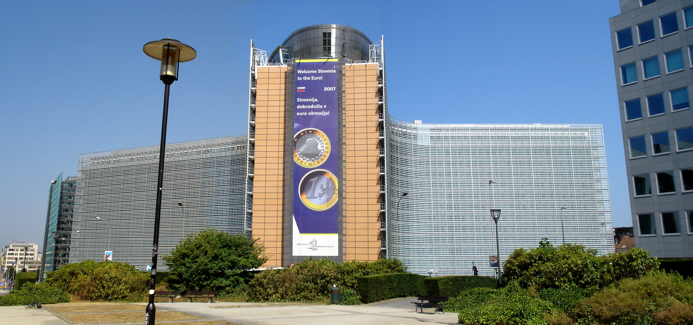

# EU가 4천억 매개변수 AI를 발주했다. 몰타어 데이터는 0.03%다.

_Domyn 주도 EUROPA 프로젝트와 24개 언어 데이터 준비의 현실_

## Executive Summary

> [!callout]
> 유럽연합 집행위원회가 2026년 6월 19일, 자체 프론티어 AI 모델을 짓겠다며 EUROPA 컨소시엄을 선정했다. 이탈리아 회사 Domyn이 주도하고 독일 프라운호퍼가 참여한다. 약속은 단순하지 않다. 4천억 매개변수가 넘는 오픈소스 모델을, EU의 24개 공식 언어 전부로, 1년 안에 내놓겠다는 것이다. 약속은 야심차다. 다만 그것이 실제로 가능한지는, 발표가 가장 짧게 언급하고 지나간 곳에서 판가름 난다.

> 관심을 끄는 숫자는 4천억이 아니다. 몰타어가 거대 웹 말뭉치 Common Crawl에서 차지하는 비중은 0.03%다. 24개 언어를 조건으로 내건 순간, 진짜 시험대는 모델의 크기가 아니라 가장 작은 언어의 학습 데이터가 된다. 컴퓨팅 자원은 EuroHPC가 1년치를 떼어 줬지만, 몰타어·라트비아어 코퍼스를 누가 어떤 품질로 모을지는 아직 합의되지 않았다.

> 이 격차가 24개 언어를 단순한 기능이 아니라 기술 조건이자 정치 조건으로 만든다. 그리고 저자원 언어 데이터가 지금 어떤 상태인지, 하나의 컨소시엄에 1년을 거는 구조가 무엇을 감수하는지를 따지고 나면, 발표가 가장 크게 외친 숫자보다 가장 작게 말한 숫자가 더 오래 남는다.

발표의 긴장은 네 숫자에 그대로 담긴다. 모델 규모는 4천억 매개변수, 가장 작은 공식 언어인 몰타어의 웹 데이터 비중은 0.03%, 미국 두 회사의 자본 점유는 약 80%, 확보된 컴퓨팅은 1년치다. 쉬운 숫자와 어려운 숫자가 한자리에 모여 있다.

<!-- stat-card -->
**400B+** — EUROPA 모델 규모 — 24개 언어 오픈소스 MoE

<!-- stat-card -->
**0.03%** — 몰타어 웹 데이터 비중 — Common Crawl 기준, 저자원 언어 희소성

<!-- stat-card -->
**~80%** — 미국 2개사 자본 점유 — OpenAI+Anthropic, Forbes AI 50

<!-- stat-card -->
**1년** — EuroHPC 컴퓨팅 지원 — 전체 용량의 2.5%, 데이터 협약은 미정

## 무슨 일이 벌어졌나

유럽연합 집행위원회는 'Frontier AI Grand Challenge'의 승자로 EUROPA 컨소시엄을 발표했다. 리드 기업은 밀라노에 본사를 둔 Domyn, 규제 산업용 AI를 만들어 온 회사로 예전 이름은 iGenius다. 1992년생 CEO 울얀 샤르카(Uljan Sharka)가 이끈다. 독일의 연구기관 프라운호퍼가 핵심 파트너로 합류했다.

지원 조건은 명확하다. 4천억 매개변수가 넘는 Mixture-of-Experts 구조의 모델을, EU 24개 공식 언어 전부로 훈련하고, 가중치를 오픈소스로 공개한다. 컴퓨팅은 EuroHPC 슈퍼컴퓨터 전체 용량의 2.5%를 1년간 쓴다. 샤르카는 EuroHPC를 "과소평가된 전략 자산"이라 부르며, 프론티어 모델을 한 번 훈련하는 데는 수억 명에게 서비스하는 것보다 훨씬 적은 컴퓨팅이 든다고 주장했다.

왜 지금일까. 배경에는 자본 쏠림이 있다. Forbes AI 50 기준으로 OpenAI와 Anthropic 두 회사가 전체 모금액의 약 80%를 가져갔다. 2026년 1분기에는 이 둘에 xAI, Waymo를 더한 단 네 곳이 전 세계 벤처 투자의 65%를 흡수했다. 기술주권 담당 집행위 부위원장 헨나 비르쿠넨(Henna Virkkunen)의 말은 이 맥락을 그대로 드러낸다. "유럽은 다른 곳에서 개발한 기술의 수동적 소비자로 남을 수 없다."

*▲ 브뤼셀 베를레이몽 — EU 집행위원회 본부. EUROPA 컨소시엄 선정 발표가 나온 곳 | Source: [Wikimedia Commons](https://commons.wikimedia.org/wiki/File:Berlaymont_building_european_commission.jpg) (CC BY-SA 2.5)*

## 24개 언어가 '조건'인 이유

'24개 언어 전부'라는 조건은 마케팅 문구가 아니다. EU에서 언어는 곧 시민권의 문제다. 어떤 모델이 영어와 독일어는 잘하면서 몰타어와 라트비아어는 못한다면, 그 언어권 시민은 사실상 2등 AI 사용자가 된다. 집행위 문서가 짚는 위험도 정확히 거기다. 자원이 적은 언어일수록 성능이 떨어지고, 안전성 평가도 더 허술해진다.

*▲ 발레타, 몰타 항공 사진. 몰타어는 Common Crawl 전체 웹 데이터의 0.03%를 차지한다 | Source: [Jonathan Mercieca / Wikimedia Commons](https://commons.wikimedia.org/wiki/File:Valletta,_Malta_(Aerial_View).jpg) (CC BY-SA 4.0)*

그래서 언어 평등은 기술 조건인 동시에 정치 조건이다. EU는 영어를 우선하고 나머지를 끼워 넣는 모델을 규제 문턱에서 통과시키기 어렵다. AI Act가 발효된 환경에서 '공정한 다국어 성능'은 선택이 아니라 요건에 가깝다. 24개 언어를 처음부터 조건으로 못 박은 것은, 나중에 끼워 맞추는 방식으로는 이 요건을 충족할 수 없다는 판단으로 읽힌다.

> [!callout]
> 핵심은 번역 능력이 아니다. 24개 언어를 동등하게 다루려면, 각 언어로 모델이 충분히 학습돼 있어야 한다. 그리고 학습은 데이터의 문제다. 조건을 언어로 거는 순간, 병목은 자동으로 데이터로 옮겨간다.

## 진짜 병목은 말뭉치다

숫자를 보면 문제의 윤곽이 잡힌다. 웹 데이터의 표준 출처인 Common Crawl에서 몰타어는 전체의 0.03%, 아일랜드어는 0.07%, 라트비아어는 0.09%를 차지한다. EU 언어 중 비중이 낮은 절반을 모두 더해도 2.4%에 미치지 못한다. 영어로 채워진 인터넷에서 작은 언어를 긁어 모으는 일은, 큰 모델을 훈련하는 일과는 전혀 다른 종류의 노동이다.

가장 큰 오픈소스 유럽 모델로 꼽히는 EuroLLM 22B의 학습 데이터 구성을 보면 현실이 더 분명해진다. 영어가 50%, 서유럽 주요 5개 언어가 27%, 고자원 글로벌 언어가 14%이고, 나머지 EU 언어 전체를 합쳐도 9%다. 저자원 언어를 최대 2.5배까지 업샘플링해도 이 불균형은 지워지지 않았다. EUROPA가 목표로 잡은 4천억 매개변수는 EuroLLM 22B의 약 18배지만, 모델을 키운다고 없던 몰타어 문장이 생기지는 않는다.
