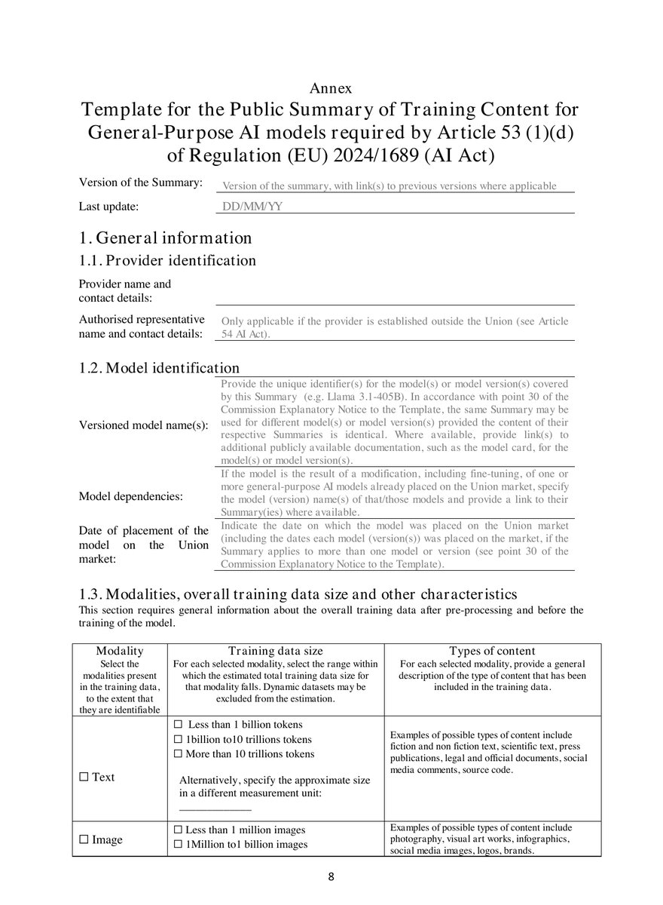
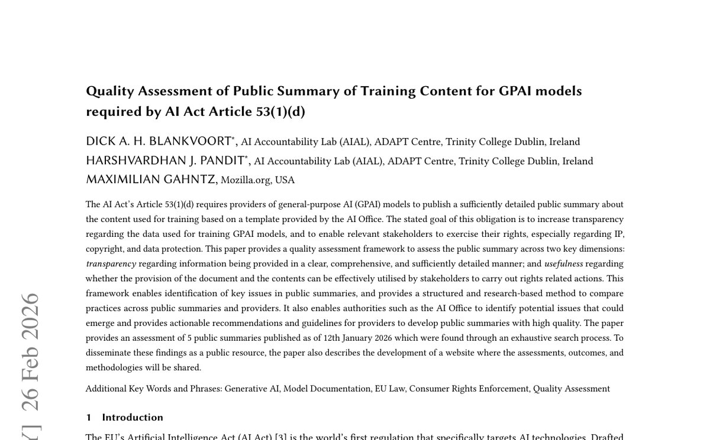

# EU에 제출된 학습데이터 요약, 빅테크는 절반을 비워 냈다

_Article 53 표준 템플릿을 비교했더니 구글·메타는 채우고 오픈AI·xAI는 서술로 얼버무렸다_

## Executive Summary

> [!callout]
> EU AI법이 범용 AI(GPAI) 제공자에게 요구하는 의무 중 하나는 "모델을 무엇으로 학습시켰는지 충분히 상세한 요약을 작성해 공개하라"는 것이다(Article 53(1)(d)). 이 의무는 2025년 8월 2일부터 이미 법이었다. 2026년 8월 2일에 새로 생긴 것은 의무가 아니라 집행 수단이다. AI Office가 이날부터 문서를 요구하고, 시정을 명령하고, 벌금을 물릴 수 있게 됐다. 이 글은 그 집행권이 켜지기 직전 실제로 공개된 요약들을 비교한다.

> 비교하면 격차가 드러난다. 구글·메타·마이크로소프트는 AI Office가 만든 표준 템플릿의 칸을 채워 냈고, 오픈AI도 학습데이터 요약은 제출했다. 반면 Anthropic·Mistral·xAI는 "공개 정보와 라이선스 데이터의 독점적 혼합"류 서술형 문구로 칸을 대신했다. 그런데 채운 요약조차 진짜 비교를 허용하지는 않는다. 거의 모든 제공자가 "공개적으로 이용 가능한 데이터셋"에 체크하고 "10조 토큰 이상"을 보고해, 그 지점부터 변별력이 사라진다.

> 그래서 이 글이 던지는 질문은 벌금이 아니다. 트리니티 칼리지 더블린과 모질라 재단이 그 요약들을 정량 평가했더니, Code of Practice에 서명한 기업이 비서명 기업보다 미미하게만 앞섰고 그 우위마저 규제가 정작 겨냥하는 학습데이터 공개가 아니라 배포자용 문서에 몰려 있었다. 서명 배지가 실사의 대리지표가 못 된다면, 유럽 시장에 진입하려는 모델에게 진짜 리스크는 벌금이 아니라 템플릿의 칸에 채워 넣을 실제 데이터 계보 기록이 있느냐다.

이 이야기의 구도를 네 개의 숫자가 먼저 압축해 준다. 8월 2일부터 실제로 도는 제재의 크기, 요약을 갱신해야 하는 주기, 서술로 칸을 대신한 제공자의 비중, 그리고 집행권이 켜진 뒤 지금까지 확인된 실제 벌금 건수다.

<!-- stat-card -->
**매출 3%** — 8/2 발효 GPAI 제재 상한 — €15M과 매출 3% 중 큰 쪽 · Article 101

<!-- stat-card -->
**6개월** — 학습데이터 요약 갱신 주기 — 실질 변경 시 더 빨리 · 일회성 서류가 아님

<!-- stat-card -->
**3 / 7** — 서술로 얼버무린 제공자 — Anthropic·Mistral·xAI · 나머지는 템플릿 작성

<!-- stat-card -->
**0건** — 확인된 실제 벌금·조사 — 2026-08-07 기준 · 메커니즘만 막 가동

## 의무가 아니라 이빨이 돋았다

8월 2일을 두고 "이제 학습데이터를 공개해야 한다"는 말이 돌지만, 순서가 뒤집혀 있다. GPAI 제공자가 학습에 쓴 콘텐츠를 요약해 공개할 의무는 2025년 8월 2일, 곧 EU AI법 Chapter V가 발효한 날부터 이미 법적 의무였다. 권고가 아니라 처음부터 강제 규정이었다. 다만 그 뒤 1년은 집행위(AI Office)에게 감독·집행 권한이 없는 조정 기간이었다.

2026년 8월 2일에 바뀐 것은 바로 그 권한이다. 이날부터 AI Office는 제공자에게 문서를 요구하고, 모델을 평가하고, 시정을 명령하고, 시장에서 제한·회수하고, 벌금을 부과할 수 있다. 상한은 €15M과 전 세계 매출 3% 중 큰 쪽이다(Article 101). 정리하면 "유예가 끝났다"는 말은 의무의 유예가 아니라 집행의 유예가 끝났다는 뜻이다. 규칙은 1년 전부터 있었고, 이제 이빨이 돋은 것이다.

*▲ 브뤼셀의 유럽연합 집행위원회 베를레몽 청사. AI Office는 이 집행위 산하 조직이다 | Source: [Acediscovery, Wikimedia Commons (CC BY 4.0)](https://commons.wikimedia.org/wiki/File:Berlaymont_EU_Building-Brussels.jpg)*

이 구분은 실무 판단을 가른다. 집행권 발효 자체는 우리 사이트가 [지난 7월 리포트](https://blog.pebblous.ai/report/eu-ai-act-august-2026-deadline-reality/ko/)에서 이미 다뤘다. 그래서 이 글은 "8월 2일에 무엇이 켜지는가"를 반복하지 않는다. 집행 수단이 손에 쥐어진 지금, 그 수단이 겨눌 대상, 곧 이미 공개된 요약 문서들이 실제로 어떤 상태인지를 본다.

## '요약을 공개하라'가 만든 서식

조문은 "충분히 상세한 요약"을 요구한다. 이 표현만 보면 자유 서술처럼 읽힌다. 실제로는 그렇지 않다. AI Office가 2025년 7월 24일 "학습 콘텐츠 공개 요약을 위한 설명 고지와 템플릿"을 내놓으면서, 요약은 몇 개의 칸을 채우는 표준 서식이 됐다. "요약을 공개하라"가 실무에서는 "이 칸들을 채워라"로 바뀐 것이다.

템플릿이 요구하는 항목은 대략 이렇다. 데이터의 모달리티(텍스트·이미지·음성 등), 규모(사이즈 밴드), 언어, 수집 시기, 사용한 주요 공개 데이터셋의 식별자, 웹크롤러의 사양과 목적, 상업 라이선스 데이터의 존재 여부, 그리고 텍스트·데이터마이닝 옵트아웃을 어떻게 반영했는지다. 한 번 쓰고 끝나는 서류도 아니다. 6개월마다, 또는 추가 학습 같은 실질적 변경이 있으면 더 빨리 갱신해야 한다.

*▲ AI Office가 2025년 7월 24일 공개한 Article 53(1)(d) 템플릿(Annex) 실물 — 모달리티·규모를 체크박스로 채우는 서식이다 | Source: [European Commission, C(2025) 8311 final](https://digital-strategy.ec.europa.eu/en/library/explanatory-notice-and-template-public-summary-training-content-general-purpose-ai-models)*

> [!callout]
> 템플릿에는 설계상의 타협이 들어 있다. 영업비밀을 보호하려고 "서사적 서술"을 허용한 것이다. 그 결과 제공자는 정량 수치 대신 문장으로 칸을 대신할 여지를 얻는다. 다음 장에서 볼 격차는 대부분 이 여지에서 비롯된다.

## 채운 자와 얼버무린 자

연구자 키어런 메이너드(Kieran Maynard)가 7개 제공자의 요약 11건을 나란히 놓고 비교했다. 결과는 두 진영으로 갈린다. 구글(Gemini 3 Pro), 메타(Muse Spark), 마이크로소프트(Phi-4), 오픈AI(GPT-5.5), 그리고 Swiss AI·SpeakLeash·Hugging Face 같은 오픈소스 진영은 템플릿의 칸을 채워 제출했다. 반면 Anthropic(Fable 5), Mistral, xAI는 "공개적으로 이용 가능한 정보와 라이선스 데이터의 독점적 혼합"류 서술형 문구로 칸을 대신했다.

| 제공자 | 대표 모델 | 요약 형태 |
| --- | --- | --- |
| Google | Gemini 3 Pro | 템플릿 항목 작성 |
| Meta | Muse Spark | 템플릿 항목 작성 |
| Microsoft | Phi-4 | 템플릿 항목 작성 |
| OpenAI | GPT-5.5 | 템플릿 작성(저작권 항목은 §5 참조) |
| Hugging Face · SpeakLeash · Swiss AI | 오픈소스 모델 | 템플릿 항목 작성 |
| Anthropic · Mistral · xAI | Fable 5 등 | 서술형 문구로 대체 |

공정을 위해 한 가지를 병기해야 한다. 서술로 대체한 세 곳의 모델 상당수는 2025년 8월 2일 이전에 출시된 기존 모델이라 준수 시한이 2027년까지 열려 있다. 규정을 어긴 것이 아니라 아직 유예 구간에 있는 셈이다. 다만 그 사정을 감안해도 방향의 차이는 남는다. 같은 시점에 누군가는 칸을 채웠고 누군가는 문장을 적었다.

메이너드의 진짜 지적은 채운 쪽에 있다. 칸을 채운 요약조차 서로를 비교하기 어렵다는 것이다. 거의 모든 제공자가 "공개적으로 이용 가능한 데이터셋"에 체크한다. 정의가 불명확해 큐레이션된 연구 데이터부터 무차별 웹 스크래핑까지 다 흡수하는 항목이라, 체크 자체로는 아무것도 구별하지 못한다. 규모 칸도 마찬가지다. 대부분 "10조 토큰 이상"을 보고하고, 그 지점부터는 숫자가 변별력을 잃는다.

의미 있는 차이는 다른 데서 나온다. 사용자 데이터를 학습에 썼는지(오픈AI·메타는 인정, 오픈소스 랩은 부인), 상업 라이선스 데이터와 크롤링 관행, 텍스트 전용인지 멀티모달인지 같은 항목이다. 문제는 요약을 모아 두는 등록처가 없다는 점이다. 각사 웹사이트에 제각각 형식으로 흩어져 있고, 외부 검증도 없다. 자기신고 체크박스가 있을 뿐 비율이나 정량 정보는 대개 빠진다. 메이너드는 이 상태를 "보물찾기"에 빗댔다. 이전보다 나아졌지만 진짜 비교가능성을 주지는 못한다는 것이다.

## 서명은 투명성과 무관했다

인상 비평으로 끝날 이야기를 학술 연구가 숫자로 받쳤다. 트리니티 칼리지 더블린(ADAPT 센터)과 모질라 재단이 2026년 ACM FAccT 컨퍼런스에서 발표한 논문이다. 연구진은 소프트웨어 문서 품질관리 모범사례를 응용해, Article 53(1)(d) 요약의 품질을 잴 수 있는 평가 프레임워크를 만들었다. 개발자가 요약을 작성할 때도, 집행위가 "성실 이행"을 판단할 때도 쓸 수 있도록 설계했다.

*▲ Blankvoort·Pandit·Gahntz, "Quality Assessment of Public Summary of Training Content for GPAI models" (ACM FAccT 2026) | Source: [arXiv:2603.13270](https://arxiv.org/abs/2603.13270)*

이 프레임워크는 추상적 채점표가 아니라 통과·낙제를 실제로 가른다. 공개 초기에 검토한 요약 다섯 건 중 마이크로소프트 Phi 모델의 요약은 기준을 넘지 못했고, Hugging Face의 SmolLM 계열은 통과했다. 3장에서 Phi가 '템플릿 칸을 채운' 쪽으로 분류됐던 걸 떠올리면 요점이 분명해진다. 칸을 채우는 것과 그 칸이 품질 기준을 넘는 것은 다른 문제다. 서식을 채웠다는 사실만으로는 아무것도 보증되지 않는다.

핵심 발견은 조달 실무를 정면으로 겨눈다. GPAI Code of Practice에 서명한 기업이 비서명 기업보다 전반적으로 점수가 높긴 했다. 그러나 그 격차는 미미했고, 우위는 거의 전부 배포자용 문서(다운스트림 정보) 한 영역에서 나왔다. 유사한 MÖVE 벤치마크에서도 서명사 평균 27.6점, 비서명사 26.3점으로 차이가 작았고, 세부적으로 사용·배포 영역은 63.0% 대 46.8%로 벌어진 반면 규제가 정작 겨냥하는 업스트림 공개, 곧 학습데이터·저작권 관련 데이터 활용·편향 완화·컴퓨팅 소비에서는 서명 여부가 차이를 만들지 못했다.

> [!callout]
> 그래서 논문은 명시적으로 결론짓는다. Code of Practice 서명 같은 표면적 준수 지표를 조달 의사결정에서 문서 깊이의 대리지표로 취급해서는 안 된다. 서명 배지는 "이 벤더가 배포용 안내서를 잘 썼다"는 신호일 수는 있어도, "학습데이터 출처를 실제로 댈 수 있다"는 보증은 아니다. 실사는 배지가 아니라 문서 자체를 봐야 한다.

## 오픈AI가 비운 칸

빈칸이 개별 기업의 일탈이 아니라 업계 패턴임을 보여주는 사례가 오픈AI다. 집행권 발효 이틀 전인 7월 31일, 오픈AI는 EU AI법 준수 관련 성명을 냈다. 안전 프레임워크, 프로버넌스 워터마킹 파트너십, 유럽 기관과의 사이버보안 협력은 상세히 다뤘다. 그런데 저작권 챕터, 곧 학습데이터 요약과 문서화된 저작권 컴플라이언스 정책은 그 성명에서 통째로 빠졌다.

오픈AI가 학습데이터 요약 자체를 제출하지 않았다는 뜻은 아니다(3장 표 참조). 다만 대외적으로 준수를 설명하는 자리에서 가장 민감한 칸을 조용히 건너뛰었다는 점이 눈에 띈다. TechPolicy.Press는 이를 "성실 준수와 최소 정보 공개 사이의 선타기"로 진단하며 오픈AI·구글·xAI를 함께 거론했다. 집행위가 벌금 권한을 갖기 전까지 대형 랩들이 취한 공통 자세라는 것이다.

이 선타기는 자발적 서명 단계에서부터 예고돼 있었다. GPAI Code of Practice에 xAI는 보안 챕터에만 서명하고 투명성·저작권 챕터는 명시적으로 제외했고, 메타는 서명 자체를 거부했다. 약속의 문턱에서부터 가장 민감한 두 칸, 곧 투명성과 저작권이 먼저 빠져나간 셈이다. 발효 직전 성명에서 저작권 항목이 조용히 빠진 것은 그 연장선일 뿐이다.

배경에는 자발적 체계의 후퇴도 있다. 시민단체 COMMUNIA에 따르면 GPAI Code of Practice 초안은 저작권 정책과 권리유보 조치를 공개하도록 요구했지만, 최종본은 이를 제공자와 권리자 사이의 양자 간 의무로 격하하고 공개는 권고로 낮췄다. 시민사회는 이를 투명성의 후퇴로 비판했다. 저작권 칸이 유독 비기 쉬운 데는 이런 제도적 여지가 깔려 있다.

## 벌금보다 무거운 것

8월 2일 이후 지금까지 AI Office가 실제로 벌금을 물렸거나 공식 조사를 개시했다는 확인된 보도는 없다(2026년 8월 7일 기준). 그래서 이 글의 시제는 "벌금이 떨어졌다"가 아니다. 메커니즘이 막 살아났고, 이미 공개된 문서들을 보면 누가 준비돼 있고 누가 아닌지가 드러난다는 것이다. 그리고 여기서 진짜 리스크의 위치가 바뀐다.

벌금은 위반한 뒤에 온다. 그전에 오는 것은 실사다. 트리니티·모질라 논문이 "서명은 실사 대리지표가 못 된다"고 결론 낸 순간, 유럽에 AI를 조달·배포하는 기업은 서명 배지가 아니라 실제 데이터 계보를 요구하는 쪽으로 움직일 수밖에 없다. 벤더에게 "학습데이터 요약을 잘 쓰는 법무 기술"이 아니라 "요약의 칸에 채워 넣을 진짜 기록"이 있느냐를 묻게 된다는 뜻이다.

그 기록은 출처 로그, 라이선스 계약, 크롤러 이력, 옵트아웃 반영 내역이다. 공통점은 하나다. 모델 학습을 다 끝낸 뒤에는 소급해 만들 수 없다. 파이프라인이 도는 동안 부산물로 쌓여야 하는 축적 자산이다. 템플릿의 칸을 서술로 얼버무린 제공자와 정량으로 채운 제공자의 차이는, 결국 그 축적을 해 뒀는가의 차이로 환원된다. 계보 없는 모델은 벌금을 맞기 전에 이미 실사에서 진다. 채워 넣을 말이 없기 때문이다.

> [!callout]
> 데이터 출처와 권리를 정리하는 일(provenance)이 컴플라이언스 서류철에서 벌금이 걸린 실사 대상으로 옮겨 가는 중이다. 요약란은 그 축적의 마지막 출력일 뿐이다. 진짜 승부는 데이터를 수집하고 라벨링하는 그 순간, 무엇을 기록으로 남겼는가에서 이미 갈린다.

## 참고문헌

### 학술

- 1.Blankvoort, D., Pandit, H., & Gahntz, M. (2026). "[Quality Assessment of Public Summary of Training Content for GPAI models required by AI Act Article 53(1)(d)](https://arxiv.org/pdf/2603.13270)." ACM FAccT 2026.

### 업계·보도

- 2.Maynard, K. (2026). "[What the EU AI Act's Training-Data Summaries Do and Don't Reveal](https://kieranmaynard.com/blog/eu-ai-act-training-transparency.html)." Kieran Maynard Blog.
- 3.TechPolicy.Press. (2026). "[How Big AI Developers Are Skirting a Mandate for Training Data Transparency](https://www.techpolicy.press/how-big-ai-developers-are-skirting-a-mandate-for-training-data-transparency/)."
- 4.COMMUNIA Association. (2025). "[Our thoughts on the final version of the GPAI Code of Practice](https://communia-association.org/2025/07/21/our-thoughts-on-the-final-version-of-the-gpai-code-of-practice/)."
- 5.WilmerHale. (2025). "[European Commission Releases Mandatory Template for Public Disclosure of AI Training Data](https://www.wilmerhale.com/en/insights/blogs/wilmerhale-privacy-and-cybersecurity-law/european-commission-releases-mandatory-template-for-public-disclosure-of-ai-training-data)."

### 공식 문서

- 6.EU Artificial Intelligence Act. "[Article 53: Obligations for Providers of General-Purpose AI Models](https://artificialintelligenceact.eu/article/53/)."
- 7.EU Artificial Intelligence Act. "[Enforcement of Chapter V under the EU AI Act](https://artificialintelligenceact.eu/enforcement-of-chapter-v-under-the-eu-ai-act/)."
- 8.European Commission. "[Enforcement of the AI Act](https://digital-strategy.ec.europa.eu/en/policies/enforcement-ai-act)." Shaping Europe's digital future.
