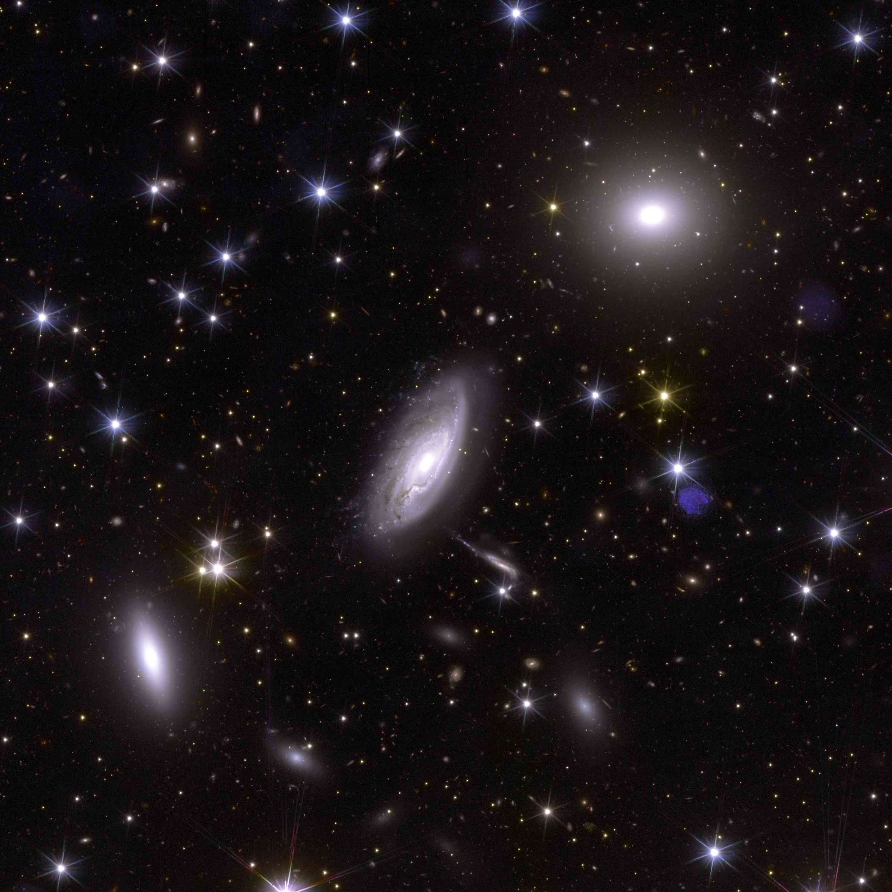

# Can AI Learn Straight From Euclid

_China_

## Executive Summary

> [!callout]
> Five researchers from the National Astronomical Observatories of the Chinese Academy of Sciences and the National Astronomical Data Center posted a paper to arXiv on September 26, 2026. They took 365,513 galaxy images captured by the European Space Agency's Euclid space telescope, converted every one of them to the same pixel size, and computed a feature vector of 384 numbers per image to release alongside the pictures. The title of the paper carries the phrase 'AI-Ready', meaning a state in which AI can use the data as it stands. This article looks at what that phrase actually fixes in advance.

> The figure that draws the eye is 1,681. That is how many anomaly candidates came out when anomaly detection was run over the prepared data. Yet in the place where the paper lays those candidates out as pictures, there is almost nothing unknown. Most of them are blank frames with nothing captured, cutouts sliced off at an edge, cross-shaped glare from a bright star, and galaxies photographed on top of one another. The authors put a line under it themselves, writing that the workflow proves its worth for quality control here, not for establishing that any astrophysical anomaly exists.

> Sections 1 through 4 report what is in the paper. Section 5 reads the same facts through the lens of data quality, and that reading belongs to this article.

### Key Figures

Source: Xie, Xu, Zhang, Chen, Cui, ["Making Euclid VIS Imaging AI-Ready"](https://arxiv.org/abs/2609.32753) (arXiv:2609.32753, September 26, 2026).

<!-- stat-card -->
**365,513** — Galaxy images put into one format — The first production run took about 48 hours, an operational estimate the authors logged

<!-- stat-card -->
**384 dimensions** — Feature values precomputed per image — Classification, search and anomaly detection all read the same numbers again

<!-- stat-card -->
**1,681** — Anomaly candidates selected — The sample the paper displays is mostly imaging defects such as blank frames and star glare

<!-- stat-card -->
**0.484** — Spiral-arm classification score — Lower than 0.492, the score for always guessing the majority class

## Two Days, 365,513 Images, One Format

Euclid is a space telescope the European Space Agency launched in 2023. It sweeps broadly across the sky photographing galaxies in order to measure the expansion of the universe and the distribution of dark matter, and what its visible-light camera has already recorded runs far past what one person could look through. The material in this paper is Euclid's first public release, Quick Data Release 1, together with the Galaxy Zoo Euclid morphology catalogue built from the classifications of volunteers. That catalogue lists 380,111 unique objects.

*▲ The telescope behind the images this paper processed: an artist's impression of Euclid | Source: [ESA/C. Carreau, CC BY-SA 3.0 IGO](https://commons.wikimedia.org/wiki/File:Euclid_ESA376594.jpg)*

The morphology values in the catalogue were not written in by hand, galaxy by galaxy. They are probabilities produced by Zoobot, a model trained on the responses volunteers left behind, and what this paper used as ground truth is the subset of those probabilities that a confidence threshold kept.

Of that catalogue the team released 365,513 rows. Removing the 9 rows with duplicate object identifiers leaves 365,504 objects that line up with the catalogue. For each one they took the released 128×128 pixel cutout, converted it to 224×224, and attached the 384 numbers drawn from the same picture alongside it. The National Astronomical Data Center hosts the data for download, and the processing code is public under the MIT license.

*▲ Euclid's view of part of the Perseus cluster. 365,513 pictures like this one went into a single format | Source: [ESA/Euclid/Euclid Consortium/NASA, image processing by J.-C. Cuillandre (CEA Paris-Saclay), G. Anselmi, CC BY-SA 3.0 IGO](https://commons.wikimedia.org/wiki/File:Euclid%E2%80%99s_view_of_Perseus_-_zoom_2_ESA25172046.jpg)*

The work was handled by a cutout service running inside the National Astronomical Data Center. It gathers requests into batches, hands them out to parallel workers, and stores results under a key made of the coordinates, the cutout size, the instrument, the file type and the band. When the same request arrives again, the stored copy is served instead of being recomputed. The more often a dataset is requested repeatedly, the more that structure pays for itself.

The first production run finished in roughly 48 hours. That works out to 2.12 images per second, about 7,615 per hour. Reading that rate as a precise measurement, though, would go further than the paper does. The authors wrote in the body text that the number is an author-attested operational estimate rather than a timestamp-complete benchmark. Among the figures quoted in this article, that one is different in kind from the rest.

## What 'AI-Ready' Fixes in Advance

Exactly one place in the paper defines the phrase, and it is the caption of the first figure. AI-Ready there points to two things. One is standardized cutouts. The other is a reusable embedding that several analyses can share. The authors draw the line once more in the body text: "We use 'AI-ready' in this operational engineering sense, not as a claim that one representation is sufficient for every scientific inference."

The first thing fixed in advance is the pixel format. Each source cutout is read as 32-bit floating point, pixels with no value are dropped, the top and bottom one percent of the brightness distribution is clipped, and the rest is squeezed flat between 0 and 1. Then 128 pixels are stretched to 224 and the single grayscale frame is duplicated into three channels. The brightness ranges and sizes that differed from picture to picture converge at this step.

The second is the feature space. The team took the small version of DINOv2, Meta's general-purpose vision model (ViT-S/14), and ran it with its weights frozen. They did not retrain it on astronomical images. The 384 numbers a model trained on 142 million web pictures produces when it looks at a galaxy became, as they stand, the shared coordinates for this dataset. Every analysis that follows reads only those numbers, never opening the picture again.
